# 开发人员对上周的回购进行总结

> 原文：<https://dev.to/devteam/dev-to-repo-recap-from-the-past-week-3i27>

欢迎回到另一个回购回顾，我们涵盖了上周对 [dev.to 的仓库](https://github.com/thepracticaldev/dev.to)[iOS 回购](https://github.com/thepracticaldev/dev-ios)和[Android 回购](https://github.com/thepracticaldev/dev-android)的贡献。这一期涵盖 6 月 8 日至 6 月 14 日。

# 主回购

## 特性

*   [@rhymes](https://dev.to/rhymes) 修复了 InstantClick 无法与 pro dashboard 一起工作的问题。谢谢，[@韵](https://dev.to/rhymes)！

# [  Dashboard Pro:支持即时点击显示组织分析 #3102](https://github.com/thepracticaldev/dev.to/pull/3102) 

[](https://github.com/rhymes) **[rhymes](https://github.com/rhymes)** posted on [<time datetime="2019-06-10T14:41:36Z">Jun 10, 2019</time>](https://github.com/thepracticaldev/dev.to/pull/3102)

## 这是什么类型的公关？(勾选所有适用选项)

*   [ ]重构
*   [x]功能
*   [x]错误修复
*   [ ]文档更新

## 描述

此 PR 使 Pro Dashboard 与 InstantClick 一起工作，并为组织显示正确的分析。

它移动函数内部的所有代码，删除全局变量，然后在 InstantClick `change`事件中加载“初始化器”,这样点击之间的转换就很平滑。

现在，如果您有自己的控制面板和您组织的控制面板，在两者之间单击不起作用。此外，如果你从 https://dev.to/dashboard 的[链接到 https://dev.to/dashboard/pro 的](https://dev.to/dashboard)链接，你必须刷新页面。

它做的另一件事是为组织显示正确的分析。目前，我们从未将组织 ID 传递给分析业务逻辑，这意味着返回的数据总是用户的数据，而不是用户正在查看的组织的数据。

## 添加到文档中？

*   [ ]文档开发到
*   [ ]自述文件
*   [x]不需要文档

[View on GitHub](https://github.com/thepracticaldev/dev.to/pull/3102)

*   我们暂时删除了未读组织通知的数量，因为它会影响性能。PR by [@ben](https://dev.to/ben)

# [ 从通知视图中删除组织通知计数 #3158](https://github.com/thepracticaldev/dev.to/pull/3158) 

[](https://github.com/benhalpern) **[benhalpern](https://github.com/benhalpern)** posted on [<time datetime="2019-06-14T13:22:13Z">Jun 14, 2019</time>](https://github.com/thepracticaldev/dev.to/pull/3158)

## 这是什么类型的公关？(勾选所有适用选项)

*   [ ]重构
*   [x]功能
*   [x]错误修复
*   [ ]文档更新

## 描述

我们在组织通知方面遇到了一些性能问题，这是一个快速修复方法，可以在最终修复之前帮助我们解决这些问题。

[View on GitHub](https://github.com/thepracticaldev/dev.to/pull/3158)

## Bug 修复/其他贡献

*   [@danielcompton](https://dev.to/danielcompton) 在“更改 meta 标签”和`canonical_url`之间加了一个空格。谢谢@danielcompton！

# [ 在“更改元标签”和 canonical _ URL# 3063](https://github.com/thepracticaldev/dev.to/pull/3063)之间加一个空格

[](https://github.com/danielcompton) **[danielcompton](https://github.com/danielcompton)** posted on [<time datetime="2019-06-06T18:36:18Z">Jun 06, 2019</time>](https://github.com/thepracticaldev/dev.to/pull/3063)

## 这是什么类型的公关？(勾选所有适用选项)

*   [ ]重构
*   [ ]功能
*   [x]错误修复
*   [ ]文档更新

## 描述

如果这两个元素之间没有空格，就会显示为 Change meta tag `canonical_url`。

## 相关车票&单据

[https://github . com/appearlier/appearlies/issues/4223 # issue comment-380093772](https://github.com/prettier/prettier/issues/4223#issuecomment-380093772)描述了如何将 JSX 元素组成多行需要`{' '}`。

## 手机&桌面截图/录音(如有 UI 改动)

实际上我自己没有尝试过，但是我在[https://www.cdevn.com/why-medium-actually-sucks/](https://www.cdevn.com/why-medium-actually-sucks/)看过之前的图像:

[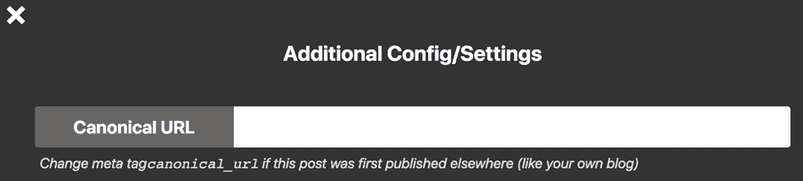](https://camo.githubusercontent.com/c6cbffa118cfaec028106fe966e95f3f8aa25153/68747470733a2f2f7777772e636465766e2e636f6d2f6173736574732f7374617469632f646576746f2e636261623263662e643361376338362e706e67)

通过查看代码，我可以了解为什么会这样，以及如何修复它。

## 添加到文档中？

*   [ ]文档开发到
*   [ ]自述文件
*   [x]不需要文档

[View on GitHub](https://github.com/thepracticaldev/dev.to/pull/3063)

*   在开发播种过程中，[@押韵](https://dev.to/rhymes)禁止 podcast 专题节目提取。感谢优化，[@韵脚](https://dev.to/rhymes)！

# [ 在播种期间禁用播客单集抓取 #3075](https://github.com/thepracticaldev/dev.to/pull/3075) 

[](https://github.com/rhymes) **[rhymes](https://github.com/rhymes)** posted on [<time datetime="2019-06-08T11:11:35Z">Jun 08, 2019</time>](https://github.com/thepracticaldev/dev.to/pull/3075)

## 这是什么类型的公关？(勾选所有适用选项)

*   [ ]重构
*   [ ]功能
*   [ ]错误修复
*   [ ]文档更新

## 描述

ActiveJob 作业在`rails db:reset`期间内联执行，这意味着现在[https://github.com/thepracticaldev/dev.to/pull/3057](https://github.com/thepracticaldev/dev.to/pull/3057)加入的应用程序试图从每个播客中获取 1000 集，如果成功的话，这真的很慢(它在我的机器上过了一会儿就崩溃了)。

此 PR 在播种期间禁用获取。如果需要进行本地测试，可以使用`rails get_podcast_episodes`任务提取剧集。

我知道 [@lightalloy](https://dev.to/lightalloy) 正在改进播客抓取，但我相信这是她所做的良好工作的一个意想不到的副作用。

事实上，我们必须禁用回调，这也是反对在回调中做这种事情的一个很好的理由，回调首先隐藏了许多业务逻辑(例如，通过分离对象的创建和相关对象的获取)，但这是一个完全不同的理由:-)

## 相关车票&单据

3057 号和 2952 号

## 添加到文档中？

*   [ ]文档开发到
*   [ ]自述文件
*   [x]不需要文档

[View on GitHub](https://github.com/thepracticaldev/dev.to/pull/3075)

*   [@韵脚](https://dev.to/rhymes)完全重构了我们处理分析的方式。如果你对代码感兴趣，这是一个非常详细的 T2 公关。再次感谢，[@韵](https://dev.to/rhymes)！

# [ 分析:重构提升速度 #3072](https://github.com/thepracticaldev/dev.to/pull/3072) 

[](https://github.com/rhymes) **[rhymes](https://github.com/rhymes)** posted on [<time datetime="2019-06-07T14:17:28Z">Jun 07, 2019</time>](https://github.com/thepracticaldev/dev.to/pull/3072)

## 这是什么类型的公关？(勾选所有适用选项)

*   [x]重构
*   [ ]功能
*   [ ]错误修复
*   [ ]文档更新

## 描述

当我开始查看 Dashboard pro 中的整个分析是如何工作的，并注意到我们可以更快地计算它时，这种重构就开始了。我还注意到，由于性能问题，有时需要在生产中显示多次刷新。

这个 PR 包含两件事:API 的`AnalyticsController`中的逻辑重构和分析本身的速度改进。

### 解虑

我谈到了#2311 中可能的改进，设想的可能解决方案是:

*   限制日期范围(此处未实现)
*   向作为筛选/where 条件一部分的列添加索引(此 PR 的一部分)
*   在 SQL 中使用分组(本 PR 的一部分)
*   批量预计算数据(此处未实现)
*   低级别缓存(这已经在生产中，但正如我们在生产中已经看到的那样，单独缓存每个日期会有问题。每个日期都意味着对缓存服务器的一次单独的网络调用，这意味着一个月内平均有 30 次 HTTP 调用，对于“无限期”可能有数百次。我已经将其更改为每个范围一次缓存调用，但我们将在稍后详细讨论缓存)

因此，这个 PR 包含了对 SQL 的更好的使用(在按天分组中从 64 个查询减少到 4 个),并在将要重复过滤的列上添加了索引(PostgreSQL 在 Rails 迁移的同时添加了索引，以避免中断正常的生产流程)

### 预排所采取的步骤和改善措施

首先，我必须设定一个底线。在不知道事情有多慢或多快的情况下，你无法让事情变得“更快”。所以我写了一个脚本，使用 [Ruby 的基准模块](https://ruby-doc.org/stdlib-2.6.3/libdoc/benchmark/rdoc/Benchmark.html)来大致了解一下正在发生的事情:

```
require 'benchmark'

# disable logging to avoid measuring that
ActiveRecord::Base.logger = nil

user = User.find(11)

iterations = 1_000

Benchmark.bm do |bm|
  bm.report("totals") do
    as = AnalyticsService.new(user)
    iterations.times { as.totals }
  end
  bm.report("last week") do
    as = AnalyticsService.new(user, start_date: 1.week.ago.to_date.iso8601)
    iterations.times { as.grouped_by_day }
  end
  bm.report("last month") do
    as = AnalyticsService.new(user, start_date: 1.month.ago.to_date.iso8601)
    iterations.times { as.grouped_by_day }
  end
  bm.report("since the beginning") do
    as = AnalyticsService.new(user, start_date: "2019-04-01")
    iterations.times { as.grouped_by_day }
  end
  bm.report("date too much in the past") do
    as = AnalyticsService.new(user, start_date: "2018-01-01")
    iterations.times { as.grouped_by_day }
  end
end
```

<svg width="20px" height="20px" viewBox="0 0 24 24" class="highlight-action crayons-icon highlight-action--fullscreen-on"><title>Enter fullscreen mode</title></svg> <svg width="20px" height="20px" viewBox="0 0 24 24" class="highlight-action crayons-icon highlight-action--fullscreen-off"><title>Exit fullscreen mode</title></svg>

这是我的开发实例的结果(数据库中没有太多数据):

```
                     user        system     total         real
totals               2.028109    0.231059   2.259168      (  3.594266)
last week            27.779555   1.734052   29.513607     ( 45.470222)
last month           120.701257  7.255624   127.956881    (206.690019)
since the beginning  225.478188  13.058602  238.536790    (384.704629)
```

<svg width="20px" height="20px" viewBox="0 0 24 24" class="highlight-action crayons-icon highlight-action--fullscreen-on"><title>Enter fullscreen mode</title></svg> <svg width="20px" height="20px" viewBox="0 0 24 24" class="highlight-action crayons-icon highlight-action--fullscreen-off"><title>Exit fullscreen mode</title></svg>

*从一开始*指的是`2019-04-01`也就是 DEV 发布分析的日期。

#### 步骤 1 -重构总计

在重构了`AnalyticsService.totals`计算之后，我对这个时间进行了基准测试:

```
       user     system      total        real
totals  1.787045   0.128882   1.915927 (  2.999562)
```

<svg width="20px" height="20px" viewBox="0 0 24 24" class="highlight-action crayons-icon highlight-action--fullscreen-on"><title>Enter fullscreen mode</title></svg> <svg width="20px" height="20px" viewBox="0 0 24 24" class="highlight-action crayons-icon highlight-action--fullscreen-off"><title>Exit fullscreen mode</title></svg>

速度比主分支快 1.17 倍。不多，但这是一个开始，周围有更少的查询。

#### 第二步-重构按天分组

这花费了相当多的时间来实现，但是在使用 PostgreSQL 之后，它的查询计划将查询数量从 64 个减少到 4 个(每个指标一个)。

这些是测量的时间:

```
                          user        system      total       real
last week                 3.164215    0.148648    3.312863    (  4.885400)
last month                5.232762    0.173115    5.405877    (  7.152623)
since the beginning       7.509549    0.204578    7.714127    (  9.507002)
date too much in the past 39.811000   0.820973    40.631973   ( 44.212027)
```

<svg width="20px" height="20px" viewBox="0 0 24 24" class="highlight-action crayons-icon highlight-action--fullscreen-on"><title>Enter fullscreen mode</title></svg> <svg width="20px" height="20px" viewBox="0 0 24 24" class="highlight-action crayons-icon highlight-action--fullscreen-off"><title>Exit fullscreen mode</title></svg>

上周:高于主分支 8.91 倍上月:高于主分支 23.69 倍年初:高于主分支 5.87 倍

*过去的日期太多了*我只是想回到`2018-01-01`去看看在如此大的范围内会有多慢

速度的提高肯定是显著的，但有一些事情困扰着我。那时我就想到了缓存。

#### 在数据分析的背景下，缓存是怎么回事？

主分支中的分析缓存在日期范围内每天执行一次，这可能会导致对缓存服务的数十甚至数百次网络调用。是的，缓存是有帮助的，因为(如果我没弄错的话)DEV 正在使用一个全球分布的 memcached 服务器池，所以数据很可能就在您附近**，但是如果范围足够大的话，来回访问缓存服务器可能比直接向 DB 请求数据要慢。基本上，增加到缓存服务器速度中的往返行程可能会比请求 web 服务器从 DB(可能在服务器附近)获取数据并将其发送回客户端花费更多的时间。**

我仍然认为缓存很重要，但是每天单独缓存可能会适得其反。由于数据现在是从数据库中批量加载的(`GROUP BY`在同一个查询中每天返回一行)，缓存整个结果集而不是单独缓存每一行可能是有意义的。

#### 步骤 3 -如果我们移除所有缓存调用，会发生什么

```
                            user        system     total        real
last week                   2.369785    0.201472   2.571257     (  3.973177)
last month                  2.793212    0.148250   2.941462     (  4.483640)
since the beginning         3.373822    0.158784   3.532606     (  5.202688)
date too much in the past   5.493960    0.209581   5.703541     (  7.480122)
```

<svg width="20px" height="20px" viewBox="0 0 24 24" class="highlight-action crayons-icon highlight-action--fullscreen-on"><title>Enter fullscreen mode</title></svg> <svg width="20px" height="20px" viewBox="0 0 24 24" class="highlight-action crayons-icon highlight-action--fullscreen-off"><title>Exit fullscreen mode</title></svg>

上周:主分支上个月速度提升 11.48 倍:主分支自开始速度提升 43.52 倍:主分支速度提升 67.57 倍

正如我所怀疑的，日期范围越大，N 缓存调用的反作用就越大。鉴于我正在使用与运行开发生产站点完全不同的硬件和软件进行开发，时间会有所不同，速度增长可能会更低，但这验证了我在上一节中的逻辑。

#### 第四步-添加指标

对许多行进行分析的一个结果是，索引开始变得很重要(在我的开发测试中不是很重要)。请记住，如果数据集不够大，PostgreSQL 仍然可以决定不使用索引，但总的来说，它们是一个好主意。

什么指数？我采用了由`totals`和`grouped_by_day`运行的每个查询，并检查了`WHERE`、`GROUP BY`和`FILTER`条件。这些是我决定添加索引的字段:

*   (这也将使整个网站受益，因为发表的文章是一个超级常见的查询)
*   `comments.created_at`
*   `comments.score`
*   `follows.created_at`
*   `page_views.created_at`
*   `reactions.created_at`
*   `reactions.points`

因为 DEV 已经投入生产很长时间了，而且那些表包含了很多很多的数据(我估计尤其是反应和页面浏览量)，所以(再次:P)使用整个 PostgreSQL 的能力和[同时添加索引](https://thoughtbot.com/blog/how-to-create-postgres-indexes-concurrently-in)是个好主意。这意味着 PostgreSQL 将使用其并发能力在后台写入索引，而不会停止对这些表的正常写入工作流。索引通常是锁定整个表来编写的，这会在迁移过程中降低网站的速度。你可以在关于主题的 [PostgreSQL 文档中了解更多细节。](https://www.postgresql.org/docs/9.6/sql-createindex.html#SQL-CREATEINDEX-CONCURRENTLY)

那么，基准计时是什么？

```
                          user        system      total       real
totals                    1.678849    0.194811    1.873660    (  2.974526)
last week                 2.410151    0.109961    2.520112    (  3.714314)
last month                4.619584    0.132775    4.752359    (  6.109809)
since the beginning       7.117115    0.159913    7.277028    (  8.774819)
date too much in the past 36.347774   0.402848    36.750622   ( 38.826439)
```

<svg width="20px" height="20px" viewBox="0 0 24 24" class="highlight-action crayons-icon highlight-action--fullscreen-on"><title>Enter fullscreen mode</title></svg> <svg width="20px" height="20px" viewBox="0 0 24 24" class="highlight-action crayons-icon highlight-action--fullscreen-off"><title>Exit fullscreen mode</title></svg>

总计:上周比无索引版本快 1.02 倍:上个月比无索引版本快 1.31 倍:比无索引版本快 1.13 倍:比无索引版本快 1.06 倍

它们只比没有索引的版本稍微快一点的原因是，一些索引已经存在(id/type 列和用户 id 上的索引),而且我没有足够大的数据集，如前所述，可以让 PostgreSQL 决定进行顺序扫描或类似的操作。

#### 步骤 5——有索引且无缓存调用

因为每天的缓存调用仍然存在，所以我尝试不使用它们:

```
                            user        system      total       real
last week                   1.870252    0.116198    1.986450    (  3.161371)
last month                  2.725406    0.144293    2.869699    (  4.278060)
since the beginning         2.924799    0.146779    3.071578    (  4.523648)
date too much in the past   5.456498    0.215746    5.672244    (  7.229783)
```

<svg width="20px" height="20px" viewBox="0 0 24 24" class="highlight-action crayons-icon highlight-action--fullscreen-on"><title>Enter fullscreen mode</title></svg> <svg width="20px" height="20px" viewBox="0 0 24 24" class="highlight-action crayons-icon highlight-action--fullscreen-off"><title>Exit fullscreen mode</title></svg>

同样，在没有缓存调用的情况下，计算速度要快得多，但是上面所做的相同评估对于这个示例也是有效的。

上周:比无缓存和无索引版本快 1.29 倍上个月:比无缓存和无索引版本快 1.02 倍从一开始:比无缓存和无索引版本快 1.14 倍

#### 第 6 步(也是最后一步)——使用索引和一次缓存调用

```
                            user       system     total     real
last week                   2.259850   0.134709   2.394559  (  3.935191)
last month                  3.120629   0.161101   3.281730  (  4.906886)
since the beginning         3.539331   0.181215   3.720546  (  5.575235)
date too much in the past   8.353001   0.302818   8.655819  ( 11.406922)
```

<svg width="20px" height="20px" viewBox="0 0 24 24" class="highlight-action crayons-icon highlight-action--fullscreen-on"><title>Enter fullscreen mode</title></svg> <svg width="20px" height="20px" viewBox="0 0 24 24" class="highlight-action crayons-icon highlight-action--fullscreen-off"><title>Exit fullscreen mode</title></svg>

如果与使用索引和每天一次缓存调用的示例相比，当日期范围变得一致时，可以看到最大的差异:过去 3 个月快了 1.95 倍，过去 1 年半快了 4.24 倍

如果与当前的主控相比:

上周:12.34 倍速度提升上月:39 倍速度提升自开始:64.12 倍速度提升

我希望这个演练是有帮助的<g-emoji class="g-emoji" alias="grin" fallback-src="https://github.githubassets.cimg/icons/emoji/unicode/1f601.png">😁</g-emoji>

## 相关车票&单据

与[https://github.com/thepracticaldev/dev.to/issues/2311](https://github.com/thepracticaldev/dev.to/issues/2311)有关

## 添加到文档中？

*   [ ]文档开发到
*   [ ]自述文件
*   [x]不需要文档

[View on GitHub](https://github.com/thepracticaldev/dev.to/pull/3072)

*   @maestromac 找到了一个令人困扰的问题，并为那些不完全支持 web 组件的浏览器用户修复了它。谢谢你，麦克！

# [ 修复 js 中断的 web component# 3087](https://github.com/thepracticaldev/dev.to/pull/3087)

[](https://github.com/maestromac) **[maestromac](https://github.com/maestromac)** posted on [<time datetime="2019-06-09T17:29:25Z">Jun 09, 2019</time>](https://github.com/thepracticaldev/dev.to/pull/3087)

## 这是什么类型的公关？(勾选所有适用选项)

*   [x]错误修复

## 描述

看起来拥有一个独立的`webcomponent-loader.js`副本是不够的，而且会破坏某些浏览器的 JS，特别是 WaterFox。WebComponent 建议按以下方式使用 polyfill:

```
<script src="node_modules/@webcomponents/webcomponentsjs/webcomponents-loader.js"></script> 
```

但是这也不是一个可行的选择，因为我们不能像那样从节点模块加载依赖关系。我们能做的下一个最好的事情是从基于[这个指令](https://github.com/webcomponents/webcomponentsjs#asynchronous)的 CDN 异步加载 polyfill。自述文件指出，加载器是高效的，将只加载必要的内容。

我试图通过让 webpack 动态导入 CDN 来不依赖 CDN，但如果没有[额外的 webpack 配置](https://github.com/webcomponents/polyfills/issues/63#issuecomment-412302377)，这似乎也行不通。如果有更可行的解决方案或者我遗漏了什么，请告诉我。

## 相关车票&单据

#3081，很可能还有 https://github.com/thepracticaldev/dev.to/issues/2790 的一些用户

## 手机&桌面截图/录音(如有 UI 改动)

不适用的

## 添加到文档中？

*   [x]不需要文档

[View on GitHub](https://github.com/thepracticaldev/dev.to/pull/3087)

*   [@maestromac](https://dev.to/maestromac) 还修复了由时区测试和数据库时间组合引起的不一致测试。

# [ 修复不一致的规格 #3113](https://github.com/thepracticaldev/dev.to/pull/3113) 

[](https://github.com/maestromac) **[maestromac](https://github.com/maestromac)** posted on [<time datetime="2019-06-10T21:10:49Z">Jun 10, 2019</time>](https://github.com/thepracticaldev/dev.to/pull/3113)

## 这是什么类型的公关？(勾选所有适用选项)

*   [x]错误修复

## 描述

## 相关车票&单据

## 手机&桌面截图/录音(如有 UI 改动)

## 添加到文档中？

*   [x]不需要文档

[View on GitHub](https://github.com/thepracticaldev/dev.to/pull/3113)

*   [@wassimchegham](https://dev.to/wassimchegham) 在账号设置页面增加了 DEV API 链接。谢谢， [@wassimchegham](https://dev.to/wassimchegham) ！

# [ 文档:在账户设置界面  #3119](https://github.com/thepracticaldev/dev.to/pull/3119) 添加开发 API 链接

[](https://github.com/manekinekko) **[manekinekko](https://github.com/manekinekko)** posted on [<time datetime="2019-06-11T10:15:47Z">Jun 11, 2019</time>](https://github.com/thepracticaldev/dev.to/pull/3119)

## 这是什么类型的公关？(勾选所有适用选项)

*   [ ]重构
*   [ ]功能
*   [ ]错误修复
*   [x]文档更新

## 描述

在帐号设置界面中增加了开发者 API 链接(dev.to/api/)。

## 相关车票&单据

公关关闭[https://github.com/thepracticaldev/dev.to/issues/3114](https://github.com/thepracticaldev/dev.to/issues/3114)

## 手机&桌面截图/录音(如有 UI 改动)

不适用的

## 添加到文档中？

*   [ ]文档开发到
*   [ ]自述文件
*   [x]不需要文档

## 【可选】哪个 gif 最能描述这个 PR 或者给你的感觉？

[](https://user-images.githubusercontent.com/1699357/59264048-94947c00-8c42-11e9-8fb3-247bd7d7d41f.gif)

[View on GitHub](https://github.com/thepracticaldev/dev.to/pull/3119)

*   [@arun](https://dev.to/arun) 将`AdditionalContentBoxesController#randomize`方法私有。谢谢， [@arun](https://dev.to/arun) ！

# [ 使` additionalcontentboxecontroller # randomize ` private# 3115](https://github.com/thepracticaldev/dev.to/pull/3115)

[](https://github.com/arku) **[arku](https://github.com/arku)** posted on [<time datetime="2019-06-11T00:50:26Z">Jun 11, 2019</time>](https://github.com/thepracticaldev/dev.to/pull/3115)

## 这是什么类型的公关？(勾选所有适用选项)

*   [x]重构
*   [ ]功能
*   [ ]错误修复
*   [ ]文档更新

## 描述

目前，`AdditionalContentBoxesController#randomize`是一个`public`方法，离开它`public`没有多大意义。这个 PR 使它成为`private`，因为它只在`AdditionalContentBoxesController`使用

## 添加到文档中？

*   [ ]文档开发到
*   [ ]自述文件
*   [x]不需要文档

[View on GitHub](https://github.com/thepracticaldev/dev.to/pull/3115)

*   [@arun](https://dev.to/arun) 将一个 Ruby `times`循环重构为`Array.new(n)`。再次感谢， [@arun](https://dev.to/arun) ！

# [ 重构数组创建 #3116](https://github.com/thepracticaldev/dev.to/pull/3116) 

[](https://github.com/arku) **[arku](https://github.com/arku)** posted on [<time datetime="2019-06-11T01:24:39Z">Jun 11, 2019</time>](https://github.com/thepracticaldev/dev.to/pull/3116)

## 这是什么类型的公关？(勾选所有适用选项)

*   [x]重构
*   [ ]功能
*   [ ]错误修复
*   [ ]文档更新

## 描述

使用`Array.new`重构`Api::V0::ArticlesController`和`Credit`中的数组创建

## 添加到文档中？

*   [ ]文档开发到
*   [ ]自述文件
*   [x]不需要文档

[View on GitHub](https://github.com/thepracticaldev/dev.to/pull/3116)

*   [@arun](https://dev.to/arun) 也重构了`Timeframer#datetime`方法，使用散列代替条件。再次感谢， [@arun](https://dev.to/arun) ！

# [ 重构“Timeframer#datetime ”,以使用散列代替条件 #3117](https://github.com/thepracticaldev/dev.to/pull/3117) 

[](https://github.com/arku) **[arku](https://github.com/arku)** posted on [<time datetime="2019-06-11T01:27:07Z">Jun 11, 2019</time>](https://github.com/thepracticaldev/dev.to/pull/3117)

## 这是什么类型的公关？(勾选所有适用选项)

*   [x]重构
*   [ ]功能
*   [ ]错误修复
*   [ ]文档更新

## 描述

用哈希替换`Timeframer#datetime`中的条件。

## 添加到文档中？

*   [ ]文档开发到
*   [ ]自述文件
*   [x]不需要文档

[View on GitHub](https://github.com/thepracticaldev/dev.to/pull/3117)

*   @mazentouati 修复了夜间主题中阅读列表过滤器的输入颜色。谢谢，[@ mazenouati](https://dev.to/mazentouati)！

# [ 修复阅读列表过滤输入的颜色在夜间主题 #3089](https://github.com/thepracticaldev/dev.to/pull/3089) 

[](https://github.com/sunchayn) **[sunchayn](https://github.com/sunchayn)** posted on [<time datetime="2019-06-09T23:21:15Z">Jun 09, 2019</time>](https://github.com/thepracticaldev/dev.to/pull/3089)

## 这是什么类型的公关？(勾选所有适用选项)

*   [ ]重构
*   [ ]功能
*   [x]错误修复
*   [ ]文档更新

## 描述

这将修复夜间主题(或任何未来主题不使用黑色作为主题颜色)中阅读列表过滤器的输入颜色

[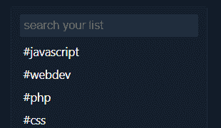](https://user-images.githubusercontent.com/14861869/59165482-8ba98a80-8b1c-11e9-889f-d09bc3fdabed.PNG)

## 手机&桌面截图/录音(如有 UI 改动)

[](https://user-images.githubusercontent.com/14861869/59165485-92d09880-8b1c-11e9-9606-c918c3a86da1.PNG) 之前

[](https://user-images.githubusercontent.com/14861869/59165487-95cb8900-8b1c-11e9-920e-d2da9158a921.PNG) 后

## 添加到文档中？

*   [ ]文档开发到
*   [ ]自述文件
*   [x]不需要文档

[View on GitHub](https://github.com/thepracticaldev/dev.to/pull/3089)

*   修正了撤销访问令牌会导致 404 的错误。谢谢，[@韵](https://dev.to/rhymes)！

# [ 修复访问令牌撤销 #3131](https://github.com/thepracticaldev/dev.to/pull/3131) 

[](https://github.com/rhymes) **[rhymes](https://github.com/rhymes)** posted on [<time datetime="2019-06-11T17:55:27Z">Jun 11, 2019</time>](https://github.com/thepracticaldev/dev.to/pull/3131)

## 这是什么类型的公关？(勾选所有适用选项)

*   [ ]重构
*   [ ]功能
*   [x]错误修复
*   [ ]文档更新

## 描述

我不是 100%确定为什么，但是似乎把 ID 作为关键字参数放在一个`DELETE`中并不能很好地与 Rails 兼容。我已经将其转换为使用一个内联参数，遵循 Rails 用于任何其他`DELETE` /destroy 动作的相同约定

## 相关车票&单据

关闭#3079

## 添加到文档中？

*   [ ]文档开发到
*   [ ]自述文件
*   [x]不需要文档

[View on GitHub](https://github.com/thepracticaldev/dev.to/pull/3131)

*   我修复了一个问题，当用户的帐户被删除时，他们的组织成员身份不会被破坏。

# [ 如果用户被破坏则破坏组织会员资格 #3125](https://github.com/thepracticaldev/dev.to/pull/3125) 

[](https://github.com/Zhao-Andy) **[Zhao-Andy](https://github.com/Zhao-Andy)** posted on [<time datetime="2019-06-11T14:28:20Z">Jun 11, 2019</time>](https://github.com/thepracticaldev/dev.to/pull/3125)

## 这是什么类型的公关？(勾选所有适用选项)

*   [x]错误修复

## 描述

修复了一个小错误，即当用户被破坏时，用户的组织成员身份没有被破坏。

相关#3077

[View on GitHub](https://github.com/thepracticaldev/dev.to/pull/3125)

*   默认情况下，@mariocsee 选中了列表的“通过连接联系”选项。谢谢，马里奥！

# [ 【通过连接联系】默认勾选 #3128](https://github.com/thepracticaldev/dev.to/pull/3128) 

[](https://github.com/mariocsee) **[mariocsee](https://github.com/mariocsee)** posted on [<time datetime="2019-06-11T16:43:16Z">Jun 11, 2019</time>](https://github.com/thepracticaldev/dev.to/pull/3128)

## 这是什么类型的公关？(勾选所有适用选项)

*   [x]重构

## 描述

将“通过连接联系”的默认状态设置为默认选中(true)。

## 相关车票&单据

解决#3088

## 添加到文档中？

*   [x]不需要文档

[View on GitHub](https://github.com/thepracticaldev/dev.to/pull/3128)

*   [@bdlb77](https://dev.to/bdlb77) 在 mobie view 内联作者自己帖子上的动作按钮。谢谢， [@bdlb77](https://dev.to/bdlb77) ！

# [Bug/动作按钮修复 #3110](https://github.com/thepracticaldev/dev.to/pull/3110) 

[](https://github.com/bdlb77) **[bdlb77](https://github.com/bdlb77)** posted on [<time datetime="2019-06-10T17:23:12Z">Jun 10, 2019</time>](https://github.com/thepracticaldev/dev.to/pull/3110)

Bug 修复-动作空间

按钮编辑和管理|添加 inline-flex 以使动作按钮总是在同一行

## 这是什么类型的公关？(勾选所有适用选项)

*   [ ]重构
*   [ ]功能
*   [X]错误修复
*   [ ]文档更新

## 描述

固定的行动空间按钮在手机上显示在同一行。添加了`display: inline-flex`以使元素始终保持相同的水平间距..导致它们在没有足够空间时缠绕在一起

## 相关车票&单据

修复#3061

## 手机&桌面截图/录音(如有 UI 改动)

[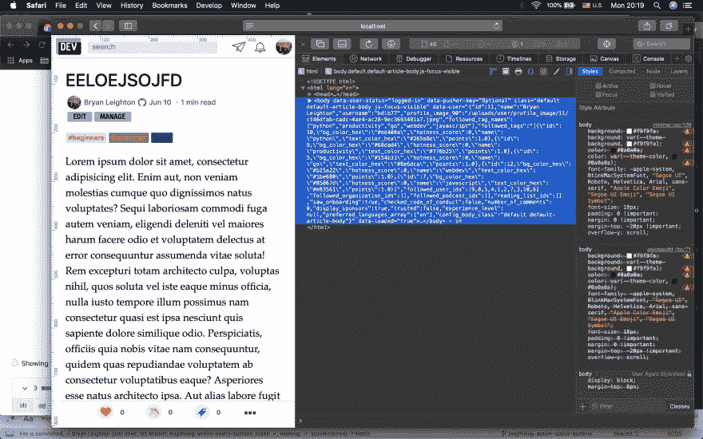](https://user-images.githubusercontent.com/32174912/59213276-2659a600-8bbd-11e9-81d9-0a70dbee9ee6.png)

[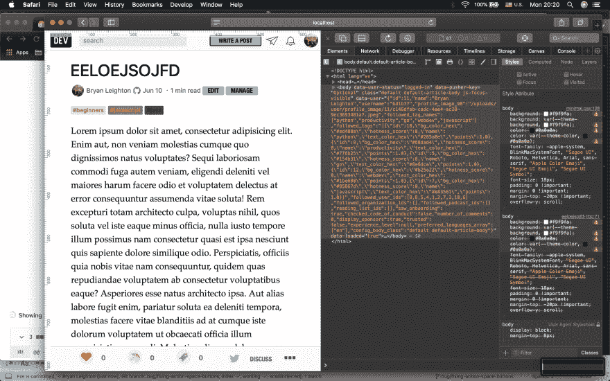](https://user-images.githubusercontent.com/32174912/59213294-2eb1e100-8bbd-11e9-8538-c8e2a32259a3.png)

## 添加到文档中？

*   [ ]文档开发到
*   [ ]自述文件
*   [X]不需要文档

## 【可选】哪个 gif 最能描述这个 PR 或者给你的感觉？

[](https://camo.githubusercontent.com/9d19823f3fcde1a94734deb282ae165a104c2519/68747470733a2f2f6d656469612e67697068792e636f6d2f6d656469612f313346727065564830395a7262322f67697068792e676966)

[View on GitHub](https://github.com/thepracticaldev/dev.to/pull/3110)

*   作为重构我们的`DelayedJob`方法的持续过程的一部分， [@lightalloy](https://dev.to/lightalloy) 将对`SlackBot.delay.ping`的调用转移到了`ActiveJob`。谢谢安娜。

# [ 将 SlackBot.delay.ping 调用到 active job # 3136# 3139](https://github.com/thepracticaldev/dev.to/pull/3139)

[](https://github.com/lightalloy) **[lightalloy](https://github.com/lightalloy)** posted on [<time datetime="2019-06-12T12:50:39Z">Jun 12, 2019</time>](https://github.com/thepracticaldev/dev.to/pull/3139)

## 这是什么类型的公关？(勾选所有适用选项)

*   [x]重构

## 描述

将 SlackBot.delay.ping 调用移动到单独的 ActiveJob。与将`handle_asynchronous`方法移动到`ActiveJob`方法相比，这似乎是多余的，但我仍然认为这样做是值得的，因为这样一来:

*   我们减少了对延迟作业的依赖
*   出错时更容易调试

## 相关车票&单据

#3136

[View on GitHub](https://github.com/thepracticaldev/dev.to/pull/3139)

*   [@arun](https://dev.to/arun) 提取了一个复合条件到自己的`private`方法。谢谢， [@arun](https://dev.to/arun) ！

# [ 提取复合条件到私有方法 #3144](https://github.com/thepracticaldev/dev.to/pull/3144) 

[](https://github.com/arku) **[arku](https://github.com/arku)** posted on [<time datetime="2019-06-12T20:23:10Z">Jun 12, 2019</time>](https://github.com/thepracticaldev/dev.to/pull/3144)

## 这是什么类型的公关？(勾选所有适用选项)

*   [x]重构
*   [ ]功能
*   [ ]错误修复
*   [ ]文档更新

## 描述

将`TagAdjustment#user_permissions`中的复合条件提取到一个方法中。

## 添加到文档中？

*   [ ]文档开发到
*   [ ]自述文件
*   [x]不需要文档

[View on GitHub](https://github.com/thepracticaldev/dev.to/pull/3144)

*   [@arun](https://dev.to/arun) 修复了夜间模式下未读频道名称为白色而非黑色的视觉问题。再次感谢， [@arun](https://dev.to/arun) ！

# [ 修复未读频道可见性名称 #3143](https://github.com/thepracticaldev/dev.to/pull/3143) 

[](https://github.com/arku) **[arku](https://github.com/arku)** posted on [<time datetime="2019-06-12T20:07:54Z">Jun 12, 2019</time>](https://github.com/thepracticaldev/dev.to/pull/3143)

## 这是什么类型的公关？(勾选所有适用选项)

*   [ ]重构
*   [ ]功能
*   [x](设计)错误修复
*   [ ]文档更新

## 描述

有未读消息的频道以黄色突出显示，但文本几乎不可读(见下面的截图)。这个 PR 通过把文字弄黑(#0a0a0a)来修复。

**在**之前

[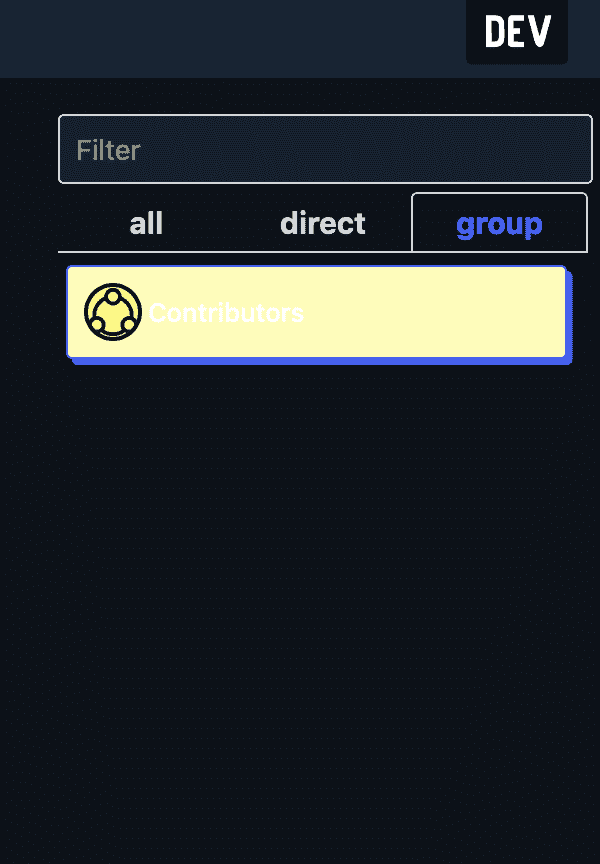](https://user-images.githubusercontent.com/7039523/59382554-971ad280-8d23-11e9-88bb-8e54e1695492.png)

之后

 **[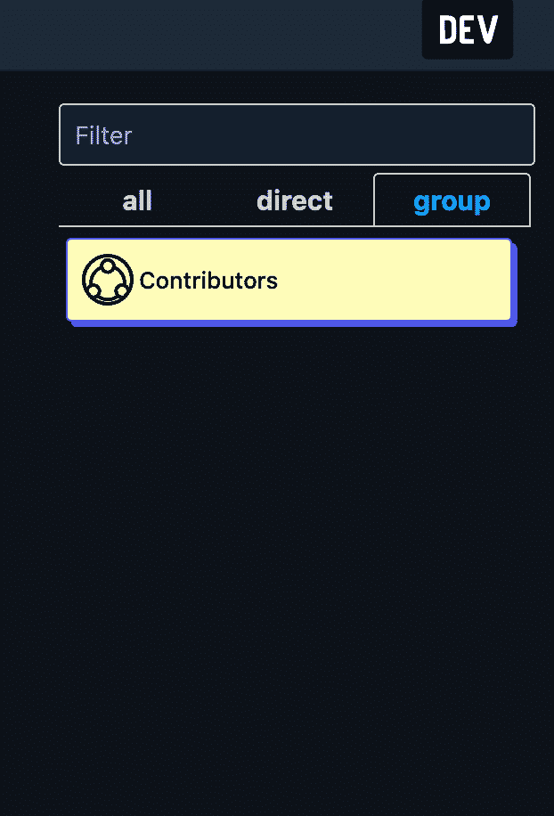](https://user-images.githubusercontent.com/7039523/59382501-7f434e80-8d23-11e9-88ef-5a3ea19ef5f9.png)

## 添加到文档中？

*   [ ]文档开发到
*   [ ]自述文件
*   [x]不需要文档** **[View on GitHub](https://github.com/thepracticaldev/dev.to/pull/3143)** ***   [@tannakartikey](https://dev.to/tannakartikey) 将`DelayedJob` `Mention`方法移入`ActiveJob`。谢谢， [@tannakartikey](https://dev.to/tannakartikey) ！

# [ 实施主动作业 #3055](https://github.com/thepracticaldev/dev.to/pull/3055) 

[](https://github.com/tannakartikey) **[tannakartikey](https://github.com/tannakartikey)** posted on [<time datetime="2019-06-06T03:28:53Z">Jun 06, 2019</time>](https://github.com/thepracticaldev/dev.to/pull/3055)

## 这是什么类型的公关？(勾选所有适用选项)

*   [x]重构
*   [ ]功能
*   [ ]错误修复
*   [ ]文档更新

## 描述

在`Mention`上为以下方法实现了 ActiveJob:

*   `Mention.create_all`
*   `Mention#send_email_notification`

## 相关车票&单据

#2497

[View on GitHub](https://github.com/thepracticaldev/dev.to/pull/3055)

*   [@arun](https://dev.to/arun) 去掉了一些死代码(100 行！);谢谢， [@arun](https://dev.to/arun) ！

# [ 清除死码 #3146](https://github.com/thepracticaldev/dev.to/pull/3146) 

[](https://github.com/arku) **[arku](https://github.com/arku)** posted on [<time datetime="2019-06-12T23:19:53Z">Jun 12, 2019</time>](https://github.com/thepracticaldev/dev.to/pull/3146)

## 这是什么类型的公关？(勾选所有适用选项)

*   [x]重构
*   [ ]功能
*   [ ]错误修复
*   [ ]文档更新

## 描述

移除`UserStates`类，因为它不在代码库中的任何地方使用。还删除了使用`UserStates`代码的测试。

## 添加到文档中？

*   [ ]文档开发到
*   [ ]自述文件
*   [x]不需要文档

[View on GitHub](https://github.com/thepracticaldev/dev.to/pull/3146)

*   @maestromac 更新了我们的服务人员，以便在控制台中显示任何错误。谢谢你，麦克！

# [ 更新服务人员和图标 #3142](https://github.com/thepracticaldev/dev.to/pull/3142) 

[](https://github.com/maestromac) **[maestromac](https://github.com/maestromac)** posted on [<time datetime="2019-06-12T17:28:25Z">Jun 12, 2019</time>](https://github.com/thepracticaldev/dev.to/pull/3142)

## 这是什么类型的公关？(勾选所有适用选项)

*   [x]杂项

## 描述

如果服务人员决定为`500.html`提供服务，现在将向浏览器输出一个错误。

## 相关车票&单据

## 手机&桌面截图/录音(如有 UI 改动)

## 添加到文档中？

*   [x]不需要文档

[View on GitHub](https://github.com/thepracticaldev/dev.to/pull/3142)

*   [@lightalloy](https://dev.to/lightalloy) 将抓取播客从回调中移除并放入`ActiveJob`。谢谢安娜。

# [ 从回调中移除抓取播客 #3098](https://github.com/thepracticaldev/dev.to/pull/3098) 

[](https://github.com/lightalloy) **[lightalloy](https://github.com/lightalloy)** posted on [<time datetime="2019-06-10T13:25:40Z">Jun 10, 2019</time>](https://github.com/thepracticaldev/dev.to/pull/3098)

## 这是什么类型的公关？(勾选所有适用选项)

*   [x]重构

## 描述

*   移除了用于获取播客片段的`after_create`回调
*   在管理员控制器动作中添加了抓取播客片段
*   从`/admin/podcasts/new`开始创建播客的请求规范
*   移除了在播种和运行测试时禁止获取播客的黑客行为

创建播客和获取剧集不应该紧密联系在一起。我们有时想创建一个播客，但不需要获取剧集，例如用于测试或植入数据库。

## 相关车票&单据

#2952

[View on GitHub](https://github.com/thepracticaldev/dev.to/pull/3098)

*   @lightalloy 为播客添加了一些急需的验证。再次感谢你，安娜！

# [# 3123](https://github.com/thepracticaldev/dev.to/pull/3123)

[](https://github.com/lightalloy) **[lightalloy](https://github.com/lightalloy)** posted on [<time datetime="2019-06-11T11:56:33Z">Jun 11, 2019</time>](https://github.com/thepracticaldev/dev.to/pull/3123)

## 这是什么类型的公关？(勾选所有适用选项)

*   [x]错误修复

## 描述

对播客和播客片段进行适当的验证，以避免将来失败。

*   添加了模型验证:字段存在、`slug`唯一性、`slug`唯一性和`username` s 以及组织`slug` s
*   添加了数据库约束
*   增加了验证规格

在合并之前，需要检查所有的`podcasts`和`podcast_episodes`记录没有违反所提供的约束(非空值和唯一性)

## 相关车票&单据

第 271 号[https://github.com/thepracticaldev/team/issues/177](https://github.com/thepracticaldev/team/issues/177)

[View on GitHub](https://github.com/thepracticaldev/dev.to/pull/3123)

*   [@maestromac](https://dev.to/maestromac) 修复了一个破损的测试。谢谢你，麦克！

# [ 修破规格 #3150](https://github.com/thepracticaldev/dev.to/pull/3150) 

[](https://github.com/maestromac) **[maestromac](https://github.com/maestromac)** posted on [<time datetime="2019-06-13T17:50:45Z">Jun 13, 2019</time>](https://github.com/thepracticaldev/dev.to/pull/3150)

_ (茨) _ /

[View on GitHub](https://github.com/thepracticaldev/dev.to/pull/3150)

*   [@lightalloy](https://dev.to/lightalloy) 更新了通知的唯一索引。安娜，谢谢你！

# [ 变更通知唯一索引#2525  #3012](https://github.com/thepracticaldev/dev.to/pull/3012) 

[](https://github.com/lightalloy) **[lightalloy](https://github.com/lightalloy)** posted on [<time datetime="2019-05-31T11:05:07Z">May 31, 2019</time>](https://github.com/thepracticaldev/dev.to/pull/3012)

## 这是什么类型的公关？(勾选所有适用选项)

*   [x]错误修复

## 描述

*   с改变了通知索引，使得它们考虑到了`user_id`、`organization_id`、`action`字段中可能的空值。Postgres 允许创建包含相同字段的记录，如果其中一些包含空值，那么我
    *   为`user_id`和`organization_id`创建了单独的索引，因为通知有`user_id`或`organization_id`
    *   为`action`为空和不为空的情况建立了部分索引
*   添加了检查通知是否重复的规范，即使验证被跳过

在合并之前，必须删除所有具有重复字段`%i[user_id organization_id notifiable_id notifiable_type action]`的通知

## 相关车票&单据

#2525

[View on GitHub](https://github.com/thepracticaldev/dev.to/pull/3012)

*   @lightalloy 增加了针对播客 slug 的用户名和组织 slug 验证。再次感谢你，安娜！

# [ 对照播客 slugs   #3148](https://github.com/thepracticaldev/dev.to/pull/3148) 验证用户名和组织 slugs

[](https://github.com/lightalloy) **[lightalloy](https://github.com/lightalloy)** posted on [<time datetime="2019-06-13T12:43:32Z">Jun 13, 2019</time>](https://github.com/thepracticaldev/dev.to/pull/3148)

## 这是什么类型的公关？(勾选所有适用选项)

*   [x]错误修复

## 描述

*   不仅相互验证用户名和组织 slug，还验证播客 slug
*   增加了测试用户名和组织 slugs 唯一性和不等于保留字的规范

播客`slug`的验证在另一个 pr #3123 中

[View on GitHub](https://github.com/thepracticaldev/dev.to/pull/3148)

*   [@lightalloy](https://dev.to/lightalloy) 也给通知增加了一个`organization_id`索引。谢谢安娜。

# [ 给通知  #3155](https://github.com/thepracticaldev/dev.to/pull/3155) 增加了 organization_id 索引

[](https://github.com/lightalloy) **[lightalloy](https://github.com/lightalloy)** posted on [<time datetime="2019-06-14T10:00:47Z">Jun 14, 2019</time>](https://github.com/thepracticaldev/dev.to/pull/3155)

## 这是什么类型的公关？(勾选所有适用选项)

*   [x]优化

## 描述

将`organization_id`索引添加到`notifications`表中。

解释不带索引的查询:

```
Notification.where("organization_id = 3 and read = false").select("count(*)").explain
------------------------------------------------------------------------
 Aggregate  (cost=780.32..780.33 rows=1 width=8)
   ->  Seq Scan on notifications  (cost=0.00..775.94 rows=1753 width=0)
         Filter: ((NOT read) AND (organization_id = 3))
(3 rows) 
```

使用提供的索引:

```
Notification.where("organization_id = 3 and read = false").select("count(*)").explain
-----------------------------------------------------------------------------------------------------------------------
 Aggregate  (cost=338.36..338.37 rows=1 width=8)
   ->  Index Scan using index_notifications_on_organization_id on notifications  (cost=0.28..333.98 rows=1753 width=0)
         Index Cond: (organization_id = 3)
         Filter: (NOT read)
(4 rows) 
```

[View on GitHub](https://github.com/thepracticaldev/dev.to/pull/3155)

*   [@押韵](https://dev.to/rhymes)修复了分析的运行时错误。谢谢，[@韵](https://dev.to/rhymes)！

# [ 修复按日分组的分析，平均页面浏览量为零 #3159](https://github.com/thepracticaldev/dev.to/pull/3159) 

[](https://github.com/rhymes) **[rhymes](https://github.com/rhymes)** posted on [<time datetime="2019-06-14T15:15:06Z">Jun 14, 2019</time>](https://github.com/thepracticaldev/dev.to/pull/3159)

## 这是什么类型的公关？(勾选所有适用选项)

*   [ ]重构
*   [ ]功能
*   [x]错误修复
*   [ ]文档更新

## 描述

我不确定这是如何在生产中发生的，但我猜有些页面浏览量对于特定的文章来说是零。如果平均结果为`NULL`，那么分析页面将会打开。

这是解决这个问题的方法。

## 添加到文档中？

*   [ ]文档开发到
*   [ ]自述文件
*   [x]不需要文档

[View on GitHub](https://github.com/thepracticaldev/dev.to/pull/3159)

*   [@韵](https://dev.to/rhymes)还删除了一些与 pro 仪表盘相关的死代码。谢谢，[@韵](https://dev.to/rhymes)！

# [ 删除旧仪表板 Pro 代码 #3161](https://github.com/thepracticaldev/dev.to/pull/3161) 

[](https://github.com/rhymes) **[rhymes](https://github.com/rhymes)** posted on [<time datetime="2019-06-14T16:21:05Z">Jun 14, 2019</time>](https://github.com/thepracticaldev/dev.to/pull/3161)

## 这是什么类型的公关？(勾选所有适用选项)

*   [x]重构
*   [ ]功能
*   [ ]错误修复
*   [ ]文档更新

## 描述

有一个`Dashboard::Pro`类是躺在周围，我认为它早于`AnalyticsService`@赵安迪开始。因为它在任何地方都没有被使用，所以我要把它拿掉

## 添加到文档中？

*   [ ]文档开发到
*   [ ]自述文件
*   [x]不需要文档

[View on GitHub](https://github.com/thepracticaldev/dev.to/pull/3161)

*   [@jrsam](https://dev.to/jrsam) 为液体标签内的物品设置 1 分钟的默认读取时间。谢谢，@jrsam！

# [ 设置液体标签内物品的默认读取时间为 1 分钟 #3084](https://github.com/thepracticaldev/dev.to/pull/3084) 

[](https://github.com/jrsam) **[jrsam](https://github.com/jrsam)** posted on [<time datetime="2019-06-09T11:27:38Z">Jun 09, 2019</time>](https://github.com/thepracticaldev/dev.to/pull/3084)

解决#3024

## 这是什么类型的公关？(勾选所有适用选项)

*   [ ]重构
*   [ ]功能
*   [x]错误修复
*   [ ]文档更新

## 添加到文档中？

*   [ ]文档开发到
*   [ ]自述文件
*   [x]不需要文档

[View on GitHub](https://github.com/thepracticaldev/dev.to/pull/3084)

*   [@押韵](https://dev.to/rhymes)做了一点重构，并通过删除不必要的`.pluck`调用做了一些性能改进。谢谢，[@韵](https://dev.to/rhymes)！

# [ 性能:保存一些不需要拔毛时的查询 #3160](https://github.com/thepracticaldev/dev.to/pull/3160) 

[](https://github.com/rhymes) **[rhymes](https://github.com/rhymes)** posted on [<time datetime="2019-06-14T15:37:50Z">Jun 14, 2019</time>](https://github.com/thepracticaldev/dev.to/pull/3160)

## 这是什么类型的公关？(勾选所有适用选项)

*   [x]重构
*   [ ]功能
*   [ ]错误修复
*   [ ]文档更新

## 描述

Rails `pluck`强制执行额外的 SQL 查询，当对象已经在内存中或者请求的 ID 是主键 ID 时，并不总是需要这样的查询。

## 添加到文档中？

*   [ ]文档开发到
*   [ ]自述文件
*   [x]不需要文档

[View on GitHub](https://github.com/thepracticaldev/dev.to/pull/3160)

*   [@max](https://dev.to/max) 修复了 Safari 阅读器模式下的一些图标尺寸。谢谢， [@max](https://dev.to/max) ！

# [ 修复 Safari 阅读器模式下图标尺寸 #3157](https://github.com/thepracticaldev/dev.to/pull/3157) 

[](https://github.com/maximelafarie) **[maximelafarie](https://github.com/maximelafarie)** posted on [<time datetime="2019-06-14T12:15:26Z">Jun 14, 2019</time>](https://github.com/thepracticaldev/dev.to/pull/3157)

## 这是什么类型的公关？(勾选所有适用选项)

*   [ ]重构
*   [ ]功能
*   [X]错误修复
*   [ ]文档更新

## 描述

在 Safari 阅读器模式下，图标变得非常大。我使用了**未使用的**类，该类在阅读器模式下仅添加到图标**的**:`.reader-image-tiny`。

默认视图: [](https://user-images.githubusercontent.com/5319267/59508415-25bb5b00-8eae-11e9-9570-84141623ee26.png)

Safari 阅读器模式视图: [](https://user-images.githubusercontent.com/5319267/59508431-34a20d80-8eae-11e9-9c04-40d6c444b5ef.png)

## 相关车票&单据

我对此一无所知。

## 手机&桌面截图/录音(如有 UI 改动)

苹果智能手机也是如此

## 添加到文档中？

*   [ ]文档开发到
*   [ ]自述文件
*   [X]不需要文档

## 【可选】哪个 gif 最能描述这个 PR 或者给你的感觉？

[](https://camo.githubusercontent.com/6850c706cb778f51d6343f0c005a7fc017f578bd/68747470733a2f2f6d656469612e67697068792e636f6d2f6d656469612f725662417a555553554336644f2f67697068792e676966) (迫不及待，因为这是我第一次为这个伟大的项目做出贡献<g-emoji class="g-emoji" alias="metal" fallback-src="https://github.githubassets.cimg/icons/emoji/unicode/1f918.png">🤘</g-emoji>

[View on GitHub](https://github.com/thepracticaldev/dev.to/pull/3157)

## 新的问题和讨论

*   [@andrewbrown](https://dev.to/andrewbrown) 请求了一个功能，其中可能有文章的短链接。谢谢， [@andrewbrown](https://dev.to/andrewbrown) ！

# [ 文章链接 #3078](https://github.com/thepracticaldev/dev.to/issues/3078) 

[](https://github.com/omenking) **[omenking](https://github.com/omenking)** posted on [<time datetime="2019-06-08T15:31:05Z">Jun 08, 2019</time>](https://github.com/thepracticaldev/dev.to/issues/3078)

**您的功能请求是否与某个问题相关？请描述一下。**短链接。

**描述你想要的解决方案**有一个比整篇文章链接更短的替代链接，用于在对你不利的平台上分享。

**描述你考虑过的替代方案**我可以使用短链接工具，但我觉得使用`dev.to` url 更可信

**附加上下文**

[View on GitHub](https://github.com/thepracticaldev/dev.to/issues/3078)

*   @dance2die 申请了一个功能，读者可以为一篇文章建议“相关文章”。谢谢， [@dance2die](https://dev.to/dance2die) ！

# [ 创建一个特征来建议一个【相关帖子】 #3083](https://github.com/thepracticaldev/dev.to/issues/3083) 

[](https://github.com/dance2die) **[dance2die](https://github.com/dance2die)** posted on [<time datetime="2019-06-09T03:53:19Z">Jun 09, 2019</time>](https://github.com/thepracticaldev/dev.to/issues/3083)

**您的功能请求是否与某个问题相关？请描述一下。**这是一个全新的功能要求。

当我在阅读帖子时，我看到许多帖子都与另一个帖子相关或者是更高级的话题。

例如，下面的第一个帖子(`Testing your apps like a boss...`)是关于如何测试 React 组件的介绍(使用`jest` &显示嘲笑)，而后者(`A bit about Jest mocks`)是关于“Jest mocks”的更深入的帖子。

1.  [用 React.js 和 Jest 像老板一样测试你的应用](https://dev.to/softchris/testing-your-apps-like-a-boss-with-react-js-and-jest-1hkh)
2.  [一点关于笑话的嘲讽](https://dev.to/jenniferlynparsons/a-bit-about-jest-mocks-2o7k)

**描述您想要的解决方案**

这可能需要两个特性。

1.  在“经典”和“另一个你可能喜欢的帖子”上方的帖子底部创建一个新的“建议/相关帖子”。
2.  在“建议一条推文”下面添加“建议一个相关的帖子”。

[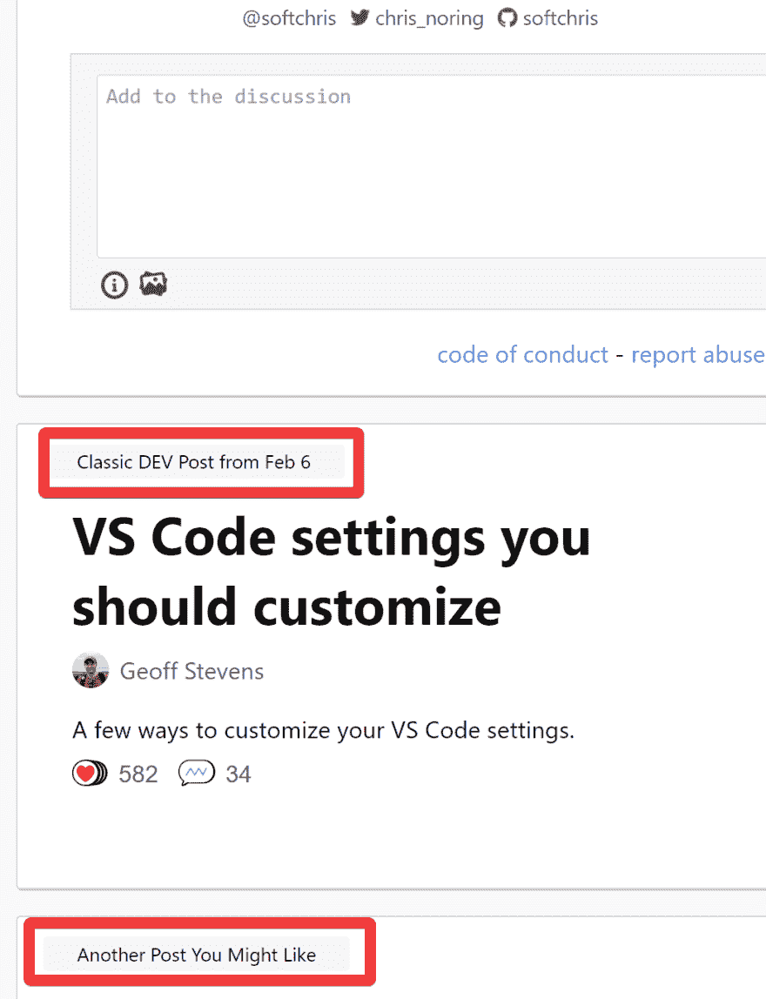](https://user-images.githubusercontent.com/8465237/59154771-153b5880-8a48-11e9-93bc-79c4cfc4f43e.png)

**描述你考虑过的替代方案**

我们可以将它显示为“另一个你可能喜欢的帖子”，而不是创建一个新的“建议/相关帖子”类别。

**附加上下文**

此功能可能需要标签/版主状态。

[View on GitHub](https://github.com/thepracticaldev/dev.to/issues/3083)

*   [@nickytonline](https://dev.to/nickytonline) 报告了一个问题，即一旦选择了一个文件，评论的图像上传按钮就会跳起来。谢谢， [@nickytonline](https://dev.to/nickytonline) ！

# 选择一个文件后，评论表单上的 [ 图片上传按钮会弹出 #3085](https://github.com/thepracticaldev/dev.to/issues/3085) 

[](https://github.com/nickytonline) **[nickytonline](https://github.com/nickytonline)** posted on [<time datetime="2019-06-09T12:16:49Z">Jun 09, 2019</time>](https://github.com/thepracticaldev/dev.to/issues/3085)

**描述 bug**

当图像被选择添加到评论时，UI 移动或覆盖其他 UI(在移动的情况下)。

**重现**

1.  转到任何帖子，点击评论的图片上传按钮。
2.  选择要上传的文件。
3.  文件被上传。
4.  包含新上传图像的 URL 的文本输入出现，导致图像上传按钮上移(桌面)或覆盖其他 UI(移动)。

**预期行为**

该用户界面不应移动或覆盖其他用户界面。

**截图**

[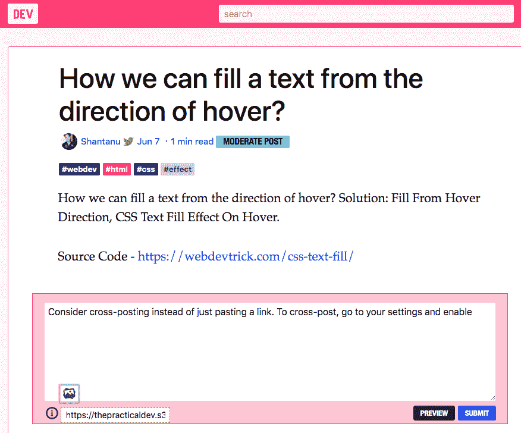](https://user-images.githubusercontent.com/833231/59158795-f2cc2e00-8a8d-11e9-985e-40547aea514d.png)

[](https://user-images.githubusercontent.com/833231/59158834-8271dc80-8a8e-11e9-8fc8-9317921f2212.png)

**桌面(请填写以下信息):**

*   操作系统:macOS 10.14.5
*   浏览器:FireFox，Chrome，Safari
*   版本:最新

**智能手机(请填写以下信息):**

*   设备:iPhone 6 SE
*   OS: iOS
*   浏览器:勇敢
*   版本:不确定

**附加上下文**

[View on GitHub](https://github.com/thepracticaldev/dev.to/issues/3085)

*   [@georgecoldham](https://dev.to/georgecoldham) 为用户开启了一个关于限速新帖的讨论。谢谢， [@georgecoldham](https://dev.to/georgecoldham) ！

# [# 3091](https://github.com/thepracticaldev/dev.to/issues/3091)

[](https://github.com/GeorgeColdham) **[GeorgeColdham](https://github.com/GeorgeColdham)** posted on [<time datetime="2019-06-10T12:55:58Z">Jun 10, 2019</time>](https://github.com/thepracticaldev/dev.to/issues/3091)

**您的功能请求是否与某个问题相关？请描述一下。**我偶尔会发现我的订阅被我猜是机器人的帖子堵塞了？或者用户试图将用户推离网站。

**描述您想要的解决方案**限制用户每小时的发帖量。或许对那些有足够老的账号和/或足够多的帖子互动的人放宽限制。

**描述你考虑过的替代方案**创建一个机器人来过滤掉任何标题相似的文章？

**附加语境**我最新供稿的例子: [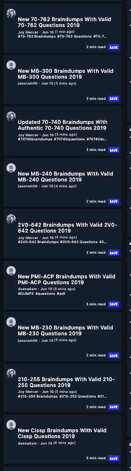](https://user-images.githubusercontent.com/21260083/59196458-a7497b00-8b86-11e9-9363-89cb654f27f0.png)

今天创建并在最近 40 分钟内发表了 15 篇以上帖子的用户示例:[](https://user-images.githubusercontent.com/21260083/59196744-656d0480-8b87-11e9-9535-766f09ed34e6.png)[](https://user-images.githubusercontent.com/21260083/59196747-67cf5e80-8b87-11e9-86ba-fccb72cffe8b.png)[](https://user-images.githubusercontent.com/21260083/59196752-6a31b880-8b87-11e9-94b3-216f78cc9e14.png)

[ ](https://user-images.githubusercontent.com/21260083/59197026-24292480-8b88-11e9-9d16-02f23bd8ee18.png) [ 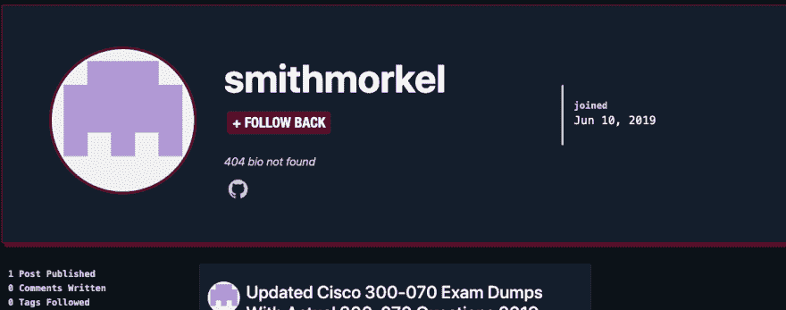](https://user-images.githubusercontent.com/21260083/59197031-25f2e800-8b88-11e9-834d-8c9864311c0a.png)

[View on GitHub](https://github.com/thepracticaldev/dev.to/issues/3091)

*   [@mariocsee](https://dev.to/mariocsee) 报告了页脚在某个宽度范围内不能正确居中`/dashboard`的问题。谢谢，马里奥！

# [ 文章仪表板中的非居中页脚 #3112](https://github.com/thepracticaldev/dev.to/issues/3112) 

[](https://github.com/mariocsee) **[mariocsee](https://github.com/mariocsee)** posted on [<time datetime="2019-06-10T20:56:36Z">Jun 10, 2019</time>](https://github.com/thepracticaldev/dev.to/issues/3112)

**描述 bug** 在`dev.to/dashboard`中，页脚比文章的中间栏更靠右。这发生在`950`和`1119`的宽度之间，似乎对任何更宽或更窄的东西都没问题。

**重现**

1.  转到“开发到/仪表板”
2.  将宽度调整到 950 到 1119 之间
3.  向下滚动到底部
4.  参见页脚

**预期行为**页脚应该像`/dashboard`一样居中，中间栏的左右两边都没有卡片。

**截图** [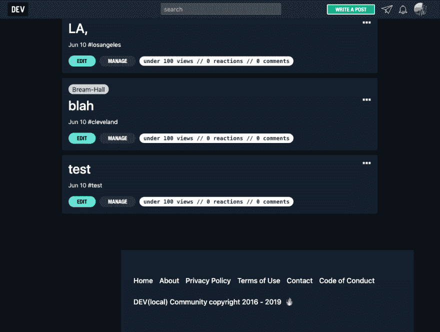](https://user-images.githubusercontent.com/13403332/59226431-fbf9ef80-8ba0-11e9-9251-279507f8bc81.png)

**桌面(请填写以下信息):**

*   操作系统:苹果操作系统
*   浏览器:铬
*   版本:75

**附加上下文**请注意，页脚在整个开发过程中使用，并不总是居中对齐，这取决于您所在的页面。

[View on GitHub](https://github.com/thepracticaldev/dev.to/issues/3112)

*   [@ksato1995](https://dev.to/ksato1995) 报告了一个问题，有时从“最新列表”侧边栏中点击一个列表并不能载入一个列表。谢谢，@ksato1995！

# [ 有时不载入清单 #3118](https://github.com/thepracticaldev/dev.to/issues/3118) 

[](https://github.com/K-Sato1995) **[K-Sato1995](https://github.com/K-Sato1995)** posted on [<time datetime="2019-06-11T06:02:56Z">Jun 11, 2019</time>](https://github.com/thepracticaldev/dev.to/issues/3118)

**描述 bug**

当我点击一个清单上的`newest listings`、[、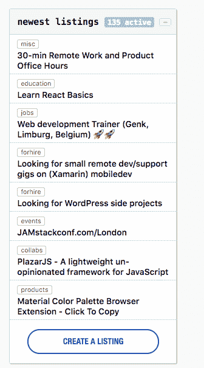、](https://user-images.githubusercontent.com/32632542/59247195-830a9e80-8c59-11e9-843b-9e922c1aea40.png)

有时我会看到像下面截图一样的黑屏，我不得不刷新页面来加载列表。[](https://user-images.githubusercontent.com/32632542/59247176-738b5580-8c59-11e9-90c4-4ac665863135.png)

**重现**

**预期行为**

加载点击的列表并在屏幕上显示。**截图**

截图如上。

**桌面(请填写以下信息):**

*   操作系统:Mac
*   浏览器:铬
*   版本:版本 74.0.3729.169(官方版本)(64 位)

**智能手机(请填写以下信息):**

*   设备:
*   操作系统:
*   浏览器:
*   版本:

**附加上下文**

[View on GitHub](https://github.com/thepracticaldev/dev.to/issues/3118)

*   @inozex 报告了一个问题，dev.to 在专有的脸书浏览器上无法正常工作。谢谢， [@inozex](https://dev.to/inozex) ！

# [  Dev.to 脸书浏览器 #3121](https://github.com/thepracticaldev/dev.to/issues/3121) 

[](https://github.com/I-NOZex) **[I-NOZex](https://github.com/I-NOZex)** posted on [<time datetime="2019-06-11T10:51:16Z">Jun 11, 2019</time>](https://github.com/thepracticaldev/dev.to/issues/3121)

**描述 bug** Dev.to 页面无法在脸书内置浏览器上加载

**复制**打开一个从脸书共享的开发链接

**预期行为**正确加载页面

**截图** [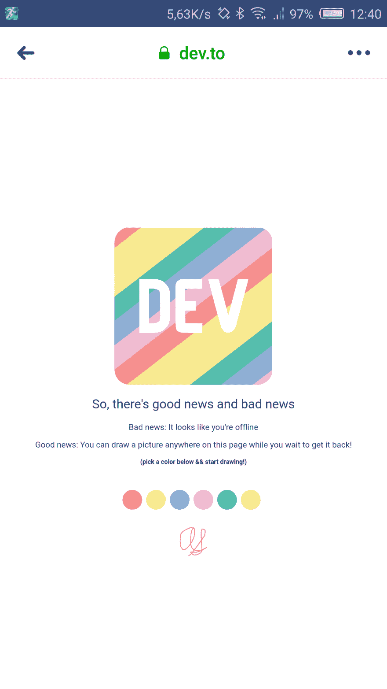](https://user-images.githubusercontent.com/5805207/59265868-8c3e4000-8c46-11e9-9f96-6a3a8f2f5f73.png)

**智能手机**

*   设备:nubia z17 lite (nx591j)
*   OS: Android 7.1.1
*   浏览器:脸书(浏览器)
*   版本:224.0.0.33.114

[View on GitHub](https://github.com/thepracticaldev/dev.to/issues/3121)

*   @rhymes 请求了一个阅读列表可以分页或无限滚动的特性。也是有点 bug。谢谢，[@韵](https://dev.to/rhymes)！

# [ 阅读列表:添加分页或无限卷轴 #3122](https://github.com/thepracticaldev/dev.to/issues/3122) 

[](https://github.com/rhymes) **[rhymes](https://github.com/rhymes)** posted on [<time datetime="2019-06-11T11:56:17Z">Jun 11, 2019</time>](https://github.com/thepracticaldev/dev.to/issues/3122)

**您的功能请求是否与某个问题相关？请描述一下。**

现在阅读列表只显示最新的 64 个条目。如果用户有更多，他们不能访问其他项目，直到他们保存或存档“N - 64”文章。

参见[https://github . com/the practical dev/dev . to/blob/master/app/JavaScript/reading list/reading list . jsx # L24](https://github.com/thepracticaldev/dev.to/blob/master/app/javascript/readingList/readingList.jsx#L24)

**描述您想要的解决方案**

要么有一个“加载更多”按钮，如上市必须加载其他项目，或有无限滚动的分页

[View on GitHub](https://github.com/thepracticaldev/dev.to/issues/3122)

*   [@押韵](https://dev.to/rhymes)阅读列表:添加表头项目数

# [ 阅读列表:添加表头项目数 #3124](https://github.com/thepracticaldev/dev.to/issues/3124) 

[](https://github.com/rhymes) **[rhymes](https://github.com/rhymes)** posted on [<time datetime="2019-06-11T12:05:39Z">Jun 11, 2019</time>](https://github.com/thepracticaldev/dev.to/issues/3124)

**您的功能请求是否与某个问题相关？请描述一下。**

从主页上可以看到阅读列表中有多少条目。一旦进入 https://dev.to/readinglist，这些信息就无法获取

**描述您想要的解决方案**

添加标题中的文章数量。

从目前来看

[](https://user-images.githubusercontent.com/146201/59270499-eb558200-8c51-11e9-8f57-f8b04962fdfc.png)

类似于

[](https://user-images.githubusercontent.com/146201/59270511-f14b6300-8c51-11e9-8ae1-4e1cc77da8fd.png)

**附加上下文**

我猜，每当一个项目被删除或存档，这个数字就必须更新

[View on GitHub](https://github.com/thepracticaldev/dev.to/issues/3124)

*   @jess 请求了一个可以使用热键切换文章预览的功能。谢谢杰西。

# [ 热键切换为文章预览 #3129](https://github.com/thepracticaldev/dev.to/issues/3129) 

[](https://github.com/jessleenyc) **[jessleenyc](https://github.com/jessleenyc)** posted on [<time datetime="2019-06-11T17:09:47Z">Jun 11, 2019</time>](https://github.com/thepracticaldev/dev.to/issues/3129)

**您的功能请求是否与某个问题相关？请描述一下。**作为一名用户，我想要一个在我写文章时切换文章预览的热键，这样我就不用手动来回点击了。

[View on GitHub](https://github.com/thepracticaldev/dev.to/issues/3129)

*   [@jess](https://dev.to/jess) 报告了一篇文章阅读时间估计不正确的问题。再次感谢你，杰西！

# [ 阅读时间估计有误 #3130](https://github.com/thepracticaldev/dev.to/issues/3130) 

[](https://github.com/jessleenyc) **[jessleenyc](https://github.com/jessleenyc)** posted on [<time datetime="2019-06-11T17:16:31Z">Jun 11, 2019</time>](https://github.com/thepracticaldev/dev.to/issues/3130)

@迈克尔-塔林顿评论[2019 年 06 月 04 日星期二](https://github.com/thepracticaldev/team/issues/175)

**描述 bug** 某个帖子的(【https://dev.to/backendandbbq/what-does-a-tech-lead-do-1cpj】T2)预计阅读时间为 1 分钟，但该帖子相当长，应该给予更高的估计。

**重现**

1.  访问此帖子-[https://dev.to/backendandbbq/what-does-a-tech-lead-do-1cpj](https://dev.to/backendandbbq/what-does-a-tech-lead-do-1cpj)
2.  看看阅读时间
3.  看文章的长度

**预期行为**我期望阅读时间是一个更清晰的估计。这篇文章比一分钟阅读要长得多。

**截图**

文章图片: [](https://camo.githubusercontent.com/c4b85fa5d4a63a733906025cfd532e5bd00f660f/68747470733a2f2f636c2e6c792f6661336330346336316664342f646f776e6c6f61642f496d616765253230323031392d30362d3034253230617425323031312e35342e3530253230414d2e706e67)

记者发来的邮件图片:

[](https://camo.githubusercontent.com/7f24e32edb41bec647f1af0a0bc8d6228360820b/68747470733a2f2f636c2e6c792f3166313432643065303430362f646f776e6c6f61642f496d616765253230323031392d30362d3034253230617425323031312e35362e3230253230414d2e706e67)

**附加语境**记者还参考了另一期(链接预告 O 分钟)已经报道过的——【https://github.com/thepracticaldev/dev.to/issues/3024】T2。

[View on GitHub](https://github.com/thepracticaldev/dev.to/issues/3130)

*   [@beatngu13](https://dev.to/beatngu13) 报告了一个问题，一些数学符号和其他符号无法正确渲染。谢谢，@beatngu13！

# [ 编码问题 #3133](https://github.com/thepracticaldev/dev.to/issues/3133) 

[](https://github.com/beatngu13) **[beatngu13](https://github.com/beatngu13)** posted on [<time datetime="2019-06-11T20:43:11Z">Jun 11, 2019</time>](https://github.com/thepracticaldev/dev.to/issues/3133)

**描述 bug**

我的文章中有一篇[使用了各种数学符号，这在我写作和发表的时候是没问题的。但是今天我又看了一遍，发现有各种各样的编码问题。除了数学符号之外，普通破折号现在也会引起问题，例如:](https://dev.to/beatngu1101/a-formal-look-at-seleniums-nosuchelementexception)

> [……]描述的情况 GUI 元素识别问题……]

曾经是:

> [……]描述的情况 GUI 元素识别问题[……]

您可以在文章的[中版本](https://medium.com/@beatngu13/a-formal-look-at-seleniums-nosuchelementexception-bafce97df2e7)上检查预期的行为。

**重现**

转到[https://dev . to/beatngu 1101/a-formal-look-at-se leniums-nosuchelementexception](https://dev.to/beatngu1101/a-formal-look-at-seleniums-nosuchelementexception)。

**预期行为**

对比[https://medium . com/@ beatngu 13/a-formal-look-at-se leniums-nosuchelementexception-BAF ce 97 df 2e 7](https://medium.com/@beatngu13/a-formal-look-at-seleniums-nosuchelementexception-bafce97df2e7)。

**桌面(请填写以下信息):**

*   操作系统:macOS Mojave (10.14.5)
*   浏览器:Firefox Quantum (67.0.1，64 位)

[View on GitHub](https://github.com/thepracticaldev/dev.to/issues/3133)

*   [@michaeltharrington](https://dev.to/michaeltharrington) 开启了一个关于提供选择不公开显示 GitHub 或 Twitter 图标的功能的讨论。谢谢你，迈克尔！

# [ 提供选择不在个人资料/姓名/评论  #3134](https://github.com/thepracticaldev/dev.to/issues/3134) 上显示 GitHub 或 Twitter 图标的功能

[](https://github.com/michael-tharrington) **[michael-tharrington](https://github.com/michael-tharrington)** posted on [<time datetime="2019-06-11T21:03:29Z">Jun 11, 2019</time>](https://github.com/thepracticaldev/dev.to/issues/3134)

**您的功能请求是否与某个问题相关？请描述一下。**一位用户来信询问是否可以选择不在评论旁边显示他们的 GitHub 链接。他们通过 GitHub 注册，但不一定希望他们的 GitHub 公开展示。这个选择会给他们更多的隐私。

**描述您想要的解决方案**我们可以在 https://dev.to/settings[的个人资料部分的“链接”下添加针对 Twitter 和 GitHub 的信息](https://dev.to/settings)。我在想，如果用户通过其中一个或两个注册，默认填写这些会很好。然而，用户可以很容易地访问他们的设置并删除可见的链接，这样 GH 和 Twitter 图标就可以被删除。

**描述你考虑过的替代方案**我们可以像上面一样做，但默认情况下不填写 GitHub/Twitter 输入。然而，我认为一般来说拥有它们是很好的，所以我更喜欢默认填充它们的想法。

[View on GitHub](https://github.com/thepracticaldev/dev.to/issues/3134)

*   [@lightalloy](https://dev.to/lightalloy) 写了一份把`DelayedJob`的电话转移到`ActiveJob`的清单。欢迎投稿！谢谢安娜。

# [ 移动延迟调用到 ActiveJob  #3136](https://github.com/thepracticaldev/dev.to/issues/3136) 

[](https://github.com/lightalloy) **[lightalloy](https://github.com/lightalloy)** posted on [<time datetime="2019-06-12T09:50:41Z">Jun 12, 2019</time>](https://github.com/thepracticaldev/dev.to/issues/3136)

如#2497 所述，为了减少对`DelayedJob`的依赖，我们还需要将通过调用`delay`方法创建的作业转移到`ActiveJob`:

这是通话清单:

*   [x] `Slackbot.ping`
*   [x] `reaction.create`
*   [x] `ArticleAnalyticsFetcher.new.update_analytics`
*   [x] `HtmlVariantSuccess.create`
*   [x] `HtmlVariantTrial.create`
*   [x] `message.send_push`
*   [x] `RssReader.new.fetch_user`
*   `trigger_delayed_index`中的[x]个呼叫
*   [x] `index.delay.delete_object("users-#{id}")`
*   [x] `user.follow`
*   【x】`chat_channel.delay.index!`-[https://github.com/thepracticaldev/dev.to/pull/4317](https://github.com/thepracticaldev/dev.to/pull/4317)

每个呼叫的操作:

*   创建一个相应的`ActiveJob`，指定一个队列名
*   在作业中调用所需的方法
*   用作业`perform_later`调用替换`delay`方法调用
*   您可能需要通过使用`perform_enqueued_job`而不是`run_background_jobs_immediately`助手来修改现有的测试

记住将记录`id` s(如果需要)而不是 ActiveRecord 对象传递给作业，以避免反序列化错误(#1621)

[View on GitHub](https://github.com/thepracticaldev/dev.to/issues/3136)

*   [@ noahscott](https://dev.to/noahsscott)从用户的个人资料页面请求了一个更容易控制用户的功能。谢谢，[@ noahscott](https://dev.to/noahsscott)！

# [ 能够温和用户从他们的个人资料页面 #3137](https://github.com/thepracticaldev/dev.to/issues/3137) 

[](https://github.com/noahsscott) **[noahsscott](https://github.com/noahsscott)** posted on [<time datetime="2019-06-12T10:09:50Z">Jun 12, 2019</time>](https://github.com/thepracticaldev/dev.to/issues/3137)

**您的功能请求是否与某个问题相关？请描述一下。**随着最近垃圾邮件的出现(见[问题#3091](https://github.com/thepracticaldev/dev.to/issues/3091) )，有能力标记或禁止用户的个人资料页面将是有用的。如果一个帐户负责多个类似垃圾邮件的帖子和/或显然是垃圾邮件帐户，这将节省标记单个帖子的时间。

**描述您想要的解决方案**一个按钮或图标标记一个帐户——对所有人可见，另一个按钮或图标禁止——对版主及以上的版主可见(取决于人们对版主拥有这种能力的看法)。一旦被标记，用户将选择一个帐户被标记或禁止的原因，并有一个字段为管理员提供进一步的背景信息，类似于[报告页面](https://dev.to/report-abuse)，但可能包装在一个模态中？如果有帮助，我可以提供一个模型。

**描述你考虑过的替代方案**没有，因为所描述的标记或禁止用户的行为在在线社区中很常见。

**附加背景**在最近的 feed 上发现许多垃圾邮件帖子后，我将违规帐户的列表发送给了开发管理员 Michael，他将我指向了[问题#3091](https://github.com/thepracticaldev/dev.to/issues/3091) ，建议的改进似乎可以防止未来发生类似的活动。但在垃圾邮件帐户仍然通过的情况下，如果所有用户都可以标记帐户，并且版主可以禁止这些帐户，将会节省时间。正如我上面提到的，我知道报告页面，但是考虑到一旦一个帐户开始张贴垃圾邮件，无论如何都需要采取行动来控制该帐户，直接选择标记或禁止用户进入个人资料页面感觉更合适。

[View on GitHub](https://github.com/thepracticaldev/dev.to/issues/3137)

*   [@merri](https://dev.to/merri) 报告了一个问题，当编辑查看元数据进行编辑时，会删除元数据。谢谢， [@merri](https://dev.to/merri) ！

# [ 编辑器一开机就删除 meta# 3138](https://github.com/thepracticaldev/dev.to/issues/3138)

[](https://github.com/Merri) **[Merri](https://github.com/Merri)** posted on [<time datetime="2019-06-12T10:34:50Z">Jun 12, 2019</time>](https://github.com/thepracticaldev/dev.to/issues/3138)

描述 bug 我已经花了一周的时间写一篇文章。昨天我加了一个组织，把文章移到了组织里。后来，我注意到在加载文章进行编辑时，它丢失了所有的元信息。编辑器只包含文章文本。在编辑器启动前，我可以看到元数据在闪烁，但启动后它消失了(按钮出现在底部)。除此之外编辑器一直在底部显示**新变化(清晰)**。

此外，如果我转到设置，在编辑器的 v1 和 v2 版本之间切换，我看不到编辑器发生任何变化。我以前从来没有接触过这个设置，但是编辑器在一两周前改变了一些视觉上不同的东西。

到目前为止，我已经注意到，如果我打开 private (Firefox 或 Chrome)并在那里登录，编辑器就会正常工作，所以它似乎也会以某种方式链接到 session。

**重现**

我还没有看到麻烦，看看这是否重复，但这些大致是在撰写本文的历史过程中发生的步骤:

1.  注册
2.  以你自己的名字(没有组织)创建一个新的未发表的文章
3.  也在另一台机器或浏览器上编辑文章文本
4.  在第一台机器/浏览器中编辑文章:将文章交换到 organization，并更改一些 meta，如标题
5.  现在，每次您加载这篇文章的编辑器时，它都会删除元

**预期行为**

出于任何原因，编辑器都不应该删除元数据。

**截图**

在这里，我正在重新加载页面，您可以看到当编辑器启动时 meta 是如何被删除的:

[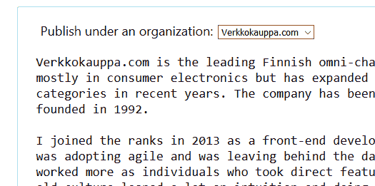](https://user-images.githubusercontent.com/976619/59343992-b874c200-8d15-11e9-93e6-ef1015b6ee98.gif)

**桌面(请填写以下信息):**

*   操作系统:Windows 10
*   浏览器:Firefox
*   版本:67.0.1

[View on GitHub](https://github.com/thepracticaldev/dev.to/issues/3138)

*   [@ben](https://dev.to/ben) 请求了一个有版主操作日志的功能。谢谢你，本！

# [ 版主审核日志 #3141](https://github.com/thepracticaldev/dev.to/issues/3141) 

[](https://github.com/benhalpern) **[benhalpern](https://github.com/benhalpern)** posted on [<time datetime="2019-06-12T16:33:21Z">Jun 12, 2019</time>](https://github.com/thepracticaldev/dev.to/issues/3141)

版主和管理员在平台上采取某些行动。这些行为可以在我们更深层次的应用程序日志中的某些痕迹中发现，各种各样的东西被创建和破坏，但我们目前没有采取的所有行为的有用记录。

我认为创建一个名为`mod_actions`的表格或者类似的东西是值得的。这将是一个表格，我们附加到任何时候一个模块或管理员做任何事情。为了更好地全面审计发生了什么以及何时发生的。它将对标签中的其他模块可见，并引起所有管理员的注意。

我认为其他人可能对如何思考这个问题有更好的见解，但我觉得这些应该是我的高级功能想法:

*   谁采取了行动(用户 ID)
*   什么类别(标签审核、一般社区审核、管理操作等。)
*   关于用户当时的模式/管理角色的信息(可能会随着时间的推移而改变，但这保持了一个时刻
*   markdown 捕获关于动作的所有信息，根据上下文生成以包括相关链接等。
*   行动类型的专用名称/slug，例如移除标签、向下投票、呕吐投票以及我们可能采取的所有其他类型的行动。我们可以继续增加这个列表。

它应该定义一个 API，让我们在相关的地方删除日志行。它们应该以尽可能少的内存占用来执行，所以它们应该异步执行。

这将是一个非常有用的功能！我觉得它本身并不需要我们代码库的大量现有知识来实现。

[View on GitHub](https://github.com/thepracticaldev/dev.to/issues/3141)

*   [@desi](https://dev.to/desi) 请求了一个允许阻止用户的功能。谢谢，[@德西](https://dev.to/desi)！

# [ 功能请求:屏蔽用户 #3145](https://github.com/thepracticaldev/dev.to/issues/3145) 

[](https://github.com/desirottman) **[desirottman](https://github.com/desirottman)** posted on [<time datetime="2019-06-12T23:07:30Z">Jun 12, 2019</time>](https://github.com/thepracticaldev/dev.to/issues/3145)

**您的功能请求是否与某个问题相关？请描述一下。**似乎目前有一种方法可以阻止平台上的另一个用户，这并不直观。DEV 是一个快乐的地方(尤其是和互联网的其他地方相比！)但是仍然有许多风险和原因，有人可能想要阻止另一个用户。

**描述你想要的解决方案**用户资料上一个易于找到的按钮，上面写着“阻止”也许有一个表单要求管理团队提供反馈，说明为什么会有一个阻塞(也许那个人在平台外辱骂，阻塞者只是不想看到他们在 DEV 上的活动，或者也许阻塞者不想/不需要提供反馈)

**描述您考虑过的替代方案**联系管理员请求屏蔽可能是一种替代方案，但这可能会让屏蔽者觉得他们必须解释或证明他们的请求，从而降低他们请求屏蔽的可能性。要求这么多的“额外工作”也可能会驱使他们不去申请这个区块。

**附加上下文**TL；dr: DEV.to 是一个快乐的地方，但互联网上的坏人会在他们可以找到我们的任何地方跟踪我们，让我们帮助保护用户的安全，保护他们免受他们不想看到的内容或人的影响！

[View on GitHub](https://github.com/thepracticaldev/dev.to/issues/3145)

*   @taillogs 发起了一场讨论，声称我们应该有更多关于分析状态的信息。谢谢， [@taillogs](https://dev.to/taillogs) ！

# [ 最低，文档状态分析 #3151](https://github.com/thepracticaldev/dev.to/issues/3151) 

[](https://github.com/rylandg) **[rylandg](https://github.com/rylandg)** posted on [<time datetime="2019-06-13T23:15:39Z">Jun 13, 2019</time>](https://github.com/thepracticaldev/dev.to/issues/3151)

**您的功能请求是否与某个问题相关？请描述一下。**没有描述分析状态的官方声明/页面/文档。我已经通读了公开的问题和现有的公关，并认为我理解当前的状态，但许多用户不会在 Github 上找到这些信息。

**描述您想要的解决方案**我认为分析 API 目前还不可用。无论如何，应该在前端 UX 中清楚地记录存在/不存在的内容。我认为大多数用户(包括我自己)都认为一个开发规模的网站会有可用的分析(不仅仅是基本的视图和反应)，几乎不可能找到这方面的信息。

**从用户角度描述你认为**不可能的替代方案。

**附加语境**我认为基本信息如

*   当您的内容被查看时
*   查看它的地区/语言
*   平均读取时间
*   转化率%
*   用户输入方法(从 Twitter、Google、Direct 等链接...)

[View on GitHub](https://github.com/thepracticaldev/dev.to/issues/3151)

*   [@taillogs](https://dev.to/taillogs) 报告了一个问题，编辑内容应该在整个网站保持一致——具体来说，直接消息应该是可编辑的。再次感谢， [@taillogs](https://dev.to/taillogs) ！

# [ 编辑内容应在整个网站保持一致【3152 号](https://github.com/thepracticaldev/dev.to/issues/3152)

[](https://github.com/rylandg) **[rylandg](https://github.com/rylandg)** posted on [<time datetime="2019-06-13T23:23:03Z">Jun 13, 2019</time>](https://github.com/thepracticaldev/dev.to/issues/3152)

**您的功能请求是否与某个问题相关？请描述一下。**帖子和帖子上的评论都是可编辑的，但是用户之间的直接消息是不可编辑的。不管偏好是什么(twitter 风格的不编辑还是 slack of edit everything)，整个网站的 UX 应该是一致的。

**描述您想要的解决方案**使直接消息可编辑(如果担心被滥用，请保留历史记录)。

**描述你考虑过的替代方案**从技术上讲，你可以让评论变得不可编辑，因为它是一致的。请不要这样做。

[View on GitHub](https://github.com/thepracticaldev/dev.to/issues/3152)

*   [@taillogs](https://dev.to/taillogs) 请求一个功能，在更新的情况下“撞”一个帖子。再次感谢， [@taillogs](https://dev.to/taillogs) ！

# [ 考虑增加一个“凹凸”机制 #3153](https://github.com/thepracticaldev/dev.to/issues/3153) 

[](https://github.com/rylandg) **[rylandg](https://github.com/rylandg)** posted on [<time datetime="2019-06-13T23:31:10Z">Jun 13, 2019</time>](https://github.com/thepracticaldev/dev.to/issues/3153)

**您的功能请求是否与某个问题相关？请描述一下。**帖子发布后，如果在最初的编辑过程中遗漏了某些内容，通常有必要进行重大的修改/更正。取消发布帖子非常适合这种情况，但是当您重新发布帖子时，它会回到“队列”中完全相同的位置(例如最新的队列)。Dev.to 没有简单/清晰的发现机制或可见的内容持久性，这意味着更新版本的帖子不太可能被看到。

就在昨天我发了一个帖子，标题不好。10 分钟后，我意识到，改变了它，并得到 0 的意见或牵引，因为它的窗口已经过去。我最终删除了这个帖子，然后重新创建了这个感觉有点滥用的帖子。在转发的几分钟内，它变成了我有史以来最受欢迎的帖子。如果我没有删除它，我就会错过那些内容。

我知道这里有部分讨论过这个问题[https://github.com/thepracticaldev/dev.to/issues/3062](https://github.com/thepracticaldev/dev.to/issues/3062)。但是那感觉不完全集中在凸起方面。

**描述您想要的解决方案**添加一种机制，允许您推送/转发/刷新现有内容，以便它有另一个发现窗口。

**描述您考虑过的替代方案**反向冲击(用户积极接收内容，使其在队列中向上移动)可能是可行的，但如果您的内容已经无法被发现，就不太好了。

[View on GitHub](https://github.com/thepracticaldev/dev.to/issues/3153)

*   [@taillogs](https://dev.to/taillogs) 请求了一个功能，将每个唯一用户的反应计数限制为 1。再次感谢， [@taillogs](https://dev.to/taillogs) ！

# [ 将每个唯一用户的“反应”计数限制为 1# 3154](https://github.com/thepracticaldev/dev.to/issues/3154)

[](https://github.com/rylandg) **[rylandg](https://github.com/rylandg)** posted on [<time datetime="2019-06-13T23:43:30Z">Jun 13, 2019</time>](https://github.com/thepracticaldev/dev.to/issues/3154)

**您的功能请求是否与某个问题相关？请描述一下。**

现在，用户可以在每个帖子上用 3 种不同的表情符号做出反应。虽然这是一种有趣的内容交互方式，但它也是一种公开的内容分级机制。任何时候给某样东西打分，你都需要担心人们滥用/重视这些分数的方式。但是因为这些反应对每个用户来说都是间接的，所以没有人会一直使用它们。

从作者的角度来看，这导致缺乏对有多少用户对你的帖子做出反应的可见性。您知道最小值(总反应数/ 3)，但不知道真实值。

在发帖者方面，如果你是那种只给出 1 个回应的人，你可能会认为一个帖子有 30 个回应是“令人惊讶的”。但实际上，可能只有 10 个人，而不是你所期望的 30 个人。

这种设计对于其他平台来说问题不大，但是因为 Dev.to 隐藏了关注者数量和公共页面浏览量，这导致了潜在的不健康的反馈循环。

**描述您想要的解决方案**

读者体验不变，他们可以用 1-3 个表情符号做出反应。但从外部来看，任何数量的反应都将被视为 1 个总反应，这将增加所有表情符号的计数。这样，你可以看到独特反应的总数，而不是猜测。

**描述您考虑过的替代方案**始终选择反应数最高的反应。

[View on GitHub](https://github.com/thepracticaldev/dev.to/issues/3154)

*   [@max](https://dev.to/max) 报告了封面图片和帖子信息在 Twitter 上不更新的问题。谢谢， [@max](https://dev.to/max) ！

# [ 封面图片和帖子信息没有在推特上更新 #3156](https://github.com/thepracticaldev/dev.to/issues/3156) 

[](https://github.com/maximelafarie) **[maximelafarie](https://github.com/maximelafarie)** posted on [<time datetime="2019-06-14T11:48:47Z">Jun 14, 2019</time>](https://github.com/thepracticaldev/dev.to/issues/3156)

**描述 bug**

如果你发布了一篇带有封面图片的文章，然后你编辑它并再次更改封面图片，并且你试图在 Tweeter 上发布文章，Tweeter 只会显示你设置的第一张封面图片。如果你在第一次出版后改了它，标题也是一样的。

**重现**

1.  发布带有封面图片的文章
2.  在 tweeter 上分享
3.  编辑你的文章并更改封面图片或标题
4.  再次在 Tweeter 上分享(此处错误为标题和封面图片)

**预期行为**

高音必须显示最新的封面图片

**截图**

帖子的封面图片和标题: [](https://user-images.githubusercontent.com/5319267/59507271-daec1400-8eaa-11e9-8a73-c1cabe8250c1.png)

推文(带有最初帖子的封面图片和标题) [](https://user-images.githubusercontent.com/5319267/59507293-ee977a80-8eaa-11e9-8aad-1b3f313466d5.png)

[View on GitHub](https://github.com/thepracticaldev/dev.to/issues/3156)

*   [@timdeschryver](https://dev.to/timdeschryver) 报告了一个 API 不能正确接受`top`参数的问题。谢谢， [@timdeschryver](https://dev.to/timdeschryver) ！

# [  bug(API):顶级参数 #3163](https://github.com/thepracticaldev/dev.to/issues/3163) 

[](https://github.com/timdeschryver) **[timdeschryver](https://github.com/timdeschryver)** posted on [<time datetime="2019-06-14T20:50:32Z">Jun 14, 2019</time>](https://github.com/thepracticaldev/dev.to/issues/3163)

**描述 bug**

查询字符串中的 top 参数不在结果顶部。

**重现**

不带标签:[https://dev.to/api/articles?top=2](https://dev.to/api/articles?top=2)

带标签:[https://dev.to/api/articles?tag=react&top = 2](https://dev.to/api/articles?tag=react&top=2)

奇怪的是:

这确实名列前茅的结果[https://dev.to/api/articles?tag=Angular&top = 2](https://dev.to/api/articles?tag=Angular&top=2)

而这并没有[https://dev.to/api/articles?tag=Angular&top = 1](https://dev.to/api/articles?tag=Angular&top=1)[https://dev.to/api/articles?tag=Angular&top = 3](https://dev.to/api/articles?tag=Angular&top=3)

**预期行为**

我希望结果会被置顶，例如`top=2`应该返回 2 个结果。

**附加上下文**

在 API 上写了一些测试，但是这些测试没有验证返回结果的长度[https://github . com/thepractical dev/dev . to/blob/master/spec/requests/API/v 0/articles _ spec . Rb # L56](https://github.com/thepracticaldev/dev.to/blob/master/spec/requests/api/v0/articles_spec.rb#L56)

[View on GitHub](https://github.com/thepracticaldev/dev.to/issues/3163)

# 开发-iOS

我们本周在 iOS 回购方面没有太多活动。随意[提问题](https://github.com/thepracticaldev/dev-ios/issues/new)，[看代码库](https://github.com/thepracticaldev/dev-ios)，或者[提拉请求](https://github.com/thepracticaldev/dev-ios/pulls)！

# DEV-Android

## 新的问题和讨论

*   [@codingsam](https://dev.to/codingsam) 报告了一个问题，他们打开应用程序时，应用程序会将他们带到离线页面。谢谢， [@codingsam](https://dev.to/codingsam) ！

# [ 启动后卡在离线页面 #36](https://github.com/thepracticaldev/DEV-Android/issues/36) 

[](https://github.com/samfcmc) **[samfcmc](https://github.com/samfcmc)** posted on [<time datetime="2019-06-08T15:56:04Z">Jun 08, 2019</time>](https://github.com/thepracticaldev/DEV-Android/issues/36)

**描述 bug** 前两天，我试着打开 app，它只是给我显示离线画面(见截图)。

我已经使用这个应用程序一个多月了，没有任何问题。但是自从两天前我总是得到这个错误。我什么都做不了，比如注销什么的。

如果我打开谷歌浏览器，输入“dev.to ”,我就可以毫无问题地使用这个网络应用了。只有应用程序返回我这个错误。

很抱歉，我不想告诉你这个，但我真的不知道如何繁殖。我刚刚在使用它，有一天我试了试，它开始向我显示错误屏幕。从那天起，它总是这样，我什么也做不了。

我是一名软件开发人员，我讨厌人们报告一个错误并告诉我他们不知道如何复制...但这里的情况就是如此。<g-emoji class="g-emoji" alias="disappointed" fallback-src="https://github.githubassets.cimg/icons/emoji/unicode/1f61e.png">😞</g-emoji>

**预期行为**显示要进给的设备

**截图**

[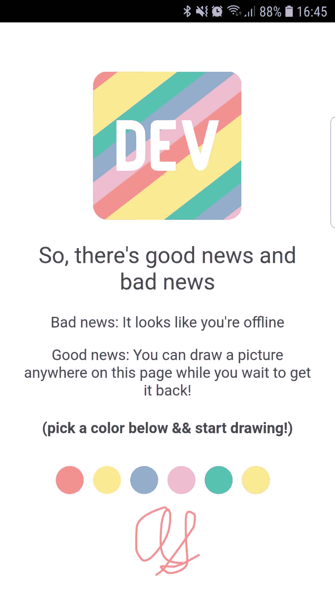](https://user-images.githubusercontent.com/4904318/59149461-3b8fd280-8a0d-11e9-95b2-a5a880a9b62d.jpg)

**智能手机(请填写以下信息):**

*   设备:三星 Galaxy S7 Edge
*   OS: Android
*   版本 8.0.0

**附加上下文**

我不知道发生了什么。让我知道我能做什么来获得更多的数据来帮助你。

[View on GitHub](https://github.com/thepracticaldev/DEV-Android/issues/36)

*   @ryanwhocodes 报告了一个问题，他们得到了一个奇怪的错误信息。谢谢@ryanwhocodes！

# [ 试图保存文章时出现错误 URL 不存在 #37](https://github.com/thepracticaldev/DEV-Android/issues/37) 

[](https://github.com/ghost) **[ghost](https://github.com/ghost)** posted on [<time datetime="2019-06-12T12:53:30Z">Jun 12, 2019</time>](https://github.com/thepracticaldev/DEV-Android/issues/37)

描述 bug 对 bug 的清晰简洁的描述。

当我试着保存帖子时，总是得到关于 URL 不存在的错误-请看附件截图。它使用 Android 上的开发应用程序。

**重现**重现行为步骤:通过手机 app 登录账号。点击编辑你的一篇文章点击保存错误出现

注意！此错误仅在试图保存一些文章时出现，而不是所有文章，因此我不知道原因是什么，也不知道如何可靠地再现该问题。

预期行为对你预期会发生的事情的清晰简明的描述。

你应该点击保存，它没有显示错误，它成功地更新了文章。

**截图**如果适用，添加截图来帮助解释您的问题。

[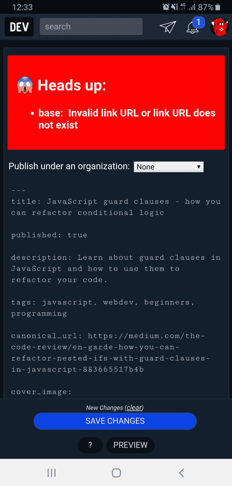](https://user-images.githubusercontent.com/22416807/59353353-aea18d80-8d1a-11e9-9586-652d6d8b6f56.jpg)

**智能手机(请填写以下信息):**

*   设备:三星 A50
*   OS: Android 9
*   版本 9

**附加上下文**在此处添加关于该问题的任何其他上下文。

[View on GitHub](https://github.com/thepracticaldev/DEV-Android/issues/37)

这星期到此为止！敬请关注下周的版本。**