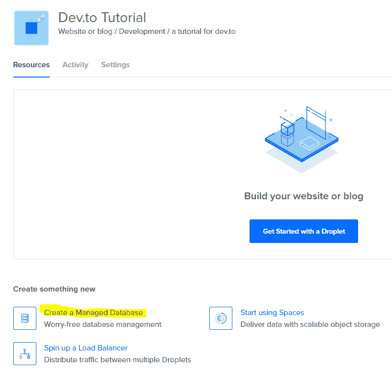
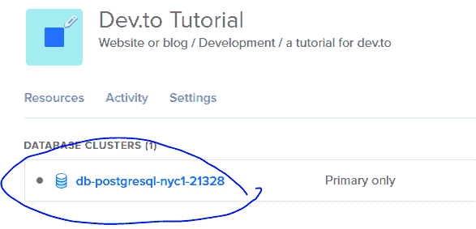
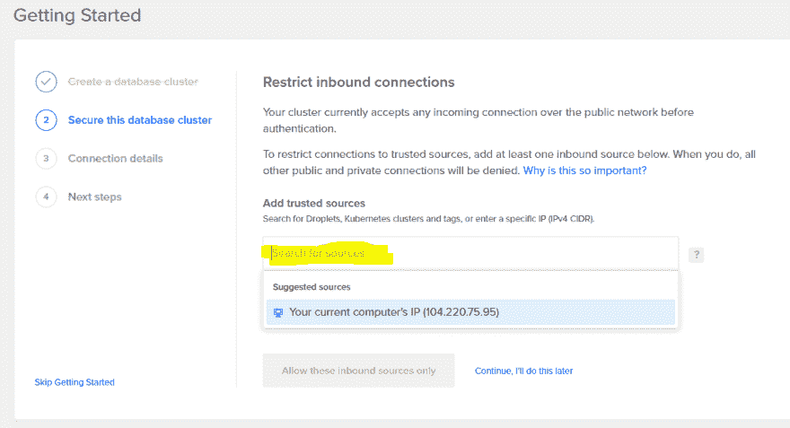
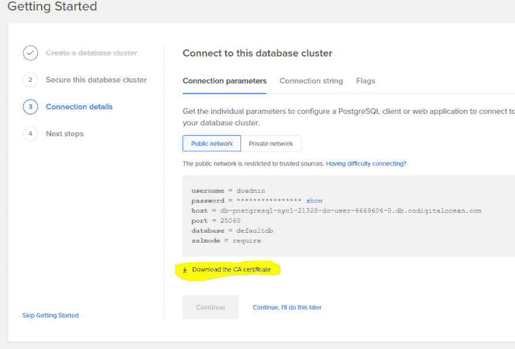
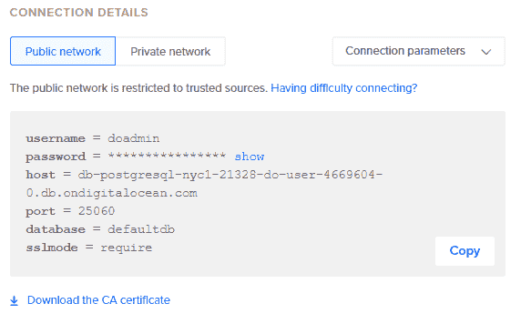

# PostgreSQL 入门

> 原文：<https://dev.to/doylecodes/getting-started-with-postgresql-5g29>

## 为什么要用 PostgreSQL？

在这篇文章中，我将着眼于创建一个托管 PostgreSQL(从现在开始，我将称之为 SQL 数据库)并使用 *node_postgres* 连接到它。我在使用 MongoDB 数据库方面有相当丰富的经验，并且已经使用 Prisma 构建了一个相当大的项目，Prisma 在幕后使用 SQL，但是我从来没有真正编写过 SQL 查询并直接与 SQL 数据库交互。

使用 Mongo Atlas(或 mLab)和 mongoose，我很容易找到如何启动和运行，但我很难启动和运行我自己的 SQL 数据库。

以下是一些注意事项:

*   我不想使用一些奇怪的免费网站，我永远无法在生产中使用。
*   我希望它便宜(我可能成功了？！)
*   它需要是一个真正的解决方案，我可以看到自己在一个真正的节点应用程序中使用。(反对使用已经为我建立了一堆数据库的 GoDaddy 服务器之类的东西)

事不宜迟，下面是我将要经历的:

1.  建立数据库并运行数字海洋。
2.  使用 node-postgres 为节点中的项目设置配置。
3.  创建一个表并测试它。

## 创建 PostgreSQL 数据库

如果你还没用过 DigitalOcean，那它相当不错。简而言之，这是一个你可以设置虚拟服务器的网站。起初，我试图安装 MySQL 来建立自己的服务器(每月运行费用约为 5 美元)，但这变得有点难以理解，最终我的目标是能够访问 SQL 数据库，能够编写前端应用程序，所以我不想把所有时间都花在那里。因此...

我选定了数字海洋管理数据库。每月 15 美元，但比一门课程便宜，它是合法的，我节省了我很多时间(我的意思是，人们有管理数据库的全职工作)，DigitalOcean 给你推荐代码，让你在一定时间内(通常为 30-60 天)获得积分，我有积分，所以可以免费尝试！如果你想试一试[使用我的推荐代码](https://m.do.co/c/e3e79529827f)注册，你可以获得 50 美元的信用 30 天，所以你可以免费开始。

### 建立数字海洋数据库

1.  [注册数字海洋](https://m.do.co/c/e3e79529827f)
2.  创建新项目
3.  创建托管数据库。我使用了 PostgreSQL，在编写本文时这是唯一的选择。您需要在这里设置一些选项，但这是不言自明的。
4.  数据库将被创建，您可以在您的项目中看到它。转到 it 以完成设置。
5.  添加您的 IP 地址，以便数据库访问不对公众开放。
6.  下载 SSL 证书，我们将使用它进行连接。

干得好！您的数据库已经启动并正在运行。

## 连接数据库

我并不想写一个关于如何制作一个完整的应用程序的教程，所以我们在这里只讨论几个步骤。首先，我们将设置 node-postgres，然后我们将编写一个基本查询来创建一个新表，并将其记录到控制台。

### 项目设置

要进行连接，您只需要两样东西，一个用于连接的. js 文件和。你从数字海洋下载的 crt 证书。这是我的结构。

```
postgresql-tutorial
  /certificate.crt (I renamed this)
  /connect.js (you can name whatever you want) 
```

Enter fullscreen mode Exit fullscreen mode

### 设置连接

首先，这是我必须连接到我的数据库。我从 node-postgres 上的[文档中获取了所有内容，但我在其中留下了注释来解释每一部分。您可以从您的 DigitalOcean 访问所有配置选项，如下图所示。
T3T5](https://node-postgres.com/) 

```
// node-postgres also support a pool connection, but I was more familiar with the Client type so I started with that
const { Client } = require('pg');
// fs is used to read the certificate
const fs = require('fs');

const config = {
  // everything here you can get from the "Connection Details" when viewing your database in DigitalOcean
  user: 'doadmin',
  host: 'db-postgresql-nyc1-21328-do-user-4669604-0.db.ondigitalocean.com',
  database: 'defaultdb',
  password: 'tqjgkd6uxyqger6n',
  port: 25060,
  /* You have to include the ssl options because DigitalOcean requires them.
  This is essentially just added on from the boilerplate config in the node-postgres docs */
  ssl : {
    rejectUnauthorized : false,
    ca: fs.readFileSync("./certificate.crt").toString(), //make sure name matches your certificate name you downloaded
  }
}

// creates a new Client instance with the config options above (you can also just put them directly in as argument)
const client = new Client(config);

// Connects! (Or tells me I don't know what I'm doing)
client.connect((err) => {
  if (err) {
    console.log("Connection error!", err)
  } else {
    console.log("Connection to DB successful")
  }
}); 
```

Enter fullscreen mode Exit fullscreen mode

### 测试出数据库

有了上面的代码(和你自己的配置选项，因为上面的那些不再起作用了)，你应该在你的控制台上看到你正在连接。从这里开始，使用数据库非常容易。基本上，node-postgres 有[个查询](https://node-postgres.com/features/queries)，您可以在那里传入一个 SQL 查询。我不会说太多，毕竟，这是为了在第一时间做得更好。如果查询成功，将返回一个响应对象。

在同一个 connect.js 文件中，添加以下代码。

```
const makeTable = `
  CREATE TABLE products (
  product_no integer,
  name text,
  price numeric
);`;

const testQuery = `SELECT * FROM products`

client.query(makeTable) //pass in the testQuery to see if making the table was successful
  .then(res => console.log(res))
  .catch(e => console.error(e))
  .then(() => client.end()) 
```

Enter fullscreen mode Exit fullscreen mode

添加这些行之后，您应该能够运行`node connect.js`并看到返回的响应对象。

本质上，client.query 接受 makeTable SQL 查询(我从 [PostgreSQL 文档](https://www.postgresql.org/docs/11/dml-insert.html)中获得)，这是一个承诺，要么记录返回的响应，要么记录错误。最后，连接被关闭。

您可以看到还有第二个查询`testQuery`，您可以将它传递给`client.query`(替换 makeTable)，您应该能够获得另一个响应对象，它显示了您最初创建的表的详细信息。

就是这样。希望其他人会发现这很有用，并开始在实际应用程序中使用 SQL！

我很快就发了这个帖子，因为我的手在空调过度的星巴克里冻死了，所以如果有什么不清楚的地方，请让我知道，这样我可以修改和澄清！