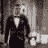
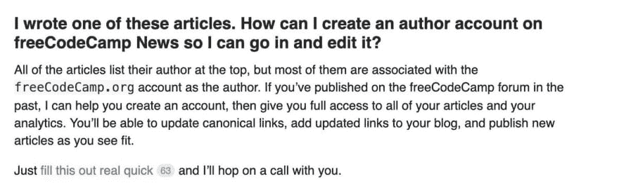
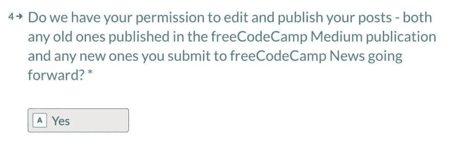

# 自由代码营侵犯了媒体作者的权利

> 原文：<https://dev.to/kylegalbraith/freecodecamp-violated-the-rights-of-medium-authors-47n>

到目前为止，dev.to 社区中的许多人都非常熟悉自由代码营最近摆脱 Medium 的举措。FCC 是媒体上领先的技术内容出版物。数百名作者贡献了精彩的内容，包括我自己。

但是，自由代码营侵犯了我作为媒体作者的权利。未经我的允许，他们将链接从 Medium 重定向到他们自己的 FCC 新闻网站。你可以在本的精彩文章中读到更多关于这一举动和这一违规行为的内容。

 [## 我担心 FreeCodeCamp 刚刚退出 Medium 的举动

### 本哈尔彭 5 月 28 日 193 分钟阅读

#meta #news #freecodecamp #writing](/ben/i-m-concerned-with-the-move-that-freecodecamp-just-pulled-by-leaving-medium-io8)

首先，我确实为我的文章做了所有未完成的事情，所有链接现在都重定向回我在自由代码营出版物之外的中型帖子。但是，这并不容易，我仍然没有看到任何联邦通信委员会承认他们所做的是错误的。

### 采取的步骤

那么我做了什么来挽回呢？老实说，当这一切第一次发生时，我不知道该怎么办。所以我在推特上分享了我对整个事件的想法和感受。

> 凯尔·加尔布雷斯[@ Kyle Galbraith](https://dev.to/kylegalbraith)所以今天我从[@ bendhalpen](https://twitter.com/bendhalpern)那里得知，我的一篇重要博文在未经我允许或同意的情况下被移出了媒体，放到了一个新的网站上。 [@ossia](https://twitter.com/ossia) 我认为这肯定侵犯了我在拥有我的内容的媒体上持有的作者权利。[dev.to/ben/i-m-concer…](https://t.co/zUW8BQxTQL)2019 年 5 月 29 日下午 15:48

> 凯尔·加尔布雷思[@凯尔·加尔布雷思](https://dev.to/kylegalbraith)O 这才渐入佳境。所以现在在我的一天里，我需要跳上一个电话，要求收回理应属于我的内容？！？！？2019 年 5 月 29 日下午 16:48

> 凯尔·加尔布雷思[@凯尔·加尔布雷思](https://dev.to/kylegalbraith)O 如果你想真正解决问题，你只有一个选择，选择“是”将控制权转移给 FreeCodeCamp，以收回对你的内容的权利🤦‍♂️ [@ossia](https://twitter.com/ossia) 我希望我的内容从这个平台上删除，我的作者权利得到恢复。DMs 开启。2019 年 5 月 29 日下午 16:51

这在多大程度上影响了事情的最终结果？我不知道，但至少它让人们注意到这是不对的。

我在 Twitter 上经常看到的一件事是，这不是关于开发和自由代码阵营的竞争。我尊重这两个社区提供的东西。所以我对这一举措的感受和抱怨是**而不是**针对社区的。他们反对社区的负责人。他们对那些帮助他们走到今天这一步的人，他们的贡献者缺乏尊重。

由于推特没有得到回应，我走了下一条我能走的路。我向免费代码营地托管提供商提交了 DMCA 关闭通知。这其实很容易做到。FCC 通过 Cloudflare 代理所有流量，这允许您提交 [DMCA 关闭通知](https://www.cloudflare.com/abuse/form)，它们会将通知转发给网站所有者和托管提供商。

### 分辨率

在我提交 DMCA 撤下通知后不久，自由代码营联系了我。值得称赞的是，他们对撤销事情持开放态度。我所有的文章都从自由代码营媒体出版物中删除，现在重定向到我在媒体上的文章。

所以在这一点上，我的文章回到了正常的状态。由于缺乏对整个事件的了解，损害情况不明。但是我现在又可以控制我的内容了，这对我来说是最重要的事情之一。

### 外卖

这整个经历凸显了自由代码营做错的很多事情。他们移动内容，通过媒体服务条款，属于内容的作者。这些服务条款即使在发布到出版物时也适用。

更糟糕的是，作者被锁定在自由代码营平台的内容之外。要获得访问权限，需要在平台上建立视频通话，对于我们这些忙碌的人来说，这并不像听起来那么简单。

最糟糕的是，我已经联系了几十个其他 FCC 作者，他们害怕联系他们来撤销这个。数十位作者担心，联系联邦通信委员会撤销这一规定会遭到抵制。这是实际社区传达的相反态度。

我的希望是，这个帖子至少可以给那些作者一个采取行动的伪蓝图。我不能保证对我有效的方法对你也有效，但这似乎是一个明智的开始。

如果有任何问题，我可以根据我的经验回答，请随时在下面添加评论。👇 👇 👇 👇