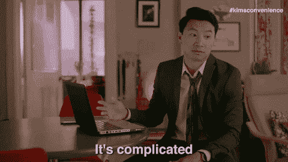
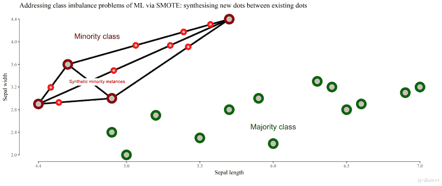
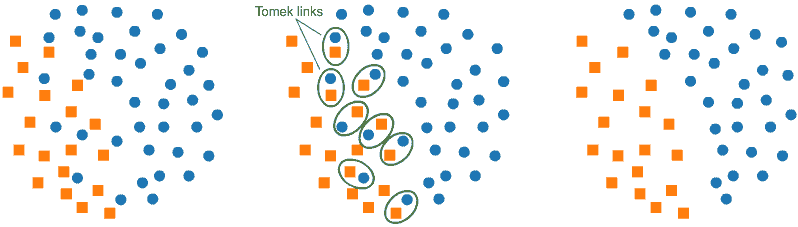

# 平衡不平衡

> 原文：<https://dev.to/lberlin/balancing-the-imbalanced-2bgo>

随着我继续构建我的数据科学工具包，我已经开始学习用于解决日常问题的[类分类技术](https://medium.com/@Mandysidana/machine-learning-types-of-classification-9497bd4f2e14)。这些工具真的很酷！想知道自己收到的一封邮件是不是垃圾邮件？使用分类技术！想知道一笔新交易是不是诈骗？使用分类技术！等等，等等。

我反复看到的一件事是，在将数据输入这些模型时，职业平衡的重要性。想想看，你在问一台计算机，它不知道你在说什么，也不知道如何识别任何东西，除了你告诉它如何识别东西，看一些全新的东西并对其进行分类。如果你给它 1000 封电子邮件，其中 950 封是“非垃圾邮件”，50 封是“垃圾邮件”，并要求它识别哪些是“非垃圾邮件”，它可以将所有邮件都标记为“非垃圾邮件”，并且 95%正确！还不错。

可是...那根本不是你想要的。你希望你的模型学习“垃圾”邮件的特征，并实际识别出它的哪些部分是“垃圾”邮件的可靠预测者。一般来说，随着你的数据集中的大多数变得更大，你的模型变得更复杂，计算机越来越倾向于不这样做。

所以！是时候练习如何平衡数据集中的类了。我将举例说明如何编写我在 Python 3 中遇到的一些方法，使用 [Pandas](https://pandas.pydata.org/) 、 [SciKit Learn](https://scikit-learn.org/stable/) 和一点 [imblearn](https://imbalanced-learn.org/en/stable/index.html) 让我们的生活变得更简单。

[](https://i.giphy.com/media/myDXHnYYPxT4od4NEN/giphy.gif)

* * *

### 平衡的简单方法

也许最简单的平衡你的代表性不足的类别和你的其他数据的方法是对你的其他数据进行欠采样。为了坚持我们的 950 个“非垃圾邮件”与 50 个“垃圾邮件”的例子，我们简单地选取 50 个“非垃圾邮件”的样本，并使用该样本和我们的完整“垃圾邮件”数据来获得一个平衡的数据集，用于训练我们的模型！很简单。

```
# Using a Pandas dataframe, 'data,' where a column "category" either 
# has the "majority" option or the "minority" option within the column

minority = data[data["category"] == "minority"]
majority = data[data["category"] == "majority"].sample(n=len(minority)) 
```

<svg width="20px" height="20px" viewBox="0 0 24 24" class="highlight-action crayons-icon highlight-action--fullscreen-on"><title>Enter fullscreen mode</title></svg> <svg width="20px" height="20px" viewBox="0 0 24 24" class="highlight-action crayons-icon highlight-action--fullscreen-off"><title>Exit fullscreen mode</title></svg>

唉，你大概能看出这个简单模型的一些问题。首先，沿着这条路线走下去，我们会丢失大量数据(900 个观察值)。区分“垃圾邮件”和“非垃圾邮件”的关键可能就藏在丢失的数据中！

-

因此，平衡你的代表性不足的类别的另一种不同的(但仍然简单的)方法是从那个少数群体中**过采样**，一遍又一遍地替换，直到它和你的多数群体一样大。

```
# Same example Pandas dataframe as before

majority = data[data["category"] == "majority"]
minority = data[data["category"] == "minority"].sample(n=len(majority), replace=True) 
```

<svg width="20px" height="20px" viewBox="0 0 24 24" class="highlight-action crayons-icon highlight-action--fullscreen-on"><title>Enter fullscreen mode</title></svg> <svg width="20px" height="20px" viewBox="0 0 24 24" class="highlight-action crayons-icon highlight-action--fullscreen-off"><title>Exit fullscreen mode</title></svg>

这...也有问题。在我们 950-50 的情况下，这意味着你可能会反复使用“垃圾邮件”类别中的这 50 条观察结果 19 次，以与“不是垃圾邮件”的 950 条观察结果持平这将很可能导致你的数据过度拟合——你的模型变得如此习惯于你的少数人的内容，即“垃圾邮件”类别，以至于它只对那些电子邮件有效，而不能被推广到识别现实世界中的“垃圾邮件”。

当然，你可以平衡这两者，过度采样你的少数派和欠采样你的多数派，也许这对你的某些工作会有好处！但是，对于需要更细致的方法来平衡数据的情况，有更复杂的方法。

* * *

### 稍微复杂一点

[](https://i.giphy.com/media/wHASLyWK4zj5OhRCnv/giphy.gif)

好吧，如果我们不能简单地对现有数据进行采样，我们能做什么？一个想法是将**权重**添加到我们的少数类别中，这样我们的模型知道它遇到每个类别的频率并不转化为每个类别的重要性——不太频繁的类别应该被认为更重要，即使它很少！

SciKit Learn 的用于分类数据的[逻辑回归](https://scikit-learn.org/stable/modules/generated/sklearn.linear_model.LogisticRegression.html#sklearn.linear_model.LogisticRegression)模型有一个内置的`class_weight`选项，允许您向您的模型解释某些类应该比其他类更受重视。最简单的平衡方法就是应用`class_weight='balanced'`——逻辑回归模型会自动知道给那个类的频率分配一个权重倒数。在我们的垃圾邮件示例中，逻辑回归模型知道“垃圾邮件”和“非垃圾邮件”应该是平衡的，并会自动指出这 50 个“垃圾邮件”示例应该加权，因此它们被认为比 950 个“非垃圾邮件”示例更重要

```
# Import the logistic regression package from sci-kit learn
from sklearn.linear_model import LogisticRegression

# Start the instance of the Logistic Regression, but balanced
# Default for class_weight is None, which gives all classes a weight of 1
logreg = LogisticRegression(class_weight='balanced') 
```

<svg width="20px" height="20px" viewBox="0 0 24 24" class="highlight-action crayons-icon highlight-action--fullscreen-on"><title>Enter fullscreen mode</title></svg> <svg width="20px" height="20px" viewBox="0 0 24 24" class="highlight-action crayons-icon highlight-action--fullscreen-off"><title>Exit fullscreen mode</title></svg>

那么这实际上是在做什么呢？您告诉您的模型，当它计算损失函数时，所有类的贡献应该相等。换句话说，当模型决定哪种方式最适合数据时，你是在非常明确地告诉它，它需要考虑少数错误的百分比与多数错误的百分比一样重要。

在我们的例子中，我们讨论了一个总是预测我们的电子邮件“不是垃圾邮件”的模型，因为 1000 封电子邮件中有 950 封“不是垃圾邮件”，只有预测“不是垃圾邮件”才能得到 95%准确的模型。但对于实际上是“垃圾邮件”的电子邮件，这一准确率为 0%，因为它从未预测到一封电子邮件是“垃圾邮件”通过告诉我们的模型应该平衡分类，我们的模型知道预测“垃圾邮件”的准确性与预测“不是垃圾邮件”的准确性一样重要，因此它不能认为总体 95%的准确性是可接受的。

这个管用！我目前只能对逻辑回归模型说话，但我知道其他 Sci-Kit Learn 建模算法有一种平衡它们的类的方法。这可能足以让你的数据得到更好的结果，如果是这样，那就太好了。但如果不是呢？我们能变得更复杂吗？

* * *

### 当然我们可以弄得更复杂

[](https://i.giphy.com/media/13KAFmL9bJSm4M/giphy.gif)

另一个想法是，如果我们可以训练我们的模型来制作合成数据，这与我们的“垃圾邮件”少数类别中的数据类似，但又有一点不同，从而避免我们之前担心的一些过度拟合，会怎么样？

是的，这是一个东西，不，你不必从头开始编码。不平衡学习库 [imblearn](https://imbalanced-learn.readthedocs.io/en/stable/index.html) 充满了应用更复杂的平衡技术的有趣方法——包括通过集群进行欠采样和过采样！这些技术通过识别数据集中的聚类来工作。要进行欠采样，您可以使用这些聚类来删除该聚类内的观察值，从而比随机欠采样在多数聚类中保留更多的多样性。要进行过采样，您需要在少数聚类中生成新的合成观察值，从而避免过拟合您的数据，因为少数聚类中的数据更加多样化。

好吧，但这到底是怎么回事？让我们开始吃吧。

**合成少数过采样技术** (SMOTE)是我遇到的最常见的进行基于聚类的过采样的方法。SMOTE 的工作方式是在观察值中找到少数类别的所有实例，在这些实例之间画线，然后沿着这些线创建新的观察值。

我发现了一个关于 SMOTE 如何处理丰富数据的很好的解释，尽管他的例子是用 R 语言编写的(也就是说对我们这些只懂 Python 的人没什么帮助)。但是下图显示了这些线是如何绘制的，以及新的合成观测结果是在哪里创建的。

[](https://res.cloudinary.com/practicaldev/image/fetch/s--FRaLW02A--/c_limit%2Cf_auto%2Cfl_progressive%2Cq_auto%2Cw_880/https://raw.githubusercontent.com/rikunert/SMOTE_visualisation/master/SMOTE_R_visualisation_3.png)

那么我们如何在 Python 中做到这一点呢？

```
# Import the SMOTE package from the imblearn library
from imblearn.over_sampling import SMOTE

# First, look at your initial value counts
print(y.value_counts())

# Start your SMOTE instance
smote = SMOTE()

# Apply SMOTE to your data, some previously defined X and y
X_resampled, y_resampled = smote.fit_resample(X, y) 

# Look at your new, resampled value counts - should be equal!
print(pd.Series(y_resampled).value_counts()) 
```

<svg width="20px" height="20px" viewBox="0 0 24 24" class="highlight-action crayons-icon highlight-action--fullscreen-on"><title>Enter fullscreen mode</title></svg> <svg width="20px" height="20px" viewBox="0 0 24 24" class="highlight-action crayons-icon highlight-action--fullscreen-off"><title>Exit fullscreen mode</title></svg>

现在，你能猜到为什么这不完美吗？这比简单地使用随机过采样要好，然而不仅这些合成样本不是真实数据，而且这些样本是基于你现有的少数群体。因此，那些新的合成样本仍然会导致过度拟合，因为它们是由我们原来的少数民族类别制成的。您可能遇到的另一个陷阱是，如果您的少数群体类别之一是异常值，您将有新数据，该新数据基于该异常值和您的少数群体中的另一个点之间的线创建合成数据，并且可能该新合成数据点也是异常值。

我要指出的是，SMOTE 有一堆人们发明的变体，这些变体解释了一些过度拟合和离群值问题，但变得越来越复杂。尽力而为。

-

另一种创建合成数据以对我们的少数类别进行过采样的方法是**自适应合成**方法，ADASYN。ADASYN 的工作方式类似于 SMOTE，但它专注于少数聚类中最接近多数聚类的点，也就是最容易混淆的点，并专注于这些点。它试图通过关注可能混淆的地方,“垃圾邮件”和“非垃圾邮件”最接近的地方来帮助您的模型，并在“垃圾邮件”少数类别中制作更多数据。

```
# Import the ADASYN package from the imblearn library
from imblearn.over_sampling import ADASYN

# Start your ADASYN instance
adasyn = ADASYN()

# Apply ADASYN to your data, some previously defined X and y
X_resampled, y_resampled = adasyn.fit_resample(X, y) 
```

<svg width="20px" height="20px" viewBox="0 0 24 24" class="highlight-action crayons-icon highlight-action--fullscreen-on"><title>Enter fullscreen mode</title></svg> <svg width="20px" height="20px" viewBox="0 0 24 24" class="highlight-action crayons-icon highlight-action--fullscreen-off"><title>Exit fullscreen mode</title></svg>

-

让我们试试相反的，合成欠采样。 **Cluster Centroids** 也可以找到聚类，但不是使用这些聚类来创建新的数据点，而是推断出你的多数类别中的哪些数据点在该聚类中是“中心”的。然后，您的模型将这些质心(中心点)用于多数，而不是实际实例。

```
# Import the ClusterCentroids package from the imblearn library
from imblearn.under_sampling import ClusterCentroids

# Start your ClusterCentroids instance
cc = ClusterCentroids()

# Apply ClusterCentroids to your data, some previously defined X and y
X_cc, y_cc = cc.fit_sample(X, y) 
```

<svg width="20px" height="20px" viewBox="0 0 24 24" class="highlight-action crayons-icon highlight-action--fullscreen-on"><title>Enter fullscreen mode</title></svg> <svg width="20px" height="20px" viewBox="0 0 24 24" class="highlight-action crayons-icon highlight-action--fullscreen-off"><title>Exit fullscreen mode</title></svg>

当然，任何欠采样技术都将消除您拥有的一些数据，从而减少如果您查看大多数类别中的所有数据时可能发现的细微差别。但是这样，至少，这些质心比你的大多数随机样本更有代表性。

-

如果您的数据难以区分您的类，ADASYN 的另一种替代技术是让您的模型忽略与您的少数群体接近的多数群体的实例。呃，怎么了？所以，假设你有一些看起来很像“垃圾邮件”的“非垃圾邮件”实例。你可以告诉你的模型将那些相似的点联系起来，然后忽略那个链接中的大多数，即“非垃圾邮件”，从而增加数据中“垃圾邮件”和“非垃圾邮件”之间的空间。

这些被称为 **Tomek 链接**，我在一个关于[不平衡数据集重采样策略的 Kaggle 页面上找到了一个很好的例子](https://www.kaggle.com/rafjaa/resampling-strategies-for-imbalanced-datasets):

[](https://res.cloudinary.com/practicaldev/image/fetch/s--KA-Zlu7l--/c_limit%2Cf_auto%2Cfl_progressive%2Cq_auto%2Cw_880/https://raw.githubusercontent.com/rafjaa/machine_learning_fecib/master/src/static/img/tomek.png%3Fv%3D2)T3】

```
# Import the TomekLinks package from the imblearn library
from imblearn.under_sampling import TomekLinks

# Start your TomekLinks instance
tomek = TomekLinks()

# Apply TomekLinks to your data, some previously defined X and y
X_tl, y_tl = tomek.fit_sample(X, y) 
```

<svg width="20px" height="20px" viewBox="0 0 24 24" class="highlight-action crayons-icon highlight-action--fullscreen-on"><title>Enter fullscreen mode</title></svg> <svg width="20px" height="20px" viewBox="0 0 24 24" class="highlight-action crayons-icon highlight-action--fullscreen-off"><title>Exit fullscreen mode</title></svg>

这也有问题吗？当然啦！您忽略了处于多数和少数类别之间的数据，而这可能是您最需要挖掘的数据！但这是一种选择。

有几十种越来越复杂的方法来平衡你的类，因为你在试图建立分类模型之前混合和匹配并试图获得最佳的观察集。如果你想找到很多其他的方法来平衡你不平衡的类别，请看下面的参考资料，并深入研究一下 [imblearn 文档](https://imbalanced-learn.readthedocs.io/en/stable/user_guide.html)！

* * *

### 告诫

在做数据科学的任何部分时，都有许多考虑要记住，当然平衡不平衡的类也不例外。我绝对想重申的一件事是，在创建你的模型之前做一个[训练测试分割](https://scikit-learn.org/stable/modules/generated/sklearn.model_selection.train_test_split.html)是多么重要，所以你要保留一定比例的数据来测试你的模型。

在平衡你的类之前，创建你的训练测试分割！否则，特别是如果您使用过采样技术，您的“平衡”类将在您的训练数据和测试数据之间有重叠-毕竟，您的过采样基本上是使用您已经在少数类中生成更多数据的数据，因此您的测试数据将只是被 SMOTE 精确修改或稍微修改的训练数据。[本教程](https://beckernick.github.io/oversampling-modeling/)详细介绍了这是如何在实践中绊倒你的。

一般来说，最好的建议是不要只看准确性。准确性很重要，但如果我们只看“垃圾邮件”或“非垃圾邮件”示例中的准确性，我们会有 95%的准确性，但在其他方面完全无用的模型。也要考虑召回率和精确度，并一如既往地尝试找到神奇的金发区，实现您希望您的模型实现的目标。运行一个[混淆矩阵](https://scikit-learn.org/stable/modules/generated/sklearn.metrics.confusion_matrix.html)——混淆矩阵是朋友！

-

很快，我将编辑这篇文章，使用实际数据，而不仅仅是垃圾邮件，添加一个 GitHub 库示例。与此同时，对于平衡数据集的更可靠的方法有什么建议吗？在应用这些技术时遇到任何陷阱，或者有一个你发现自己一次又一次求助的技术？让我知道！

[](https://i.giphy.com/media/RI4LTRjrVJhTskGtrb/giphy.gif)

#### 一些资源

我使用了下面的许多方法来了解每种技术的更多信息:

*   [SMOTE 为 Noobs 解释](http://rikunert.com/SMOTE_explained)
*   [不平衡数据集的重采样策略](https://www.kaggle.com/rafjaa/resampling-strategies-for-imbalanced-datasets)
*   [应对机器学习数据集中不平衡类别的 8 种策略](https://machinelearningmastery.com/tactics-to-combat-imbalanced-classes-in-your-machine-learning-dataset/)
*   [处理深度学习中的不平衡数据集](https://towardsdatascience.com/handling-imbalanced-datasets-in-deep-learning-f48407a0e758)

###### *封面图片来源于[本媒帖](https://medium.com/@SistaniSays/constantly-calibrating-on-work-and-life-why-balance-is-bullshit-cea3fbcab8ae)。SMOTE 可视化源自[丰富的数据](https://raw.githubusercontent.com/rikunert/SMOTE_visualisation/master/SMOTE_R_visualisation_3.png)。Tomek 链接可视化来源于[这个 Kaggle 页面](https://www.kaggle.com/rafjaa/resampling-strategies-for-imbalanced-datasets)。gif 一如既往来自[GIPHY](https://giphy.com/)T11】*