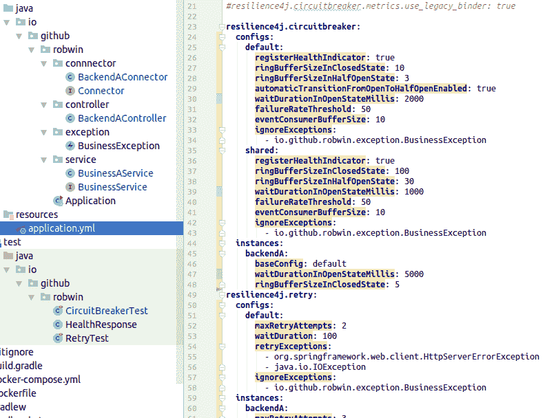
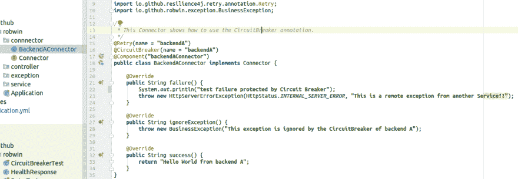
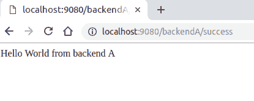
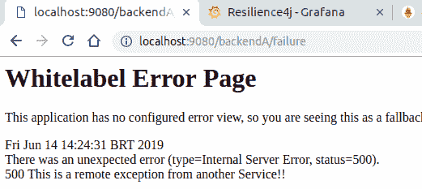
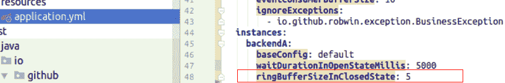
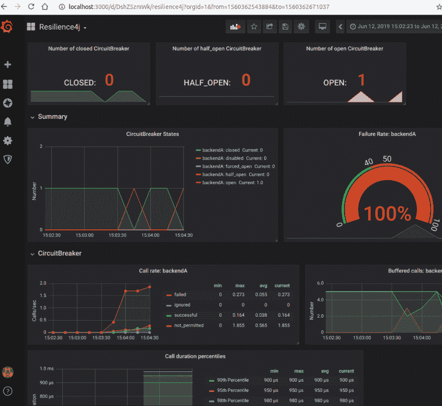

# Java 微服务的弹性。带弹性 4j 的断路器

> 原文：<https://dev.to/silviobuss/resilience-for-java-microservices-circuit-breaker-with-resilience4j-5c81>

# 什么是断路器模式？

阅读第一篇文章来理解这个概念。

[](/silviobuss) [## Java 微服务的弹性模式。断路器。

### Silvio Buss ・ Jun 13 '19 ・ 2 min read

#java #microservices #opensource #devops](/silviobuss/resilience-pattern-for-java-microservices-the-circuit-breaker-b2g)

## resilience 4j

2018 年 12 月， [Spring 宣布 Spring Cloud 网飞项目进入维护模式](https://spring.io/blog/2018/12/12/spring-cloud-greenwich-rc1-available-now)，并在该宣布之后推荐了一些替换，包括 Resilience4j 而不是 Hystrix。

### 模块化

Resilience4j 是为 Java 8 和函数式编程设计的轻量级容错库。该库使用 [Vavr](https://www.vavr.io/) ，它没有任何其他外部库依赖。Resilience4j 允许挑选你需要的。

Resilience4j 存储库还提供了几个实现模式，可以使您的应用程序更加健壮，包括断路器、时间限制器、速率限制器、重试和缓存。

## 普罗米修斯和格拉夫纳

Prometheus 和 Grafana 的结合正在成为 DevOps 团队用于存储和可视化时间序列数据的越来越常见的监控堆栈。Prometheus 充当存储后端，Grafana 充当分析和可视化界面。

演示项目将这一组合与来自 Resilience4j 的 Prometheus Metrics exporter 模块一起使用，以简化 Resilience4j 生成的指标的分析和可视化。最重要的是，如果你已经在机器上安装了 docker，只需**不到 1 分钟**就可以配置好这个演示。

## 用 Spring Boot 2 + Resilience4j +普罗米修斯+格拉法纳实现

完整的演示代码如下。

*   启动 grafana 和 prometheus 应用程序的设置(通过 docker)和两种配置都可以在 github 的项目自述文件中找到。

*   断路器设置位于 application.yml 文件中。

[](https://res.cloudinary.com/practicaldev/image/fetch/s--EHw0HPuX--/c_limit%2Cf_auto%2Cfl_progressive%2Cq_auto%2Cw_880/https://thepracticaldev.s3.amazonaws.com/i/7i9sebgxq0ja5zolk3yc.png)

*   这是断路器的保护方法

[](https://res.cloudinary.com/practicaldev/image/fetch/s--ip1fhQLZ--/c_limit%2Cf_auto%2Cfl_progressive%2Cq_auto%2Cw_880/https://thepracticaldev.s3.amazonaws.com/i/mvf5ai0q07u8dvh73mou.png)

*   使用项目端点来模拟成功。

    *   [http://localhost:9080/backendA/success](http://localhost:9080/backendA/success)

[](https://res.cloudinary.com/practicaldev/image/fetch/s--2d91Lopx--/c_limit%2Cf_auto%2Cfl_progressive%2Cq_auto%2Cw_880/https://thepracticaldev.s3.amazonaws.com/i/eko9u5rnf8o2p9jh0l3c.png)

*   以及用于模拟故障。

    *   [http://localhost:9080/backendA/failure](http://localhost:9080/backendA/failure)

[](https://res.cloudinary.com/practicaldev/image/fetch/s--uyFJo4dI--/c_limit%2Cf_auto%2Cfl_progressive%2Cq_auto%2Cw_880/https://thepracticaldev.s3.amazonaws.com/i/axhaj5ietcqcb0o1mipl.png)

*   为了模拟打开状态，调用失败端点，直到它达到设置中使用的 5 次尝试的阈值。

[](https://res.cloudinary.com/practicaldev/image/fetch/s--vt7bV3VY--/c_limit%2Cf_auto%2Cfl_progressive%2Cq_auto%2Cw_880/https://thepracticaldev.s3.amazonaws.com/i/k40ui15qqcibv7h53vpk.png)

*   当状态为打开时，将不会执行远程调用(backendA connector . class # failure ),并且对断路器的所有进一步调用将返回错误“断路器‘backendA’打开...”。

*   我们可以通过 grafana 仪表盘看到生成的状态和指标:

[](https://res.cloudinary.com/practicaldev/image/fetch/s--8FsMhdq3--/c_limit%2Cf_auto%2Cfl_progressive%2Cq_auto%2Cw_880/https://thepracticaldev.s3.amazonaws.com/i/z2o1cmhbb6nylpaxkp3l.png)

## 源代码

##  [西尔维奥巴斯](https://github.com/silviobuss)/[resilience 4j-spring-boot 2-demo](https://github.com/silviobuss/resilience4j-spring-boot2-demo)

### 一个 Spring Boot 2 演示，展示了如何使用 Resilience4j Spring Boot 2 启动

<article class="markdown-body entry-content container-lg" itemprop="text">

# Resilience4j 的 Spring Boot 2 演示

[](https://travis-ci.org/resilience4j/resilience4j-spring-boot2-demo)

这个演示展示了如何在 Spring Boot 2 应用程序中使用容错库。

更多详情参见[用户指南](https://resilience4j.readme.io/docs/getting-started-3)。

[BackendAService](https://github.com/resilience4j/resilience4j-spring-boot2-demo/blob/master/src/main/java/io/github/robwin/service/BackendAService.java) 展示了如何使用 Resilience4j 注释。

[BackendBController](https://github.com/resilience4j/resilience4j-spring-boot2-demo/blob/master/src/main/java/io/github/robwin/controller/BackendBController.java) 展示了如何使用函数风格和 Spring Reactor 操作符。

## 入门指南

只需在您的 IDE 中运行 Application.java。
应用程序正在 [http://localhost:9080](http://localhost:9080) 上运行。

## 使用 Prometheus 和 Grafana 进行监控(可选)

### 要求

[对接器](https://docs.docker.com/install/)和[对接器组成](https://docs.docker.com/compose/install/)安装。

### 第一步

使用 docker-compose 启动 Grafana 和 Prometheus 服务器。

*   在根文件夹中

```
docker-compose -f docker-compose.yml up
```

Enter fullscreen mode Exit fullscreen mode

### 第二步

检查普罗米修斯服务器。

*   打开 [http://localhost:9090](http://localhost:9090)
*   访问状态->目标，两个端点都必须“启动”

### 第三步

配置 Grafana。

*   打开 [http://localhost:3000](http://localhost:3000)
*   **配置与普罗米修斯的集成**
    *   访问配置
    *   添加数据源
    *   选择普罗米修斯
    *   使用 URL "[http://localhost:9090](http://localhost:9090)"并用值" Browser "访问
*   **配置仪表板**
    *   访问“主页”
    *   导入仪表板
    *   上传 dashboard.json…

</article>

[View on GitHub](https://github.com/silviobuss/resilience4j-spring-boot2-demo)

包含所有模块的完整演示项目可在此处查看。

## 结论

在这篇文章中，我们可以看到它是如何工作的，以及如何用 Resilience4j，Prometheus 和 Grafana 来监控 Spring Boot 2 中实现的断路器。

### 资源

[https://github . com/resilience 4j/resilience 4j-spring-boot 2-demo](https://github.com/resilience4j/resilience4j-spring-boot2-demo)
T3】https://logz.io/blog/prometheus-monitoring/