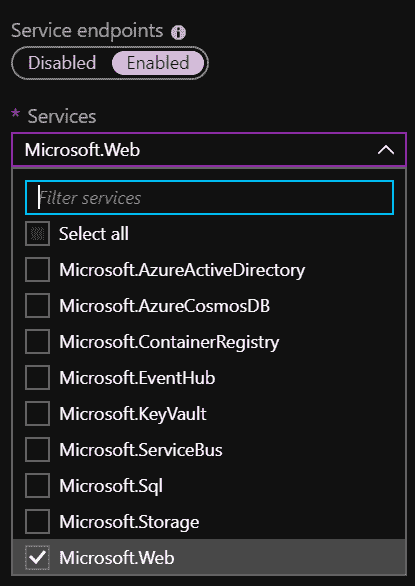
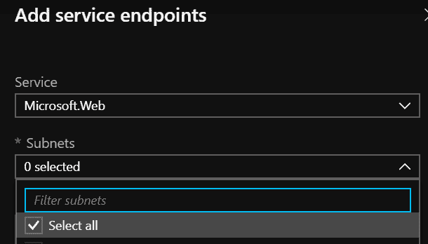
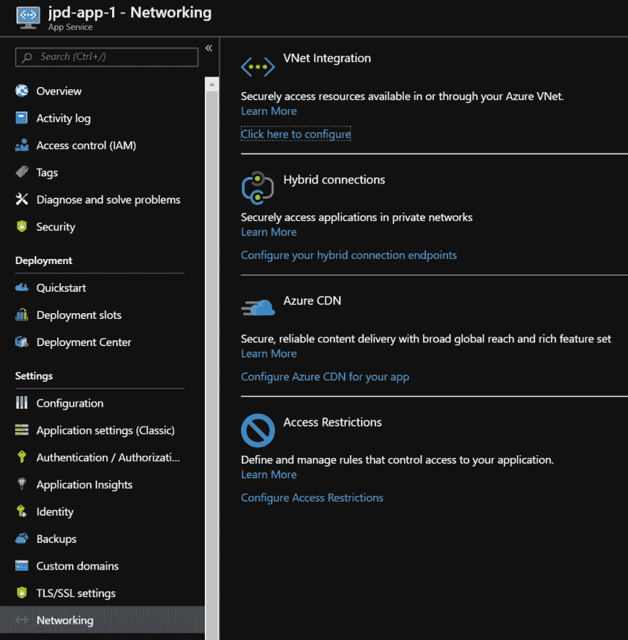
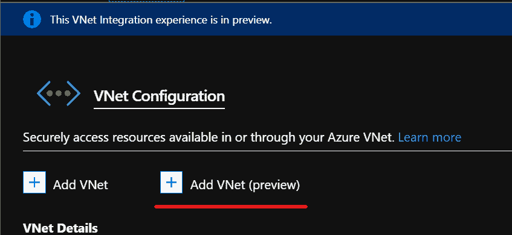
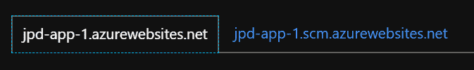
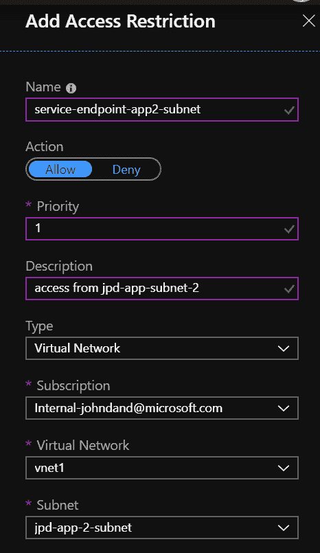
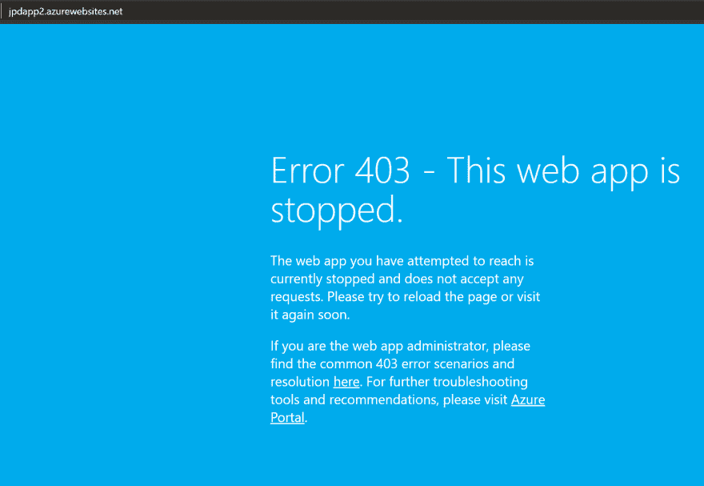
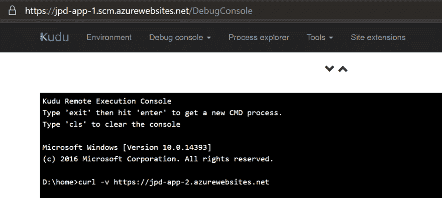
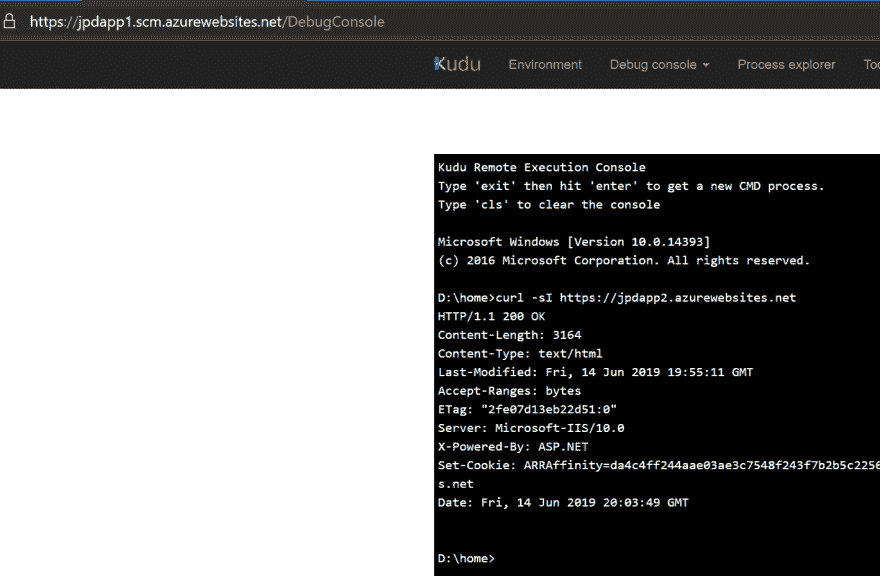

# 多租户平台即服务中的私有应用服务到应用服务调用

> 原文：<https://dev.to/jpda/private-app-service-to-app-service-calls-in-multitenant-paas-51g8>

最近， [Shannon](https://twitter.com/shankuehn) &一位客户向我提出了一个有趣的请求，他正在使用多租户应用服务(例如，非 ASE)，但希望将通信限制在他们的虚拟网络内。如果你熟悉 Azure 应用服务，通常实现这一点的方式是通过[应用服务环境](https://docs.microsoft.com/en-us/azure/app-service/environment/intro) (ASE)。as 是在您的虚拟网络中运行应用服务堆栈*的单租户专用节点——这翻转了“私有”位，因为它们拥有来自您的虚拟网络内部的 RFC 1918 IPs。这意味着您几乎可以对网络做任何您想做的事情——在它前面使用 17 个防火墙，访问 vnet 或本地资源，等等。问题是，它们可能会有点贵，至少相对于多租户应用服务来说是这样。内部 ASE 也可能有一些部署问题，因为您需要管理 DNS 并为您的 ASE 获取通配符证书(从安全&运营团队获取通配符证书尤其困难)。幸运的是，随着一些(非常)最近的增加，在 Azure 中使用[“新的”VNET 集成(无网关)](https://docs.microsoft.com/en-us/azure/app-service/web-sites-integrate-with-vnet)和[服务端点](https://docs.microsoft.com/en-us/azure/virtual-network/virtual-network-service-endpoints-overview) / [IP 限制](https://docs.microsoft.com/en-us/azure/app-service/app-service-ip-restrictions)的组合，这是可能的。让我们开始吃吧。*

## 布局

我们有:

*   `jpd-app-1`，一个有自己的应用服务计划的网络应用(API)
*   `jpd-app-2`，另一个拥有自己的应用服务计划的 web 应用(API)
*   一个虚拟网络，`vnet1`，有三个子网，`jpd-app-1-subnet`，`jpd-app-2-subnet`和`default`
*   用于测试的虚拟机，位于`default`子网中
*   这两个应用程序& vnet 位于同一个地区

我们需要`jpd-app-1`和`jpd-app-2`互相交谈，并且可以从 VNet 访问，但根本不能从互联网访问。

## 与虚拟网络整合

首先，我们需要将每个应用服务集成到 VNet 中。我们需要将应用服务集成放在它们自己的子网中，这样我们就可以将子网委托给应用服务。首先我们需要注册`Microsoft.Web`服务端点。如果您正在创建一个新的 VNet，您可以在创建时完成。如果没有，以后很容易启用。

创建期间:

创建后(从 VNet –>服务端点窗格)。在您想要访问我们的应用服务的所有子网上启用它。

一旦你启用了它们，进入第一个应用服务的网络面板(在我的例子中是`jpd-app-1`)。

配置虚拟网络集成，然后选择添加虚拟网络(预览)。选择虚拟网络，然后选择子网。

为您的两个应用服务执行此操作，将每个应用服务集成到各自的子网中。此时，我们的应用服务现在已连接到`vnet1` -如果我们在虚拟网络中有需要访问的资源，如虚拟机、SQL 托管实例，甚至是通过站点到站点 VPN 的本地资源，我们现在就能够访问。然而，应用程序服务暴露在互联网上。我们已经允许从应用服务到 VNet 的访问*，但是我们还没有限制从*应用服务到 VNet 的访问*。为此，我们将使用访问限制。*

## 访问限制

接下来，我们需要实施访问限制。回到应用服务的“网络”面板，你会看到“访问限制”这是我们添加虚拟网络的地方。默认情况下，您的应用服务将允许来自所有来源的所有流量。您可以保留默认的 Allow All 规则，因为一旦我们添加了自己的限制，Allow All 规则就变成了 Deny All，我们的规则优先。

你还会注意到*列出了两个*主机——`<yourapp>.azurewebsites.net`和`<yourapp>.scm.azurewebsites.net`——第一个是你的应用，第二个( *.scm.* )是你的 web 应用的后台视图，Kudu 控制台。您可以单独限制这些。如果您不想从互联网访问，请确保您对主站点和 Kudu/scm 站点都添加了限制！

现在让我们添加我们的限制！因为这是`jpd-app-1`并且它被集成到`jpd-app-1-subnet`子网中，所以我们需要添加两条规则:

*   从`jpd-app-2-subnet`子网访问
*   从`default`子网访问
*   否认其他一切

首先是`jpd-app-2-subnet`规则。确保在类型中选择“虚拟网络”。然后选择您的虚拟网络(`vnet1`)和需要访问的其他应用的子网(`jpd-app-2-subnet`)。重复(`default`)以启用剩余的虚拟网络和任何其他可能需要访问的虚拟网络/子网。

## 对其他 app 重复

在你的另一个应用程序(`jpd-app-2`)中，做同样的事情。添加访问限制，只不过这次选择对方 app 的子网(`jpd-app-1-subnet`)。

## 测试

如果你从本地机器上用浏览器打开你的应用程序，你会得到一个 403，“网站停止了。”这是受限制的应用程序服务的体验——这是 403 禁止的，在这里停止有点误导。

从您的 web 应用程序的 kudu 控制台(`<yourapp>.scm.azurewebsites.net`)，它既可以从您的 vnet 上的虚拟机访问，也可以从互联网访问，如果您没有添加限制，我们可以对其他应用程序执行 curl，以确保我们的配置一切正常。`tcpping`在这里是无效的，因为站点确实响应 ping——因为它在互联网上可用，但是返回`403`。

`curl -sI https://<yourapp>.azurewebsites.net`

这应该会返回一些 HTML/标记。如果是一个`403`，那就不对劲了。如果你得到一个`200/OK`，你就成功了！

注意:你可能会注意到我的 URL 在快结束时发生了变化——我添加了一个糟糕的规则，所以我不得不丢弃这两个应用服务并重新创建它们。**不要把零(0)作为规则的优先级！**T3】

我还没有在消费计划中尝试过这种功能，但这是下一步。敬请期待！