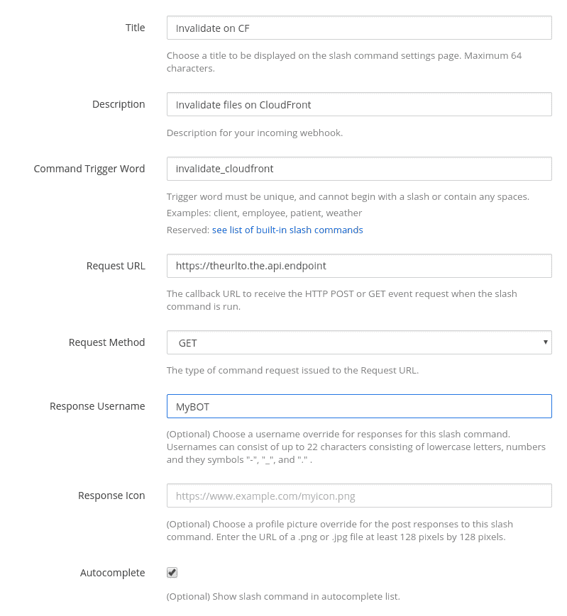

# 使用 Mattermost 和 AWS Lambda 的 ChatOps

> 原文：<https://dev.to/abdallah/chatops-with-mattermost-and-aws-lambda-2ha0>

在管理工作中的分布式资源时，我一直致力于使事情变得更简单。由于我们一天中的大部分时间都在聊天室度过(以前是 Slack，现在是 Mattermost ),我认为最好从 ChatOps 开始

这只是一个从聊天窗口直接做事情的花哨词。人们可以做的事情太多了，尤其是使用简单的斜杠命令。

这是我昨天为使 CloudFront 发行版无效而设置的 lambda 函数。

```
from time import time
import boto3

import json
import os
import re

EXPECTED_TOKEN = os.environ['mmToken']
ALLOWED_USERS = re.split('[, ]', os.environ['allowedUsers'])
DISTRIBUTIONS = {
    'site-name': 'DISTRIBUTIONID',
    'another.site': 'DISTRIBUTIONID05'
}

def parse_command_text(command_text):
    pattern = r"({})\s+(.*)".format('|'.join(DISTRIBUTIONS.keys()))
    m = re.match(pattern, command_text)
    if m:
        return { 'site': m.group(1), 'path': path}
    else: 
        return False

def lambda_handler(event, context):
    # Parse the request
    try:
        request_data = event["queryStringParameters"]
    except:
        return {
            "statusCode": 400,
            "headers": {"Content-Type": "application/json"},
            "body": '{ "message": "Use GET for setting up mattermost slash command" }'
        }

    # Check the token matches.
    if request_data.get("token", "") != EXPECTED_TOKEN:
        print('Wrong Token!')
        return {
            "statusCode": 401,
            "headers": {"Content-Type": "application/json"},
            "body": '{ "message": "Mattermost token does not match" }'
        }

    # Check the user is allowed to run the command
    if request_data.get("user_name", "") not in ALLOWED_USERS:
        print('Wrong User! {} not in {}'.format(request_data['user_name'], ALLOWED_USERS))
        return {
            "statusCode": 401,
            "headers": {"Content-Type": "application/json"},
            "body": '{ "message": "User not allowed to perform action" }'
        }

    # parse the command
    command_text = request_data.get("text", "")
    if not command_text:
        print('Nothing to do, bailing out')
        return {
            "statusCode": 404,
            "headers": {"Content-Type": "application/json"},
            "body": '{ "message": "No command text sent" }'
        }
    parts = parse_command_text(command_text)
    if not parts: 
        print('Bad formatting - command: {}'.format(command_text))
        return {
            "statusCode": 402,
            "headers": {"Content-Type": "application/json"},
            "body": '{ "message": "Wrong pattern" }'
        }

    # Do the actual work
    cf_client = boto3.client('cloudfront')

    # Invalidate
    boto_response = cf_client.create_invalidation(
        DistributionId=DISTRIBUTIONS[parts['site']],
        InvalidationBatch={
            'Paths': {
                'Quantity': len(parts['path']),
                'Items': parts['path'] 
            },
            'CallerReference': str(time()).replace(".", "")
        }
    )['Invalidation']

    # Build the response message text.
    text = """##### Executing invalidation
| Key | Info |
| --- | ---- |
| Site | {} |
| Path | {} |
| ID | {} |
| Status | {} |""".format(
        parts['site'], 
        parts['path'],
        boto_response['Id'], 
        boto_response['Status']
    )

    # Build the response object.
    response = {
        "response_type": "in_channel",
        "text": text,
    }

    # Return the response as JSON
    return {
        "body": json.dumps(response),
        "headers": {"Content-Type": "application/json"},
        "statusCode": 200,
    } 
```

<svg width="20px" height="20px" viewBox="0 0 24 24" class="highlight-action crayons-icon highlight-action--fullscreen-on"><title>Enter fullscreen mode</title></svg> <svg width="20px" height="20px" viewBox="0 0 24 24" class="highlight-action crayons-icon highlight-action--fullscreen-off"><title>Exit fullscreen mode</title></svg>

注意，您需要将它与 AWS 中的 API 网关连接起来。一旦完成，您就有了一个可以部署的 URL 端点。

接下来，我在 mattermost 中创建了斜杠命令，如下所示:

<figure>[](https://res.cloudinary.com/practicaldev/image/fetch/s--KIW8MPus--/c_limit%2Cf_auto%2Cfl_progressive%2Cq_auto%2Cw_880/https://deeb.me/wp-content/uploads/image-1.png) 

<figcaption>斜线命令配置</figcaption>

</figure>

差不多就是这样。冲洗和重复不同的命令，不同的用法。

在我的清单上，下一步是根据[https://docs . mattermost . com/developer/interactive-messages . html](https://docs.mattermost.com/developer/interactive-messages.html)

周末项目与 matter most 中的用户进行更多的互动，耶！