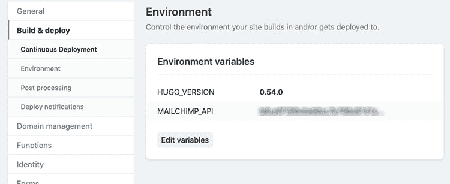
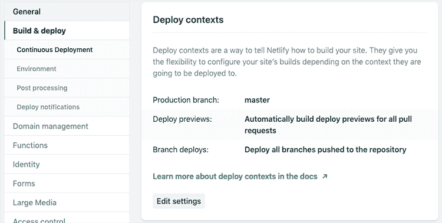
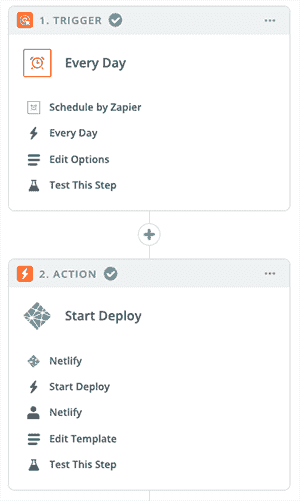

# 充分利用网络生活

> 原文：<https://dev.to/remotesynth/using-netlify-to-the-fullest-3ef>

一些工具让入门变得如此简单，以至于很容易忽略它提供的所有特性。当一切都“正常工作”时，就没有必要再去深究了。就拿 [Netlify](https://www.netlify.com/) 来说吧。

我已经使用它们很多年了，最重要的是我的在线聚会和培训网站，名为 [Certified Fresh Events](https://cfe.dev/) 。大约两年前上线的原站点是用[雨果](https://gohugo.io/)打造的(新上线的版本也是用雨果打造的)。建立网站花费了一些时间和精力，将它部署到 Netlify 只花了 5 分钟。然而，除了有限地使用他们的[表单处理](https://www.netlify.com/docs/form-handling/)，除了持续部署，我真的没有使用任何网络功能。

然而，随着最近网站的重新启动，我终于开始使用 Netlify 的一些真正的力量。在这篇文章中，我想讨论其中的一些特性。

> 注意:是的，我正在滔滔不绝地谈论 Netlify，所以值得注意的是，我不为他们工作，没有被要求写这篇文章，也没有因为这篇文章得到任何形式的补偿。这是一项我非常喜欢的服务，因为它让我多年来能够运营我的活动网站、博客等等。

## 环境变量

老实说，这是一个简单的变量，但是因为我之前没有做过什么特别的事情，所以我设置的唯一的环境变量是我的 Hugo 版本。[环境变量](https://www.netlify.com/docs/continuous-deployment/#environment-variables)是保存像 API 密匙这样你不想包含在库中的东西的好地方。

有两种方法来定义环境变量，一种是通过项目中的`netlify.toml`文件。但是，如果您使用环境变量而不是 API 键，这是很有用的，因为它将与您的存储库一起签入。另一种方法是在 UI 中设置它们。您可以通过转到设置>构建&部署>环境来设置站点特定的环境变量。

## 分支部署

Netlify 为您提供了许多选项来[预览您站点](https://www.netlify.com/docs/continuous-deployment/#branches-deploys)的潜在变化，从允许您查看一个拉取请求或合并请求到预览一个分支。这是我从第一天起就开启的功能，但我从未利用过。不过，在这种情况下，我对我的网站进行了重大的重新设计，通过分支工作是明显的方向。

默认情况下，请求和分支部署的部署预览是打开的，但是您可以在“设置”>“构建和部署”>“连续部署”>“部署上下文”下找到设置。

这是什么意思？嗯，在我的例子中，我的分支被称为“重新设计”,所以我的分支根据我的主域名被自动部署到`redesign.cfe.dev`。这不仅让我可以预览我的作品，甚至可以在我正式向所有人发布之前公开分享它来测试重新设计。

## 网络功能

JAMstack 和静态站点的主要区别在于，JAMstack 拥有静态资产，但是站点本身可以通过利用 JavaScript 和 API 来实现动态。从网络效率的角度来看，其中的一个关键部分是[函数](https://www.netlify.com/docs/functions/)。基于 AWS 构建的函数，本质上允许我构建服务器端代码块，允许我的“静态站点”做传统静态站点做不到的事情。

我承认在开始使用函数时会感到一些痛苦。部分原因是我找到的教程依赖于 [netlify-lambda](https://github.com/netlify/netlify-lambda) 工具来开发函数。这是可行的，但有点复杂，因为它涉及到一个构建过程，而使用 [Netlify Dev](https://www.netlify.com/products/dev/) 开发功能的新方法更加精简。(注意，Netlify Dev 不仅仅做函数。)

我不会详述我做了什么，主要是因为我的好朋友雷蒙德·卡姆登已经报道过了。我们对这个问题采取了不同的方法，结果证明，他的方法更好。我做了一些调整，以适应我的用例，但核心保持不变——这是一个简单的功能，允许我在不离开我的网站的情况下为人们订阅 Mailchimp。虽然这是对函数的有限使用，但随着我继续开发这个站点，它肯定是我计划更多利用的一个特性。

## 调度部署

我想讨论的最后一个特性实际上并不是 Netlify 本身的内置特性。由于我的内容对日期非常敏感，所以我希望不断地重建网站，这样日期信息就不会过时(例如，一个即将到来的事件可能会有“12 天后”的文本)。此外，我在主页的某些地方显示了随机项目，这也需要重新构建，因为随机项目是在构建时选择的。因此，我需要的是确保网站定期重建，而不需要我的直接干预。

幸运的是，Netlify 已经预先构建了与 Zapier 的集成。Zapier 不是免费的，但是，对于这种任务，你不太可能达到他们的免费帐户限制。这是一个非常简单的两步“Zap ”,它使用 Zapier 的时间表在每晚午夜触发部署(实际上，从 Netlify 的角度来看，时间并不重要，因为构建是在后台进行的，但是午夜是有意义的，因为日期会发生变化，从而改变了日期计算)。

## 刚刚入门

这篇文章更真实的标题应该是“更充分地使用 Netlify”，但是，除了语法不正确之外，它也不太吸引人。更准确的说法是，还有很多我没有充分利用的特性，比如分割测试、身份、大型媒体。但是我最终探索到了构建和部署过程的简单性之外的东西，并且很高兴能够继续学习。