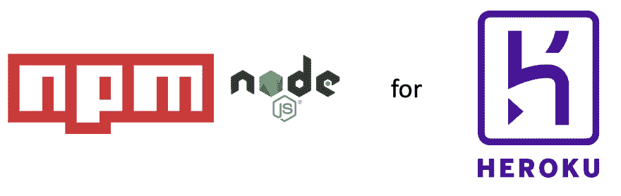

# Heroku 中具有 npm、NodeJS 的可扩展、经济高效的 web 应用的配方

> 原文：<https://dev.to/spygi/recipes-for-scalable-cost-effective-web-apps-in-heroku-with-npm-nodejs-2cng>

我正在使用 Heroku 部署一个 web 应用程序。该应用程序是作为一个 MVP 开始的，在真正的用户使用它之前，我希望部署尽可能便宜和简单，但面向未来。

[](https://res.cloudinary.com/practicaldev/image/fetch/s--lc3hpVeC--/c_limit%2Cf_auto%2Cfl_progressive%2Cq_auto%2Cw_880/https://thepracticaldev.s3.amazonaws.com/i/jhf75ivlcsa1oi15euet.png)

例如，我想通过将前端和后端分开来为代码打下坚实的基础。有许多方法可以实现这一点。其中一个处于开发/构建阶段，这意味着例如前端的改变不需要构建、运行测试、重启等。还有后端。在大型项目中，这会增加构建时间，并极大地阻碍开发人员的工作效率。

另一种(更好的)方法是分离构建，但是从同一个服务器部署/服务后端和前端。从长远来看，这种方法不太具有可扩展性，也不具有成本效益:例如，我们可能会发现，我们需要更多的后端实例来处理负载，而不必增加前端服务器的数量。因此，理想的分割是确保前端和后端不共享任何数据(除了在哪里访问彼此的配置之外)，完全通过 API 进行通信，并且可以独立构建和部署(也称为"[微服务](https://en.wikipedia.org/wiki/Microservices)"方式)。

为了方便，因为代码库和团队非常小(实际上只有我一个人🙋‍♂)我想使用单一回购方式。我们仍处于 MVP 阶段，API 和数据库模式将随着时间的推移而发展。将所有东西放在一个 repo 下非常方便:任何全栈开发人员都可以构建特性，而无需切换到不同的代码库，并且整个开发环境可以通过一个`npm start`命令启动。更重要的是，对于 JavaScript，它还支持前端和后端之间的代码重用，例如常量、验证错误等。对于谷歌和脸书这样的科技巨头来说，monorepo 方法已经[扩展得很好](https://danluu.com/monorepo/)，所以我看不出它对一个小的网络应用有什么不好。

总而言之，我的(优先)要求是:

*   前端和后端尽可能的独立。
*   [简单胜于复杂](https://www.python.org/dev/peps/pep-0020/)。
*   留在 Heroku 的免费等级内(或者尽可能便宜)。
*   使用单一回购持有代码。

## TL；速度三角形定位法(dead reckoning)

考虑到 Heroku 的一些限制，满足所有 4 个要求并不是一件小事。我找到了两种方法来实现这一点，但都不完全令人满意。如果放弃 monorepo 需求，情况会简单得多:使其与 Heroku 一起工作所需的开销可能超过了大多数项目的优势。

既然[其他人也在问](https://stackoverflow.com/questions/36504768/deploy-the-backend-and-frontend-on-the-same-heroku-app-dyno)并且有许多解决方案[不再起作用](https://medium.com/@nadayar/heroku-fu-multiple-servers-on-one-dyno-6fc68d57b373)(或者[需要将](https://stackoverflow.com/questions/36504768/deploy-the-backend-and-frontend-on-the-same-heroku-app-dyno/37283426#37283426)升级到爱好层)，我这篇博客的目标是澄清当前的情况并探索各种权衡。我的应用程序和这里的例子使用的技术堆栈是 NodeJS 和 Express，后端是 Angular，前端是 npm 脚本来构建/服务一切。

* * *

## 先来点英雄本色

常见的 Heroku 用例是您有一个使用`git push heroku master`部署的代码库。这部署了一个*应用*，因此在存储库和应用之间存在 1:1 的关系。每个应用都可以在多个 *dynos* 上运行(把它们想象成 Heroku 容器)。dynos 运行的内容被定义为一个 [*进程*](https://devcenter.heroku.com/articles/process-model#process-types-vs-dynos) (将进程视为 dyno 类型/类)。Heroku 使用一个名为 [*Procfile*](https://devcenter.heroku.com/articles/procfile) 的文件为每个应用程序定义这些进程，这意味着 1 个 Procfile ↔️ 1 个 app。在您可以定义的所有流程中，只有 [web 流程可以接收来自外部](https://devcenter.heroku.com/articles/procfile#the-web-process-type)(用户)的流量。这是要记住的第一个限制。

* * *

### 我尝试过但不起作用的方法

因为我们希望前端通过一个 API 与后端通信，所以我们需要一个从外界获取流量的后端。很公平，我们只需要 2 个 web 进程:一个用于前端，另一个用于后端，对吗？不幸的是，在[免费层](https://www.heroku.com/free)你可以创建多达 100 个应用，但每个应用最多只能使用 1 个 *web* 和 1 个 *worker* ，正如我们所说，只有 web 进程接收流量。

假设我们放宽了成本限制，升级到允许 [10 种流程类型](https://www.heroku.com/pricing)的爱好层，这仍然是行不通的:每个 Procfile/application 只能有一个 web 流程。

好吧，然后，你说，让我们有 2 个应用程序，每个都有一个 web 进程。这将是可行的，但我们打破了单一回购的要求，因为一个回购相当于一个 Heroku 应用程序。还是我们..？💡我们一会儿将回到这个想法。

回溯一下，如果我们有一个在 2 个 dyno 中扩展的 web 流程，有一个 [*配置变量*](https://devcenter.heroku.com/articles/config-vars#managing-config-vars) ，这样一个 dyno 处理前端调用，另一个处理后端调用。当一个调用被路由到错误的 dyno 时，它应该(以某种方式)在内部调用另一个。首先，要做到这一点，我们需要使用专业的 dynos，因为你[不能扩展业余爱好 dynos](https://blog.heroku.com/dynos-pricing-ga#about-the-new-dynos) 。但即使这样，这也是行不通的，因为 dynos 在 [*公共运行时*](https://devcenter.heroku.com/articles/dyno-runtime#common-runtime) (默认情况下获得)中是完全相互隔离的。

### 英雄(？)方式(异步)-可以工作

实现我们想要的一种方法是在同一个 Procfile 中使用两个不同的进程(web 和 worker ),通过队列/数据存储进行通信。该解决方案在自由层限制内，并且是 Heroku 文档中所描述的[。为了使它适应我们的模型，web dyno 接收来自外部世界的 HTTP 请求:它交付(缩小的、丑陋的、捆绑的……)前端代码(HTML、CSS、JS ),在 API 调用的情况下，它将请求写入队列。worker dyno 接收请求并完成后端工作。web dyno 不断轮询队列以获取请求的更新，并根据结果更新 UI(或者使用乐观更新)。](https://www.heroku.com/dynos)

显然，对于一个简单的 web 应用程序来说，这是一个非常复杂的设置:需要配置额外的组件(队列、websocket 等),并且在应用程序代码中要涵盖许多边缘情况(例如，如果一个工作进程在处理异步任务时突然终止，会发生什么？).虽然异步处理对某些任务(例如发送通知、日志或计算密集型任务)有意义，但大多数 web 应用程序不会从中受益(当然不是我正在构建的应用程序)。因此，由于复杂性，我拒绝了这个选项。

* * *

## 究竟是什么在起作用

### 1。“手动”方式——没有独立部署

需求之一是独立于后端构建和部署前端。因为目前没有用户，但是我们可以通过构建前端，然后从后端服务器提供服务来放松独立部署的要求。这是角度文档中的官方推荐[。](https://angular.io/guide/deployment#basic-deployment-to-a-remote-server)

要在实践中看到这一点，给定以下项目结构:

```
fullstack/                  # top level folder
├── backend/             
│   ├── package.json  
│   ├── api/                # API files 
│   └── ...       
├── frontend/                  
│   ├── package.json
│   └── ...├── package.json
├── ... 
```

顶层`package.json`包括这个:

```
"scripts": {
    "install": "(cd backend && npm i) & (cd frontend && npm i)",   
    "heroku-postbuild": "cd frontend && npm run build-prod && mv dist/frontend ../backend/",
    "start": "if [ \"$NODE_ENV\" == \"production\" ]; then cd backend && npm run start-prod; else cd backend && npm start & (cd frontend && npm start); fi"
} 
```

注意这里没有 *Procfile* 。这是因为 Heroku 也[支持 npm 脚本](https://devcenter.heroku.com/articles/deploying-nodejs#specifying-a-start-script)来启动 web 进程。

独立的构建是通过为后端和前端使用不同的 npm 模块来实现的，这些模块安装依赖项、监视文件的更改并为文件提供服务。

对于*安装*步骤之后的部署，运行 [*heroku-postbuild 脚本*](https://devcenter.heroku.com/articles/nodejs-support#heroku-specific-build-steps) :构建前端的生产版本(例如用`ng build --prod`)，并将输出移动到*后端/* 文件夹。然后我们启动生产后端服务器(Express ),它包含如下内容:

```
const app = express();
if (process.env.NODE_ENV === 'production') {
   app.use(express.static(path.join(__dirname, '/frontend')));
} 
```

它提供来自 *frontend/* 文件夹的静态文件，而 Angular app (frontend)被配置为使用 */api* 来访问数据。

#### 2。多文件方式

我在研究过程中发现的另一个选项是由 Heroku 工程师创建的[多进程文件构建包](https://elements.heroku.com/buildpacks/heroku/heroku-buildpack-multi-procfile)。这基本上消除了我们之前遇到的 Heroku 要求:回购不再必须对应于一个 Heroku 应用程序(我们仍然在免费层！)🎉

应用关于如何使用构建包的[指令](https://elements.heroku.com/buildpacks/heroku/heroku-buildpack-multi-procfile):

*   我们创建了两个 Heroku 应用程序，例如 *awesomeapp* (前端)和*awesome app-后端*。
*   我们为前端设置了 *fullstack/Procfile* ，为后端设置了*full stack/back end/Procfile*。
*   每当我们部署一个新版本时，我们都需要推进到两个 Git-Heroku 端点。

通过使用`git config -e`
指定两个不同的遥控器，可以使最后一部分变得更简单

```
[remote "heroku"]
    url = https://git.heroku.com/**awesomeapp**.git
    fetch = +refs/heads/*:refs/remotes/heroku/*
[remote "heroku-backend"]
    url = https://git.heroku.com/**awesomeapp-backend**.git
    fetch = +refs/heads/*:refs/remotes/heroku/* 
```

然后分别用`git push heroku master`和`git push heroku-backend master`做前端和后端(或者在`git push`上两者都自动化)。

用于前端的 *Procfile* 为`web: cd frontend && npm run start-prod`。 *start-prod* 脚本启动一个为前端资产服务的 Express 服务器。

*后端/过程文件*完全一样:`web: cd backend && npm run start-prod`。 *start-prod* 脚本启动一个服务于 *api* 文件夹的 Express 服务器。请注意，`cd backend`在这里实际上是错误的，不会在本地与`heroku local`一起工作。它在 Heroku 中工作，因为 buildpack 复制了根文件夹 *fullstack/:* 中的 Procfile。不幸的是，我们不得不放弃 [dev-prod 奇偶校验](https://12factor.net/dev-prod-parity)。

由于前端在不同的域中(*awesomeapp.herokuapp.com*)，我们现在也必须[在后端启用 CORS](https://enable-cors.org/server_expressjs.html):

```
app.use(function(req, res, next) {
  res.header('Access-Control-Allow-Origin', process.env.NODE_ENV === 'production' ? 'https://awesomeapp.herokuapp.com' : 'http://localhost:4200/');
  res.header('Access-Control-Allow-Headers', 'Origin, X-Requested-With, Content-Type, Accept');
  next();
}); 
```

还值得注意的是，在两个 Heroku 应用程序中，提交了相同的代码，安装步骤安装了前端和后端，即使只使用了一个:当然不理想，但可以接受。

* * *

在这篇博文中，我们探索了在 Heroku 中构建、构建和部署 web 应用程序的各种选项。这里介绍的两个解决方案都有点“粗糙”，而且都没有实现开发和生产环境之间的对等:“手动”方式可能更容易理解(没有来自构建包的魔法)并且更容易开发(不需要推送和设置 2 个应用程序)，但是将来要完全独立地部署还需要做更多的工作。另一方面，多 procfile 方式带来了一些开销，但允许使用单个 Git 存储库从后端完全独立地部署前端。

* * *

你的 Heroku 部署微服务 web 应用的最佳实践是什么？请在评论中告诉我！

这是我在这里的第一篇文章，最初发表在我的媒体:

[](https://medium.com/@spygi/scalable-cost-effective-web-architectures-for-heroku-eb8f1f55a4b6) [## Heroku 中具有 npm、NodeJS 的可扩展、经济高效的 web 应用程序的配方| Spyros Giannakakis | Medium

### spyros Giannakakis<time datetime="2019-06-26T14:39:37.953Z">2019 年 6 月 26 日</time>7min readT3】Medium](https://medium.com/@spygi/scalable-cost-effective-web-architectures-for-heroku-eb8f1f55a4b6)