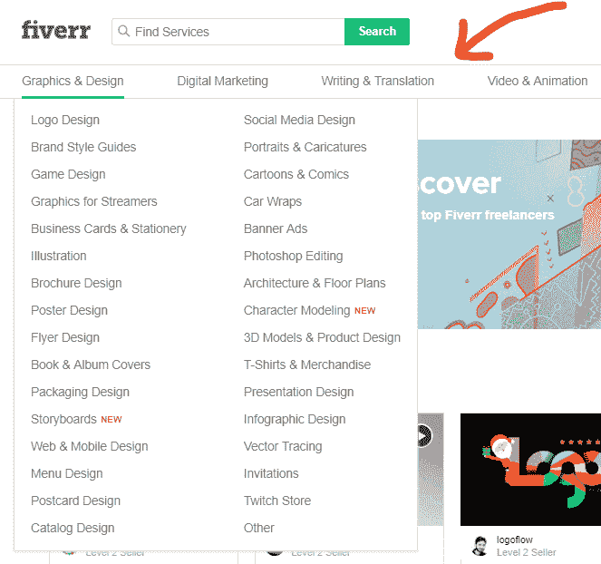
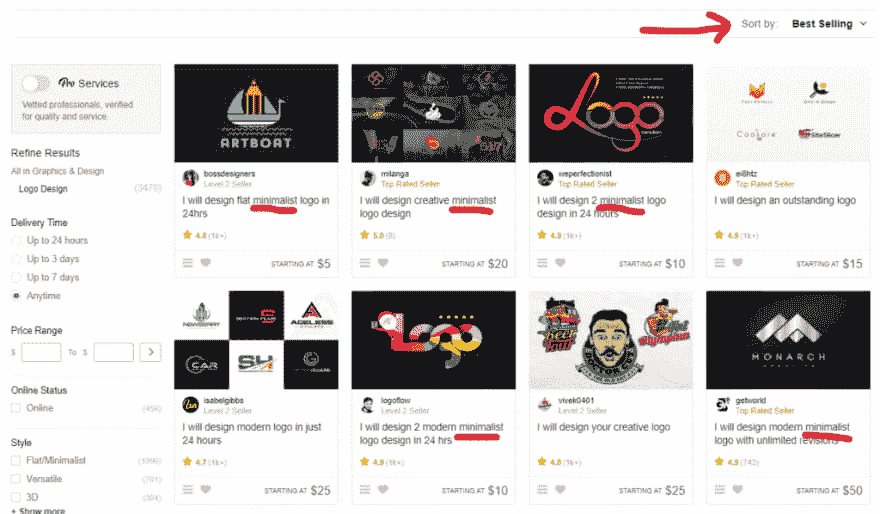
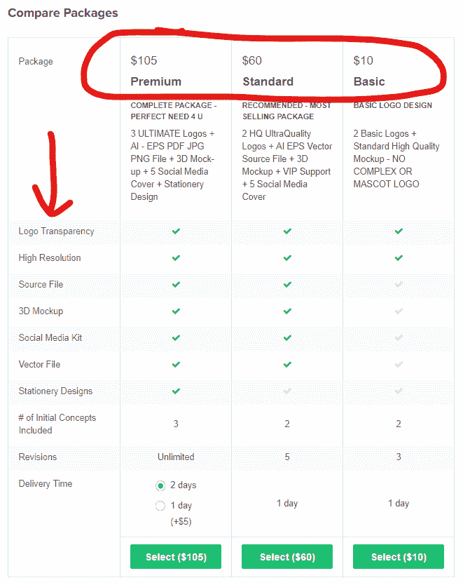

# 使用 Fiverr 创建你的自由职业者服务项目

> 原文：<https://dev.to/jpmorris/use-fiverr-to-create-your-freelance-service-offers-384c>

你想卖得更多，并能为你的自由职业者服务收取更多费用吗？

你有没有遇到过一个产品或服务，感觉就像是为你而造的？你看到了，就一定要拥有它？当你这么做的时候，你真的需要被说服吗？

大概不会。

你一看到它就知道你想要它。

这不是偶然的。

在这方面投入了大量的时间和研究。

作为一名自由职业者，你给潜在客户的报价越诱人，你卖出的服务就越多，你能收取的费用也就越多。

如果有一个地方，你可以得到你需要的所有答案，弄清楚你的服务和报价应该是什么，以便像这样不可抗拒，这不是很好吗？

有。

是五元。

作为自由职业者，Fiverr 非常适合做市场调查，因为它是真实世界的数据，一切都已经为你细分、打包和定价了。

你真正要做的就是看。

因此，在这篇文章中，我将向你展示 3 种不同的方法，你可以使用 Fiverr 来做深入的市场研究，并制作有吸引力的服务产品，这样你就可以更容易地销售你的服务。

让我们从 Fiverr 特性#1 开始:

### **主菜单**

如果您正在跟进，请将鼠标悬停在“图形与设计”链接上。当你这样做的时候，你会得到一个庞大的服务列表，Fiverr 认为这些服务属于图形设计类别。

*   标志设计
*   品牌风格指南
*   海报、小册子、传单
*   社交媒体设计
*   旗帜
*   汽车包装

它只是列出了所有不同的利基服务，你可以提供给客户的保护伞下的平面设计，这是一个伟大的第一步“产品化”你的服务…你一定要做的事情。

所以，找一个适合你的工作…

并且，用它来找出你能提供的利基服务。

尽量保持最多三个核心服务。

超过这一点，客户就会开始不知所措，不知所措。

而且，俗话说…

"混乱的头脑永远不会购买。"

好了，接下来是:

### **类别列表页面**

因此，选择一个我们刚刚看到的子类别，并单击其链接。我们将继续我们的图形设计的例子，并点击“图形和设计”下的“标志设计”。

接下来，在“排序依据”下拉列表中，选择“最佳销售”。

这给了我们一个在标志设计下分类的最畅销产品列表。

我喜欢这个例子，因为 logos 看起来很直接。

看起来不会有太多的变化。

但是，如果你滚动这个列表，你仍然可以找到它。

写这篇文章时，我看到一些独特的东西，如“吉祥物标志设计”，“简约标志设计”，“复古标志设计”。继续滚动，你会看到“现代标志设计”、“奢侈时尚标志设计”、“手绘标志设计”等。

对于如此直截了当的事情来说，这是相当大的变化。

我不会马上想到这些。但是，看看这些数字……“吉祥物标志设计”服务已经卖出了 790 套。vintage 和 minimal 徽标设计服务都售出了 1k 以上的产品。

如果你把现代和极简主义的清单加在一起，你甚至会更胜一筹。

所以，人们正在购买这些利基服务。

不仅如此，趋势变得非常明显。稍微浏览一下这个列表，你会看到“极简主义”和“现代”无处不在……而且有很多单位正在出售这些类型的标志。

所以，如果你是一名标志设计师…

考虑在你提供的服务中使用“现代”和“极简主义”这两个词。

然后，利用所有这些进行头脑风暴，找出你能提供什么服务。

最后，我们有:

### **产品清单**

这里要注意的部分是“比较包”部分。这份平面图给了你每个自由职业者服务的层次以及其中的内容。透明度、分辨率、矢量、源文件、修订版等。

因此，无需猜测每一层的细节。

就列在这里。

而且，真正有趣的是，这些倾向于跨子类别标准化，但对于不同的子类别是不同的。所以，标志设计和文章写作有两套不同的“功能”。

但是，标志设计服务具有相同的功能。

文章写作服务具有相同的功能。

这告诉你什么？

它告诉你这些是 Fiverr 和它的卖家多年来发现的对客户很重要的事情。他们会问的常见问题。此外，为了给客户提供决策所需的信息，他们最起码要涵盖的内容。

对你有价值的情报。

至少，您应该为您的服务包含相同的内容。

所以，这就对了。

正如你现在所看到的，Fiverr 是一个很好的工具，可以深入挖掘你的市场，并准确地计算出提供什么服务，以及如何构建你的软件包来吸引潜在的客户。

后来，

约翰

另外，如果你喜欢这篇文章，我在 johnsfreetuts.com 的免费教程网站上有一个名为“Fiverr 方法”的免费教程，向你展示如何使用 Fiverr 和 Google 创建一个完整的、基于数据的产品线。