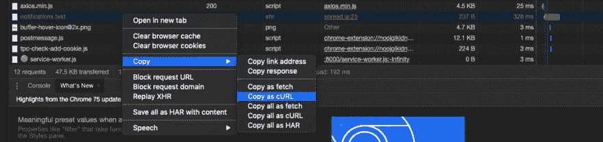
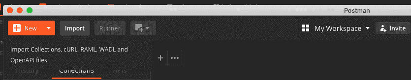
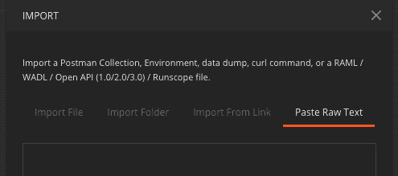
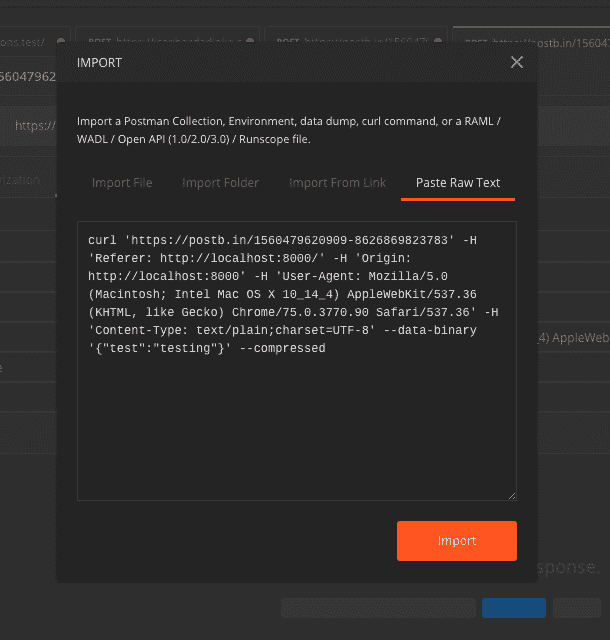
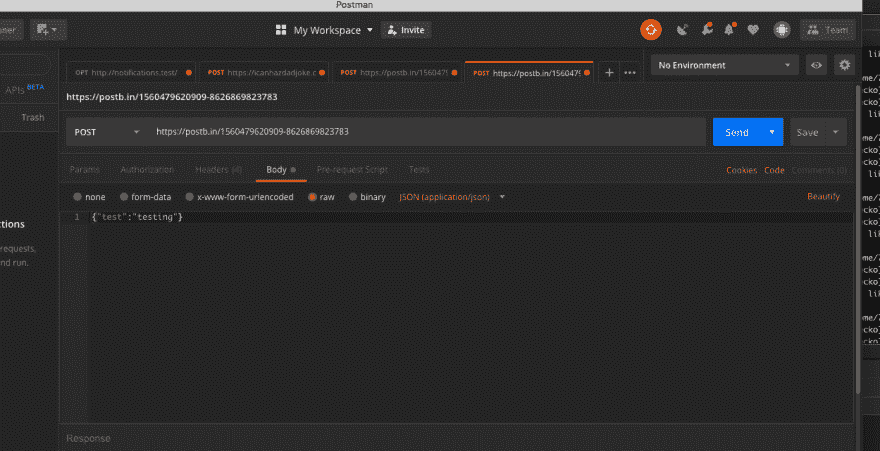

# 快速 API 调试技巧

> 原文：<https://dev.to/theringleman/quick-api-debugging-tip-2m3i>

几年前我学会了这个技巧，它为我节省了很多时间，所以分享它是明智的。

假设您构建了一个 API，并且您正在前端工作，以使用您的 API 的出色之处。您设置好表单，让您的用户登录。点击发送按钮，你会得到 400 回复。等等，什么什么？我有一个非常简单的起点，你可以使用你可能已经在使用的工具。

这篇技巧文章涉及到 Google Chrome 或者 Mozilla Firefox。可能还有更多，但这是我使用的两个浏览器。以及[邮差](https://www.getpostman.com/) app。这些都是免费使用的，那就用吧。他们太棒了！

1.  打开您的开发工具。
    *   Chrome (cmd + alt + i)
    *   Firefox (cmd + alt + i)
2.  转到网络选项卡。
    *   
3.  找到失败的请求。
    *   
4.  右键单击并复制为 cURL。
    *   
5.  打开 Postman 并选择导入。
    *   
6.  选择“粘贴原始文本”标签。
    *   
7.  粘贴从浏览器中复制的 cURL 请求，然后点击 Import。
    *   
8.  发送您的请求以简化调试。
    *   

有一点需要注意，你的请求是完全导入到 Postman 中的。这使得调试您的请求变得非常简单。您可以更容易地看到您的数据和任何标题在他们漂亮的用户界面发送。

作为后端开发人员，我发现前端开发人员在聊天中向我发送请求很方便。这样，我就可以用他们发送的确切数据重新创建我的 API 中的中断。

我每天都使用这个技巧。我希望你也一样！