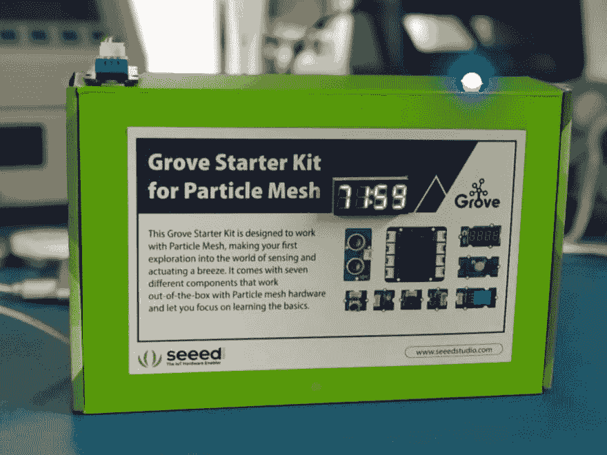
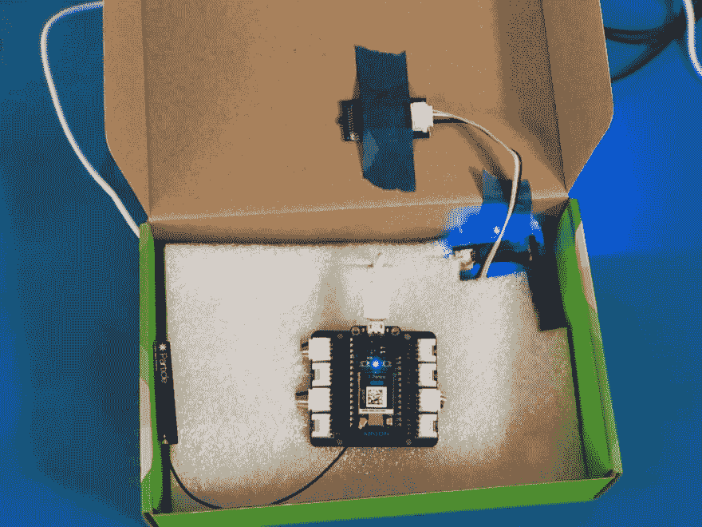
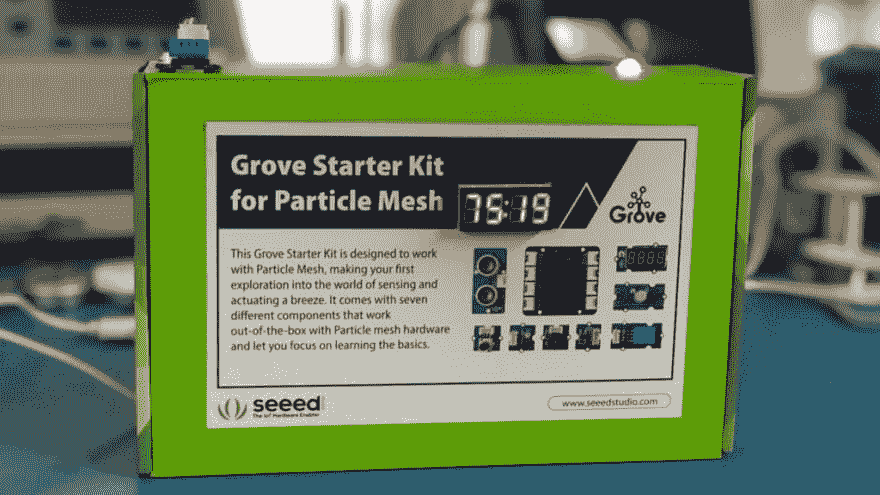
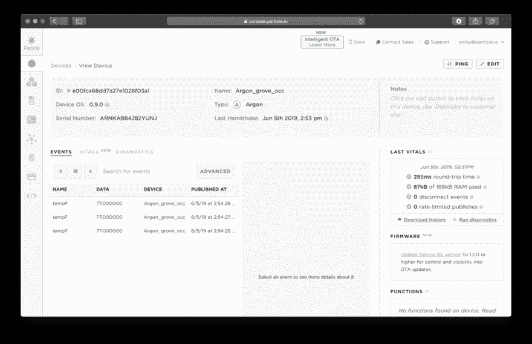
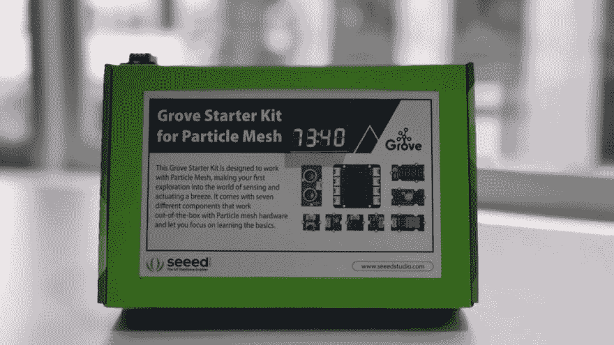

# 使用第三代氩气和 Grove 初学者工具包为您的车间制作这款 Wi-Fi 温度计

> 原文：<https://dev.to/particle/build-this-wi-fi-thermometer-for-your-workshop-using-a-gen-3-argon-and-a-grove-starter-kit-2nfl>

在本教程中，您将使用[粒子氩](https://store.particle.io/products/argon-kit)和 [Grove 粒子网格入门套件](https://store.particle.io/products/grove-starter-kit)制作一个简单的 Wi-Fi 温度计。目标是测量当前温度，在显示器上显示该值，如果温度超过预定义的阈值，RGB LED 将发出视觉警告。由于 Grove 系统的易用性，即使您刚刚开始，这也应该是一个容易理解的项目。

## 所需硬件

为了遵循本指南，您需要以下物品。

*   (1)粒子氩——这个项目假设你已经设置了氩。如果你还没有这样做，在你开始这个项目之前，请按照这里的指示做。
*   (1)用于粒子网格的 Grove 入门套件—该套件带有许多不同的传感器。该项目将使用套件中的以下零件:
    *   (1)用于粒子网格的凹槽屏蔽
    *   (1)温度和湿度传感器
    *   (1)可链接的 RGB LED V2
    *   (1) 4 位数显示
    *   (3)槽线

## 硬件组装

[](https://res.cloudinary.com/practicaldev/image/fetch/s--QqBF2mA3--/c_limit%2Cf_auto%2Cfl_progressive%2Cq_auto%2Cw_880/https://blog.particle.io/wp-content/uploads/2019/06/Grove-temp-blue-LED-crop-1024x768.jpg)

该项目的组装需要零焊接。在我的建筑中，我有点想入非非，决定将 Grove 工具箱重新用作外壳。我不会涵盖建立外壳的确切步骤，但我会说，当你用纸板工作时，测量两次，并用你的切割工具切割几次。

#### 连接您的 Grove 传感器

<figure>[](https://res.cloudinary.com/practicaldev/image/fetch/s--LLZYdOXf--/c_limit%2Cf_auto%2Cfl_progressive%2Cq_auto%2Cw_880/https://blog.particle.io/wp-content/uploads/2019/06/Grove-temp-project-interior-crop-1024x768.png) 

<figcaption>我用我的 Grove 套件中的盒子作为附件。只要加上胶带和一点耐心。</figcaption>

</figure>

这个项目的主要步骤是将所有传感器连接到 Grove FeatherWing。使用 Grove 系统进行建筑既快速又高效。此外，每根 Grove 电线都有一小块塑料切口，因此在物理上不可能以错误的方式连接 Grove 电缆。这是我在项目中使用的连接图表。

| **格罗夫顺桨港口** | **传感器** |
| --- | --- |
| D2 | 4 位数显示 |
| 主动脉第二声 | 温度和湿度传感器 |
| 通用非同步收发传输器(Universal Asynchronous Receiver/Transmitter) | RGB LED |

最后，把你的氩气加入到 Grove FeatherWing 中，让它舒适地坐好。就这样，所有的物理构建都完成了。让我们来看看代码。

## 添加代码，您马上就能监控环境温度

尽管组装硬件相当琐碎，但在添加代码之前，您的项目不会做太多事情。幸运的是，闪烁你的氩也不太复杂。为了使事情更加简化，您可以使用 Grove 传感器和致动器的现有固件库，因此您不必从头开始。库是一种很好的方法，可以抽象出很多复杂的代码。通过使用正确的库，你基本上只需要把你想在项目中使用的函数捆绑在一起，并添加你自己的程序逻辑。

此外，通过点击[该链接](https://go.particle.io/shared_apps/5ce72d269c35ef001786ffc4)，您将被带到 Particle Web IDE，所有代码都已预加载。你需要做的就是复制这个项目。

## 从代码中突出显示

虽然复制代码并调用项目完成很方便，但还是有必要查看程序逻辑的一些部分，以了解您的 Argon 上正在运行什么。

#### 预设置:库包含和变量定义

在代码的开头，您将看到`#include`和`#define`声明，它们指定了项目中使用的库以及用于每个传感器的引脚配置。

```
#include "Seeed_DHT11.h"
#include "TM1637.h"
#include "Grove_ChainableLED.h"
#define DHTPIN A2     // Temp&Humi pin
#define CLK D2    // 4-Digit Display pins
#define DIO D3    
DHT dht(DHTPIN);    // Temp/&Humi object
TM1637 tm1637(CLK,DIO);    // 4-Digit Display object
ChainableLED leds(RX, TX, 1);     // LED object with respective pins 
```

#### 用`Setup()`函数整理你的代码

setup 函数用于初始化你的库，并用你将在代码中用到的设置来配置它们的对象。

```
void setup()
{
tm1637.init();    // initialize Display library
tm1637.set(BRIGHTEST);    // BRIGHT_TYPICAL = 2,BRIGHT_DARKEST = 0,BRIGHTEST = 7;
tm1637.point(POINT_ON);    // Enable 'decimal' points
leds.init();    // initialize LED library
dht.begin();    // initialize DHT library
} 
```

### 理解主代码`loop()`

在草图中，`loop()`功能连续运行。因此，这是您想要放置项目的主程序逻辑的代码部分。在高层次上，`loop()`轮询来自传感器的数据，处理数据，并以可操作的方式输出数据。让我们开始吧。

#### 测量温度和湿度

本项目的主要数据来自`A2`附带的温湿度传感器。首先要做的是验证传感器数据有效。如果有任何无效数据，代码将使用`Serial.println()`输出“无法从 DHT11 传感器读取！”并退出`loop()`功能。

```
//Read Humidity
float h = dht.getHumidity();

// Read temperature as Celsius
float t = dht.getTempCelcius();

// Read temperature as Farenheit
float f = dht.getTempFarenheit();

// Check if any reads failed
if (isnan(h) || isnan(t) || isnan(f))
{
Serial.println("Failed to read from DHT11 sensor!");
return;
} 
```

#### 处理温湿度测量值

如果数据有效，您将继续并将温度数据分成单独的数字，这样它们就可以显示在 4 位数显示屏上。

```
// Separate the temperature to individual numbers to be used on the display.
int int_number = f * 100.0; // Two digits after decimal are kept. Turn the number into integer
int digits[10];             //Just in case I have 8 digits before decimal 
for (byte i=0; i<10; i++)
{
    digits[i]  = int_number % 10;
    if (int_number == 0) 
        break;
    int_number /= 10;
}

// display the numbers on the display
tm1637.display(0,digits[3]);
tm1637.display(1,digits[2]);
tm1637.display(2,digits[1]);
tm1637.display(3,digits[0]); 
```

#### 输出温度和湿度读数

接下来，您将获取收集的数据并将其推出。同时使用串行连接和`Particle.publish()`确保您可以分别在本地和远程读取它。

```
// Print the measured values over a Serial connection
Serial.print("Temp: ");
Serial.print(f);
Serial.println("*F ");
Serial.println();
Serial.println();

// Publis the temperature to the Cloud using Server Sent Events (SSE)
Particle.publish("tempF", String(f)); 
```

#### 根据温度改变 RGB LED 颜色

<figure>[](https://res.cloudinary.com/practicaldev/image/fetch/s--eeqeyPFY--/c_limit%2Cf_auto%2Cfl_progressive%2Cq_auto%2Cw_880/https://blog.particle.io/wp-content/uploads/2019/06/Grove-temp-LED-red-crop-1024x576.jpg) 

<figcaption>当温度超过 75.0F 时，RGB LED 亮起红色。这是在 loop()函数的逻辑中处理的。</figcaption>

</figure>

最后一段代码是根据当前温度控制 LED 的颜色。为此，代码使用条件语句来评估当前温度是高于还是低于 75F。如果温度高于 75F，RGB LED 将变为红色。如果温度低于这一温度，LED 将亮起蓝色。您可以简单地通过修改代码中的`75.0`来调整温度阈值。你自己试试吧。你需要刷新你的氩看到你的新代码在行动。

```
/ Temperature warning. Over 75F -> red. Under 75F -> Cyan.
if (f > 75.0){
leds.setColorRGB(0, 255, 0, 0); // red
}
if (f < 75.0){
leds.setColorRGB(0, 0, 0, 255); // cyan
}
delay(1000); 
```

这段代码的最后一行不容忽视。线`delay(1000)`将`loop()`功能的执行速度减慢了 1000 毫秒。我添加了这个，这样代码就不会超过`Particle.publish`的速率限制。此外，传感器的读取速度无论如何也不能超过 1000 毫秒，因此排除环路延迟没有任何优势。

#### 知道温度，即使你不在房间里

[](https://res.cloudinary.com/practicaldev/image/fetch/s--rbfa6ETN--/c_limit%2Cf_auto%2Cfl_progressive%2Cq_auto%2Cw_880/https://blog.particle.io/wp-content/uploads/2019/06/viewoftheconsole-1024x662.png)

如果你已经正确地遵循了说明，你现在应该有一个带本地显示的工作温度计。然而，由于有了`Particle.publish`，你也可以通过进入[粒子控制台](https://console.particle.io)并在“我的设备”标签上选择设备，或者通过检查*事件*标签(在那里你将能够一次看到来自你所有设备的发布)，来远程查看温度。

## 定制此项目以满足您的需求

<figure>[](https://res.cloudinary.com/practicaldev/image/fetch/s--7fvG0lEB--/c_limit%2Cf_auto%2Cfl_progressive%2Cq_auto%2Cw_880/https://blog.particle.io/wp-content/uploads/2019/06/Grove-temp-office-crop-1024x576.jpg) 

<figcaption>粒子动力会议室部署在会议室的温度监视器。</figcaption>

</figure>

现在您已经有了向互联网广播数据的项目，您可以获取这些数据并对其采取行动。要获得灵感，请看一下 [Hackster](https://particle.hackster.io/) 上的一些鼓舞人心的项目以及如何扩展这个项目的想法。例如，您可以使用粒子的 [IFTTT 配方，在室内温度超过您预定义的最高温度时自动发送电子邮件。](https://ifttt.com/particle)

确保无论你如何修改这个项目，你都在[粒子论坛](https://community.particle.io/)上分享你的作品，并且[在推特上发布你的项目照片](https://twitter.com/particle)给我们。

帖子[使用 Gen 3 Argon 和 Grove Starter Kit](https://blog.particle.io/2019/06/14/gen3-wi-fi-thermometer/) 为您的工作间制作这款 Wi-Fi 温度计最先出现在[粒子博客](https://blog.particle.io)上。