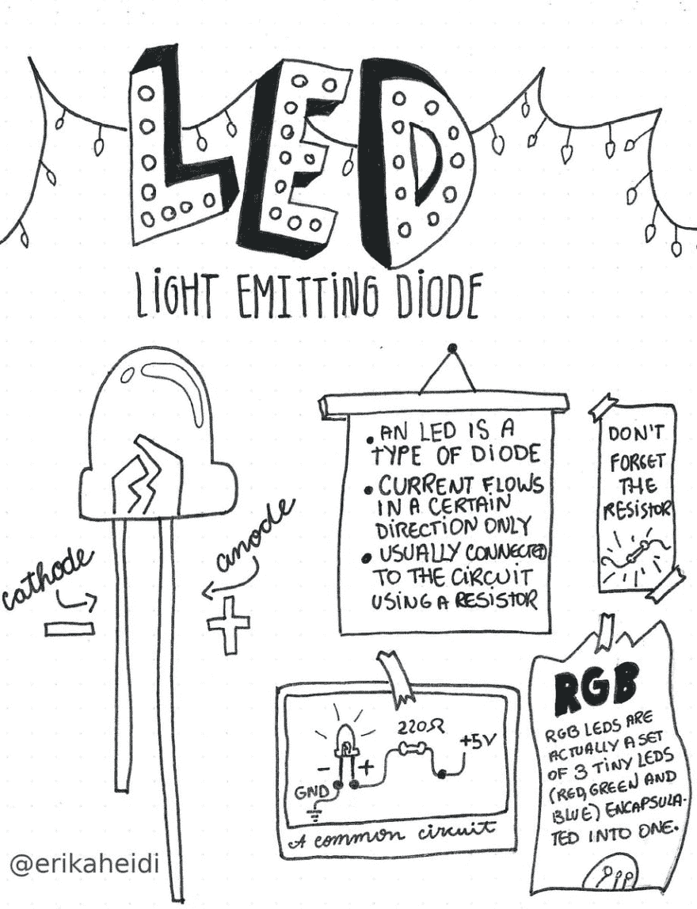
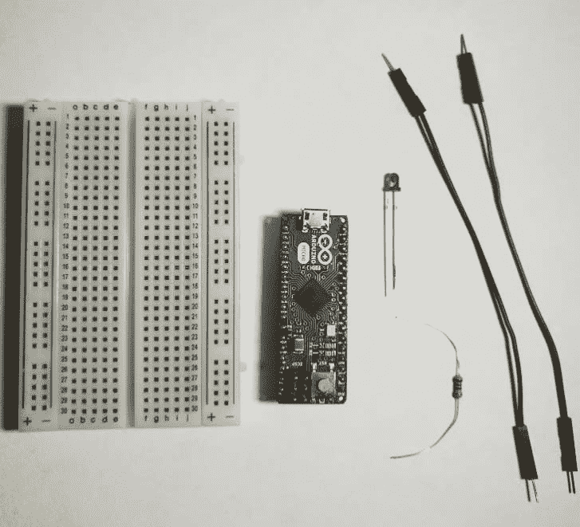
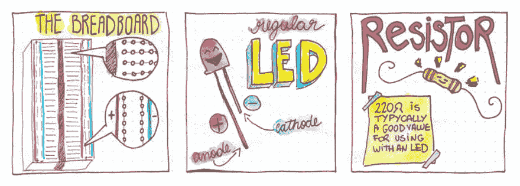
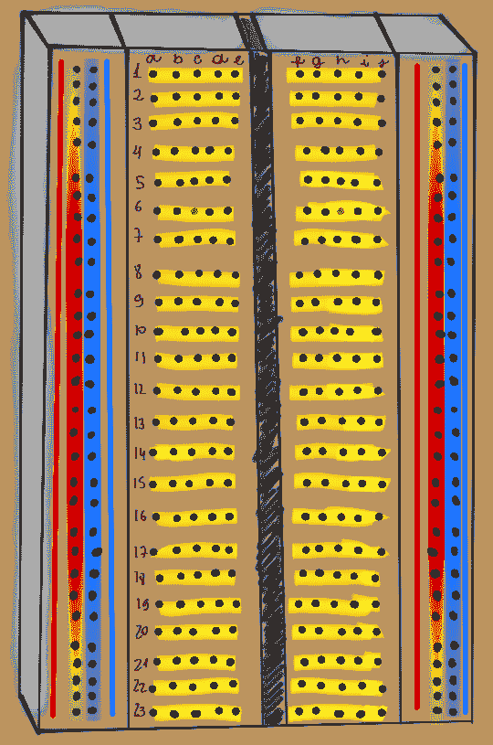
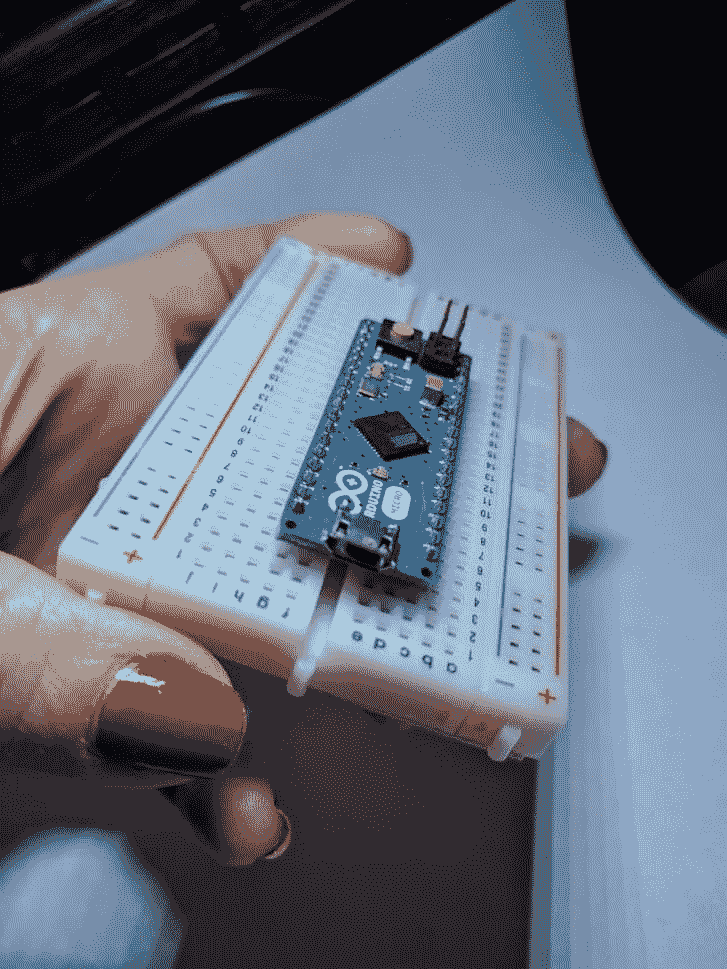
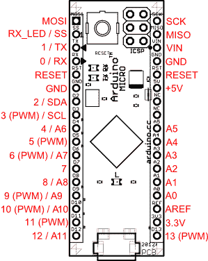
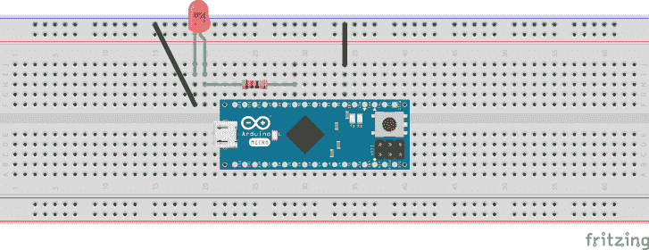
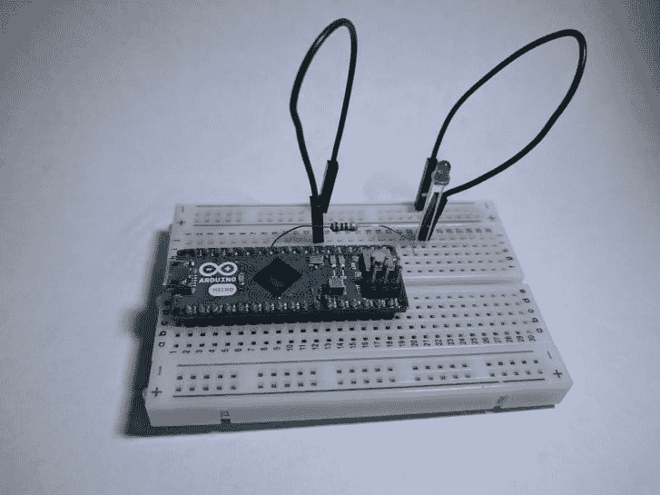

# 在 Arduino 上玩 led

> 原文：<https://dev.to/erikaheidi/playing-with-leds-on-arduino-116i>

## 简介

led 可能是电子产品中最棒的东西了，它们几乎可以和任何东西(比如葡萄干)搭配，而且事实证明，它们使用起来非常简单。

> Erika Heidi[@ erikaheidi](https://dev.to/erikaheidi)[@ ThePracticalDev](https://twitter.com/ThePracticalDev)led 最棒2019 年 6 月 14 日上午 11:03[](https://twitter.com/intent/tweet?in_reply_to=1139488550003650566)[](https://twitter.com/intent/retweet?tweet_id=1139488550003650566)[](https://twitter.com/intent/like?tweet_id=1139488550003650566)

本教程将演示使用简单的微控制器板(Arduino micro)并使用它来控制 LED 的基本知识。这是电子系列的[速成课程的最后一部分，一旦完成这一练习，你应该熟悉如何使用试验板和基本元件开始构建你自己的小型电子项目。万岁！](https://dev.to/erikaheidi/a-primer-on-basic-electronics-and-circuits-n3e)

## 所需材料

[](https://res.cloudinary.com/practicaldev/image/fetch/s--Vnd8cmul--/c_limit%2Cf_auto%2Cfl_progressive%2Cq_auto%2Cw_880/https://heidislab.ams3.cdn.digitaloceanspaces.com/basic-electronics/material_irl.jpg)

*   试验板。
*   Arduino 板。在本教程中，我将使用一个 Arduino Micro ，因为这是我这里有的，但你可以使用不同的 Arduino 板。
*   1 个常规 LED。
*   1 个 220 欧姆电阻器。
*   2 根跨接导线。

> 如果你还没有，看看本指南的第 2 部分:[整理预算发明者的工具包](https://dev.to/erikaheidi/putting-together-a-budget-inventor-s-kit-p95)

下面是我们要使用的物品的详细介绍:

[](https://res.cloudinary.com/practicaldev/image/fetch/s--RDdFuXsM--/c_limit%2Cf_auto%2Cfl_progressive%2Cq_auto%2Cw_880/https://heidislab.ams3.cdn.digitaloceanspaces.com/basic-electronics/tutorial_material.jpg)

**Arduino 板**

Arduino Micro 是基于 ATmega32U4 微控制器的紧凑型微控制器板。

**试验板**

[](https://res.cloudinary.com/practicaldev/image/fetch/s--pNEy4f0m--/c_limit%2Cf_auto%2Cfl_progressive%2Cq_auto%2Cw_880/https://heidislab.ams3.cdn.digitaloceanspaces.com/basic-electronics/breadboard_trails.png)

试验板有一系列带穿孔的轨迹，您可以在这些轨迹上连接组件。每个编号的行通常有 5 个相互连接的孔，因此，例如，将导线和元件放置在同一行中，就像直接连接它们一样。电路板两侧的两行穿孔通常用于连接电源(红线)和 GND(蓝线)。

**普通 LED**

LED 来源于“发光二极管”。常规 led 有两个引脚，一个正极(阳极)通常较长，一个负极(阴极)通常较短。通常将 LED 的正极引脚连接到一个电阻(约 220 欧姆或更高，最高 1k)，负极引脚连接到 GND。

**电阻器**

电阻器是一种基本的电子元件。它们用于限制流过电路的电流。电阻可以有许多不同的预定义值，以欧姆为单位测量。数值越大，电阻越大，意味着通过的电子越少。

**跳线**

跳线是简单的可重复使用的导线，可以轻松连接到试验板和用于原型制作的元件。

## 准备好您的环境

让我们从准备好环境开始。如果您使用的是 Arduino Micro，请将它“插”到试验板上，确保将引脚的每一侧放在试验板的不同侧，这样它们就不会短路。它应该看起来像这样:

[](https://res.cloudinary.com/practicaldev/image/fetch/s--xtd8rrEm--/c_limit%2Cf_auto%2Cfl_progressive%2Cq_auto%2Cw_880/https://heidislab.ams3.cdn.digitaloceanspaces.com/basic-electronics/breadboard_with_arduino.jpg)

现在，您可以将 USB 电缆连接到板上，以便打开它。

访问 Arduino 网站并[下载 Arduino IDE](https://www.arduino.cc/en/Main/Software) 。一旦你安装好了，在菜单中选择正确的板**工具- >板**。对于 Arduino Micro，您应该选择`Arduino / Genuino Micro`。您可能还需要在菜单**工具- >板- >端口**下选择通信端口。端口选择仅在板连接时起作用。

当你插上 USB 线打开电路板时，你应该可以通过菜单**工具- >获取电路板信息**来获取相关信息。

### 咨询板卡引脚排列

手边有*电路板引脚排列*总是很有趣。它将向您显示有关电路板的详细信息、可用引脚和其他信息。通过谷歌搜索，您可以轻松找到所有最受欢迎的主板的引脚排列——您甚至可以直接进入“图片”快速找到您需要的内容。

Arduino micro 的简单引脚排列如下:

[](https://res.cloudinary.com/practicaldev/image/fetch/s--6UWNgStg--/c_limit%2Cf_auto%2Cfl_progressive%2Cq_auto%2Cw_880/https://heidislab.ams3.cdn.digitaloceanspaces.com/basic-electronics/arduino_micro_pinout.png)

## 入门

现在你已经设置好了，是时候把你的第一张草图上传到板上了。在 IDE 上通过**文件- >实例- > 01 打开基本的 blink 实例。基本- >眨眼**。请看一下代码，了解一下它是如何工作的:

```
// the setup function runs once when you press reset or power the board
void setup() {
  // initialize digital pin LED_BUILTIN as an output.
  pinMode(LED_BUILTIN, OUTPUT);
}

// the loop function runs over and over again forever
void loop() {
  digitalWrite(LED_BUILTIN, HIGH);   // turn the LED on (HIGH is the voltage level)
  delay(1000);                       // wait for a second
  digitalWrite(LED_BUILTIN, LOW);    // turn the LED off by making the voltage LOW
  delay(1000);                       // wait for a second
} 
```

Enter fullscreen mode Exit fullscreen mode

你会注意到这个程序有两个功能，一个“设置”和一个“循环”。它们是不言自明的。本例使用 Arduino 板的内置 LED，由常量“LED_BUILTIN”定义。正如您将在下一个示例中看到的，如果使用外部 LED，我们可以将其更改为不同的引脚。

当你觉得准备好了，点击“上传”按钮(右箭头)发送代码到董事会。几秒钟后，您应该会看到主板上的内置 LED 开始闪烁。

## 使用外部 LED

这很有趣，但非常简单。在下一个例子中，我们将使用外部 LED，为此，我们需要构建一个小电路。激动人心！

### 创建您的第一条赛道

基本上，电路是电运行的路径。

你可以把电路想象成一个程序。它有一个非常特殊的执行流程(电流),可以通过控制来改变:函数或方法调用、条件等等。在电路中，这种控制是通过使用按钮、电阻、电容、led 等元件在“裸机”中实现的。

我们的电路非常简单。我们将把一个 LED 连接到 Arduino 微型板的引脚 6。为了连接 led，我们需要一个 220 欧姆的电阻(阻值高达 1k 仍然可以点亮 LED)。

事不宜迟，让我们检查一下代表我们要构建的电路的示意图:

[](https://res.cloudinary.com/practicaldev/image/fetch/s--BD7X_89_--/c_limit%2Cf_auto%2Cfl_progressive%2Cq_auto%2Cw_880/https://heidislab.ams3.cdn.digitaloceanspaces.com/basic-electronics/simpleled_circuit.png)

从图中可以看出，LED 的正极引脚(阳极，图中的右侧引脚)连接到电阻器，然后电阻器连接到 Arduino 板上的 6 号引脚。

你可能想知道这些黑线在那里做什么。他们将 LED 的负极引脚(阴极，本图中的左引脚)连接到 Arduino 板上的一个 GND 引脚。

下面是我的电路看起来像 IRL:

[](https://res.cloudinary.com/practicaldev/image/fetch/s--uydpRq9c--/c_limit%2Cf_auto%2Cfl_progressive%2Cq_auto%2Cw_880/https://heidislab.ams3.cdn.digitaloceanspaces.com/basic-electronics/circuit_irl.jpg)

现在，我们将对之前的“Blink”示例稍作修改，因此它使用引脚 6，而不是之前使用的内置 led 引脚。为了使代码更加通用，我们将创建一个包含 pin 值的变量，以便在需要时更容易修改它。

下面是更新后的代码:

```
int led = 6; // we are using pin 6 for the led
// the setup function runs once when you press reset or power the board
void setup() {
  // initialize digital pin led as an output.
  pinMode(led, OUTPUT);
}
// the loop function runs over and over again forever
void loop() {
  digitalWrite(led, HIGH);   // turn the LED on (HIGH is the voltage level)
  delay(1000);               // wait for a second
  digitalWrite(led, LOW);    // turn the LED off by making the voltage LOW
  delay(1000);               // wait for a second
} 
```

Enter fullscreen mode Exit fullscreen mode

## 附加示例:使用 PWM

[PWM](https://learn.sparkfun.com/tutorials/pulse-width-modulation?_ga=2.218747549.529935267.1515078321-82394859.1515078321) 代表“脉宽调制”，基本上是一种模拟模拟信号的数字信号。虽然数字信号只能为高电平(5v)或低电平(0v)，但 PWM 实现了一种将数字信号转换为模拟波(各种)的方法，因此我们可以通过一个引脚使用分级范围的值——在本例中，我们将使用 PWM 来使我们的 LED 渐入渐出，而不是简单地闪烁。

现在，如果你看一下 Arduino 微型引脚排列图，你会注意到一些引脚在引脚编号旁边有“PWM”字样。这意味着引脚支持 PWM 输出，这正是我们需要的，以便使我们的 LED 褪色。

您会注意到，我们为上例选择的引脚(引脚 6)支持 PWM，因此我们实际上不需要改变电路中的任何东西。只有代码需要更改。

让我们打开`Fade`的例子。在 Arduino IDE 上，进入菜单**文件- >示例- > 01。基本- >褪色**。现在将 pin 号从 9 改为 6，您应该准备好上传新示例了。

下面是代码(包括修改的 pin 和从注释中删除的内容):

```
int led = 6; // our led uses pin 6
int brightness = 0;
int fadeAmount = 5; 

void setup() {
 pinMode(led, OUTPUT);
}

void loop() {
 analogWrite(led, brightness);

 brightness = brightness + fadeAmount;

 if (brightness <= 0 || brightness >= 255) {
   fadeAmount = -fadeAmount;
 }

 delay(30);
} 
```

Enter fullscreen mode Exit fullscreen mode

## 结论

在电子系列的*速成班的最后部分，我们看到了如何设置 Arduino 环境，以及如何为 Arduino IDE 中包含的`blink`示例创建简单的 LED 电路。我们也看到了如何使用脉宽调制的*渐变*效果。*

从这里，你可以开始修补其他基本组件，如按钮和 RGB LEDs(基本上是 3 个微小的 led 封装成一个，共用一个阳极或阴极腿)。

如果你有其他你想在这里看到的教程的建议，请随时留下你的评论！

下次见\，，/