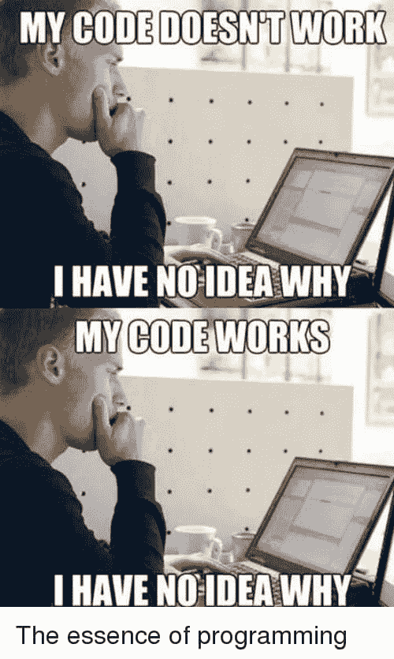

# CSS 战役#3 -按钮

> 原文：<https://dev.to/pheeria/css-battle-3-push-button-25>

最近，当我在努力完成第三个目标时，我希望自己能得到指导。当然，有像[这样的 GitHub 库，但是他们只给你最短的可能的答案，没有任何提示。写这个系列的一个想法就是这样诞生的。](https://github.com/alexzaworski/cssbattle-solutions)

## 1。绝对定位

重要的事情先来。让我们来设计主体的样式，并给它一个 0 的边距和一个可选的背景颜色。到目前为止一切顺利。现在，为了在我们的`400x300`画布中间制作一个矩形，我们可以制作一个所需大小的 div`300x150`，并使用边距将其居中。当宽度`400 - 300 = 2x`导致`50px`和`300 - 150 = 2y`为`75px`时。然后我们给它的背景上色，瞧，我们有东西了！

现在我们有一个选择。有三个圆圈。我们已经标记了两个分区- `outer`和`inner`。所以我们可以自由选择哪一个作为第三个圆的边界。对我来说，是外面的那个。所以我们给它`50px`浅蓝色的实心边框，并设置它的宽度、高度和边框半径为相同的值(因为它有一个边框)来得到一个圆。下一件事是把它放在矩形的中心。显然，它比它大。所以我们希望圆不在矩形内，而是在矩形的上方。我们给外圆一个绝对位置，并使其居中，如这里描述的。当然，还有其他的方法来使事情居中。注意，在这里将`position: relative`添加到`rect`作为`outer`的直接父代，使得圆沿着矩形的中心。如果你想通过调整它的边距来移动矩形，你会注意到这个效果。如果没有这个相对位置，外圆将始终停留在整个画布的中心，只有在这种情况下，它才会与矩形的中心重合。另一件值得注意的事情是`overflow: hidden`，在这种情况下，它似乎没有影响，因为外圆的边界与背景颜色相同。

内圈是小菜一碟。我们给它一个背景，宽度，高度，并将其居中。

```
<div id="rect">
  <div id="outer">
    <div id="inner"></div>
  </div>
</div>

<style>
  body {
    margin:0;
    background: #6592CF;
  }
  #rect {
    margin: 75px 50px;
    width: 300px;
    height: 150px;
    background: #243D83;
    overflow: hidden;
    position: relative;
  }
  #outer {
    border: 50px solid #6592CF;
    border-radius: 150px;
    width: 150px;
    height: 150px;
    background: #243D83;
    position: absolute;
    top: 50%;
    left: 50%;
    transform: translate(-50%, -50%);
  }
  #inner {
    border-radius: 25px;
    width: 50px;
    height: 50px;
    background: #EEB850;
    margin: 50px auto;
  }
</style> 
```

<svg width="20px" height="20px" viewBox="0 0 24 24" class="highlight-action crayons-icon highlight-action--fullscreen-on"><title>Enter fullscreen mode</title></svg> <svg width="20px" height="20px" viewBox="0 0 24 24" class="highlight-action crayons-icon highlight-action--fullscreen-off"><title>Exit fullscreen mode</title></svg>

## 2。方框阴影

让我们从长方形开始。它看起来与前面的例子非常相似，但是有一个默认的位置和边距，并根据浏览器的默认设置进行了调整。为了使圆在我们的矩形内居中，让我们使用 flexbox [，如这里描述的](https://css-tricks.com/centering-css-complete-guide/)。
曾经有段时间[w3 学校不好](https://www.w3fools.com/)，但是这些日子已经过去了。当我想要一个对初学者更友好的解释时，我经常访问这个网站。所以[在这里](https://www.w3schools.com/cssref/css3_pr_box-shadow.asp)我们了解到我们可以使用盒子阴影为一个元素制作多重阴影。我们创建一个黄色圆圈，并将其居中。然后我们添加两个不同大小和颜色的阴影。请注意，阴影的顺序很重要，因为每个下一个阴影都放在现有阴影的后面。

```
<div id="rect">
    <div id="circle"></div>
</div>

<style>
  * {
    background: #6592CF;
  }
  #rect {
    margin: 75px 42px;
    width: 300px;
    height: 150px;
    background: #243D83;
    display: flex;
    justify-content: center;
    align-items: center;
  }
  #circle {
    border-radius: 25px;
    width: 50px;
    height: 50px;
    background: #EEB850;
    margin: 50px auto;
    box-shadow: 0 0 0 50px #243D83, 0 0 0 100px #6592CF;
  }
</style> 
```

<svg width="20px" height="20px" viewBox="0 0 24 24" class="highlight-action crayons-icon highlight-action--fullscreen-on"><title>Enter fullscreen mode</title></svg> <svg width="20px" height="20px" viewBox="0 0 24 24" class="highlight-action crayons-icon highlight-action--fullscreen-off"><title>Exit fullscreen mode</title></svg>

## 3。方框阴影 2.0

你可能知道这个。

[](https://res.cloudinary.com/practicaldev/image/fetch/s--IlRx6D7L--/c_limit%2Cf_auto%2Cfl_progressive%2Cq_auto%2Cw_880/https://pics.me.me/my-code-doesnt-work-i-have-no-idea-why-my-21449922.png)

这正是我的感受。我不明白`overflow: hidden`——没有它代码就不能工作，我也不知道为什么。

```
<div id="rect">
    <div id="circle"></div>
</div>

<style>
  * {
    background: #6592CF;
  }
  #rect {
    margin: 75px 42px;
    width: 300px;
    height: 150px;
    background: #243D83;
    overflow: hidden;
  }
  #circle {
    border-radius: 25px;
    width: 50px;
    height: 50px;
    background: #EEB850;
    margin: 50px auto;
    box-shadow: 0 0 0 50px #243D83, 0 0 0 100px #6592CF;
  }
</style> 
```

<svg width="20px" height="20px" viewBox="0 0 24 24" class="highlight-action crayons-icon highlight-action--fullscreen-on"><title>Enter fullscreen mode</title></svg> <svg width="20px" height="20px" viewBox="0 0 24 24" class="highlight-action crayons-icon highlight-action--fullscreen-off"><title>Exit fullscreen mode</title></svg>