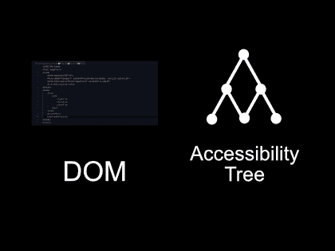
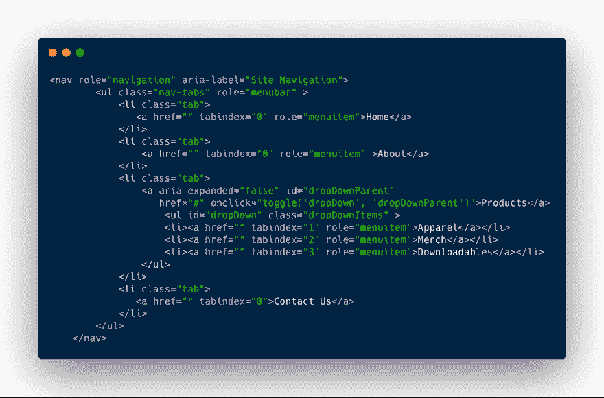
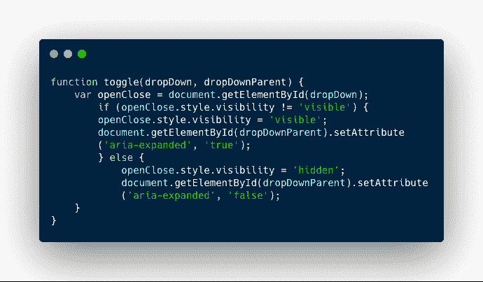

# 我对网页可访问性的看法大错特错，真是可笑！

> 原文：<https://dev.to/njericooper/a-web-accessibility-cry-for-help-48hm>

昨天，我得到了第一个基于产品的编码挑战。挑战在于开发一个允许无障碍导航条使用的网络应用。我曾经认为让一些东西可以被网络访问意味着我使用了一个好的配色方案。仅此而已。我以为就这么简单。以下是我蹩脚的、陈旧的可及性思维过程:

1.  在文本和背景色之间使用高对比度。导航、主要内容区域和页脚被视为一个背景。

2.  对我想索引的东西使用 Alt-Text。

这是不正确的，完全不是网页可访问性的内容。

以下是来自[vetshocode 的](https://twitter.com/vetswhocode)“代码挑战”空闲频道的挑战待办事项:

*   添加正确的 ARIA 规则
*   确保文本大小可读
*   使导航栏上的选项卡成为焦点
*   前景色/背景色的比例至少为 4:1
*   确保有动作让用户知道导航条的哪些部分是交互的
*   确保下拉菜单是可聚焦的，在悬停/聚焦时也是可取消的。

我晚了一个小时才看到挑战，并注意到没有人发布解决方案。我想成为第一个做好工作的学生。我深入研究了 web 可访问性协议、规则和工具。以下是我目前为止学到的东西:

ARIA 代表可访问的富互联网应用程序。这些应用程序分配角色、控制和状态定义。ARIA 是一组属性，它们与 DOM 的一个子集(称为可访问性树)一起工作。看不到可访问性树。它是键盘可控和屏幕阅读器友好。它还可以有不可见的功能，提供更独特的体验。

ARIA 通过告诉可访问性树项目的位置来补充 HTML。与网页元素交互的能力也被编入索引。这是一个带有 ARIA roles、tabindex 和 expanded 属性的导航栏示例。

Tabindex 使用户能够用键盘切换并选择菜单项。可以设置 tabindex 的值，以确定项目的列出顺序。

Aria-roles 让可访问性树知道一个元素有什么功能。如果我用一个图标作为按钮会怎么样？我将设置 role =“button”。

对于这个挑战，我必须创建一个嵌套在导航栏中的下拉列表。我使用 aria-expanded="false "作为项目的默认状态，在用户与之交互之前，我不想让这些项目可见。Expanded true false 是一个独特的属性，需要使用 JavaScript 进行切换。下面是一个访问两个 HTML 元素并设置其属性的函数示例:

该函数传递两个参数；“dropDown”和“dropDownParent”。参数通过 if/else 循环，改变下拉菜单的 CSS 可见性状态。扩声唱段的真假也随之改变。

焦点、活动和悬停状态的相应 CSS 将下拉菜单设置为可见。

ARIA 和 web 可访问性有更好的工作示例。虽然这是一项正在进行中的工作，请在 CodePen 上查看我的导航栏。

[https://codepen.io/njericooper/embed/QXwXaO?height=600&default-tab=result&embed-version=2](https://codepen.io/njericooper/embed/QXwXaO?height=600&default-tab=result&embed-version=2)

我还没有完成挑战。我想讨论和学习如何为所有用户提供最佳的用户体验。请告诉我你是如何使用 ARIA 的故事和例子。

在哪里了解到的 ARIA 角色:
[https://www . w3 . org/WAI/PF/ARIA/States _ and _ properties # ARIA-controls](https://www.w3.org/WAI/PF/aria/states_and_properties#aria-controls)
[https://developer . Mozilla . org/en-US/docs/Web/Accessibility/ARIA](https://developer.mozilla.org/en-US/docs/Web/Accessibility/ARIA)
[https://www.youtube.com/watch?v=qdB8SRhqvFc](https://www.youtube.com/watch?v=qdB8SRhqvFc)

来自#VetsWhoCode 的 slack 频道的编码挑战。他们是退伍军人拥有的非营利组织，教退伍军人 JavaScript。更多地了解他们，申请他们的项目，或者在这里捐款: [www.vetswhocode.io](http://www.vetswhocode.io)

[在推特上联系我](https://twitter.com/intent/user?screen_name=@njericooper)

> <video loop="" controls=""><source src="https://video.twimg.com/tweet_video/D89-CNNWwAEg5dG.mp4" type="video/mp4"></video>Njeri Cooper[@ njericooper](https://dev.to/njericooper)我最新的求救包括一个为期 5 天的强迫性水禁食一本书和一个未完成的代码挑战。在我的最新帖子[dev.to/njericooper/a-…](https://t.co/n5cEM1q0Kl)01:00AM-2019 年 6 月 14 日00中阅读或观看