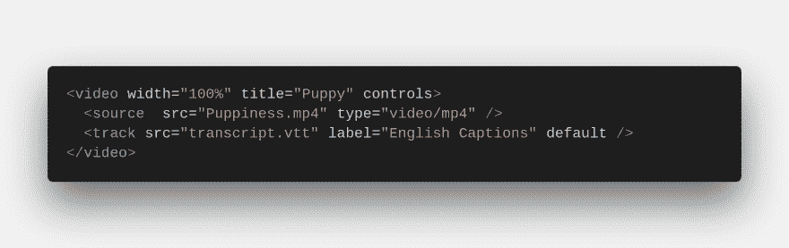
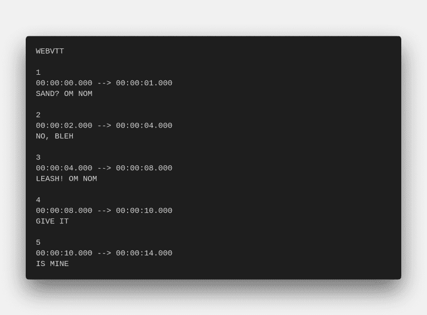
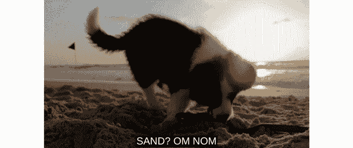

# 开始使用 HTML 视频字幕

> 原文：<https://dev.to/ashleemboyer/get-started-with-html-video-captions-3b2f>

你知道你可以用一点 HTML 和一个 VTT 文件给`<video>`元素添加标题吗？今天才知道！这真的很容易做到(只要你的 VTT 文件格式正确...大声呼喊[康林·德宾](https://twitter.com/CallMeWuz)帮助我找到那个错误😄).至少，您需要 3 个文件:

1.  视频，大概是`.mp4`
2.  WebVTT，字幕在那里
3.  超文本标记语言

# 我们开始吧

### HTML

这是最简单的一步。你只需要 3 个元素。在`<video>`元素上，确保包含了 [`controls`](https://www.w3schools.com/tags/att_video_controls.asp) 属性。这将允许用户切换字幕或切换到不同的语言，如果适用的话。

`<source>`元素应该是你的视频。指定它的`src`和`type`属性。`<track>`元素用于您将在下一步中创建的`.vtt`文件。这里包括多个属性。

*   `kind`默认为“字幕”,但是如果您指定了它，您还必须包括`srclang`属性。
*   `label`是曲目的标题，将显示在视频控制菜单中，在这里可以切换字幕。
*   `default`用于将轨道设置为启用。

### WebVTT

这个文件的格式非常特殊。您必须在文件的顶部包含“WEBVTT ”,然后是中间有空格的部分，这些部分被称为“cues”。在我上面附加的示例文件中，每个提示的第一行被称为标识符。下一行指定了提示的时间。最后，我们有线索有效载荷。这是包含每个标题内容的地方。你可以在这里做一些造型。

### 最终产品

封面图片是我给一个小狗在沙滩上玩耍的视频添加的标题的快速预览。这是整件事的 GIF 图。你也可以在这里看到我的小项目 live。

### 更多资源

我在那里找不到太多的例子，但是有大量的资源来研究字幕和标题之间的差异，样式能力，以及完成上述相同事情的其他方法，但是使用不同的抄本格式或第三方库。

*   [“How-to:在 HTML 的视频元素中使用字幕”](https://a11yproject.com/posts/using-caption-services-with-html5-video/)(A11Y 项目)
*   [“网络视频文本曲目格式(Web vtt)”](https://developer.mozilla.org/en-US/docs/Web/API/WebVTT_API)(MDN)
*   ["HTML `<track>`标签"](https://www.w3schools.com/tags/tag_track.asp) (w3schools)

如果你有关于标题的经验想要分享，或者知道更多有用的资源，请在评论中这样做！😊

* * *

你知道我有时事通讯吗？📬

如果你想在我发布新的博客帖子或宣布重大项目时得到通知，请联系 https://ashleemboyer.com/newsletter。