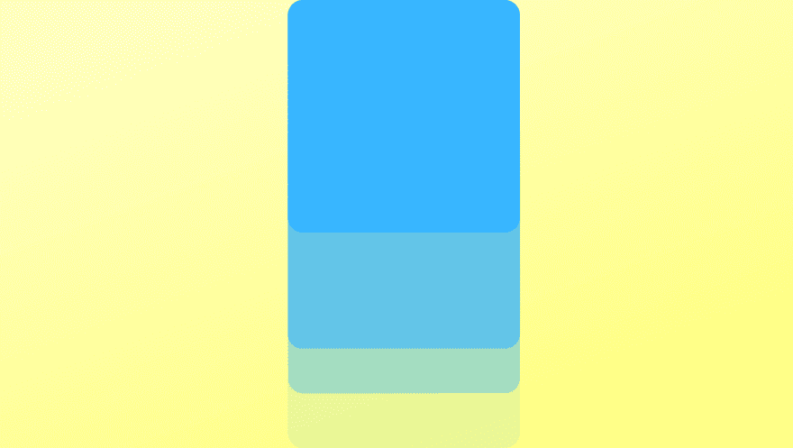
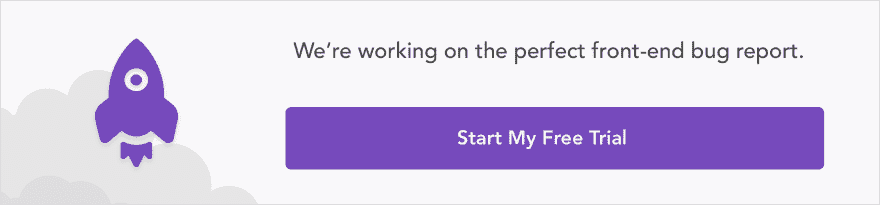
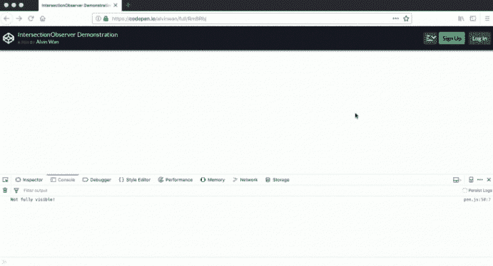
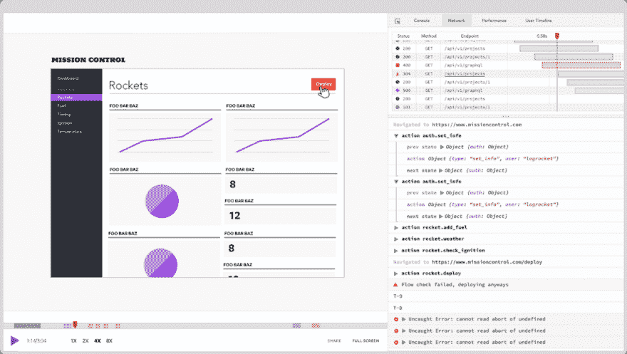

# 如何以正确的方式制作滚动链接动画

> 原文：<https://dev.to/bnevilleoneill/how-to-do-scroll-linked-animations-the-right-way-4549>

[](https://res.cloudinary.com/practicaldev/image/fetch/s--p7daOSlW--/c_limit%2Cf_auto%2Cfl_progressive%2Cq_auto%2Cw_880/https://thepracticaldev.s3.amazonaws.com/i/swofayrb414g4rwryvma.png)

如果使用不当，滚动链接动画会因实现效率低下而导致较低的帧速率和明显的抖动。即使是 2014 年的热门话题，视差滚动效果，也遇到了效率低下的问题。 [Frederick 等人](http://uxpajournal.org/the-effects-of-parallax-scrolling-on-user-experience-in-web-design/) (2015 年)报告了带有视差滚动的网站的“重大可用性问题”，甚至晕车。动画并不总是罪魁祸首，因为即使没有效果或不适当的滚动事件监听器仍然会让人头疼。Twitter 在 2011 年回应了一系列关于[滞后滚动的问题](https://twitter.com/twittersupport/status/25683274323992577?lang=en)，导致 jQuery 的创建者 John Resig 得出结论[昂贵的滚动事件处理程序不是一个好主意](https://johnresig.com/blog/learning-from-twitter/)。

这引发了两大类回应:Javascript monkey 补丁和 CSS 替换，以利用[浏览器优化](https://staktrace.com/spout/entry.php?id=834)。前者只是一种变通方法，我们将在下面详细介绍一种长期的`IntersectionObserver`解决方案。后者同样是一个合适的长期解决方案，但目前正在经历重大的重构，看到许多[已弃用](https://developer.mozilla.org/en-US/docs/Web/CSS/CSS_Scroll_Snap)[scroll-snap-*](https://developer.mozilla.org/en-US/docs/Web/CSS/CSS_Scroll_Snap)[CSS 属性](https://developer.mozilla.org/en-US/docs/Web/CSS/CSS_Scroll_Snap)。

本文围绕这两类响应，给出了两个技巧:使用 Javascript 观察者模式，尽可能使用 CSS。我们从 JavaScript 变通方法和解决方案开始。然后，我们讨论 CSS 属性，以及如何使用它们来简化滚动链接的动画——要避免的不赞成使用的属性、正在使用的当前属性和即将出现的属性。

[](https://logrocket.com/signup/)

## 尽可能使用 JavaScript 观察者模式

滚动链接动画通常基于滚动位置。对于这样的应用程序，滚动事件侦听器正在轮询滚动位置—如果滚动位置在目标范围内，则执行滚动链接动画。这与 Javascript 的[设计方法](https://developer.mozilla.org/en-US/docs/Web/API/EventListener)相反，它是监听事件而不是轮询事件。类似地，滚动链接动画将*监听*滚动位置，而不是*检查*滚动位置。观察者模式，确切地说是`IntersectionObserver`是一种持久的技术，可以实现这一点。粗略地说，一旦到达某个滚动位置，就会执行`IntersectionObserver`事件处理程序。我们将在下面更详细、更精确地描述它所实现的功能。

### 用 IntersectionObserver 实现离散滚动效果

[交叉点观察器 API](https://developer.mozilla.org/en-US/docs/Web/API/Intersection_Observer_API) 基于每个元素工作。每当这个元素(称为**目标**)出现在屏幕上时，交叉点观察器回调就会被调用。有三个配置选项需要注意:

1.  具体来说，API 支持的不仅仅是屏幕。每当目标元素与另一个元素 [**根**](https://developer.mozilla.org/en-US/docs/Web/API/Intersection_Observer_API#Intersection_observer_concepts_and_usage) 相交时，回调就会被调用。根可能是使用`null`指定的屏幕，或者开发人员指定的任何其他 DOM 元素。
2.  API 允许开发人员指定“出现”的含义，是指目标几乎不与根相交，还是完全与根相交。**相交比**是目标在根内可见的百分比。0 表示目标不可见，1.0 表示目标完全可见；开发者可以为这个交集比率指定一个**阈值**，或者一组阈值。每当交集比率超过数组中的阈值时，就会调用回调。注意两个方向都会触发回调——要么在阈值以下开始，要么在阈值以上结束，反之亦然。
3.  为了计算交集，API 使用包含目标可见部分的最小矩形和包含根内容的最小矩形。在根内容的包含矩形周围添加了**根边距**，用于计算交集。详见 MDN 的[“交集如何计算”](https://developer.mozilla.org/en-US/docs/Web/API/Intersection_Observer_API#How_intersection_is_calculated)。

以下是一个交叉点观察器配置示例。每当样本盒在用户视窗中完全可见时，处理程序被触发:

```
var intersectionOptions = {
  root: null,  // use the viewport
  rootMargin: '0px',
  threshold: 1.0
}

function intersectionCallback(entries, observer) {
  entries.forEach(entry => {
    if (entry.intersectionRatio >= 1) {
      console.log("Fully visible!");
    } else {
      console.log("Not fully visible!");
    }
  });
}

var observer = new IntersectionObserver(intersectionCallback, intersectionOptions);

var target = document.querySelector('#box');
observer.observe(target);

function intersectionCallback(entries, observer) {
  entries.forEach(entry => {
    if (entry.intersectionRatio >= 1) {
      console.log("Fully visible!");
    } else {
      console.log("Not fully visible!");
    }
  });
}

var observer = new IntersectionObserver(intersectionCallback, intersectionOptions);

var target = document.querySelector('#box');
observer.observe(target); 
```

<svg width="20px" height="20px" viewBox="0 0 24 24" class="highlight-action crayons-icon highlight-action--fullscreen-on"><title>Enter fullscreen mode</title></svg> <svg width="20px" height="20px" viewBox="0 0 24 24" class="highlight-action crayons-icon highlight-action--fullscreen-off"><title>Exit fullscreen mode</title></svg>

下面是对应的 HTML 和 CSS:

```
<html>
  <head>
    <title>IntersectionObserver Demo</title>
    <style>
      #box {
        margin-top:100% 0 100% 0;
        width:100%;
        height:90%;
        background-color:black;
      }
    </style>
  </head>
  <body>
    <div id="box"></div>
  </body>
</html> 
```

<svg width="20px" height="20px" viewBox="0 0 24 24" class="highlight-action crayons-icon highlight-action--fullscreen-on"><title>Enter fullscreen mode</title></svg> <svg width="20px" height="20px" viewBox="0 0 24 24" class="highlight-action crayons-icon highlight-action--fullscreen-off"><title>Exit fullscreen mode</title></svg>

查看代码笔[这里](https://codepen.io/alvinwan/pen/RmBRbj)，并尝试滚动黑盒完全进入视图，然后部分或完全退出视图。每当盒子完全滚动到视图中时，控制台显示`Fully visible!`。每当盒子滚动到不再完全可见时，控制台就会显示`Not fully visible!`。

[](https://res.cloudinary.com/practicaldev/image/fetch/s--NJQXF1_W--/c_limit%2Cf_auto%2Cfl_progressive%2Cq_66%2Cw_880/https://thepracticaldev.s3.amazonaws.com/i/zu084jm248canovdtyhg.gif)

然而，这不包括当用户滚动时连续出现的滚动链接动画。一个例子是视差效应。在这些情况下，如果需要滚动事件处理程序，有几种解决方法。这些方法适用于所有高频率的事件处理程序，重点是减少处理程序被调用的次数。

### 带去抖动和节流的连续滚动效果

**去抖**关注事件的“突发”。对于事件处理程序调用的任何快速序列，要么(a)第一次执行并忽略所有直接的后续调用，要么(b)等到“最后一次”调用后再执行。前者被称为*尾随模式*。后者被称为*领先(或“即时”)模式*。

这直接应用于窗口大小调整、拖放和预览渲染。然而，这对于滚动链接的动画有不利的影响。去抖动的这个缺陷是它对突发的定义:所有在`wait`毫秒内的连续呼叫都聚集成一个突发。这意味着只要事件发生在`wait`毫秒内，突发就可以无限期持续。在跟踪模式下，这意味着事件处理程序永远不会被触发。换句话说，如果用户一直滚动，你的网站内容可能永远不会在网页上显示出来。

**节流**关注的是执行速度，解决了上面的陷阱。当一个事件被重复调用时，事件处理程序保证每`wait`毫秒执行一次。这与搜索中的自动完成有直接的应用。然而，这种方法的缺陷是去抖动容易发生——如果一个脉冲串在`wait`毫秒内开始和结束，该脉冲串将不会触发事件处理程序。例如，如果`wait`是`1000ms`秒，用户拿着`500ms`滚过网页的 A 部分，A 部分将永远不会运行它的滚动链接动画。通过显示和位置不幸的正确组合，这可以不利地抵消视差效应。

诚然，上述对立的例子是人为的，但这是为了说明节流和去抖动的互补性质。选择一种方法就是选择一种折衷，没有一种方法完全胜过另一种。更多细节见来自[CSS Tricks’Chris Coyier](https://css-tricks.com/the-difference-between-throttling-and-debouncing/)和【客座作者】David Corbacho 的文章，以及`requestAnimationFrame`作为第三种选择的可能性。正如我们在下面的 CSS 部分所讨论的，这些连续滚动效果现在或者将来会被浏览器优化的 CSS 属性所替代。

## 尽可能使用 CSS 替换

使用浏览器优化的 CSS 属性，几种常见的滚动效果是可能的:滚动捕捉已经被主流浏览器支持，覆盖 80%以上的用户； [90%以上的用户](https://caniuse.com/#search=sticky)支持粘性位置；而一个[的临时 CSS 视差](https://alligator.io/css/pure-css-parallax/)得到了 97%+用户的支持 [1](https://caniuse.com/#search=transform) ， [2](https://caniuse.com/#search=transform) 。然而，考虑到 W3C 记录的[多种多样的用例，即使包含部分用户基础覆盖的 CSS 属性，支持也是有限的。然而，CSS 替换将实现和优化的开销卸载到浏览器上。有了 Javascript 或无动画的后备，CSS 属性可以提高大多数用户的可用性。](https://github.com/w3c/css-houdini-drafts/blob/master/scroll-customization-api/UseCases.md)

### 快速滚动

首先，CSS snap scrolling 的[规范在不断变化。有许多**不赞成使用的 CSS 属性来避免**，包括以下内容:](https://drafts.csswg.org/css-scroll-snap/)

1.  [滚动捕捉坐标](https://developer.mozilla.org/en-US/docs/Web/CSS/scroll-snap-coordinate)
2.  [滚动捕捉目的地](https://developer.mozilla.org/en-US/docs/Web/CSS/scroll-snap-destination)
3.  [滚动捕捉点 x](https://developer.mozilla.org/en-US/docs/Web/CSS/scroll-snap-points-x)
4.  [滚动捕捉点 y](https://developer.mozilla.org/en-US/docs/Web/CSS/scroll-snap-points-y)

这些属性被广泛用于来自 [webkit](https://webkit.org/demos/scroll-snap/) 和 [CSS 窍门](https://css-tricks.com/introducing-css-scroll-snap-points/)的 CSS 滚动链接动画教程，并且[受到 Firefox 和 Safari 的支持。](https://gist.github.com/majido/9900261e1b7e2b1eb180b01c03656b42)然而，与大多数 CSS 设计理念不同，捕捉位置是全局定义的，而不是按元素定义的。CSS 属性的当前规范有所不同，并且更加严格地遵循每个元素的设计原则:

1.  `scroll-snap-align: [none | start | end | center] [none | start | end | center]`指定 x 和 y 方向的捕捉对齐。如果只指定了一个值，该选项将应用于两个方向。 [Google Web Developers 展示了](https://developers.google.com/web/updates/2018/07/css-scroll-snap#css_scroll_snap)这种一致性，并提供了一个轮播示例。
2.  `scroll-snap-type: none | mandatory | proximity`none 选项很简单，强制选项是您可能从 snap scrolling 中期望的，其中所有滚动位置都是 snap。然而，只有当用户滚动到对齐滚动位置附近的位置时，接近度才对齐。否则，滚动不受影响。
3.  这为滚动区域配置了填充，其行为类似于典型的填充属性。有一个类似的滚动边距属性。这不是特定于对齐行为，而是避免了像粘性标题遮蔽内容这样的问题。
4.  **`scroll-snap-stop`** 这个属性表示实验性的，[没有被任何主流浏览器](https://developer.mozilla.org/en-US/docs/Web/CSS/scroll-snap-stop)实现。然而，它实际上表示用户是否可以“跳过”一个捕捉位置。

但是，捕捉位置现在由具有上述属性的元素表示。下面是一个 HTML 和 CSS 格式的快照滚动演示示例，没有多填充。

```
<html>
  <head>
    <title>Scroll Snapping Demo</title>
    <style>
      html, body, section {
        width:100%;
        height:100%;
      }
      body {
        scroll-snap-type: y mandatory;
      }
      section {
        scroll-snap-align: start;
      }
      section.black { background-color: black; }
    </style>
  </head>
  <body>
    <section></section>
    <section class="black"></section>
    <section></section>
    <section class="black"></section>
    <section></section>
  </body>
</html> 
```

<svg width="20px" height="20px" viewBox="0 0 24 24" class="highlight-action crayons-icon highlight-action--fullscreen-on"><title>Enter fullscreen mode</title></svg> <svg width="20px" height="20px" viewBox="0 0 24 24" class="highlight-action crayons-icon highlight-action--fullscreen-off"><title>Exit fullscreen mode</title></svg>

你可以在这里查看密码本。尝试上下滚动以查看滚动的效果。根据 caniuse.com[的说法，确保使用新 CSS 滚动快照规范支持的浏览器(截至发稿时——Chrome、Safari 或 Edge)。](https://caniuse.com/#search=scroll%20snap)

滚动捕捉只是许多滚动链接动画中的一个，但凭借其 80%以上的用户群覆盖率和持续快速上升的支持，它可能会成为您应用程序的黄金时间。

### **其他滚动链接动画**

为了支持持续的效果，同时支持滚动行为(例如，当用户向下滚动页面 x%时，项目水平移动 x%)，W3C 于 2019 年 3 月发布了一个非官方规范，概述了潜在的 CSS 实现。不用说，这些都是需要注意的属性，但不是用来写作的。然而，类似的提议有望进一步将滚动链接的动画工作卸载到浏览器上。

## 外卖

简而言之，对于滚动链接的动画，尽可能使用 CSS 属性，但在必要时，使用 Javascript 中的适当优化:对于基于位置的离散事件，使用观察者模式。对于连续事件，基于时间或事件突发的速率限制。如果做不到这一点，就会导致可用性体验下降，滚动链接的动画会阻碍可用性体验，也不会支持可用性体验。要了解更多细节和其他资源，请参阅关于 [Google Web 开发人员](https://developers.google.com/web/updates/2018/07/css-scroll-snap)、 [CSS 技巧](https://css-tricks.com/introducing-css-scroll-snap-points/)和 [MDN web 文档](https://developer.mozilla.org/en-US/docs/Mozilla/Performance/Scroll-linked_effects)的相关文章。

* * *

## Plug: [LogRocket](https://logrocket.com/signup/) ，一款适用于网络应用的 DVR

[](https://logrocket.com/signup/)

LogRocket 是一个前端日志工具，可以让你回放问题，就像它们发生在你自己的浏览器中一样。LogRocket 不需要猜测错误发生的原因，也不需要向用户询问截图和日志转储，而是让您重放会话以快速了解哪里出错了。它可以与任何应用程序完美配合，不管是什么框架，并且有插件可以记录来自 Redux、Vuex 和@ngrx/store 的额外上下文。

除了记录 Redux 操作和状态，LogRocket 还记录控制台日志、JavaScript 错误、堆栈跟踪、带有头+正文的网络请求/响应、浏览器元数据和自定义日志。它还使用 DOM 来记录页面上的 HTML 和 CSS，甚至为最复杂的单页面应用程序重新创建像素级完美视频。

[免费试用](https://logrocket.com/signup/)。

* * *

帖子[如何正确制作滚动链接动画](https://blog.logrocket.com/how-to-do-scroll-linked-animations/)最先出现在[博客](https://blog.logrocket.com)上。