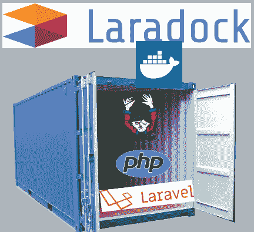
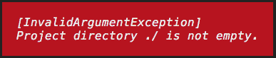
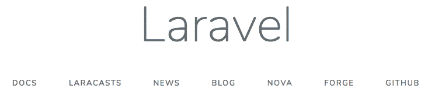
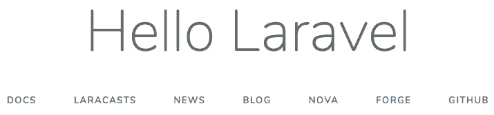

# 使用 PostgreSQL 和 Laradock 开发 Laravel

> 原文：<https://dev.to/kagundajm/laravel-development-using-postgresql-and-laradock-86c>

[](https://res.cloudinary.com/practicaldev/image/fetch/s--MZo5Kldt--/c_limit%2Cf_auto%2Cfl_progressive%2Cq_auto%2Cw_880/https://thepracticaldev.s3.amazonaws.com/i/twfp7l0i71loo8lkq525.png)

在这篇文章中，我们使用 PostgreSQL 和 [Laradock](https://github.com/laradock/laradock) 建立了一个 [Laravel](https://github.com/laravel/laravel) 开发环境。Laradock 使用 Docker 轻松地为 PHP 项目设置开发环境。通过使用 Docker，你不再需要在本地计算机上安装 [PHP](https://github.com/php/php-src) 、 [Composer](https://getcomposer.org/) 、Laravel 或数据库服务器。

### 要求

*   为了克隆 Laradock 库，需要 Git 。您可以通过在终端/命令提示符下运行`git --version`来确定您的计算机上是否安装了 Git。这将显示已安装 Git 的版本号，如果没有安装 Git，将显示一个错误。
*   为了启动必要的 Laradock 应用程序，还需要 [Docker](https://docs.docker.com/install/) 。Laradock 需要 Docker 版本 17.12 或更高版本。要显示计算机上安装的 Docker 版本，请在终端或命令提示符下运行`docker --version`。

### 安装选项

在项目中使用 Laradock 有两种方式:

*   通过在 Laravel 项目的根目录下安装 Laradock，使 LaraDock 成为项目的一部分，或者
*   在计算机上的任意位置安装一个通用的 Laradock，供所有项目使用。使用这种方法，您将需要稍后创建配置文件来指向您的项目/域，并对您的 **hosts** 文件进行更改。

第一种方法需要最少的配置。不同的项目有不同的需求是可能的，这种方法将无缝地适应这些需求，因此在本文中将采用这种方法。在这篇文章中，我们将使用 **duka** 和 **duka-laradock** 作为项目文件夹和 laradock 文件夹。您可以根据项目要求替换这些名称。

### 安装

1.  为您的项目创建文件夹，并切换到新创建的文件夹

    ```
    mkdir duka && cd duka 
    ```

2.  在根项目文件夹中初始化 Git

    ```
    git init 
    ```

3.  将 Laradock 子模块添加到您的项目中，并将存储库放在 **duka-laradock** 文件夹中

    ```
    git submodule add https://github.com/Laradock/Laradock.git duka-laradock 
    ```

### 更新 PostgreSQL 环境变量

1.  使用以下命令导航到 **duka-laradock** 文件夹:

    ```
    cd duka-laradock 
    ```

2.  将 **env-example** 文件复制到**。环境**

    ```
    cp env-example .env 
    ```

3.  打开**。env** 文件使用您最喜欢的编辑器。找到并更新 PostgreSQL 部分，以反映您的 PostgreSQL 数据库要求

    ```
    ### POSTGRES ##############################################

    POSTGRES_DB=duka-db
    POSTGRES_USER=homestead
    POSTGRES_PASSWORD=secret
    POSTGRES_PORT=5432 
    ```

4.  同时，您还可以通过修改**中的`PHP_VERSION`变量来修改项目中使用的 PHP 版本。env** 文件。

    ```
    ### PHP Version ###########################################

    PHP_VERSION=7.3 
    ```

### 创建独特的 Docker 容器

默认情况下，容器会以 **laradock_** 作为后缀。因为我们每个项目都使用 Laradock，所以我们需要对**做一些修改。env** 文件，这样创建的容器将是唯一的，并反映我们的项目名称。找到 **COMPOSE_PROJECT_NAME** 变量，修改如下:

```
 COMPOSE_PROJECT_NAME=duka-laradock 
```

这将使我们的容器有一个后缀 **duka-laradock_** 而不是 **laradock_**

### 供应您的码头集装箱

Laradock 支持各种你可以使用的软件。每个选定的软件都将在其自己的容器中进行配置

仍然在 **duka-laradock** 文件夹中，运行 docker-compose 命令并指定您需要为项目提供的软件(映像)

```
 docker-compose up -d nginx postgres 
```

如果这是第一次设置映像，根据所选的软件和您的互联网连接速度，设置容器的过程可能需要一段时间。

在流程运行完成后，运行 **docker-compose ps** 命令来查看已供应的容器。

```
docker-compose ps 
```

上述命令将提供类似如下的输出:

```
 Name                            Command              State                    Ports                  
-------------------------------------------------------------------------------------------------------------------
duka-laradock_docker-in-docker_1   dockerd-entrypoint.sh           Up      2375/tcp                                
duka-laradock_nginx_1              /bin/bash /opt/startup.sh       Up      0.0.0.0:443->443/tcp, 0.0.0.0:80->80/tcp
duka-laradock_php-fpm_1            docker-php-entrypoint php-fpm   Up      9000/tcp                                
duka-laradock_postgres_1           docker-entrypoint.sh postgres   Up      0.0.0.0:5432->5432/tcp                  
duka-laradock_workspace_1          /sbin/my_init                   Up      0.0.0.0:2222->22/tcp 
```

输出列出了为我们提供的容器。 **Name** 是分配给每个容器的名称， **Command** 是指用于提供容器的命令， **Ports** 是指为每个容器开放的端口。我们的 web 服务器 **nginx** 依赖于**PHP-fpm**(duka-laradock _ PHP-fpm _ 1)。这就是为什么即使我们从未在 docker compose 命令中指定这个容器，也要提供它的原因。**workplace**(duka-laradock _ workspace _ 1)容器将包含我们在开发工作空间中可能需要的工具。像 **PHP CLI** 、 **Composer** 、 **Git** 、 **Yarn** 等工具。

现在我们已经验证了我们的容器已经启动并运行，我们可以测试到 PostgreSQL 数据库的连接性。

### 验证 PostgreSQL 数据库的连通性

让我们通过运行命令 **docker logs** 并提供容器的名称来查看 postgresql 数据库日志。

```
docker logs duka-laradock_postgres_1 
```

这将提供如下所示的输出:

```
The files belonging to this database system will be owned by user "postgres".
This user must also own the server process.

The database cluster will be initialized with locale "en_US.utf8".
The default database encoding has accordingly been set to "UTF8".
The default text search configuration will be set to "english".

Data page checksums are disabled.

fixing permissions on existing directory /var/lib/postgresql/data ... ok
creating subdirectories ... ok
selecting default max_connections ... 100
selecting default shared_buffers ... 128MB
selecting dynamic shared memory implementation ... posix
creating configuration files ... ok
running bootstrap script ... ok

...

Success. You can now start the database server using:

    pg_ctl -D /var/lib/postgresql/data -l logfile start

...

server started
CREATE DATABASE

/usr/local/bin/docker-entrypoint.sh: ignoring /docker-entrypoint-initdb.d/createdb.sh.example

/usr/local/bin/docker-entrypoint.sh: sourcing /docker-entrypoint-initdb.d/init_gitlab_db.sh
CREATE ROLE
CREATE DATABASE
GRANT
ALTER ROLE

...

2019-06-06 18:09:35.771 UTC [1] LOG:  database system is ready to accept connections 
```

现在我们的 PostgreSQL 已经准备好接受连接，让我们尝试使用在**中更新的凭证连接数据库服务器。env** 文件，方法是运行以下命令:

```
docker-compose exec postgres psql -U homestead -d duka-db 
```

尽管容器名是 **duka-laradock_postgres_1** ，但是容器的服务名是 **docker-compose.yml** 文件中定义的 **postgres** 。您可以将服务名视为计算机名。

```
### PostgreSQL ###########################################
    postgres:
      build: ./postgres
      volumes:
        - ${DATA_PATH_HOST}/postgres:/var/lib/postgresql/data
        - ${POSTGRES_ENTRYPOINT_INITDB}:/docker-entrypoint-initdb.d
      ports:
        - "${POSTGRES_PORT}:5432"
      environment:
        - POSTGRES_DB=${POSTGRES_DB}
        - POSTGRES_USER=${POSTGRES_USER}
        - POSTGRES_PASSWORD=${POSTGRES_PASSWORD}
        ...
      networks:
        - backend 
```

这将为我们呈现类似如下的输出:

```
psql (11.3)
Type "help" for help.

duka-db=# 
```

输出确认我们可以使用包含在我们的**中的凭证来访问 PostgreSQL 数据库服务器容器。env** 文件。

键入 **\l** 并按下**回车键**以显示容器内可用的数据库。

```
duka-db=# \l
                                            List of databases
        Name         |   Owner   | Encoding |  Collate   |   Ctype    |         Access privileges         
---------------------+-----------+----------+------------+------------+-----------------------------------
 duka-db             | homestead | UTF8     | en_US.utf8 | en_US.utf8 | 
 laradock_gitlab     | homestead | UTF8     | en_US.utf8 | en_US.utf8 | =Tc/homestead                    +
                     |           |          |            |            | homestead=CTc/homestead          +
                     |           |          |            |            | laradock_gitlab=CTc/homestead
 laradock_jupyterhub | homestead | UTF8     | en_US.utf8 | en_US.utf8 | =Tc/homestead                    +
                     |           |          |            |            | homestead=CTc/homestead          +
                     |           |          |            |            | laradock_jupyterhub=CTc/homestead
 postgres            | homestead | UTF8     | en_US.utf8 | en_US.utf8 | 
 sonar               | homestead | UTF8     | en_US.utf8 | en_US.utf8 | =Tc/homestead                    +
                     |           |          |            |            | homestead=CTc/homestead          +
                     |           |          |            |            | sonar=CTc/homestead
 template0           | homestead | UTF8     | en_US.utf8 | en_US.utf8 | =c/homestead                     +
                     |           |          |            |            | homestead=CTc/homestead
 template1           | homestead | UTF8     | en_US.utf8 | en_US.utf8 | =c/homestead                     +
                     |           |          |            |            | homestead=CTc/homestead
(7 rows)

duka-db=# 
```

我们的数据库 **duka-db** 已经创建，并根据我们在**中所做的更改归角色**家园**所有。env** 配置文件。

键入 **\q** 并按下**回车键**退出容器。

### 创建我们的 Laravel 项目

针对**工作区**服务运行以下命令

```
docker-compose exec --user=laradock workspace bash 
```

工作区容器中有我们在开发过程中需要的工具(PHP7-CLI、Git、Composer 等)。 **laradock** 用户是在**工作区**容器被提供时创建的。

执行上述命令后，我们会看到一个终端提示:

```
laradock@c9aa984b7bfa:/var/www$ 
```

我们可以通过运行`composer --version`来验证 Composer 已经安装在工作区容器上。运行`composer create-project --prefer-dist laravel/laravel .`在当前文件夹位置创建项目会抛出一个`[InvalidArgumentException] Project directory ./ is not empty.`错误。

[](https://res.cloudinary.com/practicaldev/image/fetch/s--ygPdol7i--/c_limit%2Cf_auto%2Cfl_progressive%2Cq_auto%2Cw_880/https://thepracticaldev.s3.amazonaws.com/i/5g60bcrkp3bil5j3fbx6.png)

为了避免错误，我们需要首先通过运行以下命令来安装 Laravel 安装程序

```
 composer global require laravel/installer 
```

接下来，我们使用 Laravel 安装程序创建项目

```
 /home/laradock/.composer/vendor/bin/laravel new --force . 
```

安装完成后，键入`exit`退出容器，你应该回到 **laradock-duka** 文件夹。

```
laradock@c9aa984b7bfa:/var/www$ composer global require laravel/installer

laradock@c9aa984b7bfa:/var/www$ /home/laradock/.composer/vendor/bin/laravel new --force .

laradock@c9aa984b7bfa:/var/www$ exit 
```

如果导航到项目的根目录并列出文件，您会注意到在容器中创建的项目文件在主机上是可用的。

```
cd ..

ls -la 
```

### 运行我们的项目

打开浏览器，导航到 [http://localhost](http://localhost) ，您应该会看到 Laravel 欢迎屏幕

[](https://res.cloudinary.com/practicaldev/image/fetch/s--aLrYigjG--/c_limit%2Cf_auto%2Cfl_progressive%2Cq_auto%2Cw_880/https://thepracticaldev.s3.amazonaws.com/i/cjy7qw56eqapl1ulymaw.png)

打开**resources/views/welcome . blade . PHP**文件，向下滚动，将内容标题 **Laravel** 改为 **Hello Laravel** 。保存文件并刷新您的 [http://localhost](http://localhost) 网页，您现在应该看到页面已经更新。

[](https://res.cloudinary.com/practicaldev/image/fetch/s--jqlaNake--/c_limit%2Cf_auto%2Cfl_progressive%2Cq_auto%2Cw_880/https://thepracticaldev.s3.amazonaws.com/i/6sfef2tfgsokqh0ksdj7.png)

### 迁移并植入数据库

打开**。env** 放在 Laravel 项目的根中，并从

```
 DB_CONNECTION=mysql
    DB_HOST=127.0.0.1
    DB_PORT=3306
    DB_DATABASE=laravel
    DB_USERNAME=root
    DB_PASSWORD= 
```

到下面

```
 DB_CONNECTION=pgsql
    DB_HOST=postgres
    DB_PORT=5432
    DB_DATABASE=duka-db
    DB_USERNAME=homestead
    DB_PASSWORD=secret 
```

完成后，保存文件

如果您在 Laravel 项目的根目录下，导航到 duka-laradock 的根目录

为了使我们所做的更改生效，我们需要使用下面的命令
重新创建容器

```
 docker-compose down

docker-compose up -d nginx postgres 
```

重新创建容器后，登录到**工作区**服务

```
docker-compose exec --user=laradock workspace bash 
```

然后迁移和播种数据库

```
php artisan migrate --seed 
```

如果迁移和播种数据库的过程成功完成，您应该得到类似下面的输出

```
laradock@565deba12e1c:/var/www$ php artisan migrate --seed
Migration table created successfully.
Migrating: 2014_10_12_000000_create_users_table
Migrated:  2014_10_12_000000_create_users_table
Migrating: 2014_10_12_100000_create_password_resets_table
Migrated:  2014_10_12_100000_create_password_resets_table
Database seeding completed successfully.
laradock@565deba12e1c:/var/www$ 
```

### 结论

这篇文章介绍了使用 PostgreSQL 数据库和 Laradock 为 Laravel 设置开发环境所需的步骤。使用这种方法，我们消除了在本地计算机上设置开发环境所需的安装 PHP 或其他工具的需要。按照这种方法，您只需要导航到您的 Laradock 文件夹，并从终端运行`docker-compose up -d nginx postgres`来启动所有需要的工具，以继续您的开发过程。