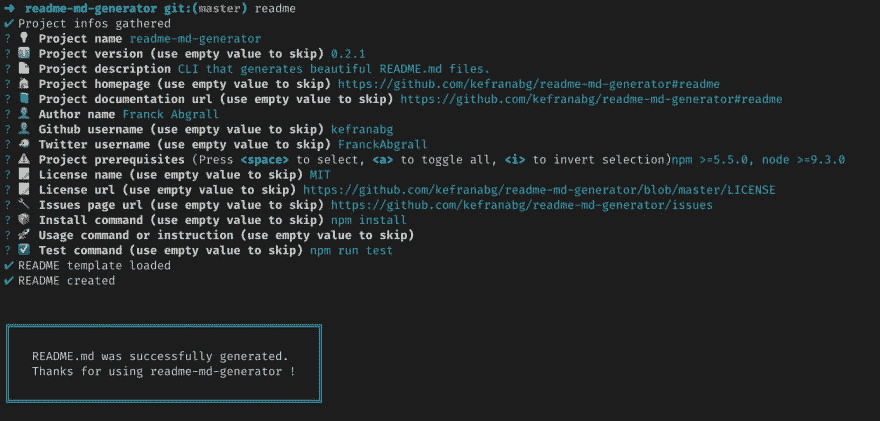
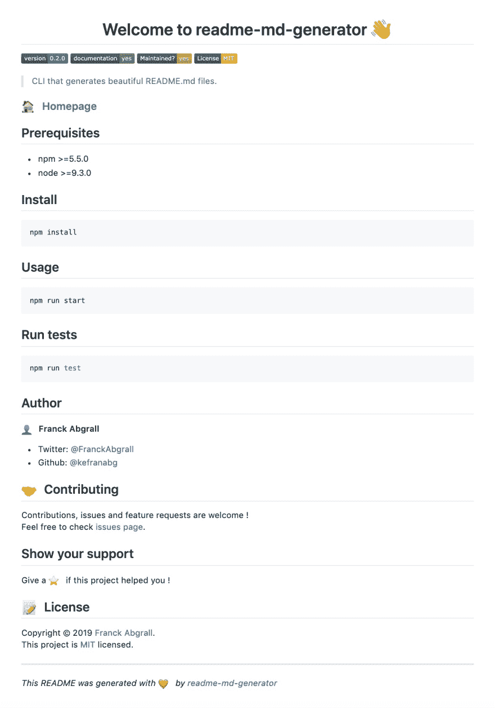

# Generate beautiful README in 10 seconds

> 原文：[https://dev.to/kefranabg/generate-beautiful-readme-in-10-seconds-38i2](https://dev.to/kefranabg/generate-beautiful-readme-in-10-seconds-38i2)

Hi 👋

A well structured and beautiful README is very important, especially for opensource projects. This is the first thing that visitors will see when they discover your project.

This is why I created [readme-md-generator](https://github.com/kefranabg/readme-md-generator), a tool that generates beautiful basic `README.md` files with less efforts !

All you need to do is answer a few questions, and [readme-md-generator](https://github.com/kefranabg/readme-md-generator) will do the rest 👌

`readme-md-generator` is able to read your environment (package.json, git config...) to suggest you default answers during the `README.md` creation process :

Generated `README.md` :

Feel free to check out the [github repos](https://github.com/kefranabg/readme-md-generator) if you're interested !