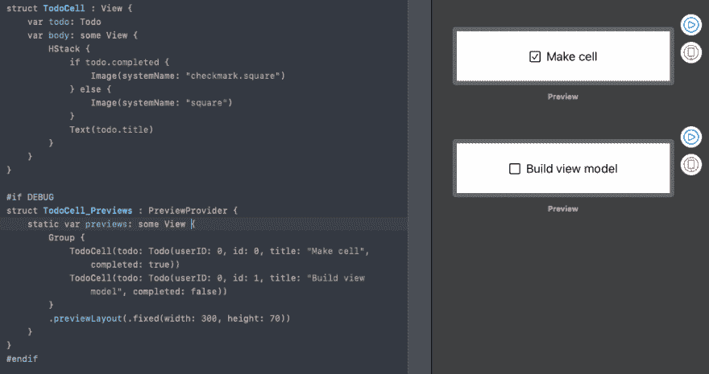

# SwiftUI 和 Combine 入门。

> 原文：<https://dev.to/kevinmaarek/getting-started-with-swiftui-and-combine-dd8>

编辑:为 XCode 11.1 更新。

因此，我已经为 iOS 开发了很长一段时间，我决定涉足苹果几天前在 WWDC 2019 上推出的新的超级新鲜框架:SwiftUI 和 Combine。

如果你错过了，SwiftUI 是一种以声明方式制作 UI 的新方法。Combine 与 SwiftUI 一起工作，并为处理 UI 或网络事件等值提供声明性 Swift API。

所以，让我们动手尝试一下吧！

首先，让我们找一个 API 来调用和使用。我发现了 [JSONPlaceholder](https://jsonplaceholder.typicode.com/) ，他们提供了一个我选择实现的 [todo API](https://jsonplaceholder.typicode.com/todos) :它返回 200 个 todo 项，看起来像:

```
 [{
    "userId": 1,
    "id": 1,
    "title": "delectus aut autem",
    "completed": false
 }] 
```

<svg width="20px" height="20px" viewBox="0 0 24 24" class="highlight-action crayons-icon highlight-action--fullscreen-on"><title>Enter fullscreen mode</title></svg> <svg width="20px" height="20px" viewBox="0 0 24 24" class="highlight-action crayons-icon highlight-action--fullscreen-off"><title>Exit fullscreen mode</title></svg>

它能完成任务。我将使用 [Quicktype](https://app.quicktype.io/) 为我的 Todo 模型自动生成我的可编码结构。

现在，让我们开始一个新的 XCode 项目。不要忘记“使用 SwiftUI”复选框😇。
我们将添加我们的 todo 模型，一个来自 Quicktype 结果的副本/past，并添加`Identifiable`一致性，我们已经有了一个`id`，我们稍后将需要它。

```
public class Todo: Codable, Identifiable {
    public let userID: Int
    public let id: Int
    public let title: String
    public let completed: Bool

    enum CodingKeys: String, CodingKey {
        case userID = "userId"
        case id = "id"
        case title = "title"
        case completed = "completed"
    }

    public init(userID: Int, id: Int, title: String, completed: Bool) {
        self.userID = userID
        self.id = id
        self.title = title
        self.completed = completed
    }
}

public typealias Todos = [Todo] 
```

<svg width="20px" height="20px" viewBox="0 0 24 24" class="highlight-action crayons-icon highlight-action--fullscreen-on"><title>Enter fullscreen mode</title></svg> <svg width="20px" height="20px" viewBox="0 0 24 24" class="highlight-action crayons-icon highlight-action--fullscreen-off"><title>Exit fullscreen mode</title></svg>

`Identifiable`是一个协议(SwiftUI 框架附带的)，用于比较和识别元素。它需要 and `id`和一个默认返回`Self`的`identifiedValue`，我们将保持这种方式。

这样，我们就知道每个`Todo`对象都是独一无二的。
注意，使用`List`或`ForEach`时需要。

现在让我们继续创建我们的视图，一个简单的列表和单元格，从 todo 单元格开始。水平堆叠就可以了:

[](https://res.cloudinary.com/practicaldev/image/fetch/s--1mijQy1Z--/c_limit%2Cf_auto%2Cfl_progressive%2Cq_auto%2Cw_880/https://thepracticaldev.s3.amazonaws.com/i/k4e04c0cvb2lzpyl7fh3.png) 
(可以在文末下载完整项目)

然后，列表，非常基本，不要忘记`Todos`作为存储属性(现在):

```
 var todos: Todos
    var body: some View {
        NavigationView {
            List(self.todos) { todo in
                TodoCell(todo: todo)
            }
     } 
```

<svg width="20px" height="20px" viewBox="0 0 24 24" class="highlight-action crayons-icon highlight-action--fullscreen-on"><title>Enter fullscreen mode</title></svg> <svg width="20px" height="20px" viewBox="0 0 24 24" class="highlight-action crayons-icon highlight-action--fullscreen-off"><title>Exit fullscreen mode</title></svg>

现在我们应该在视图模型上工作。创建一个名为 TodoViewModel 的类，让我们给它添加一些函数。比方说，我们需要(显然)下载待办事项列表，并创建另一个函数来打乱列表(因为为什么不呢，当谈到待办事项列表的特性时，我缺乏想法)。

这是你现在应该有的:

```
public class TodoViewModel {
    var todos: Todos = [Todo]()

    func shuffle() {
        self.todos = self.todos.shuffled()
    }

    func load() {
        guard let url = URL(string: "https://jsonplaceholder.typicode.com/todos/") else { return }
        URLSession.shared.dataTask(with: url) { (data, response, error) in
            do {
                guard let data = data else { return }
                let todos = try JSONDecoder().decode(Todos.self, from: data)
                DispatchQueue.main.async {
                    self.todos = todos
                }
            } catch {
                print("Failed To decode: ", error)
            }
        }.resume()
    }
} 
```

<svg width="20px" height="20px" viewBox="0 0 24 24" class="highlight-action crayons-icon highlight-action--fullscreen-on"><title>Enter fullscreen mode</title></svg> <svg width="20px" height="20px" viewBox="0 0 24 24" class="highlight-action crayons-icon highlight-action--fullscreen-off"><title>Exit fullscreen mode</title></svg>

现在到了棘手的部分。
我们需要使 ViewModel 符合`ObservableObject`。这是一个协议，它将帮助我们在值发生变化时自动通知任何订户。
它将允许我们用属性包装器标记任何需要对订户进行更新的属性(在这篇[帖子](https://dev.tohttp://) ) `@Published`中有更多关于属性包装器的内容)。

`@Published`属性包装器通过向属性添加一个`Publisher`来工作。

```
 @Published var todos: Todos = [Todo]() 
```

<svg width="20px" height="20px" viewBox="0 0 24 24" class="highlight-action crayons-icon highlight-action--fullscreen-on"><title>Enter fullscreen mode</title></svg> <svg width="20px" height="20px" viewBox="0 0 24 24" class="highlight-action crayons-icon highlight-action--fullscreen-off"><title>Exit fullscreen mode</title></svg>

这样，每次设置`todos`属性时，观察我们视图模型的任何东西都会被通知。因此，如果我们谈论一个 SwiftUI `View`，它将自动刷新(用一些平滑的 SwiftUI 魔术)。

现在，我们将使用 viewModel 实例替换 todos 属性，而不是在视图中存储 Todos 列表。

为了让我们的视图观察 VieModel，我们还有一个属性包装器。

```
@ObservedObject var viewModel: TodoViewModel = TodoViewModel() 
```

<svg width="20px" height="20px" viewBox="0 0 24 24" class="highlight-action crayons-icon highlight-action--fullscreen-on"><title>Enter fullscreen mode</title></svg> <svg width="20px" height="20px" viewBox="0 0 24 24" class="highlight-action crayons-icon highlight-action--fullscreen-off"><title>Exit fullscreen mode</title></svg>

在我们的 NavigationView 中，让我们添加一个导航条按钮，如下:

```
.navigationBarItems(leading:
    Button(action: {
        self.viewModel.shuffle()
    }, label: {
        Text("Shuffle")
    }),
trailing:
    Button(action: {
        self.viewModel.load()
    }, label: {
        Image(systemName: "arrow.2.circlepath")
    })
) 
```

<svg width="20px" height="20px" viewBox="0 0 24 24" class="highlight-action crayons-icon highlight-action--fullscreen-on"><title>Enter fullscreen mode</title></svg> <svg width="20px" height="20px" viewBox="0 0 24 24" class="highlight-action crayons-icon highlight-action--fullscreen-off"><title>Exit fullscreen mode</title></svg>

一个 shuffle 按钮和一个 Reload 按钮，调用我们的 ViewModel 的相应方法。

对于我们的列表，我们现在将迭代 viewModel 的 todos 数组。

```
List(self.viewModel.todos) { todo in
    TodoCell(todo: todo)
} 
```

<svg width="20px" height="20px" viewBox="0 0 24 24" class="highlight-action crayons-icon highlight-action--fullscreen-on"><title>Enter fullscreen mode</title></svg> <svg width="20px" height="20px" viewBox="0 0 24 24" class="highlight-action crayons-icon highlight-action--fullscreen-off"><title>Exit fullscreen mode</title></svg>

我们完事了。

在`onAppear`块上，不要忘记调用 load 函数来开始下载待办事项列表:

```
 NavigationView {
            // ...
        }.onAppear {
            self.viewModel.load()
        } 
```

<svg width="20px" height="20px" viewBox="0 0 24 24" class="highlight-action crayons-icon highlight-action--fullscreen-on"><title>Enter fullscreen mode</title></svg> <svg width="20px" height="20px" viewBox="0 0 24 24" class="highlight-action crayons-icon highlight-action--fullscreen-off"><title>Exit fullscreen mode</title></svg>

现在，当您点击刷新按钮时，它将调用加载函数，并更新待办事项列表。当待办事项发生变化时，会调用 send 函数，UI 会自动更新。

希望你喜欢这个关于 SwiftUI+Combine 能做什么的小介绍。你可以在我的 github 上下载项目文件[。](https://github.com/Que20/ToDoSwiftUI)

快乐编码😄