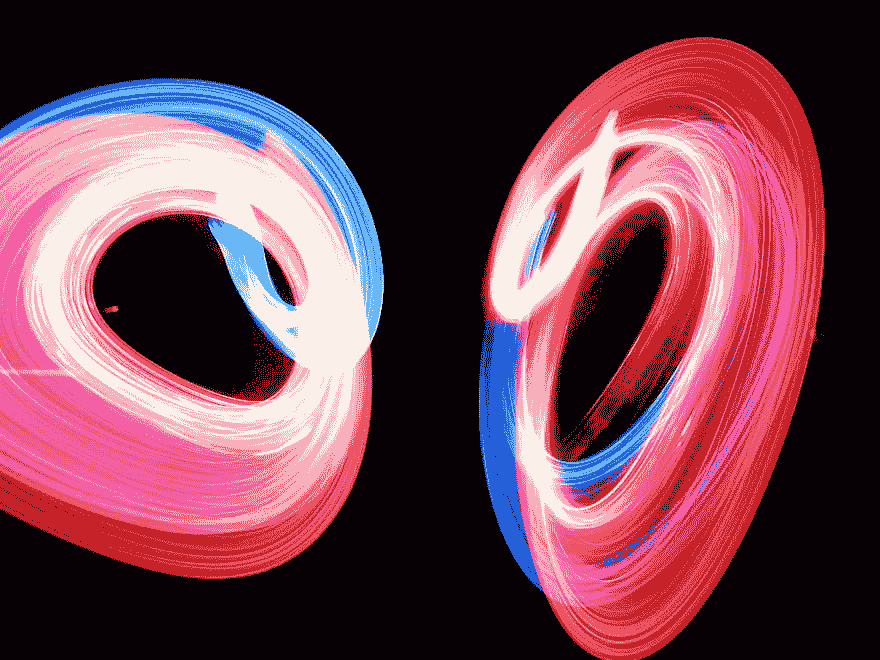

# Python 中的列表和循环

> 原文：<https://dev.to/codetips/lists-and-loops-in-python-52n6>

[](https://res.cloudinary.com/practicaldev/image/fetch/s--A-6NTBhr--/c_limit%2Cf_auto%2Cfl_progressive%2Cq_auto%2Cw_880/https://www.codetips.co.uk/conteimg/2019/06/loops.jpg)

在阅读本文之前，你应该已经了解了[数组](https://www.codetips.co.uk/beginner/what-are-arrays/)、[类型](https://www.codetips.co.uk/beginner/what-is-a-data-type/)和[循环](https://www.codetips.co.uk/beginner/what-are-loops/)。

正如您将了解到的，数组通常是不可变的，可以保存信息(通常是一种特定的类型)并将它们与索引值一起存储。

Python 在典型的数组类型之上添加了另一层，通过允许任何类型的信息以及使它们可变，这使得它们更容易使用。这个结构被称为列表。

在“[用 Python 编写你的第一个程序](https://www.codetips.co.uk/languages/python/writing-your-first-python-program/)”中，我们编写了一个输出你的姓名、年龄和职业的程序。在这篇文章中，我们将扩展这个程序，让它打印出你所有的爱好。

*注意:在“[用 Python 写你的第一个程序](https://www.codetips.co.uk/languages/python/writing-your-first-python-program/)”结束时，你还被要求完成三个挑战。我们假设你已经完成了。如果你还没有，这篇文章向你展示了解决方案，所以请确保你至少尝试一下。*

完成所有三个挑战后，您应该会得到类似于下面的结果:

```
#!/bin/env python

#Start of our code

name = "Jordan"
age = 31
profession = "Developer"
favoriteAnimal = "Penguin"

print("Welcome to my first Python programme. My name is {0}. I am {1} years old. I work as a {2}. My favourite animal is a {3}".format(
    name,
    age,
    profession,
    favoriteAnimal,
    )
)

# End of our code 
```

<svg width="20px" height="20px" viewBox="0 0 24 24" class="highlight-action crayons-icon highlight-action--fullscreen-on"><title>Enter fullscreen mode</title></svg> <svg width="20px" height="20px" viewBox="0 0 24 24" class="highlight-action crayons-icon highlight-action--fullscreen-off"><title>Exit fullscreen mode</title></svg>

我们现在想添加另一条信息；我们的爱好是什么。

我有三个主要爱好，所以显而易见的是创建三个新变量，并像我们之前做的那样将它们打印到终端:

```
#!/bin/env python

# Start of our code

name = "Jordan"
age = 31
profession = "Developer"
favoriteAnimal = "Penguin"

hobby1 := "Coding"
hobby2 := "Bass Guitar"
hobby3 := "Hiking"

print("Welcome to my first Python programme. My name is {0}. I am {1} years old. I work as a {2}. My favourite animal is a {3}".format(
    name,
    age,
    profession,
    favoriteAnimal,
    )
)

print("My hobbies are: {0}, {1}, {2}".format(hobby1, hobby2, hobby3))

# End of our code 
```

<svg width="20px" height="20px" viewBox="0 0 24 24" class="highlight-action crayons-icon highlight-action--fullscreen-on"><title>Enter fullscreen mode</title></svg> <svg width="20px" height="20px" viewBox="0 0 24 24" class="highlight-action crayons-icon highlight-action--fullscreen-off"><title>Exit fullscreen mode</title></svg>

我们现在添加了第二个`print`语句，将我们的爱好打印到屏幕上。很漂亮吧？实际上，没有。

为了三个爱好这样做可能看起来可以接受，但是如果你有十个爱好呢？

```
#!/bin/env python

# Start of our code

name = "Jordan"
age = 31
profession = "Developer"
favoriteAnimal = "Penguin"

hobby1 = "example1"
hobby2 = "example2"
hobby3 = "example3"
hobby4 = "example4"
hobby5 = "example5"
hobby6 = "example6"
hobby7 = "example7"
hobby8 = "example8"
hobby9 = "example9"
hobby10 = "example10"

print("Welcome to my first Python programme. My name is {0}. I am {1} years old. I work as a {2}. My favourite animal is a {3}".format(
    name,
    age,
    profession,
    favoriteAnimal,
    )
)

print("My hobbies are: {0}, {1}, {2}, {3}, {4}, {5}, {6}, {7}, {8}, {9}".format(
    hobby1,
    hobby2,
    hobby3,
    hobby4,
    hobby5,
    hobby6,
    hobby7,
    hobby8,
    hobby9,
    hobby10
    )
)

# End of our code 
```

<svg width="20px" height="20px" viewBox="0 0 24 24" class="highlight-action crayons-icon highlight-action--fullscreen-on"><title>Enter fullscreen mode</title></svg> <svg width="20px" height="20px" viewBox="0 0 24 24" class="highlight-action crayons-icon highlight-action--fullscreen-off"><title>Exit fullscreen mode</title></svg>

它开始看起来有点乱，不是吗？如果我们有 100 个爱好会怎么样？

一定有更好的办法！谢天谢地，有。名单！

在 Python 中，列表可以包含任何类型，只需使用`variable = []`创建一个空列表即可声明。

```
stringList = []
intList = []
boolList = []
multiTypeList = [] 
```

<svg width="20px" height="20px" viewBox="0 0 24 24" class="highlight-action crayons-icon highlight-action--fullscreen-on"><title>Enter fullscreen mode</title></svg> <svg width="20px" height="20px" viewBox="0 0 24 24" class="highlight-action crayons-icon highlight-action--fullscreen-off"><title>Exit fullscreen mode</title></svg>

我们可以通过简单地在列表声明中添加条目来立即将条目添加到列表中。

```
stringList = ["string1", "string2"]
intList = [1, 2]
boolList = [True, False]
multiTypeList = ["string", 1, 3.14, True] 
```

<svg width="20px" height="20px" viewBox="0 0 24 24" class="highlight-action crayons-icon highlight-action--fullscreen-on"><title>Enter fullscreen mode</title></svg> <svg width="20px" height="20px" viewBox="0 0 24 24" class="highlight-action crayons-icon highlight-action--fullscreen-off"><title>Exit fullscreen mode</title></svg>

在我们继续之前，请尝试完成以下挑战:

*   取十个爱好变量，并将它们转换成一个爱好数组。

*   修改`print`语句，打印出新的列表，而不是十个变量。

完成了吗？非常好。您应该得到类似于下面的结果:

```
#!/bin/env python

# Start of our code
name = "Jordan"
age = 31
profession = "Developer"
favoriteAnimal = "Penguin"

hobbies = [
    "example1",
    "example2",
    "example3",
    "example4",
    "example5",
    "example6",
    "example7",
    "example8",
    "example9",
    "example10",
]

print("Welcome to my first Python programme. My name is {0}. I am {1} years old. I work as a {2}. My Favorite animal is a {3}.".format(
    name,
    age,
    profession,
    favoriteAnimal
    )
)

print("My hobbies are: {0}".format(hobbies))
# End of our code 
```

<svg width="20px" height="20px" viewBox="0 0 24 24" class="highlight-action crayons-icon highlight-action--fullscreen-on"><title>Enter fullscreen mode</title></svg> <svg width="20px" height="20px" viewBox="0 0 24 24" class="highlight-action crayons-icon highlight-action--fullscreen-off"><title>Exit fullscreen mode</title></svg>

现在运行您的应用程序(`python main.py`)应该会得到以下输出:

```
Welcome to my first Go programme. My name is Jordan. I am 31 years old. I work as a Developer. My favorite animal is a Penguin.
My hobbies are: [example1 example2 example3 example4 example5 example6 example7 example8 example9 example10] 
```

<svg width="20px" height="20px" viewBox="0 0 24 24" class="highlight-action crayons-icon highlight-action--fullscreen-on"><title>Enter fullscreen mode</title></svg> <svg width="20px" height="20px" viewBox="0 0 24 24" class="highlight-action crayons-icon highlight-action--fullscreen-off"><title>Exit fullscreen mode</title></svg>

现在我们有了自己的爱好列表，我们可以轻松地添加和删除项目，而不必创建新的变量或修改`print`语句。

所以我们的代码现在看起来漂亮整洁，但是我仍然不太喜欢我们输出到终端的内容；我们已经有了那些难看的方括号([])，如果我们添加一个由多个单词组成的新爱好会怎么样呢？

```
hobbies = ["example1", "mountain biking", "example2", "example3"] 
```

<svg width="20px" height="20px" viewBox="0 0 24 24" class="highlight-action crayons-icon highlight-action--fullscreen-on"><title>Enter fullscreen mode</title></svg> <svg width="20px" height="20px" viewBox="0 0 24 24" class="highlight-action crayons-icon highlight-action--fullscreen-off"><title>Exit fullscreen mode</title></svg>

其中会打印:

```
My hobbies are: [example1 mountain biking example2 example3] 
```

<svg width="20px" height="20px" viewBox="0 0 24 24" class="highlight-action crayons-icon highlight-action--fullscreen-on"><title>Enter fullscreen mode</title></svg> <svg width="20px" height="20px" viewBox="0 0 24 24" class="highlight-action crayons-icon highlight-action--fullscreen-off"><title>Exit fullscreen mode</title></svg>

是“山地车”还是“山地车”“自行车”？

那么我们必须回到分离变量吗？谢天谢地没有！我们可以用一个循环！

在我们改变程序之前，让我们举一个简单的循环例子来理解这个概念。

如果我们想打印数字 1-10，我们可以写 10 个不同的`print`语句，这是非常手工的，或者我们可以写一个循环来完成。在以下示例中:

1.  init 语句。在循环的第一次迭代之前执行，我们定义了一个新的变量(I)并将值 1 赋给它(`i = 1`)。

2.  条件表达式。在循环的每次迭代之前执行，它检查表达式(I < = 10-I 是否小于或等于 10？)是真的。如果是，它将运行另一个迭代。

3.  然后，我们在每次迭代中打印 I 的值，然后简单地将 I 的值增加 1(例如，如果 I 的值是 3，运行 i+=1 将增加它，现在它将是 4)

```
i = 1
while i <= 10:
    print(i)
    i+=1 
```

<svg width="20px" height="20px" viewBox="0 0 24 24" class="highlight-action crayons-icon highlight-action--fullscreen-on"><title>Enter fullscreen mode</title></svg> <svg width="20px" height="20px" viewBox="0 0 24 24" class="highlight-action crayons-icon highlight-action--fullscreen-off"><title>Exit fullscreen mode</title></svg>

我们现在可以使用这种新技术来打印我们的爱好。在以下示例中:

1.  我们添加了一个新的`print`语句，打印我们的爱好数量。`len`方法简单地返回列表的长度；在这个例子中是 4。

2.  我们定义 init 语句，并将 I 的值设置为 0。我们将它设置为 0 而不是 1，因为 Python 列表索引从 0 开始。

3.  我们定义我们的条件表达式，将条件设置为`i < len(hobbies)`(I 是否小于爱好长度)。我们使用“小于”(`<`)而不是“小于或等于”(`<=`)，因为 Python 列表索引从 0 开始。

4.  我们定义了 post 语句，并像前面的例子一样增加 I 的计数。

5.  然后我们打印出爱好的每个元素。

```
#!/bin/env python

# Start of our code

name = "Jordan"
age = 31
profession = "Developer"
favoriteAnimal = "Penguin"

hobbies = ["example1", "mountain biking", "example2", "example3"]

print("Welcome to my first Python programme. My name is {0}. I am {1} years old. I work as a {2}. My favourite animal is a {3}".format(
    name,
    age,
    profession,
    favoriteAnimal,
    )
)

print("I have {0} hobbies, and they are: ".format(len(hobbies)))

i = 0
while i < len(hobbies):
    print(hobbies[i])
    i=+1

# End of our code 
```

<svg width="20px" height="20px" viewBox="0 0 24 24" class="highlight-action crayons-icon highlight-action--fullscreen-on"><title>Enter fullscreen mode</title></svg> <svg width="20px" height="20px" viewBox="0 0 24 24" class="highlight-action crayons-icon highlight-action--fullscreen-off"><title>Exit fullscreen mode</title></svg>

以下是我们的列表索引和值之间的链接的图示:

```
|     0    |        1        |     2    |    3     |
*----------*-----------------*----------*----------*
| example1 | mountain biking | example2 | example3 | 
```

<svg width="20px" height="20px" viewBox="0 0 24 24" class="highlight-action crayons-icon highlight-action--fullscreen-on"><title>Enter fullscreen mode</title></svg> <svg width="20px" height="20px" viewBox="0 0 24 24" class="highlight-action crayons-icon highlight-action--fullscreen-off"><title>Exit fullscreen mode</title></svg>

我们知道这是一个很大的信息量，所以如果有任何不清楚的地方，请随时联系我们。

* * *

[CodeTips](https://www.codetips.co.uk) 致力于帮助零经验或很少经验的初学者学习编码。

我们确实会交叉发布到其他网站以获得更广泛的受众，但是为什么不订阅我们的时事通讯并把最新的文章直接发到你的邮箱里呢？

此内容的原始来源是[代码提示](https://www.codetips.co.uk)。原始内容保持最新，但其他来源可能不是最新版本。