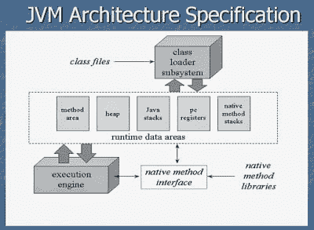
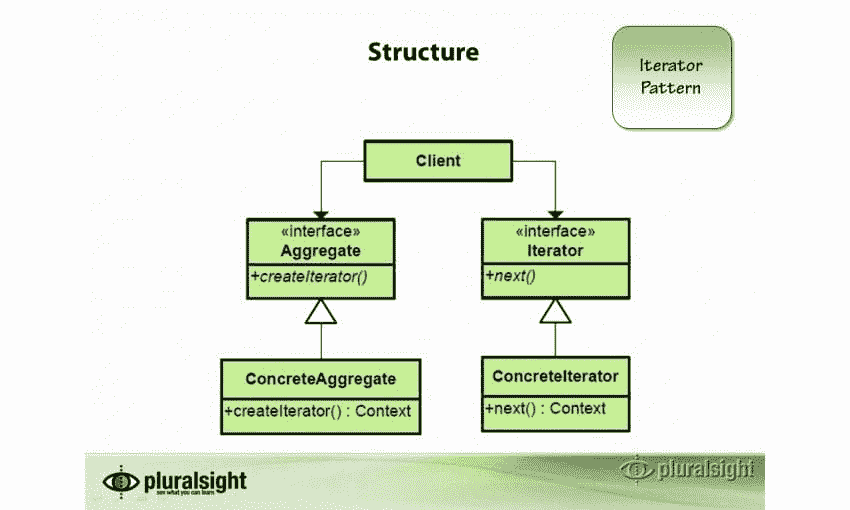
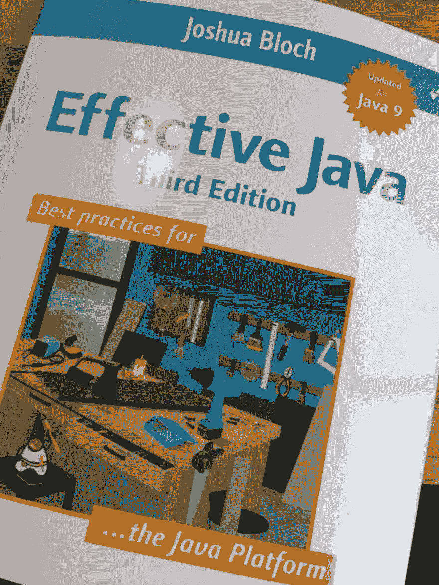
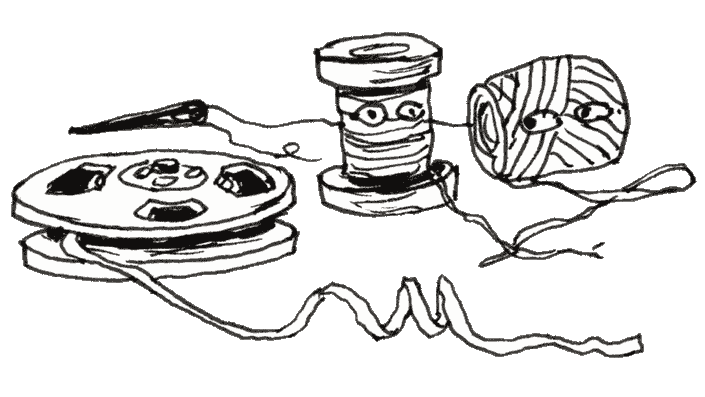
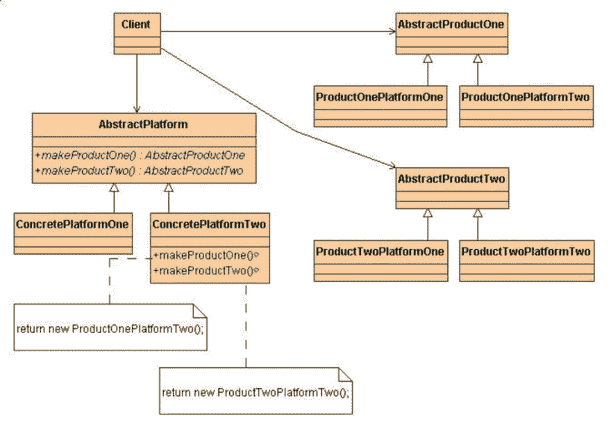
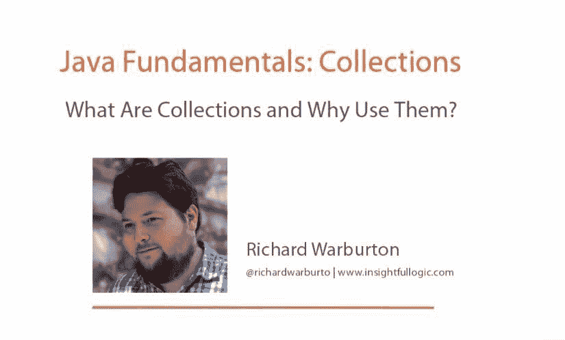
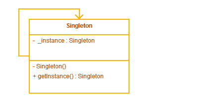
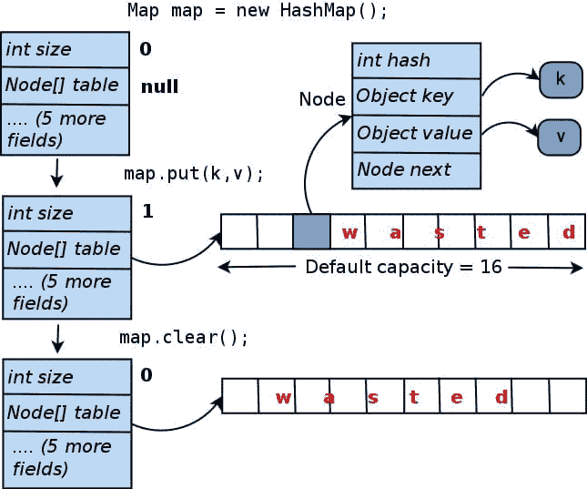
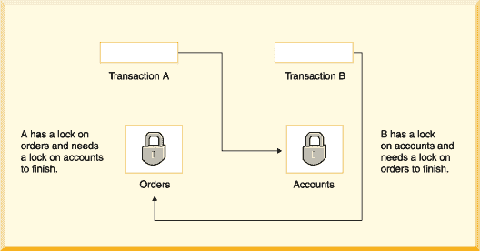
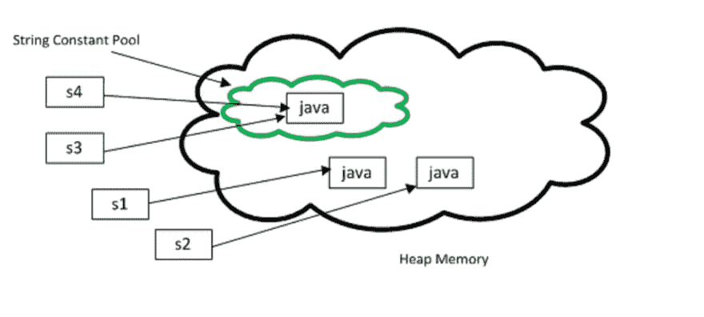

# 面向投资银行资深专业人士的 20 多个核心 Java 面试问题

> 原文：<https://dev.to/javinpaul/20-core-java-interview-questions-for-experienced-professionals-from-investment-banks-53b7>

*披露:这篇文章包括附属链接；如果您从本文提供的不同链接购买产品或服务，我可能会收到报酬。*

有许多 Java 开发人员试图在巴克莱、瑞士瑞信银行、花旗银行等投资银行中担任 Java 开发职位，但他们中的许多人不知道在那里会遇到什么样的面试问题。

在这篇文章中，我将分享一些从投资银行到拥有 3 年以上经验的 Java 程序员最常问的核心 Java 问题。

披露:这个帖子包括附属链接；如果您从本文提供的不同链接购买产品或服务，我可能会收到报酬。

是的，这些问题不是给[初学者](http://www.java67.com/2018/03/20-Java-Interview-Questions-Answers-freshers-1-2-3-YearsExperienced-Programmers.html)或 [1 到 2 年 Java 经验的专业人士准备的，因为银行通常不会通过公开面试来聘用他们，他们大多是作为毕业实习生加入的，但他们也可以通过浏览问题并理解答案及其背后的概念来学到很多东西。](https://javarevisited.blogspot.com/2018/07/top-30-java-phone-interview-questions.html#axzz5N70xIF15)

**不能保证你会得到这些问题**，事实上，最有可能的是你不会，但这会让你对你能期待什么样的问题有所了解。你准备得越多，你的面试就会越好。

如果你认为这 21 个核心 java 问题还不够，你还需要看看这些额外的 [**40 个 Java 问题**](http://www.java67.com/2015/03/top-40-core-java-interview-questions-answers-telephonic-round.html) 用于电话面试，以及过去 5 年的这些 [**200 多个 Java 问题**](http://bit.ly/2CupaSL) 。

一旦你做到了这些，你就会更有信心参加任何 Java 面试，无论是电话面试还是面对面的面试。

## 投行常见核心 Java 面试问题

无论如何，不浪费你更多的时间，让我们深入一些银行常见的 Java 面试问题，这些问题是我从一些出现在这些银行面试中的朋友和同事那里收集来的。

**问题 1。重写 hashCode()方法对性能没有任何影响吗？** ( [回答](http://java67.blogspot.com/2013/04/example-of-overriding-equals-hashcode-compareTo-java-method.html) )\
这是一个好问题，向所有人开放，据我所知，一个糟糕的 hash 代码函数会导致 HashMap 中的[频繁碰撞，最终会增加将对象添加到 HashMap 中的时间。](http://javarevisited.blogspot.sg/2016/01/how-does-java-hashmap-or-linkedhahsmap-handles.html)

从[开始，Java 8](https://javarevisited.blogspot.com/2018/08/top-5-java-8-courses-to-learn-online.html) 通过碰撞将不会像在早期版本中那样影响性能，因为在一个阈值之后,[链表](http://javarevisited.blogspot.sg/2017/07/top-10-linked-list-coding-questions-and.html#axzz4xXS86IVo)将被一个[二叉树](http://www.java67.com/2016/08/binary-tree-inorder-traversal-in-java.html)所取代，与链表的 O(n)相比，这将在最坏的情况下给你 O(logN) 的性能。

**问题 String 内部的 substring()是如何工作的？** ( [答](http://javarevisited.blogspot.sg/2011/10/how-substring-in-java-works.html))

另一个不错的 Java 面试问题，我认为答案并不充分，但这里是“ *Substring 通过取原字符串的一部分“*”在源字符串之外创建一个新的对象。

问这个问题主要是想看看开发人员是否熟悉子字符串可能造成的[内存泄漏](https://pluralsight.pxf.io/c/1193463/424552/7490?u=https%3A%2F%2Fwww.pluralsight.com%2Fcourses%2Fjava-understanding-solving-memory-problems)的风险。

在 Java 1.7 之前，substring 保存原始字符数组的引用，这意味着即使是 5 个字符长的子字符串，*也可以通过保存强引用来防止 1GB 字符数组进行垃圾收集*。

这个问题在 Java 1.7 中得到了修复，其中不再引用原始的字符数组，但是这种改变也使得创建子字符串在时间上有点昂贵。早先它在 O(1)的范围内，在 Java 7 以后的最坏情况下可能是 O(n)。

顺便说一下，如果你想学习更多关于 Java 内存管理的知识，我推荐你去看看 Pluralsight 网站上凯文·琼斯的[了解 Java 虚拟机:内存管理](https://pluralsight.pxf.io/c/1193463/424552/7490?u=https%3A%2F%2Fwww.pluralsight.com%2Fcourses%2Funderstanding-java-vm-memory-management)课程。

[](https://pluralsight.pxf.io/c/1193463/424552/7490?u=https%3A%2F%2Fwww.pluralsight.com%2Fcourses%2Funderstanding-java-vm-memory-management)

问题 3:在 Java 中，不可变对象的所有属性都需要是 final 吗？ ( [答](http://javarevisited.blogspot.com/2013/03/how-to-create-immutable-class-object-java-example-tutorial.html))

不需要，正如链接的回答文章中所说，你可以通过*使一个成员成为非 final 但私有的，并且除了在构造函数中不修改它们，来实现同样的功能。*

不要为它们提供 setter 方法，如果它是一个可变对象，那么永远不要泄漏对该成员的任何引用。

记住[使一个引用变量成为 final](https://javarevisited.blogspot.com/2016/09/21-java-final-modifier-keyword-interview-questions-answers.html) ，只是确保它不会被重新分配一个不同的值，但是你仍然可以改变引用变量指向的对象的单个属性。

这是关键点之一，面试官喜欢听到候选人的声音。如果你想了解更多关于 Java 中 final 变量的知识，我推荐你加入 Udemy 上的完整 Java MasterClass ，这是最好的实践课程之一。

**问题 4:多线程环境下可以使用 HashMap 吗？会有什么问题呢？get()方法什么时候去无限循环？** ( [答](http://java67.blogspot.com/2013/06/how-get-method-of-hashmap-or-hashtable-works-internally.html) )\
答:嗯，没什么不对，就看你怎么用了。例如，如果你[只通过一个线程初始化一个 HashMap](http://www.java67.com/2016/01/how-to-initialize-hashmap-with-values-in-java.html) ,然后所有的线程都从它那里读取数据，那么这就很好了。

一个例子是包含配置属性的**图。**

当至少有一个线程在更新 HashMap 时，即添加、更改或删除任何键-值对时，真正的问题就开始了。

由于 put()操作会导致重新调整大小，进而导致无限循环，这就是为什么要么使用[哈希表](http://javarevisited.blogspot.com/2012/01/java-hashtable-example-tutorial-code.html)要么使用[并发哈希表](http://javarevisited.blogspot.com/2013/02/concurrenthashmap-in-java-example-tutorial-working.html)，后者更好。

**问题 5:你能为 singleton 写一个临界段代码吗？** ( [回答](http://javarevisited.blogspot.sg/2014/05/double-checked-locking-on-singleton-in-java.html) )\
这个核心 Java 问题是另一个常见问题，期望考生使用[双重检查锁定](http://www.java67.com/2015/09/thread-safe-singleton-in-java-using-double-checked-locking-pattern.html)编写 Java singleton。

记得使用一个[可变变量](http://javarevisited.blogspot.sg/2011/06/volatile-keyword-java-example-tutorial.html)来使单例[线程安全](http://www.java67.com/2016/04/why-double-checked-locking-was-broken-before-java5.html)。

下面是使用[双重检查锁定习语](https://javarevisited.blogspot.com/2014/05/double-checked-locking-on-singleton-in-java.html) :
的线程安全单例模式的关键部分的代码

```
public class Singleton {

private static volatile Singleton _instance;

/** * Double checked locking code on Singleton\
    * @return Singelton instance\
*/

public static Singleton getInstance() {

if (_instance == null) {

synchronized (Singleton.class) {

if (_instance == null) {

_instance = new Singleton();

}

}

}

return _instance; }

} 
```

<svg width="20px" height="20px" viewBox="0 0 24 24" class="highlight-action crayons-icon highlight-action--fullscreen-on"><title>Enter fullscreen mode</title></svg> <svg width="20px" height="20px" viewBox="0 0 24 24" class="highlight-action crayons-icon highlight-action--fullscreen-off"><title>Exit fullscreen mode</title></svg>

同样，了解经典的设计模式，如 Singleton、Factory、Decorator 等也很有好处。如果你对此感兴趣，那么 Java 中的这个 [**设计模式**](https://click.linksynergy.com/deeplink?id=JVFxdTr9V80&mid=39197&murl=https%3A%2F%2Fwww.udemy.com%2Fcourse%2Fdesign-patterns-java%2F) 就是一个很好的例子。

[](https://pluralsight.pxf.io/c/1193463/424552/7490?u=https%3A%2F%2Fwww.pluralsight.com%2Fcourses%2Fpatterns-library)

问题 6:在编写存储过程或从 java 访问存储过程时，如何处理错误情况？ ( [答](http://javarevisited.blogspot.com/2013/04/spring-framework-tutorial-call-stored-procedures-from-java.html))

这是 Java 面试中最难回答的问题之一，我的朋友不知道答案，所以他不介意告诉我。

我的观点是，如果某个操作失败，存储过程应该返回一个错误代码，但是如果存储过程本身失败，那么捕获 [SQLException](http://www.java67.com/2016/06/javasqlsqlexception-no-suitable-driver-found-jdbc-mysql-localhost-3306.html) 是唯一的选择。

[**有效 Java 第三版**](https://www.amazon.com/Effective-Java-3rd-Joshua-Bloch/dp/0134685997/?tag=javamysqlanta-20) 也有一些处理 Java 中错误和异常的好建议，值得一读。

[](https://www.amazon.com/Effective-Java-3rd-Joshua-Bloch/dp/0134685997/?tag=javamysqlanta-20)

**问题 Executor.submit()和 Executer.execute()方法有什么区别？** ( [答](http://java67.blogspot.com/2012/08/5-thread-interview-questions-answers-in.html))

这个 Java 面试问题来自我的列表[50 大 Java 多线程问题答案](http://javarevisited.blogspot.sg/2014/07/top-50-java-multithreading-interview-questions-answers.html#axzz4jaJmaqbE)，它变得日益流行，因为对具有良好并发技能的 Java 开发人员的巨大需求。

这个 Java 面试问题的答案是，前者返回一个对象 [Future](http://javarevisited.blogspot.sg/2015/06/how-to-use-callable-and-future-in-java.html#axzz4tUeeQOAU) ，该对象可用于从一个工作线程中查找结果

在观察异常处理时有所不同。如果您的任务抛出一个异常，并且是在执行时提交的，那么这个异常将转到未捕获的异常处理程序(如果您没有显式地提供一个异常处理程序，那么默认的异常处理程序将把堆栈跟踪打印到 System.err)。

如果用`submit()`方法提交的任务有任何抛出的异常，[检查异常](http://javarevisited.blogspot.sg/2011/12/checked-vs-unchecked-exception-in-java.html)与否，是任务返回状态的一部分。

对于使用 submitting 提交并以异常终止的任务，Future.get()将重新抛出这个异常，该异常包装在 ExecutionException 中。

如果您想了解更多关于未来、可调用和异步计算的知识，并把您的 Java 并发技能提升到一个新的水平，我建议您查看 Java 冠军 Heinz Kabutz 的捆绑包 中的 [**Java 并发实践课程。**](https://learning.javaspecialists.eu/courses/concurrency-in-practice-bundle?affcode=92815_johrd7r8)

[](https://learning.javaspecialists.eu/courses/concurrency-in-practice-bundle?affcode=92815_johrd7r8)

这是一门高级课程，基于经典的 [**Java 并发实践**](http://www.amazon.com/dp/0321349601/?tag=javamysqlanta-20) 一书，作者正是 [Brian Goetz](https://medium.com/@briangoetz) ，该书被认为是 Java 开发人员的圣经。这门课程绝对值得你花时间和金钱。由于并发性是一个艰难而棘手的话题，所以将本书和课程结合起来是学习它的最佳方式。

**问题 8:工厂和抽象工厂模式有什么区别？** ( [答案](http://javarevisited.blogspot.sg/2013/01/difference-between-factory-and-abstract-factory-design-pattern-java.html) )\
答案:抽象工厂提供了多一层抽象。考虑不同的工厂，每个工厂从一个抽象工厂扩展而来，负责根据工厂的类型创建不同层次的对象。例如 AutomobileFactory、UserFactory、RoleFactory 等扩展的 AbstractFactory。每个单独的工厂将负责创建该类型的对象。

如果你想学习更多关于抽象工厂设计模式的知识，那么我建议你去 Java 课程中的 [Design Pattern，它提供了一个很好的、真实的例子来更好地理解模式。](https://click.linksynergy.com/fs-bin/click?id=JVFxdTr9V80&subid=0&offerid=323058.1&type=10&tmpid=14538&RD_PARM1=https%3A%2F%2Fwww.udemy.com%2Fdesign-patterns-java%2F)

以下是工厂和抽象工厂模式的 UML 图:

[](https://click.linksynergy.com/fs-bin/click?id=JVFxdTr9V80&subid=0&offerid=323058.1&type=10&tmpid=14538&RD_PARM1=https%3A%2F%2Fwww.udemy.com%2Fdesign-patterns-java%2F)

如果你需要更多的选择，那么你也可以看看我列出的[5 大 Java 设计模式](https://javarevisited.blogspot.com/2018/02/top-5-java-design-pattern-courses-for-developers.html)课程。

**问题 9:什么是独生子女？是让整个方法同步好还是只让临界段同步好？** ( [回答](http://javarevisited.blogspot.com/2012/12/how-to-create-thread-safe-singleton-in-java-example.html))\
Java 中的 Singleton 是整个 Java 应用中只有一个实例的类，比如`java.lang.Runtime`就是一个 Singleton 类。

在 Java 4 之前创建 Singleton 是很棘手的，但是一旦 Java 5 引入了 [Enum](https://javarevisited.blogspot.com/2011/08/enum-in-java-example-tutorial.html) 就很容易了。

你可以看我的文章[如何在 Java 中创建线程安全的 Singleton](http://javarevisited.blogspot.sg/2012/12/how-to-create-thread-safe-singleton-in-java-example.html)来了解更多关于使用枚举和双重检查锁定编写 Singleton 的细节，这是这个 Java 面试问题的目的。

**问题 10:你能在 Java 4 和 Java 5 中编写代码来迭代 HashMap 吗？** ( [答](http://java67.blogspot.com/2014/05/3-examples-to-loop-map-in-java-foreach.html) )\
棘手的一个，但他还是设法用 while 和 a for 循环写了。实际上，在 Java 中有四种方法来迭代任何 Map，一种是使用 [keySet()](http://www.java67.com/2016/05/keyset-vs-entryset-vs-values-in-java-map-example.html) 并迭代一个键，然后使用 [get()](http://www.java67.com/2013/06/how-get-method-of-hashmap-or-hashtable-works-internally.html) 方法来检索值，这有点昂贵。

第二种方法涉及使用 [entrySet()](http://www.java67.com/2013/08/best-way-to-iterate-over-each-entry-in.html) 并通过对每个循环使用[或使用 Iterator.hasNext()方法对它们进行迭代。](https://javarevisited.blogspot.com/2015/09/java-8-foreach-loop-example.html#axzz5HKqzQNyN)

这是一个更好的方法，因为在迭代期间键和值对象都是可用的，并且您不需要调用 [get()](http://javarevisited.blogspot.sg/2011/02/how-hashmap-works-in-java.html) 方法来检索值，这可以在一个桶中有一个巨大的[链表](http://www.java67.com/2017/06/5-difference-between-array-and-linked.html)的情况下提供 O(n)性能。

你可以进一步查看我的帖子 [4 种在 Java 中迭代 Map 的方法](http://javarevisited.blogspot.com/2011/12/how-to-traverse-or-loop-hashmap-in-java.html)以获得详细的解释和代码示例。

**问题 11:什么时候重写 hashCode()和 equals()？** ( [回答](http://javarevisited.blogspot.com/2013/08/10-equals-and-hashcode-interview.html) )\
在任何必要的时候，特别是当你想要基于业务逻辑而不是对象相等性来进行相等性检查的时候，例如，如果两个雇员对象具有相同的`emp_id`，那么它们就是相等的，尽管事实上它们是由代码的不同部分创建的两个不同的对象。

同样，[覆盖](http://www.java67.com/2013/04/example-of-overriding-equals-hashcode-compareTo-java-method.html)这两个方法是必须的，如果你想在[散列表](http://www.java67.com/2017/08/top-10-java-hashmap-interview-questions.html)中使用它们作为键的话。

现在，作为 Java 中 equals-hashcode 契约的一部分，当您覆盖 equals 时，您也必须覆盖 hashcode，否则，您的对象将不会破坏类的不变量，例如 Set、Map，它们依赖于 [equals()](http://javarevisited.blogspot.sg/2013/08/10-equals-and-hashcode-interview.html) 方法才能正常工作。

你也可以查看我的帖子[关于 Java 中 equals 的 5 个技巧](http://javarevisited.blogspot.com/2011/02/how-to-write-equals-method-in-java.html)来理解在处理这两种方法时可能出现的微妙问题。

**问题 12:如果不重写 hashCode()方法会出现什么问题？** ( [答](http://java67.blogspot.sg/2013/04/example-of-overriding-equals-hashcode-compareTo-java-method.html) )\
如果不重写 equals 方法，那么 equals 和 hashcode 之间的契约就不起作用，根据这个契约，两个被 equals()相等的对象必然有**相同的 hashcode** 。

在这种情况下，另一个对象可能返回不同的 hashCode，并将存储在那个位置，这破坏了 [HashMap 类](http://www.java67.com/2013/02/10-examples-of-hashmap-in-java-programming-tutorial.html)的不变性，因为它们不允许重复的键。

当您使用 put()方法添加对象时，它会遍历所有 Map。存储桶位置中存在条目对象，并更新先前映射的值(如果映射已经包含该键)。如果 hashcode 没有被覆盖，这将不起作用。

如果你想了解更多关于 equals()和 hashCode()在 Map 和 Set 这样的 Java 集合中的作用，我建议你去读一下 Richard Warburton 的关于 Pluralsight 的 [Java 基础:集合](https://pluralsight.pxf.io/c/1193463/424552/7490?u=https%3A%2F%2Fwww.pluralsight.com%2Fcourses%2Fjava-fundamentals-collections)课程

[](https://pluralsight.pxf.io/c/1193463/424552/7490?u=https%3A%2F%2Fwww.pluralsight.com%2Fcourses%2Fjava-fundamentals-collections)

**问题 13:同步 getInstance()方法的临界段好还是同步整个 getInstance()方法好？** ( [答案](http://javarevisited.blogspot.com/2014/05/double-checked-locking-on-singleton-in-java.html) )\
答案只是一个关键部分，因为如果我们锁定整个方法，那么每次有人调用这个方法时，它都必须等待，即使我们没有创建对象。

换句话说，[同步](http://javarevisited.blogspot.sg/2011/04/synchronization-in-java-synchronized.html#axzz4sZOoYUxv)只在你创建一个对象时需要，它只发生一次。

一旦创建了对象，就不需要任何同步。事实上，就性能而言，这是非常糟糕的编码，因为同步方法会将性能降低 10 到 20 倍。

这里是[单例设计模式](https://javarevisited.blogspot.com/2011/03/10-interview-questions-on-singleton.html)的 UML 图:

[](http://bit.ly/2xZnIDC)

顺便说一下，在 Java 中创建线程安全的 singleton 有几种方法，包括 [Enum](http://javarevisited.blogspot.sg/2012/07/why-enum-singleton-are-better-in-java.html#axzz4tzMEHSJw) ，你也可以在这个问题或任何后续中提到它。

如果你想了解更多，你也可以查看 [**学习 Java 中的创造性设计模式**](http://bit.ly/2xZnIDC)——Udemy 的#免费课程。

**问题 14:在 HashMap 上进行 get()操作时，equals()和 hashCode()方法出现在图片中的什么位置？** ( [回答](https://javarevisited.blogspot.com/2017/08/top-10-java-concurrenthashmap-interview.html#axzz5ITbIGRsU) )\
这个核心的 Java 面试问题是之前 Java 问题的后续，应试者应该知道，一旦你提到 hashCode，人们最有可能会问，它们是如何在 HashMap 中使用的。

当您提供一个 key 对象时，首先调用它的 hashcode 方法来计算 bucket 位置。因为一个桶可能包含不止一个条目作为链表，所以每个条目都映射。通过使用 equals()方法来评估 Entry 对象，以查看它们是否包含实际的 key 对象。

我强烈建议你阅读我的帖子，[**HashMap 如何在 Java 中工作**](http://javarevisited.blogspot.sg/2011/02/how-hashmap-works-in-java.html) ，这是另一个采访的故事，以了解更多关于这个主题的信息。

[](http://bit.ly/2AHuthF)

**问题 15:Java 中如何避免死锁？** ( [回答](http://javarevisited.blogspot.sg/2015/10/133-java-interview-questions-answers-from-last-5-years.html) )\
如果你知道，当两个线程试图访问彼此持有的两个资源时，就会发生死锁，但要发生死锁，需要满足以下四个条件:

1.  互斥\必须至少有一个进程处于不可共享模式。
2.  保持并等待\必须有一个进程保持一个资源并等待另一个资源。
3.  无抢占\资源不能被抢占。
4.  循环等待\必须存在一组进程

您可以通过打破*循环等待条件*来避免死锁。为了做到这一点，您可以在代码中做出安排，将**命令**强加到锁的获取和释放上。

如果以一致的顺序获取锁，并以相反的顺序释放锁，就不会出现一个线程持有另一个线程获取的锁的情况，反之亦然。

可以进一步看我的帖子， [**如何避免 Java 中的死锁**](https://javarevisited.blogspot.com/2018/08/how-to-avoid-deadlock-in-java-threads.html) 中的代码示例和更详细的解释。

我还推荐 Udemy 上 Michael Pogrebinsky 的 [Java 多线程、并发&性能优化](https://click.linksynergy.com/deeplink?id=JVFxdTr9V80&mid=39197&murl=https%3A%2F%2Fwww.udemy.com%2Fcourse%2Fjava-multithreading-concurrency-performance-optimization%2F)，以便 Java 开发人员更好地理解并发模式。

[](https://click.linksynergy.com/deeplink?id=JVFxdTr9V80&mid=39197&murl=https%3A%2F%2Fwww.udemy.com%2Fcourse%2Fjava-multithreading-concurrency-performance-optimization%2F)

**问题 16:创建 String as new()和 literal 有什么区别？** ( [答](http://javarevisited.blogspot.com/2012/10/10-java-string-interview-question-answers-top.html) )\
当我们用 new()操作符在 Java 中创建一个 string 对象时，它是在[堆](https://javarevisited.blogspot.com/2011/05/java-heap-space-memory-size-jvm.html#axzz5SDsAfcC8)中创建的，不会添加到 String 池中，而用[文字](http://www.java67.com/2014/08/difference-between-string-literal-and-new-String-object-Java.html)创建的 String 是在 String 池本身中创建的，它存在于堆的 PermGen 区域中。

`String str = new String("Test")`

没有将对象 str 放入字符串池，我们需要调用 [String.intern()](https://javarevisited.blogspot.com/2015/12/when-to-use-intern-method-of-string-in-java.html) 方法来显式地将它们放入字符串池。

只有当你创建一个字符串对象作为字符串文字时，例如`String s = "Test"` Java 才会自动把它放入字符串池。

顺便说一下，这里有一个问题，因为我们将参数作为字符串文字“Test”传递，它还将在[字符串池](http://javarevisited.blogspot.sg/2016/07/difference-in-string-pool-between-java6-java7.html)上创建另一个对象作为“Test”。

这是一点，它一直没有被注意到，直到有识之士在[javarestived](http://javarevisited.blogspot.com/)博客上提出来。要了解更多关于字符串文字和字符串对象之间的区别，请参见[这篇](http://java67.blogspot.sg/2014/08/difference-between-string-literal-and-new-String-object-Java.html)文章。

这是一张很好的图片，很好地展示了这种差异:

[](http://javarevisited.blogspot.sg/2013/07/java-string-tutorial-and-examples-beginners-programming.html)

**问题 17:什么是不可变对象？你能写不可变的类吗？** ( [答案](http://javarevisited.blogspot.in/2013/03/how-to-create-immutable-class-object-java-example-tutorial.html) )\
不可变类是 Java 类，其对象一旦创建就不能修改。不可变对象中的任何修改都会产生新的对象，例如 [String 在 Java](http://javarevisited.blogspot.sg/2010/10/why-string-is-immutable-in-java.html) 中是不可变的。

在 Java 中，大多数不可变类也是最终的,以防止子类覆盖方法，这会损害不变性。

您可以通过使成员成为非 final 但[私有的](http://javarevisited.blogspot.sg/2012/10/difference-between-private-protected-public-package-access-java.html)来实现相同的功能，并且除了在构造函数中之外不修改它们。

除了显而易见的，你还需要确保，你不应该暴露一个不可变对象的内部，特别是如果它包含一个可变成员。

类似地，当您从客户端如`java.util.Date`接受可变成员的值时，使用 [clone()方法](http://javarevisited.blogspot.sg/2013/09/how-clone-method-works-in-java.html)为自己保留一个单独的副本，以防止恶意客户端在设置可变引用后修改它的风险。

在返回可变成员的值时需要采取同样的预防措施，返回另一个单独的副本给客户端，不要返回不可变类持有的原始引用。你也可以看我的帖子[如何用 Java](http://javarevisited.blogspot.sg/2013/03/how-to-create-immutable-class-object-java-example-tutorial.html) 创建一个不可变的类，一步一步的指导和代码示例。

**问题 18:给出一个不使用任何分析工具，找出一个方法执行时间的最简单方法？** ( [回答](http://javarevisited.blogspot.com/2012/10/10-java-string-interview-question-answers-top.html) )\
在方法被调用之前和方法返回之后立即读取系统时间。取时间差，它会给出一个方法执行所用的时间。

请记住，如果执行时间过短，可能会显示执行时间为零毫秒。在一个足够大的方法上尝试一下，从某种意义上来说，就是正在进行大量处理的方法

问题 19:要在 HashMap 中使用任何对象作为键，你需要实现哪两个方法？ ( [答](http://javarevisited.blogspot.com/2013/01/difference-between-identityhashmap-and-hashmap-java.html) )\
为了在 HashMap 或 Hashtable 中使用任何对象作为 Key，必须在 Java 中实现 [equals](http://www.java67.com/2012/11/difference-between-operator-and-equals-method-in.html) 和 [hashcode](http://javarevisited.blogspot.sg/2015/01/why-override-equals-hashcode-or-tostring-java.html#axzz55oDxm8vv) 方法。

你也可以阅读[HashMap 如何在 Java 中工作](http://javarevisited.blogspot.sg/2011/02/how-hashmap-works-in-java.html)以获得关于 equals 和 hashcode 方法如何用于从 HashMap 中放入和获取对象的详细解释。

问题 20:你如何阻止客户直接实例化你的具体类？例如，你有一个缓存接口和两个实现类 MemoryCache 和 DiskCache，你如何确保这两个类中没有对象是由客户端使用 new()关键字创建的。在我给出答案之前，我把这个问题留给你练习和思考。我确信你能找到正确的方法来做到这一点，因为这是将类控制在你手中的重要决定之一，从维护的角度来看非常好。

**进一步学习**

1.  [完整的 Java Masterclass](https://click.linksynergy.com/fs-bin/click?id=JVFxdTr9V80&subid=0&offerid=323058.1&type=10&tmpid=14538&RD_PARM1=https%3A%2F%2Fwww.udemy.com%2Fjava-the-complete-java-developer-course%2F)
2.  [Java 基础:Java 语言](https://pluralsight.pxf.io/c/1193463/424552/7490?u=https%3A%2F%2Fwww.pluralsight.com%2Fcourses%2Fjava-fundamentals-language)
3.  [为不耐烦的人准备的核心 Java SE 9](https://www.amazon.com/Core-Java-SE-Impatient-2nd/dp/0134694724?tag=javamysqlanta-20)
4.  [**200+ Java 面试题**](http://bit.ly/2CupaSL)
5.  [王牌 Java 编码面试](https://www.educative.io/track/ace-java-coding-interview?affiliate_id=5073518643380224)

### 期末备注

太好了！！，你坚持到了文章的结尾...祝你的 Java 编程面试好运！这当然不容易，但是通过遵循这些问题，你离实现你的目标更近了一步。

如果你想在我的新帖子上得到通知，请考虑在 Medium 上关注我([**)javinpaul**](https://twitter.com/javinpaul)，并且不要忘记在 [**Twitter**](https://twitter.com/javinpaul) **上关注我！**