# 理解设计模式:使用开发人员的迭代器和中型社交网络！

> 原文：<https://dev.to/carlillo/understanding-design-patterns-iterator-using-dev-to-and-medium-social-networks-3bdd>

有 23 种经典的设计模式，在原书《设计模式:可重用面向对象软件的元素》中有描述。这些模式为软件开发中经常重复出现的特定问题提供解决方案。

在本文中，我将描述什么是**迭代器模式**；以及如何和何时应用它。

## 迭代器模式:基本思想

> 在面向对象编程中，**迭代器模式**是一种设计模式，其中迭代器用于遍历容器并访问容器的元素。迭代器模式将算法从容器中分离出来；在某些情况下，算法必然是特定于容器的，因此无法解耦。—维基百科
> 
> 提供一种方法来顺序访问聚合对象的元素，而不暴露其底层表示。—设计模式:可重用面向对象软件的元素

这种模式的主要特点是，它允许您遍历集合的元素，而不暴露其底层表示(数组、映射、树等)。).因此，这是该模式解决的两个问题:

1.  允许我们在不改变算法实现的情况下改变集合的内部实现。

2.  允许我们添加适用于所有现有集合类型的新算法。

总而言之，迭代器模式对客户端隐藏了集合的内部实现。这个模式的 UML 图如下所示:

[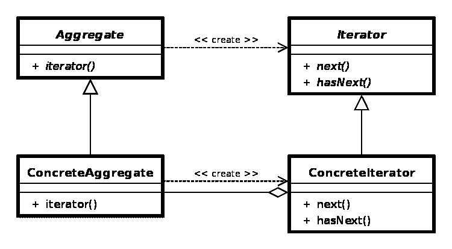](https://res.cloudinary.com/practicaldev/image/fetch/s--69Ka48vl--/c_limit%2Cf_auto%2Cfl_progressive%2Cq_auto%2Cw_880/https://cdn-images-1.medium.com/max/2000/0%2AhHpQUQuhVPSs50_E.png)

迭代器类是一个接口，它定义了不同的操作来遍历集合(next 或 hasNext ),而聚合类将创建迭代器。最后，系统将使用 ConcreteAggregate 和 ConcreteIterator。

1.  您的集合有一个复杂的数据结构，但是您想对客户隐藏它的复杂性。

2.  您需要减少应用程序中遍历代码的重复。

3.  您希望您的代码能够遍历不同的数据结构。

迭代器模式有几个优点，总结如下:

*   由于迭代器使用了**单一责任**和**打开/关闭**的可靠原则，代码**更容易使用、理解和测试**。

*   **单一责任原则**允许我们清理客户端和遍历算法的集合。

*   **开/闭原则**允许实现新类型的集合和迭代器，而不会破坏任何东西。

*   **在同一个集合上并行迭代**，因为每个迭代器对象都包含自己的迭代状态。

*   **干净的代码**因为客户端/上下文不使用复杂的接口，系统更加**灵活和可重用**。

我现在将向您展示如何使用 JavaScript/TypeScript 实现这种模式。在我们的例子中，我虚构了一个问题，其中有一个名为 WordsCollection 的类，它定义了一个单词的列表(items)及其 get 和 add 方法集(getItems 和 addItem)。此类由使用控制结构(如 for 或 forEach)的客户端使用。下面的 UML 图显示了我刚刚描述的场景。

[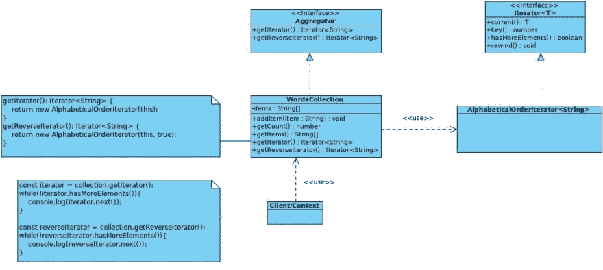](https://res.cloudinary.com/practicaldev/image/fetch/s--XeNZPLKV--/c_limit%2Cf_auto%2Cfl_progressive%2Cq_auto%2Cw_880/https://www.carloscaballero.io/conteimg/2019/06/Iterator-pattern-solution-1.jpg)

单词集合代码关联如下:

[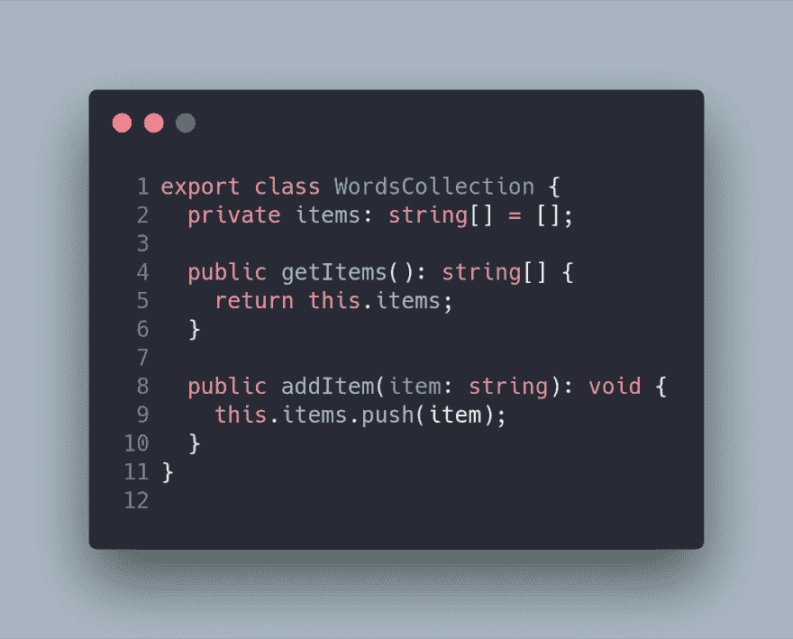](https://res.cloudinary.com/practicaldev/image/fetch/s--jTueIwRF--/c_limit%2Cf_auto%2Cfl_progressive%2Cq_auto%2Cw_880/https://cdn-images-1.medium.com/max/2000/1%2A4CpCEy-pR1CmJdYpVLGB4Q.png)

客户代码关联如下:

[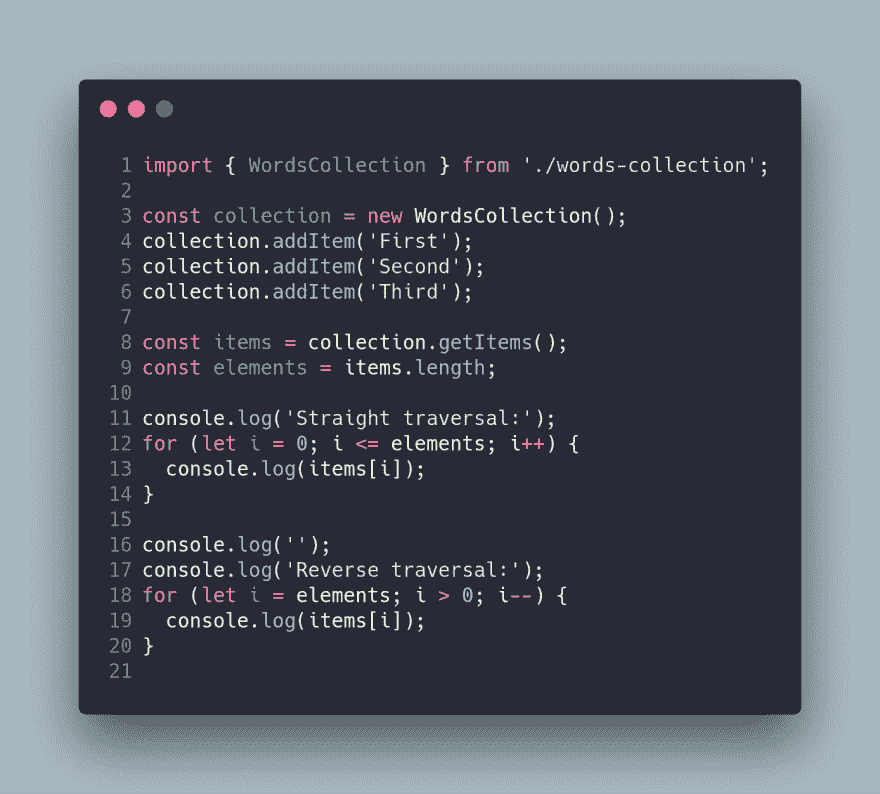](https://res.cloudinary.com/practicaldev/image/fetch/s--hz0i_jiN--/c_limit%2Cf_auto%2Cfl_progressive%2Cq_auto%2Cw_880/https://cdn-images-1.medium.com/max/2504/1%2Afl0_neuLmC6YnmkdIfH5BA.png)

这种解决方案的主要问题是代码是耦合的。也就是说，客户端需要知道集合的内部结构如何实现两个遍历的方法(直接和反向)。假设您需要将数据结构从数组更改为映射，那么与客户端相关联的代码会由于耦合而中断。迭代器模式的另一个有趣的用例是当你需要一种新的方法来迭代集合时，例如，**alphabeticallordered**。

解决方案是使用迭代器模式，使用这种模式的新 UML 图如下所示:

因此，解决方案由一个接口类(迭代器)组成，它定义了遍历集合的方法:

1.  current(): T

2.  key():数字。

3.  hasmoreelemonts_):布尔值。

4.  倒带:作废。

[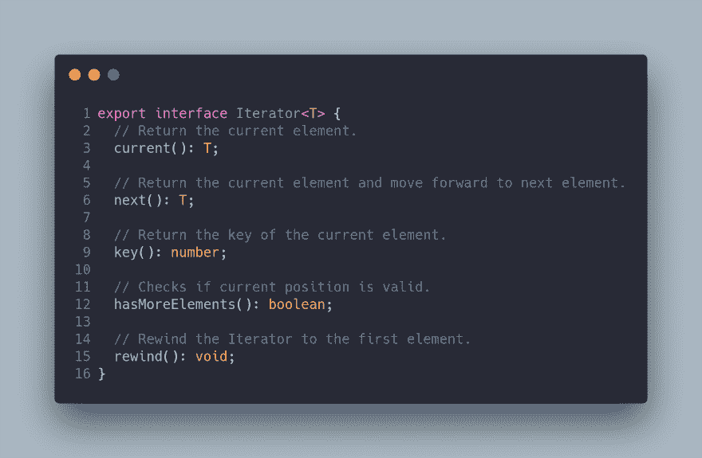](https://res.cloudinary.com/practicaldev/image/fetch/s--OnOLlF9o--/c_limit%2Cf_auto%2Cfl_progressive%2Cq_auto%2Cw_880/https://cdn-images-1.medium.com/max/2908/1%2AD5CiaX8YzlobDHJRc3_tOQ.png)

类 AlphabeticalOrderIterator 是迭代器，它负责实现以正确的方式遍历集合的方法。迭代器需要使用聚合的(WordsCollection)集合和迭代的方式(反向或正向)。因此，与 AlphabeticalOrderIterator 关联的代码如下:

[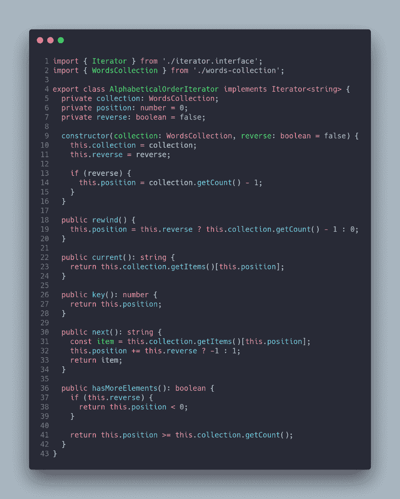](https://res.cloudinary.com/practicaldev/image/fetch/s--5RyU5nwS--/c_limit%2Cf_auto%2Cfl_progressive%2Cq_auto%2Cw_880/https://cdn-images-1.medium.com/max/3080/1%2Afz71E9r84pais_SJfrHcyQ.png)

下一步包括定义聚合器接口和修改集合以实现该接口。因此，与聚合器相关联的代码如下:

[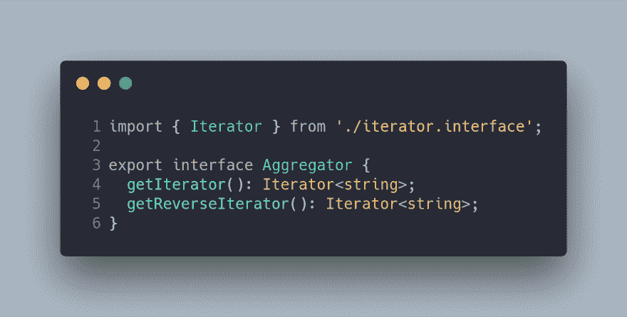](https://res.cloudinary.com/practicaldev/image/fetch/s--x2SwXUpI--/c_limit%2Cf_auto%2Cfl_progressive%2Cq_auto%2Cw_880/https://cdn-images-1.medium.com/max/2336/1%2A4cyH_J0fyGA6zlhgvlM9rg.png)

注意，聚合器接口定义了创建新迭代器的方法。在这个问题中，我们需要两个迭代器:正向迭代器和反向迭代器。因此，WordsCollection 集合被修改为包含这些方法，如下面的代码所示:

[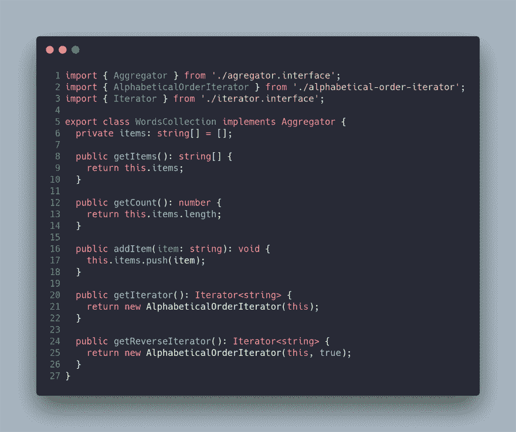](https://res.cloudinary.com/practicaldev/image/fetch/s--LpLHrjPz--/c_limit%2Cf_auto%2Cfl_progressive%2Cq_auto%2Cw_880/https://cdn-images-1.medium.com/max/3212/1%2A0QVdMb6sA_Y0-0sbLHYXaQ.png)

最后，我们可以在客户端代码中使用迭代器，现在已经解耦了，如下面的代码所示:

[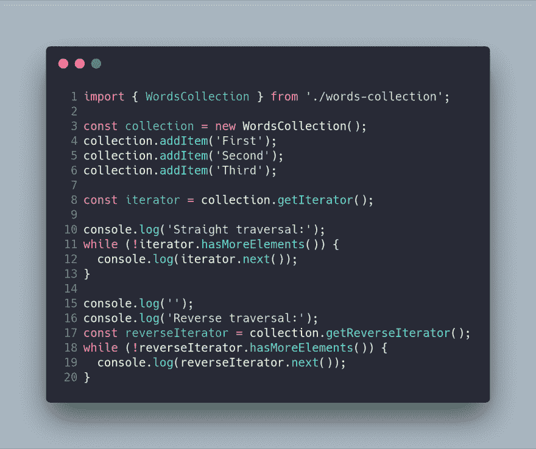](https://res.cloudinary.com/practicaldev/image/fetch/s--cmrvnzyV--/c_limit%2Cf_auto%2Cfl_progressive%2Cq_auto%2Cw_880/https://cdn-images-1.medium.com/max/2608/1%2Aq-QznAC3VvcsZQYyj6TxfA.png)

客户端从 WordsCollection 类的内部结构中分离出来(*单责任*)，你可以扩展软件实现新的迭代器(*开/闭*)。

在应用迭代器模式后，我创建了几个 npm 脚本来运行这里显示的代码示例。

npm 运行示例 1-问题
npm 运行示例 1-迭代器-解决方案-1

想象一下，我们必须创建一个软件，允许我们向社交网络中的联系人发送电子邮件，并考虑到我们将区分发送的邮件类型。在我们的人际网络中，我们有两类联系人:朋友和同事。要发送的电子邮件会更正式，这取决于电子邮件要发送到的联系人的类型。

首先，我们有来自两个著名社交网络的联系人:Dev.to 和 Medium(我们不需要阐明哪个是我最喜欢的，你们都知道！:-)).每个社交网络的数据结构的实现是不同的，因为在 Dev.to 中使用数组来维护联系人，而在 Medium 中使用地图。

迭代器模式将允许我们将代码与我们的联系人和社交网络完全解耦，允许我们将自己从每个社交网络的内部实现中抽象出来，甚至有能力添加新的社交网络(尽管…对于我们这些极客来说，其他社交网络甚至存在吗？:P)。

你可以在下面的 gif 中找到使用我们整个结构的客户端(我已经做了一个小的 CLI 例子)。

在下面的 UML 图中，您可以看到针对此问题提出的解决方案:

好吧，这个问题中的模型不是一个字符串，而是一个用户的个人资料，正如你在下面的代码中看到的:

[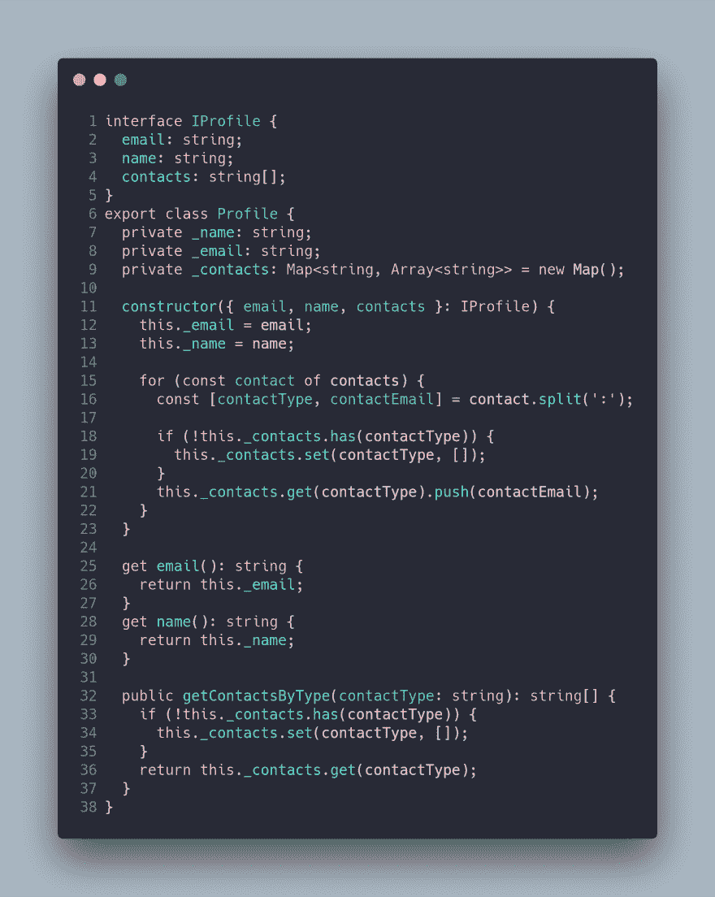](https://res.cloudinary.com/practicaldev/image/fetch/s--YsH_8BSz--/c_limit%2Cf_auto%2Cfl_progressive%2Cq_auto%2Cw_880/https://cdn-images-1.medium.com/max/2776/1%2A3c1-bfFTmAgWkte5kvV5WQ.png)

在 Profile 类中，我们有一个 getContactsByType 方法，它返回朋友或同事的联系人。

下一步是定义迭代器接口(ProfileIterator)和聚合器接口(SocialNetwork ),它们定义了每个迭代器和聚合器必须实现的方法。

因此，与这些接口相关的代码如下:

[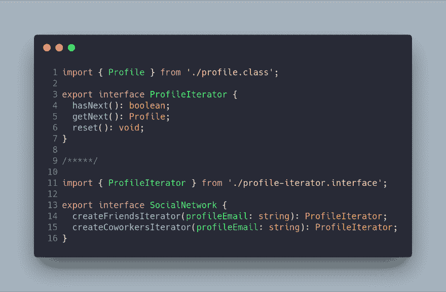](https://res.cloudinary.com/practicaldev/image/fetch/s--hM4mZqBB--/c_limit%2Cf_auto%2Cfl_progressive%2Cq_auto%2Cw_880/https://cdn-images-1.medium.com/max/2908/1%2An_7rmockSrJt5T9ZD_7vdQ.png)

现在，我们需要实现前面接口的具体实现来解决我们的问题。我们将解析的第一个社交网络是 Dev.to。聚合器和迭代器的实现如下所示。

[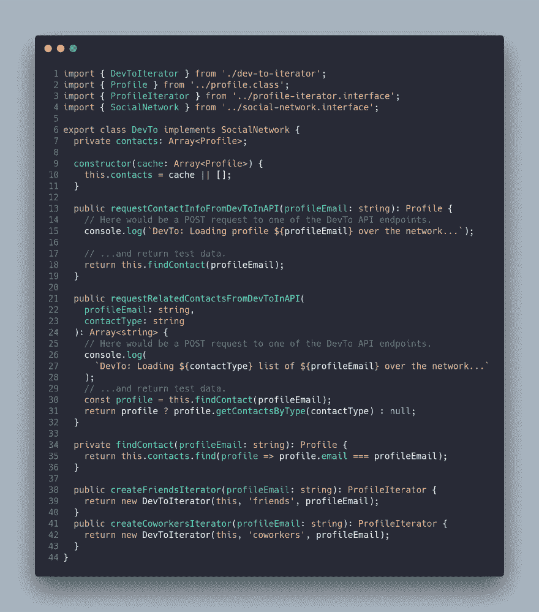](https://res.cloudinary.com/practicaldev/image/fetch/s--pthSejy8--/c_limit%2Cf_auto%2Cfl_progressive%2Cq_auto%2Cw_880/https://cdn-images-1.medium.com/max/3448/1%2AUrY0Oex6QhBd2LzDLf7x1A.png)

请注意，存储联系人的集合是一个数组，并且实现了 createFriendsIterator 和 createCoworkersIterator。它有几个方法来模拟到远程 API 的连接以获取联系人。

与 DevToIterator 类关联的代码如下:

[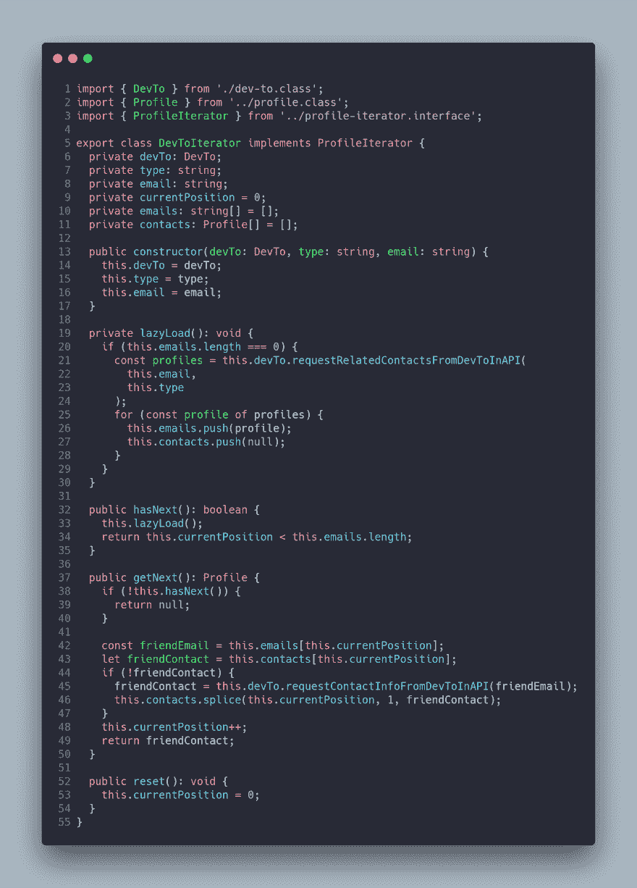](https://res.cloudinary.com/practicaldev/image/fetch/s--iP0Nql7E--/c_limit%2Cf_auto%2Cfl_progressive%2Cq_auto%2Cw_880/https://cdn-images-1.medium.com/max/3380/1%2AvpRIs93NW_pZJ2MvE9s8yw.png)

前面代码中最重要的部分是接口实现。具体实现基于集合(数组)的内部数据结构。您可能会注意到，我开发了一个懒惰的方法来请求联系人(仔细考虑一下。我是否应该向一个朋友请求所有朋友可能会导致无限循环)。

现在，我们应该创建只使用接口的 SocialSpammer 类。SocialSpammer 类与任何具体的类都是分离的，正如您在下面的代码中所看到的:

[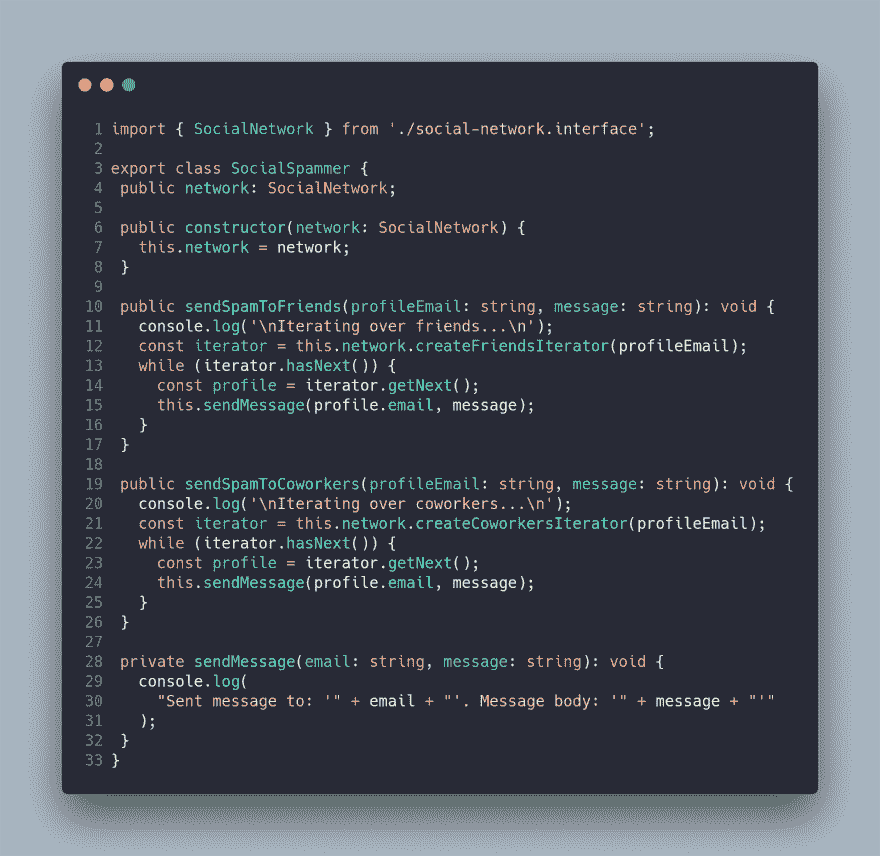](https://res.cloudinary.com/practicaldev/image/fetch/s--lNhjp64T--/c_limit%2Cf_auto%2Cfl_progressive%2Cq_auto%2Cw_880/https://cdn-images-1.medium.com/max/3212/1%2ANZQa_4899K_2UbPfy9RLrA.png)

前面的代码根据电子邮件是发给朋友还是同事来使用迭代器。

现在，我们可以在下面的客户端中使用代码:

[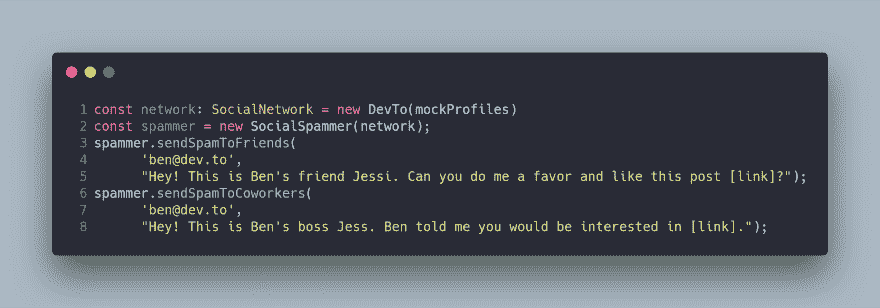](https://res.cloudinary.com/practicaldev/image/fetch/s--CaL1hDWT--/c_limit%2Cf_auto%2Cfl_progressive%2Cq_auto%2Cw_880/https://cdn-images-1.medium.com/max/3784/1%2AC5owptV83rPZ8Sr6TNEjvw.png)

现在是时候检查我们是否可以通过创建一个新的社交网络及其迭代器来利用开放/封闭原则，而不破坏我们的应用程序。

与中等等级相关的代码如下:

[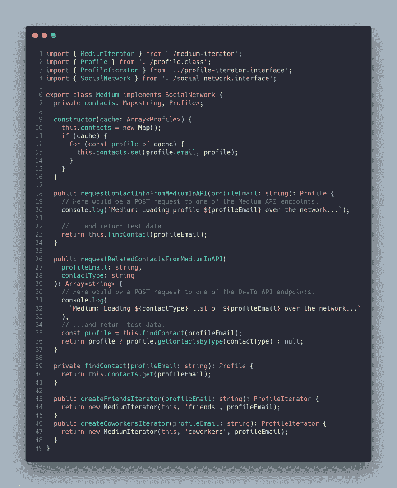](https://res.cloudinary.com/practicaldev/image/fetch/s--hQJGC5JA--/c_limit%2Cf_auto%2Cfl_progressive%2Cq_auto%2Cw_880/https://cdn-images-1.medium.com/max/3480/1%2An07Bn8wTSsADOtOqtqNdZg.png)

我们可以使用继承来简化 Dev.to 和 Medium 之间的代码，但为了不扩展这篇文章，我们更喜欢重复代码。您可以看到，Medium class 使用不同的数据结构来存储联系人。

最后，中间迭代器如下所示:

[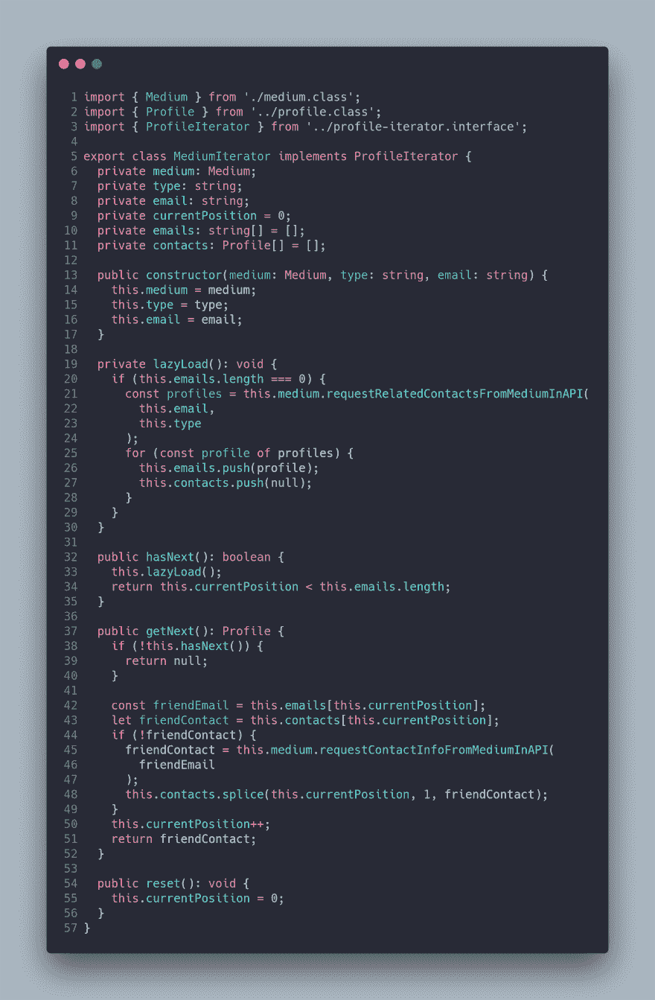](https://res.cloudinary.com/practicaldev/image/fetch/s--Uh-wMHX5--/c_limit%2Cf_auto%2Cfl_progressive%2Cq_auto%2Cw_880/https://cdn-images-1.medium.com/max/3180/1%2AhwotGmvQtmc1kX-p36Mw2Q.png)

我创建了一个 npm 脚本，在应用了迭代器模式和 CLI 接口后，它运行这里显示的示例。

npm 运行示例 2-迭代器-解决方案 1

迭代器模式可以避免项目中的耦合代码。当集合中有多种算法和数据结构时，迭代器模式非常适合。你的代码将会更干净，因为你应用了两个著名的原则，比如**单一责任**和**打开/关闭**。

最重要的事情不是实现我向你展示的模式，而是能够识别这个特定模式可以解决的问题，以及你何时可以或不可以实现所述模式。这一点至关重要，因为实现会因您使用的编程语言而异。

*最初发布于[https://www . carloscaballero . io](http://www.carloscaballero.io/design-patterns-iterator/)2019 年 6 月 12 日。*