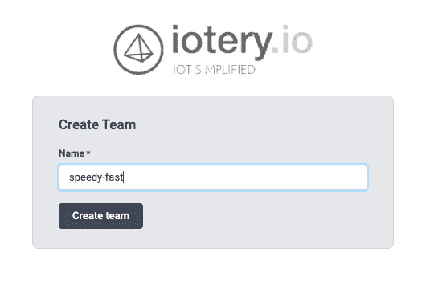
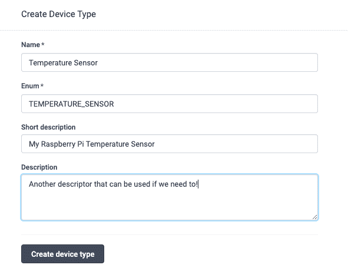
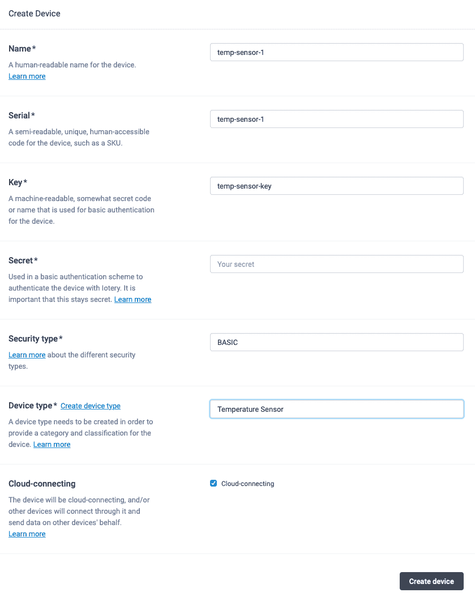
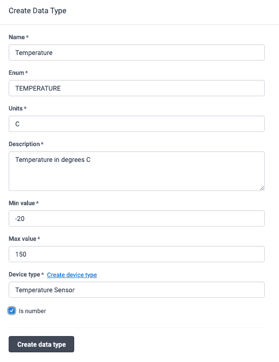
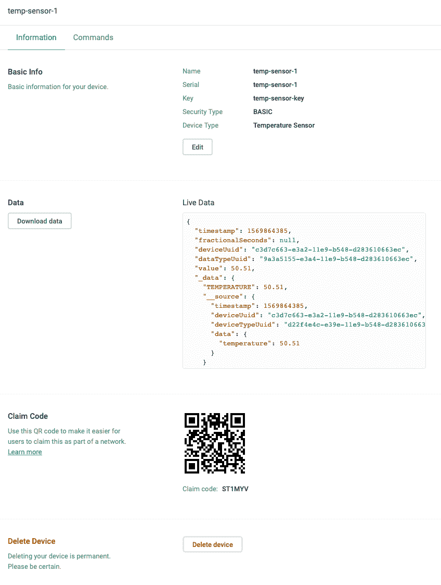
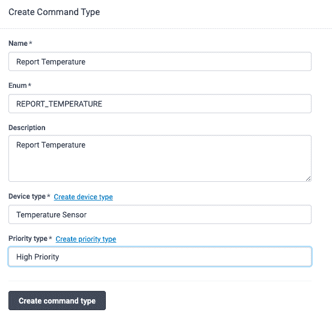
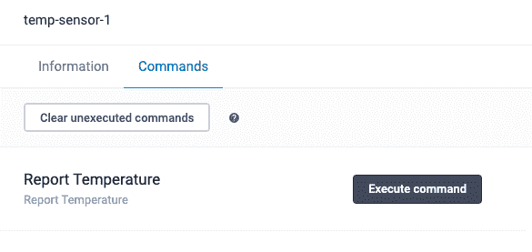

# 使用 iotery.io 开始使用物联网设备

> 原文：<https://dev.to/bjyurkovich/get-started-with-your-iot-devices-using-iotery-io-4c2d>

Iotery 是一种受管物联网(物联网)服务，它诞生于消除当今各种物联网云参与者配置和部署复杂性的需求:AWS 物联网、GCP 核心物联网、Azure 物联网。Iotery 试图为开发人员提供一种在 15 分钟内将他们的物联网设备连接到云的方法。本教程旨在为您提供一个在 15 分钟内开始的例子。

本教程需要的内容:

1.  树莓派(不需要，但是会更酷！)
2.  Python 的基础知识
3.  关于如何设置和连接到您的 Raspberry Pi 的基本知识

## 设置小额账户

Iotery 提供了一个慷慨的免费层，允许最多 5 台设备终身免费。对于大多数爱好者来说，这应该绰绰有余了！设置免费账户很简单:[https://dashboard . io tery . io](https://dashboard.iotery.io/register-team-manager)。

Iotery 将不同的环境分成他们所谓的`teams`。在本教程中，我们将只使用一个名为`speedy-fast`的`team`——你会想要创造自己的名字。

> 如果你正在做生产就绪的东西——你会想要创建两个团队——一个用于生产，一个用于测试。

[](https://res.cloudinary.com/practicaldev/image/fetch/s--rqL8IjqR--/c_limit%2Cf_auto%2Cfl_progressive%2Cq_auto%2Cw_880/https://thepracticaldev.s3.amazonaws.com/i/88i4a316su43xpgnsh61.png)

一旦我们有了自己的团队，我们就会看到一个创建`Device Type`的初始屏幕。在我们加速做某事之前，让我们快速制定一个计划。

## 让我们制定一个计划

假设我们想要设置一个设备(一个“东西”)每 5 分钟向云报告一次温度。让我们也让我们的设备在发送命令时报告温度。

下面是我们将要做的事情的简单示意图:

[](https://res.cloudinary.com/practicaldev/image/fetch/s--fnntIm7I--/c_limit%2Cf_auto%2Cfl_progressive%2Cq_auto%2Cw_880/https://thepracticaldev.s3.amazonaws.com/i/xc3zru795gkp122vrvmn.png)

## 为我们的温度传感器配置 Iotery

我们需要在 Iotery 仪表板中做四件事来准备向云报告数据:

1.  创建我们的温度传感器`Device Type`
2.  创建我们的温度传感器`Device`
3.  创造我们的温度`Data Type`
4.  创建一个`Command Type`

#### 创建设备类型

我们需要建立一个 Iotery 来让我们的树莓 Pi 报告。由于我们的 Raspberry Pi 充当(非常强大的)温度传感器，我们将[在 Iotery Dashboard 中创建一个设备类型](https://iotery.io/device-types/create)，称为`Temperature Sensor`。所有作为温度传感器的设备都将从这个`device type`中派生出来(出于我们的目的，我们只需要一个设备——我们的 Raspberry Pi！).

[](https://res.cloudinary.com/practicaldev/image/fetch/s--Ot2eLFFP--/c_limit%2Cf_auto%2Cfl_progressive%2Cq_auto%2Cw_880/https://thepracticaldev.s3.amazonaws.com/i/t12ar3n0whvlpa40u8rd.png)

> 我们也可以只使用 [REST API](https://iotery.io/docs/account-manager#tag/Device-Types/paths/~1device-types/post) 来创建一个设备类型。

#### 创建设备

接下来，我们需要[创建一个`device`](https://iotery.io/devices/create) 。你可以将`serial`、`key`和`secret`设置为你想要的任何值——这就是你给你的设备赋予身份的方式。我们稍后会用这个来验证我们的树莓派。

> 就像设备类型创建一样，我们也可以只使用 [REST API](https://iotery.io/docs/account-manager#tag/Devices/paths/~1devices/post) 来创建我们的设备。哦，还有一个 [JavaScript Node.js SDK](https://www.npmjs.com/package/iotery-server-sdk) ！

[](https://res.cloudinary.com/practicaldev/image/fetch/s--Cp983aRR--/c_limit%2Cf_auto%2Cfl_progressive%2Cq_auto%2Cw_880/https://thepracticaldev.s3.amazonaws.com/i/w9f69oiwo621bgivxapb.png)

选择`secret`是你的事——只要确保保密就好！在本教程中，我们选择了使用`BASIC`认证，所以我们将只使用`serial`、`key`和`secret`进行认证。还要确保将`Device Type`设置为我们之前创建的`Temperature Sensor`设备类型。

> 如果您想更加安全，可以使用`KEYED`选项，并使用 X.509 证书通过 Iotery 进行加密签名认证。

#### 创建数据类型

为了向云报告数据，我们需要告诉 Iotery 预期的数据类型。在这种情况下，我们将报告一个温度，因此我们需要创建一个`Temperature`数据类型，并将其分配给我们的`Temperature Sensor`设备类型。

[](https://res.cloudinary.com/practicaldev/image/fetch/s--7egTWxD2--/c_limit%2Cf_auto%2Cfl_progressive%2Cq_auto%2Cw_880/https://thepracticaldev.s3.amazonaws.com/i/04xaezv600c10beqb67l.png)

一旦我们创建了它，记下您选择命名它的`enum`。当我们向上发送数据时，这将在`data`包中使用(它不区分大小写！).

> 您也可以使用 [REST API](https://iotery.io/docs/account-manager#tag/Data-Types/paths/~1data-types/post) 来做到这一点！

我们稍后将设置命令——让我们的温度传感器(Raspberry Pi)向云报告！

## 设置我们的树莓 Pi 温度传感器

> 下面的代码和项目可以在[这里](https://github.com/bjyurkovich/iotery-in-15-minutes-raspberry-pi)找到。

既然我们现在已经用温度传感器身份设置了很多，我们可以开始编写我们的 Raspberry Pi 了。Iotery 提供了一个[嵌入式 Python SDK](https://pypi.org/project/iotery-embedded-python-sdk/) ,让我们将设备连接到云变得更加容易！让我们建立我们的项目。

> 如果你需要帮助设置你的 Raspberry Pi，网上有很多教程。一定要安装 Python 3。这里有一个[示例教程](http://www.knight-of-pi.org/installing-python3-6-on-a-raspberry-pi/)用于在您的 pi 上安装 Python 3。如果你没有树莓酱，没关系——你可以在你的笔记本电脑上做这个...你只是不能报告真实的温度。

在命令行上登录我们的 Raspberry Pi，我们将在我们的`home`目录中创建一个文件夹，并将`cd`放入其中:

```
mkdir iotery-temperature-sensor
cd iotery-temperature-sensor 
```

一旦进入文件夹，我们将[创建一个虚拟环境](https://packaging.python.org/guides/installing-using-pip-and-virtual-environments/)，确保使用`python3`作为主要解释器:

```
virtualenv -p python3 venv 
```

我们将激活`virtualenv` :

```
source venv/bin/activate 
```

如果在你的终端线的开始有一点点`(venv)`，你就会知道它是否有效。

在激活的虚拟环境中，我们将安装`iotery-embedded-python-sdk` :

```
pip install iotery-embedded-python-sdk 
```

我们已经准备好开始编写传感器代码了！

## 传感器代码

首先，让我们在我们的`iotery-temperature-sensor`文件夹中创建一个文件`main.py`，它将成为我们的传感器应用文件:

```
touch main.py 
```

在你最喜欢的 Python IDE 中打开`main.py`(我们喜欢 [VSCode](https://code.visualstudio.com) ，开始编码:

```
from iotery_embedded_python_sdk import Iotery

# team ID found on the dashboard: https://iotery.io/system TEAM_ID="188baf45-8d55-11e9-c121-d283610663ed" 
iotery = Iotery()
d = iotery.getDeviceTokenBasic(data={"key": "temp-sensor-key",
                                     "serial": "temp-sensor-1", "secret": "my-secret", "teamUuid": TEAM_ID})

# set token for subsequent iotery calls iotery.set_token(d["token"])

# get info about the device me = iotery.getMe()

print(me["name"]) 
```

在这个代码片段中，我们实例化了`Iotery`类，然后调用`getDeviceTokenBasic`，传入我们在 iotery 仪表板上为设备创建的身份。一旦我们通过了 Iotery 的认证，我们就得到了一个`token`，可以用于其他呼叫，比如`getMe()`。

> 不要忘记将`TEAM_ID`替换为您团队的 ID(参见仪表板上的系统页面),并将`my-secret`替换为您在创建设备时使用的密码。

太好了！我们现在和外星人联系在一起。当您运行上面的代码时，您应该看到您的设备名称`temp-sensor-1`被打印到控制台上。

### 读数温度

我们将创建一个助手函数来读取 Raspberry Pi 的 CPU 温度(不幸的是，Pi 没有内置温度传感器)。在一个名为`read_temperature.py`的新文件中，我们写下

```
import os
import random

# we checking for a real Pi - this code will also work on your computer real_pi = True
try:
    import RPi.GPIO as GPIO
    real_pi = True
except:
    real_pi = False

def current_cpu_temperature():
    # gets the current CPU temperature of the Pi
    if real_pi:
        temp = os.popen("/opt/vc/bin/vcgencmd measure_temp").readline()
        temp = temp.replace("temp=","")
        temp = temp.replace("'C","")
        return float(temp)
    else:
        return 50 + int(random.random()*100)/100 
```

现在我们可以用一个每 5 分钟报告一次温度数据的循环将它添加到我们的`main.py`中。

```
from iotery_embedded_python_sdk import Iotery
from read_temperature import current_cpu_temperature
from time import sleep

# team ID found on the dashboard: https://iotery.io/system TEAM_ID="188baf45-8d55-11e9-c121-d283610663ed" 
iotery = Iotery()
d = iotery.getDeviceTokenBasic(data={"key": "temp-sensor-key",
                                     "serial": "temp-sensor-1", "secret": "my-secret", "teamUuid": TEAM_ID})

# set token for subsequent eatery calls iotery.set_token(d["token"])

# get info about the device me = iotery.getMe()

print(me["name"])

while True:
    t = iotery.getCurrentTimestamp()
    temp = current_cpu_temperature()

    # https://iotery.io/docs/embedded/#tag/Embedded/paths/%7E1embedded%7E1devices%7E1:deviceUuid%7E1data/post
    data = {"packets":[{
        "timestamp": t,
        "deviceUuid": me["uuid"],
        "deviceTypeUuid": me["deviceTypeUuid"],
        "data":{"temperature": temp}
    }]}
    iotery.postData(deviceUuid=me["uuid"], data=data)
    sleep(60 * 5) # sleeps for 60 * 5 seconds (5 min) 
```

我们给`main.py`添加了几行代码。主要增加的是新的`import`依赖项(前几行)和将永远运行的`while True`循环。

该循环简单地从 Iotery 服务器获取当前时间戳(如果您愿意，也可以使用本地时间的`int(time.time())`)，从我们创建的函数中获取当前温度，然后将数据发送到 Iotery，然后休眠 5 分钟。

如果您在仪表板中查看您的设备页面，您可以在“实时数据”部分看到您的设备上次报告的时间。
[T3】](https://res.cloudinary.com/practicaldev/image/fetch/s--AmxlwUe8--/c_limit%2Cf_auto%2Cfl_progressive%2Cq_auto%2Cw_880/https://thepracticaldev.s3.amazonaws.com/i/v1aporax2angd6c0z1so.png)

太好了，我们正在向云报告，我们还有一些时间来设置我们的设备以响应报告命令！

## 为我们的温度传感器设置命令

我们希望能够随时从我们的 Pi 请求温度，所以我们需要向它发送一个命令。就像以前一样，我们必须告诉 Iotery 我们将发送什么类型的命令。我们只需要一个命令:`REPORT_TEMPERATURE`。
[](https://res.cloudinary.com/practicaldev/image/fetch/s--ACxdwtui--/c_limit%2Cf_auto%2Cfl_progressive%2Cq_auto%2Cw_880/https://thepracticaldev.s3.amazonaws.com/i/h396hn2cltep5ybs8uqb.png)

但是我们如何让我们的 Pi 监听命令呢？我们可以用 [MQTT](http://mqtt.org) 。简单来说，MQTT 允许我们的设备与 Iotery 保持持续联系，并获得实时数据(包括命令)。 [Iotery 提供了一个完全托管的 MQTT 代理](https://iotery.io/docs/mqtt)，我们可以让我们的 Pi 连接并接收命令。

我们将使用一个 [Python MQTT 库](https://pypi.org/project/paho-mqtt/)来连接 Iotery 的代理。让我们将它安装在与我们的应用程序代码相同的文件夹中(确保您仍然在您的虚拟环境中！):

```
pip install paho-mqtt 
```

让我们给`main.py`
添加必要的代码

```
from iotery_embedded_python_sdk import Iotery
from read_temperature import current_cpu_temperature
from time import sleep, time
import paho.mqtt.client as mqtt
import ssl

# team ID found on the dashboard: https://iotery.io/system TEAM_ID="188baf45-8d55-11e9-c121-d283610663ed" 
iotery = Iotery()
d = iotery.getDeviceTokenBasic(data={"key": "temp-sensor-key",
                                     "serial": "temp-sensor-1", "secret": "my-secret", "teamUuid": TEAM_ID})

# set token for subsequent eatery calls iotery.set_token(d["token"])

# get info about the device me = iotery.getMe()

#  Set up the MQTT stuff def on_connect(client, userdata, flags, rc):
    print("Connected with result code "+str(rc))

    #once connected, subscribe to the command topic
    client.subscribe("devices/" + me["uuid"] + "/commands")

# The callback for when something is published to the broker. def on_message(client, userdata, msg):
    print("Received from topic" + msg.topic)
    print("Message: " + str(msg.payload))

    if msg.topic == "devices/" + me["uuid"] + "/commands":
        # There is only one command for now, so we will just report.  If we add more later, we can look at the `commandTypeEnum` to control actions
        t = iotery.getCurrentTimestamp()
        temp = current_cpu_temperature()
        # https://iotery.io/docs/embedded/#tag/Embedded/paths/%7E1embedded%7E1devices%7E1:deviceUuid%7E1data/post
        data = {"packets":[{
            "timestamp": t,
            "deviceUuid": me["uuid"],
            "deviceTypeUuid": me["deviceTypeUuid"],
            "data":{"temperature": temp}
        }]}
        iotery.postData(deviceUuid=me["uuid"], data=data)
        print("data posted!")

client_id = TEAM_ID + ":" + str(iotery.getCurrentTimestamp()*1000) + ":" + me["uuid"] #Iotery client ID format client = mqtt.Client(client_id)
client.on_connect = on_connect # set the connect handler to run when mqtt connects client.on_message = on_message # the function that runs when we get a message 
# username and password are your device's uuid and it's token we got back from auth above client.username_pw_set(me["uuid"], password=d["token"])

# To use MQTTS (secure MQTT), we need to configure TLS client.tls_set(ca_certs=None, certfile=None, keyfile=None, cert_reqs=ssl.CERT_REQUIRED,
    tls_version=ssl.PROTOCOL_TLS, ciphers=None) 

#  connect to the broker client.connect("mqtt.iotery.io", port=8885, keepalive=60)

client.loop_start() # make sure to start the mqtt loop! 
# the main application loop! while True:
    t = iotery.getCurrentTimestamp()
    temp = current_cpu_temperature()

    # https://iotery.io/docs/embedded/#tag/Embedded/paths/%7E1embedded%7E1devices%7E1:deviceUuid%7E1data/post
    data = {"packets":[{
        "timestamp": t,
        "deviceUuid": me["uuid"],
        "deviceTypeUuid": me["deviceTypeUuid"],
        "data":{"temperature": temp}
    }]}
    iotery.postData(deviceUuid=me["uuid"], data=data)
    sleep(60 * 5) # sleeps for 60 * 5 seconds (5 min) 
```

我们添加了许多代码功能！让我们一个一个地检查添加的内容。

#### 添加必要的进口

我们需要添加必要的库。

```
from iotery_embedded_python_sdk import Iotery
from read_temperature import current_cpu_temperature
from time import sleep, time
import paho.mqtt.client as mqtt
import ssl 
```

我们添加了 MQTT 库`paho.mqtt.client`和`ssl`。我们需要`ssl`来使用 Iotery 的安全 MQTT 选项(MQTTS，MQTT over TLS)。

#### MQTT 回调

我们正在利用的 MQTT 库使用中断，因此我们必须提供函数来处理应用程序连接到代理以及消息传入的情况。

```
#  Set up the MQTT stuff def on_connect(client, userdata, flags, rc):
    print("Connected with result code "+str(rc))

    #once connected, subscribe to the command topic
    client.subscribe("devices/" + me["uuid"] + "/commands")

# The callback for when something is published to the broker. def on_message(client, userdata, msg):
    print("Received from topic" + msg.topic)
    print("Message: " + str(msg.payload))

    if msg.topic == "devices/" + me["uuid"] + "/commands":
        # There is only one command for now, so we will just report.  If we add more later, we can look at the `commandTypeEnum` to control actions
        t = iotery.getCurrentTimestamp()
        temp = current_cpu_temperature()
        # https://iotery.io/docs/embedded/#tag/Embedded/paths/%7E1embedded%7E1devices%7E1:deviceUuid%7E1data/post
        data = {"packets":[{
            "timestamp": t,
            "deviceUuid": me["uuid"],
            "deviceTypeUuid": me["deviceTypeUuid"],
            "data":{"temperature": temp}
        }]}
        iotery.postData(deviceUuid=me["uuid"], data=data)
        print("data posted!") 
```

> 为了本教程的简单起见，我们没有将`command`设置为`executed`。在一个实际的应用程序中，我们想要通知 Iotery 我们的设备已经设置了我们的[命令执行](https://iotery.io/docs/embedded#tag/Embedded/paths/~1embedded~1command-instances~1:commandInstanceUuid~1executed/patch)或使用 python SDK: `iotery.setCommandInstanceAsExecuted(deviceUuid=me["uuid"], commandInstanceUuid=command_from_broker["uuid"])`

当我们的 Pi 连接到代理时，`on_connect`回调处理程序运行。MQTT 有一个`publish/subscription`模型，其中客户端(我们的 Pi)必须`subscribe`到主题。我们想为我们的设备订阅[命令主题](https://iotery.io/docs/mqtt)，这样当我们发送命令时就会得到它们:`client.subscribe("devices/" + me["uuid"] + "/commands")`。

#### MQTT 设置并连接到代理

我们需要为代理提供适当的地址以及我们的凭证。

```
client_id = TEAM_ID + ":" + str(iotery.getCurrentTimestamp()*1000) + ":" + me["uuid"] #Iotery client ID format client = mqtt.Client(client_id)
client.on_connect = on_connect # set the connect handler to run when mqtt connects client.on_message = on_message # the function that runs when we get a message 
# username and password are your device's uuid and it's token we got back from auth above client.username_pw_set(me["uuid"], password=d["token"])

# To use MQTTS (secure MQTT), we need to configure TLS client.tls_set(ca_certs=None, certfile=None, keyfile=None, cert_reqs=ssl.CERT_REQUIRED,
    tls_version=ssl.PROTOCOL_TLS, ciphers=None) 

#  connect to the broker client.connect("mqtt.iotery.io", port=8885, keepalive=60) 
```

为了连接到代理，`client_id`必须采用特定的格式。您还会注意到，我们选择使用 MQTT(MQTT over TLS ),在传输过程中对所有数据进行加密。我们必须告诉 MQTT 库，我们正在用我们的`client.tls_set(...)`函数做这件事。

#### 启动 MQTT 循环

我们使用的库是线程化的，所以我们必须告诉我们的应用程序开始循环(在我们的`while True`指令之前):

```
client.loop_start() 
```

### 发送命令

现在，我们已经与代理建立了工作连接，我们差不多完成了！我们现在只需要发送命令。我们可以在 [Iotery 仪表板](https://iotery.io/devices)中通过查看我们想要命令的`Device`(在我们的例子中，我们的 Pi)来做到这一点。
[T6】](https://res.cloudinary.com/practicaldev/image/fetch/s--A-_yRJf2--/c_limit%2Cf_auto%2Cfl_progressive%2Cq_auto%2Cw_880/https://thepracticaldev.s3.amazonaws.com/i/xv8zj6mpv04qaxhs0wc0.png)

一旦您发送了命令，您应该看到我们的 Pi 打印出命令消息和一个`data posted!`字符串到终端。

> 您还可以使用 [REST API](https://iotery.io/docs/account-manager#tag/Devices/paths/~1devices~1:deviceUuid~1notification-instances/post) 从您构建的云或消费者移动应用程序发送命令。

## 包装完毕

如果你做到了这一点，干得好(如果你在 15 分钟内做到了，你会得到额外的分数)！我们现在有一个连接到云报告数据的 Raspberry Pi(或您的计算机)。如果您实现了 MQTT 通信，您还可以向它发送实时命令！

我们刚刚用这个例子刷了一下皮毛。Iotery 还提供了以下功能:

1.  创建设备网络，其中只有一台设备充当网关
2.  创建设备分组
3.  为您的设备和命令创建计划
4.  创建具有严重性和优先级的通知和警报
5.  管理固件
6.  使用 webhooks 通过[帐户管理器 API](https://iotery.io/docs/account-manager) 创建增值应用，使您能够连接自己的应用并管理自己的体验，而不会被不断膨胀的基础架构成本所束缚。
7.  使用 webhooks 来训练自己的 AI 模型和分析！

...还有更多。