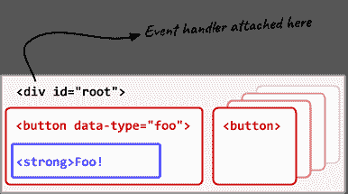

# Matching elements with selectors in JS

> 原文：[https://dev.to/samthor/matching-elements-with-selectors-in-js-4991](https://dev.to/samthor/matching-elements-with-selectors-in-js-4991)

Another short one! Let's talk about the two HTML helper methods, `Element.matches` and `Element.closest`. Both of these methods are supported in modern, evergreen browsers. 💚

These are both just nice helper methods that make your life writing HTML/JS easier! 🌈

## Matches

The first, `.matches`, is a way to check if an element matches a selector. Selectors are `.foo`, `#bar`, or `form[method="POST"]`, just like you'd use in `querySelector` or a CSS rule.

This is just a simpler way to check a condition. For instance, we can replace all these methods with a more generic equivalent:

```
el.classList.contains('foo') /* == */ el.matches('.foo');
el.hasAttribute('hello')     /* == */ el.matches('[hello]');
el.id === 'bar'              /* == */ el.matches('#bar'); 
```

<svg width="20px" height="20px" viewBox="0 0 24 24" class="highlight-action crayons-icon highlight-action--fullscreen-on"><title>Enter fullscreen mode</title></svg> <svg width="20px" height="20px" viewBox="0 0 24 24" class="highlight-action crayons-icon highlight-action--fullscreen-off"><title>Exit fullscreen mode</title></svg>

In addition, we can write more complex queries in a single request. How would I match a `button[type="foo"].green`? I can simply pass that whole string to `el.matches`! 🤯

## Closest

The second method, `.closest`, is a practical extension of `.matches.` Instead of checking just the current element, it checks itself *and* all parent elements- until it finds one that does match. 🆙

This is very useful when you're adding an event handler to a group of buttons or elements. Here's an example:

[](https://res.cloudinary.com/practicaldev/image/fetch/s--TRBVKdFZ--/c_limit%2Cf_auto%2Cfl_progressive%2Cq_auto%2Cw_880/https://thepracticaldev.s3.amazonaws.com/i/jvzpe9yfvsnmh5wzb9yj.png)

Rather than adding a handler to every button- maybe because you'll be adding more buttons as we go along, but also because you're paying more memory and performance cost adding *every* single handler- we can just add a single handler to the parent. 🤔

To find out what button we actually clicked on- because perhaps the click was on an inner element (such as the `<strong>` above), our event handler might look like this:

```
root.addEventListener('click', (event) => {
  const button = event.target.closest('button');
  if (!button) {
    return;  // clicked on the root itself or something else ¯\_(ツ)_/¯
  }
  // ... do something with the button we found!
}); 
```

<svg width="20px" height="20px" viewBox="0 0 24 24" class="highlight-action crayons-icon highlight-action--fullscreen-on"><title>Enter fullscreen mode</title></svg> <svg width="20px" height="20px" viewBox="0 0 24 24" class="highlight-action crayons-icon highlight-action--fullscreen-off"><title>Exit fullscreen mode</title></svg>

For me, I'll often set attributes like `data-name` or `data-type` so I can do something programatically with each button or *thing* that's under your root. 🌲👍

# Thanks!

That's all for today! Hope you've learned something.

13 👋