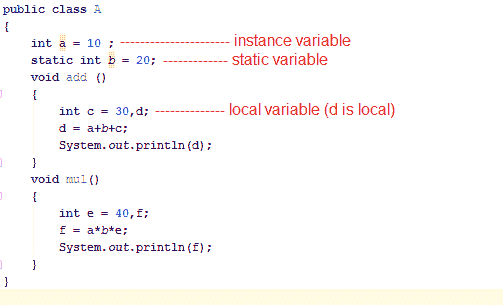
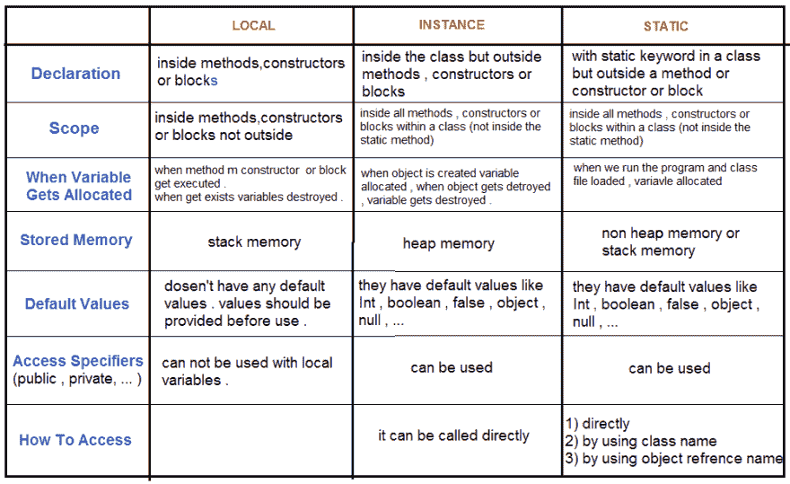
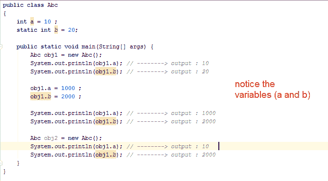

# 第 4 课:Java 中的变量

> 原文：<https://dev.to/hamid842/lesson-4-variables-in-java-4hab>

Java 变量是一块可以包含数据值的内存。因此，变量具有数据类型。变量通常用于存储 Java 程序完成工作所需的信息。

**变量:**

*1-本地*

*2 个实例*

*3-静态*

变量有一些属性，如下图所示:

请注意下面使用静态变量和实例变量的示例:

