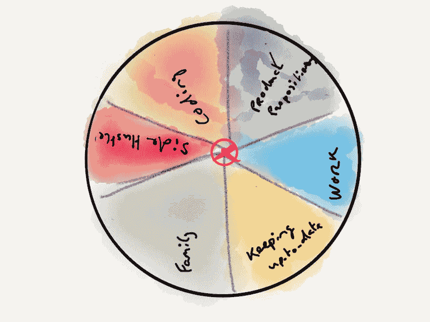

# 保持健康(也就是没有工作与生活的平衡)

> 原文：<https://dev.to/eekayonline/stay-fit-aka-there-is-no-work-life-balance-21hk>

在过去的 15 年里，我一直是一名开发人员(你可以在这里阅读，我也经历过一些挣扎:

*   在我职业生涯的初期，尝试与团队一起学习“真实的工作环境”发展
*   在努力工作的同时没有更上一层楼
*   整天伏案工作会有背痛
*   在一个老板很差劲的地方工作
*   人们强迫我去做我不想做的工作
*   等等。

最近，工作生活平衡这个话题又开始流行了。有人说这是一种重要的平衡，而其他人则不以为然，认为当你热爱你的工作时，它将成为你生活的补充，而不是一个独立的东西。

在这篇文章中，我想告诉你我是如何保持精力充沛，积极向上，作为一名程序员/制作者和健康(身体和精神)的。

简而言之:我想告诉你如何保持健康。

# 这不是这个对那个的平衡

作为一个人，我们不仅仅是工作。我们不仅仅是家人和/或朋友的总和。甚至我们在工作之外做的事情也不能定义我们。

## 我们是生活中所有重要事物的总和

这意味着，我们无法通过仅仅关注“健康的工作与生活平衡”来保持和谐。花更多的时间在我们生活的一个或两个方面，以及它们如何在整体上平衡，也就是“你”不会减少它。

工作与生活的平衡已经在网上广泛流传，它甚至成为硅谷的一个热门话题，越来越多的人看到每周工作 100 多个小时来启动一家初创公司是不应该的！)是事实上的工作方式。

## 【过度】补偿无济于事

当你专注于生活中的几个方面而忽略其他方面时，你很容易隐藏生活中的其他方面。

例如，如果你专注于可怕的工作与生活的平衡，感到压力，因为你正在努力工作，似乎无法在个人层面上减少压力，那么很容易通过在晚上或周末参加派对来隐藏(又名*补偿)。
这会给你一种感觉，就你的个人生活而言，你过得很好，但这不会持续太久。这种行为会让你筋疲力尽。

这就是为什么我上面的陈述——我们是生活中所有重要事物的总和——如此重要。

如果你想进入一种模式，帮助你成长为一个人，成为一个好的配偶/朋友/亲戚，并成为(或留在)一个优秀的有经验的开发人员，你需要把你的精力完全集中起来，平衡你生活中的各个方面。

# 通过平衡各方面来减少摩擦。

你需要做的第一件事是标出你生活中对你很重要的所有事情。在这个问题上想得更长远一些，试着将这些事情归入对你来说重要的“类别”或“主题”中。

比如看看这个概述:

这个例子展示了对我很重要的几个主题:

*   家庭的
*   侧推
*   产品定位
*   工作
*   保持最新

对于一个有雄心做出有意义的事情并试图建立自己可行的收入的人来说，这些都是合乎逻辑的事情。

对我来说，从为他人提供价值的产品中获得被动收入并实现财务独立是我努力的方向。

我想成为自己的老板，有权力按照自己的意愿支配自己的时间。这将帮助我成为一个更好的父亲和丈夫，给我们自由

所以当你看着中间的红色指针时，那个目标是我的*目标盘*的中心，每当我在其中一个主题上投入更多的努力，我就在那个主题上投入更多的重量，将平衡从中心转移到那个主题。

我需要付出额外的努力来平衡我的努力，并再次在中间找到平衡。

低:试着在重要的事情中保持平衡。

# 如何保持平衡

最有效的方法之一——我仍在学习改进我自己的行为——是通过与你生活中对每个话题都有重要影响的人交流来让你达到平衡。

谈论你的意图，你需要做出的努力，以及这对他们意味着什么。和你的家人谈谈。和同事聊聊。与你的产品/服务的潜在客户和/或用户交谈。

如果你确保每一方都及时了解他们对你的期望，并且他们明白他们会给你更多的时间去关注另一个话题。

> 最后，每个人都受益于这样一个事实:你平衡了生活中的所有事情，并且感觉最有禅意。

除了交流，界定界限是让你的话题互相制约的好方法。

这可以简单到定义你每天/每周/每月在每个话题上投入多少时间和精力。即:

*   定义你想和家人一起做有趣事情的频率
*   计划你要在你的兼职项目或兼职工作上花多少时间(以及你打算什么时候投入这些时间)

你要现实一点，这很重要。不要只是写东西。看看在过去的一段时间里，你在每个话题上花了多少精力，然后定义一个界限，让你在每个话题上不至于如履薄冰。

你很快就会发现，需要(额外)关注的主题之间会有紧张，但通过将事情具体化，你可以看到为什么会这样，你可以如何解决它，你将处于控制之中，而不是成为生活中正在发生的事情的受害者。

# 得出结论

意识到你的时间都花在了什么地方，以及这会如何影响生活中对你重要的其他话题。

正如本文中的图片所示，重要的是保持在所有重要事物的中心，而不是你生活两个方面之间的单一关系。

> 保持健康是关于在你想做的事情中保持平衡，意识到你想在每个话题上投入多少努力，并就此与你生活中重要的人交流

保重，✌🏻