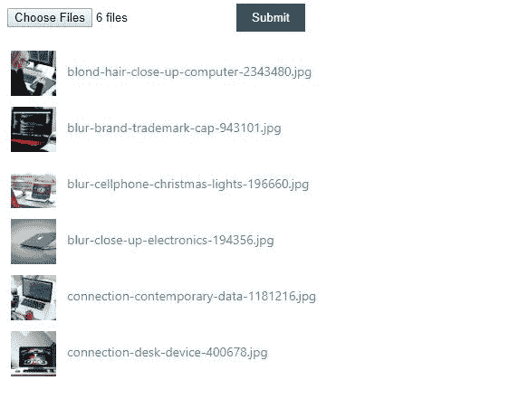
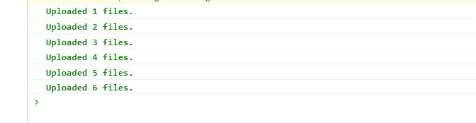
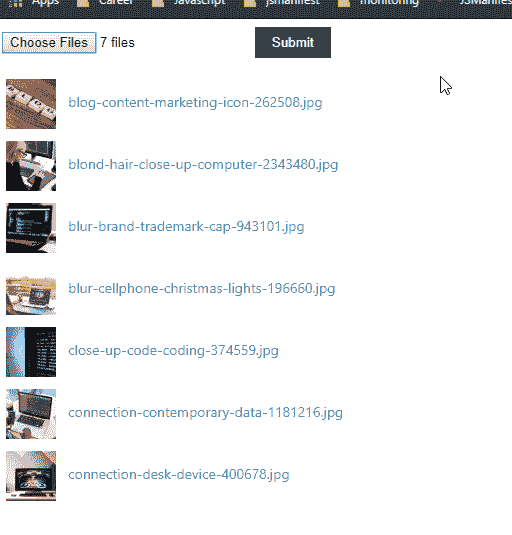

# 在 React 中上传文件，同时保持 UI 完全同步

> 原文：<https://dev.to/jsmanifest/keeping-ui-completely-synchronized-when-uploading-files-in-react-dj3>

在[媒体](https://medium.com/@jsmanifest)上找到我。

构建文件上传组件是一项非常重要的学习技能，因为它允许用户在本地环境之外选择和发送文件。

也就是说，这篇文章把重点放在了 JavaScript 的原生*文件* api 上。如果你想知道更多关于文件 api 是如何工作的，点击[这里](https://developer.mozilla.org/en-US/docs/Web/API/File/Using_files_from_web_applications)。

首先，构建一个文件上传组件可能是一个难以理解的概念，尤其是当您想要定制它的外观时。(我们可以在以后的教程中讨论定制设计文件输入组件)。但是一旦你很好地理解了这些概念，它实际上并没有那么糟糕！

我的意思是，你*可以*只创建一个文件输入元素，传入一个 onChange，然后就此结束。但是，你会通过向用户展示流程的当前*状态*来照顾他们吗？或者你只是让他们坐在那里，希望他们看到它的结束，没有任何视觉更新？

用户的互联网断了怎么办？如果服务器没有任何响应怎么办？如果 14 个文件中的第 8 个对他们来说很大呢？如果用户等待上传过程完成 10 分钟，并想看看已经完成了多少，该怎么办？或者哪些文件已经上传了？

如果你想让 UX 保持一致，你需要让用户持续更新后台发生的事情。从技术角度来看，专业、一致的用户界面有助于建立对应用程序的信任。如果你计划开发一个应用程序，让用户注册并支付你的一些服务，他们必须*相信你提供给他们的技术*，相信你的技术比其他任何人都好。你在不断发展，你拥有超越自我的力量！

## 但是我从哪里开始呢？

别担心！这篇文章将教*你*如何创建一个包含文件上传组件的用户界面，该组件将帮助用户选择并发送他们的文件到某个地方，同时允许界面从实例化到结束的每一次更新都接入*。创建组件是一回事，但是让 UI 在整个过程中与状态更新保持同步是另一回事。*

我们开始吧！

在本教程中，我们将使用 [create-react-app](https://github.com/facebook/create-react-app) 快速生成一个 react 项目。

继续使用下面的命令创建一个项目。对于本教程，我称之为*文件上传与 ux*

```
npx create-react-app file-upload-with-ux 
```

<svg width="20px" height="20px" viewBox="0 0 24 24" class="highlight-action crayons-icon highlight-action--fullscreen-on"><title>Enter fullscreen mode</title></svg> <svg width="20px" height="20px" viewBox="0 0 24 24" class="highlight-action crayons-icon highlight-action--fullscreen-off"><title>Exit fullscreen mode</title></svg>

现在当它完成时进入目录:

```
cd file-upload-with-ux 
```

<svg width="20px" height="20px" viewBox="0 0 24 24" class="highlight-action crayons-icon highlight-action--fullscreen-on"><title>Enter fullscreen mode</title></svg> <svg width="20px" height="20px" viewBox="0 0 24 24" class="highlight-action crayons-icon highlight-action--fullscreen-off"><title>Exit fullscreen mode</title></svg>

我们要做的第一件事是打开`App.js`，用我们自己的实现替换默认代码:

> src/App.js

```
import React from 'react'
import './App.css'

const Input = (props) => (
  <input type='file' name='file-input' multiple {...props} />
)

const App = () => {
  const onSubmit = (e) => {
    e.preventDefault()
  }

  const onChange = (e) => {
    console.log(e.target.files)
  }

  return (
    <div className='container'>
      <form className='form' onSubmit={onSubmit}>
        <div>
          <Input onChange={onChange} />
          <button type='submit'>Submit</button>
        </div>
      </form>
    </div>
  )
}

export default App 
```

<svg width="20px" height="20px" viewBox="0 0 24 24" class="highlight-action crayons-icon highlight-action--fullscreen-on"><title>Enter fullscreen mode</title></svg> <svg width="20px" height="20px" viewBox="0 0 24 24" class="highlight-action crayons-icon highlight-action--fullscreen-off"><title>Exit fullscreen mode</title></svg>

这里我们定义了一个*表单*元素，并传入了一个 *onSubmit* 处理程序，这样一旦用户点击 Submit，我们就可以访问用户选择的所有文件。

在表单内部，我们定义了文件输入组件，它将允许用户选择他们的任何文件。输入接受一个 *onChange* 处理程序，所以我们也把它传入。onChange 处理程序将能够通过访问第一个参数中的 *e.target.files* 来接收文件。

我在`App.css`里面应用了一些基本的样式。您可以选择使用它们或跳过这一步:

> App.css

```
.container {
  padding: 8px;
  width: 100%;
  box-sizing: border-box;
  overflow-x: hidden;
}

.form {
  position: relative;
  width: 100%;
  height: 100%;
}

.form input,
button {
  margin-bottom: 15px;
}

.form button {
  padding: 8px 17px;
  border: 0;
  color: #fff;
  background: #265265;
  cursor: pointer;
}

.form button:hover {
  background: #1e3d4b;
} 
```

<svg width="20px" height="20px" viewBox="0 0 24 24" class="highlight-action crayons-icon highlight-action--fullscreen-on"><title>Enter fullscreen mode</title></svg> <svg width="20px" height="20px" viewBox="0 0 24 24" class="highlight-action crayons-icon highlight-action--fullscreen-off"><title>Exit fullscreen mode</title></svg>

因此，我们已经建立了一个基本组件，并在适当的位置设置了处理程序。我们现在要创建一个自定义的 react 钩子，这样我们就可以将所有的脏状态逻辑放在 UI 组件之外。

我要把这个叫做`useFileHandlers.js`:

> src/usefilehandler . js
> 的文件处理程序

```
import React from 'react'

const initialState = {
  files: [],
  pending: [],
  next: null,
  uploading: false,
  uploaded: {},
  status: 'idle',
}

const useFileHandlers = () => {
  return {}
}

export default useFileHandlers 
```

<svg width="20px" height="20px" viewBox="0 0 24 24" class="highlight-action crayons-icon highlight-action--fullscreen-on"><title>Enter fullscreen mode</title></svg> <svg width="20px" height="20px" viewBox="0 0 24 24" class="highlight-action crayons-icon highlight-action--fullscreen-off"><title>Exit fullscreen mode</title></svg>

这篇文章最重要的部分可能是上面显示的*初始状态*。这将允许用户界面进入文件上传过程的每一个瞬间。

*文件*是用户最初通过从文件输入中选择文件来加载一个*数组*的地方。

*待定*将用于让 UI 知道*当前正在处理什么*文件，以及*还有多少*文件。

当代码检测到准备就绪时，下一个将被分配给*待定*数组中的下一个项目。

*上传*将用于让代码知道文件仍在上传。

*上传的*将是我们在文件上传完成后立即插入的对象。

最后，*状态*被提供作为额外的便利，主要是为了让*用户界面*发挥其优势。

我们将使用 react 的 *useReducer* hook api，因为它非常适合我们的使用。

但是首先，让我们在 *useFileHandlers* 钩子上定义一些常量，这样我们就可以确保以后在应用状态更新时不会输入错误:

> src/usefilehandler . js
> 的文件处理程序

```
const LOADED = 'LOADED'
const INIT = 'INIT'
const PENDING = 'PENDING'
const FILES_UPLOADED = 'FILES_UPLOADED'
const UPLOAD_ERROR = 'UPLOAD_ERROR' 
```

<svg width="20px" height="20px" viewBox="0 0 24 24" class="highlight-action crayons-icon highlight-action--fullscreen-on"><title>Enter fullscreen mode</title></svg> <svg width="20px" height="20px" viewBox="0 0 24 24" class="highlight-action crayons-icon highlight-action--fullscreen-off"><title>Exit fullscreen mode</title></svg>

这些将进入作为第一个参数传递给 *useReducer* 的*缩减器*。

现在定义减速器:

> src/usefilehandler . js
> 的文件处理程序

```
const reducer = (state, action) => {
  switch (action.type) {
    default:
      return state
  }
} 
```

<svg width="20px" height="20px" viewBox="0 0 24 24" class="highlight-action crayons-icon highlight-action--fullscreen-on"><title>Enter fullscreen mode</title></svg> <svg width="20px" height="20px" viewBox="0 0 24 24" class="highlight-action crayons-icon highlight-action--fullscreen-off"><title>Exit fullscreen mode</title></svg>

我们可能不应该忘记从 react now 导入 *useReducer* ，嗯？

> src/usefilehandler . js
> 的文件处理程序

```
import { useReducer } from 'react' 
```

<svg width="20px" height="20px" viewBox="0 0 24 24" class="highlight-action crayons-icon highlight-action--fullscreen-on"><title>Enter fullscreen mode</title></svg> <svg width="20px" height="20px" viewBox="0 0 24 24" class="highlight-action crayons-icon highlight-action--fullscreen-off"><title>Exit fullscreen mode</title></svg>

现在将状态/调度 api 定义到钩子中:

> src/usefilehandler . js
> 的文件处理程序

```
const useFileHandlers = () => {
  const [state, dispatch] = useReducer(reducer, initialState)

  return {}
}

export default useFileHandlers 
```

<svg width="20px" height="20px" viewBox="0 0 24 24" class="highlight-action crayons-icon highlight-action--fullscreen-on"><title>Enter fullscreen mode</title></svg> <svg width="20px" height="20px" viewBox="0 0 24 24" class="highlight-action crayons-icon highlight-action--fullscreen-off"><title>Exit fullscreen mode</title></svg>

现在我们将回到我们之前设置的 *onChange* 实现，并进一步增强它。

在此之前，让我们在减速器中添加一个新的开关盒:

> src/usefilehandler . js
> 的文件处理程序

```
const reducer = (state, action) => {
  switch (action.type) {
    case 'load':
      return { ...state, files: action.files, status: LOADED }
    default:
      return state
  }
} 
```

<svg width="20px" height="20px" viewBox="0 0 24 24" class="highlight-action crayons-icon highlight-action--fullscreen-on"><title>Enter fullscreen mode</title></svg> <svg width="20px" height="20px" viewBox="0 0 24 24" class="highlight-action crayons-icon highlight-action--fullscreen-off"><title>Exit fullscreen mode</title></svg>

这将允许 onChange 处理程序一调用就将文件传递到状态中:

> src/usefilehandler . js
> 的文件处理程序

```
const onChange = (e) => {
  if (e.target.files.length) {
    const arrFiles = Array.from(e.target.files)
    const files = arrFiles.map((file, index) => {
      const src = window.URL.createObjectURL(file)
      return { file, id: index, src }
    })
    dispatch({ type: 'load', files })
  }
} 
```

<svg width="20px" height="20px" viewBox="0 0 24 24" class="highlight-action crayons-icon highlight-action--fullscreen-on"><title>Enter fullscreen mode</title></svg> <svg width="20px" height="20px" viewBox="0 0 24 24" class="highlight-action crayons-icon highlight-action--fullscreen-off"><title>Exit fullscreen mode</title></svg>

这里需要注意的是，当我们从事件对象中检索时， *e.target.files* 不是一个数组，而是一个[文件列表](https://developer.mozilla.org/en-US/docs/Web/API/FileList)。

我们将它转换为数组的原因是为了让 UI 组件可以映射到数组上，并显示有用的信息，如文件大小和文件类型。否则，组件将使应用程序在试图映射*FileList*s 时崩溃。

到目前为止，这里是我们的定制钩子的完整实现:

> src/usefilehandler . js
> 的文件处理程序

```
import { useReducer } from 'react'

// Constants
const LOADED = 'LOADED'
const INIT = 'INIT'
const PENDING = 'PENDING'
const FILES_UPLOADED = 'FILES_UPLOADED'
const UPLOAD_ERROR = 'UPLOAD_ERROR'

const initialState = {
  files: [],
  pending: [],
  next: null,
  uploading: false,
  uploaded: {},
  status: 'idle',
}

const reducer = (state, action) => {
  switch (action.type) {
    case 'load':
      return { ...state, files: action.files, status: LOADED }
    default:
      return state
  }
}

const useFileHandlers = () => {
  const [state, dispatch] = useReducer(reducer, initialState)

  const onChange = (e) => {
    if (e.target.files.length) {
      const arrFiles = Array.from(e.target.files)
      const files = arrFiles.map((file, index) => {
        const src = window.URL.createObjectURL(file)
        return { file, id: index, src }
      })
      dispatch({ type: 'load', files })
    }
  }

  return {}
}

export default useFileHandlers 
```

<svg width="20px" height="20px" viewBox="0 0 24 24" class="highlight-action crayons-icon highlight-action--fullscreen-on"><title>Enter fullscreen mode</title></svg> <svg width="20px" height="20px" viewBox="0 0 24 24" class="highlight-action crayons-icon highlight-action--fullscreen-off"><title>Exit fullscreen mode</title></svg>

现在我们将关注另一个处理程序- *onSubmit* 。这在用户提交表单时调用(很明显)。在 *onSubmit* 处理程序中，我们用一个 [*useCallback*](https://reactjs.org/docs/hooks-reference.html#usecallback) 包装它，这样它将总是获得最新的状态值。

> src/usefilehandler . js
> 的文件处理程序

```
import { useCallback, useReducer } from 'react' 
```

<svg width="20px" height="20px" viewBox="0 0 24 24" class="highlight-action crayons-icon highlight-action--fullscreen-on"><title>Enter fullscreen mode</title></svg> <svg width="20px" height="20px" viewBox="0 0 24 24" class="highlight-action crayons-icon highlight-action--fullscreen-off"><title>Exit fullscreen mode</title></svg>

> src/usefilehandler . js
> 的文件处理程序

```
const onSubmit = useCallback(
  (e) => {
    e.preventDefault()
    if (state.files.length) {
      dispatch({ type: 'submit' })
    } else {
      window.alert("You don't have any files loaded.")
    }
  },
  [state.files.length],
) 
```

<svg width="20px" height="20px" viewBox="0 0 24 24" class="highlight-action crayons-icon highlight-action--fullscreen-on"><title>Enter fullscreen mode</title></svg> <svg width="20px" height="20px" viewBox="0 0 24 24" class="highlight-action crayons-icon highlight-action--fullscreen-off"><title>Exit fullscreen mode</title></svg>

这个 onSubmit 处理程序在 onChange 之后调用*，因此它可以从 *onChange* 刚刚设置的 *state.files* 中拉入文件，以实例化上传过程。*

为了实例化上传过程，我们需要另一个开关案例:

> src/usefilehandler . js
> 的文件处理程序

```
const reducer = (state, action) => {
  switch (action.type) {
    case 'load':
      return { ...state, files: action.files, status: LOADED }
    case 'submit':
      return { ...state, uploading: true, pending: state.files, status: INIT }
    default:
      return state
  }
} 
```

<svg width="20px" height="20px" viewBox="0 0 24 24" class="highlight-action crayons-icon highlight-action--fullscreen-on"><title>Enter fullscreen mode</title></svg> <svg width="20px" height="20px" viewBox="0 0 24 24" class="highlight-action crayons-icon highlight-action--fullscreen-off"><title>Exit fullscreen mode</title></svg>

好吧，现在事情是这样的:

1.  它改变*状态，上传*为真。当你改变 state.uploading 到 *true* 时，你可以开始破坏用户界面组件，向用户显示任何你想要的东西，只要他们明白你试图向他们传达文件正在上传的信息。

2.  它用用户选择的所有文件启动 *state.pending* 。您也可以用它来破坏 UI 组件。使用这部分状态的方法非常多。但是现在，我将跳过这一部分，因为我想先和你一起完成整个教程:)

3.  它将状态的便利部分*状态*设置为*“初始化”*。你也可以在钩子或者用户界面的某个地方使用它来触发一些“ *onStart* ”逻辑，或者任何你想要的东西——因为在新的上传过程开始之前，它不会回到这个值。

现在我们将返回状态以及 onSubmit 和 onChange 处理程序，以便 UI 可以愉快地访问它们:

> src/usefilehandler . js
> 的文件处理程序

```
return {
  ...state,
  onSubmit,
  onChange,
} 
```

<svg width="20px" height="20px" viewBox="0 0 24 24" class="highlight-action crayons-icon highlight-action--fullscreen-on"><title>Enter fullscreen mode</title></svg> <svg width="20px" height="20px" viewBox="0 0 24 24" class="highlight-action crayons-icon highlight-action--fullscreen-off"><title>Exit fullscreen mode</title></svg>

> src/usefilehandler . js

接下来我们要处理的是*使用效果*部分。我们*需要*use effect 来促进“运行到完成”的功能。

这些 useEffects 在本教程中是一个非常重要的实现，因为它们在 UI 和自定义 hook - *各处*之间创建了一个完美的、一致的同步流，稍后您将会看到。

> src/usefilehandler . js
> 的文件处理程序

```
import { useCallback, useEffect, useReducer } from 'react' 
```

<svg width="20px" height="20px" viewBox="0 0 24 24" class="highlight-action crayons-icon highlight-action--fullscreen-on"><title>Enter fullscreen mode</title></svg> <svg width="20px" height="20px" viewBox="0 0 24 24" class="highlight-action crayons-icon highlight-action--fullscreen-off"><title>Exit fullscreen mode</title></svg>

我们将定义我们的 *first useEffect* ，它将负责在检测到下一个文件准备好要上传时，促进下一个文件的上传(只要仍有项目处于*状态。待定*):

> src/usefilehandler . js
> 的文件处理程序

```
// Sets the next file when it detects that state.next can be set again
useEffect(() => {
  if (state.pending.length && state.next == null) {
    const next = state.pending[0]
    dispatch({ type: 'next', next })
  }
}, [state.next, state.pending]) 
```

<svg width="20px" height="20px" viewBox="0 0 24 24" class="highlight-action crayons-icon highlight-action--fullscreen-on"><title>Enter fullscreen mode</title></svg> <svg width="20px" height="20px" viewBox="0 0 24 24" class="highlight-action crayons-icon highlight-action--fullscreen-off"><title>Exit fullscreen mode</title></svg>

它在*状态.未决*数组中抓取下一个可用文件，并使用*分派*创建一个信号，将该文件作为下一个*状态.下一个*对象发送:

> src/usefilehandler . js
> 的文件处理程序

```
const reducer = (state, action) => {
  switch (action.type) {
    case 'load':
      return { ...state, files: action.files, status: LOADED }
    case 'submit':
      return { ...state, uploading: true, pending: state.files, status: INIT }
    case 'next':
      return {
        ...state,
        next: action.next,
        status: PENDING,
      }
    default:
      return state
  }
} 
```

<svg width="20px" height="20px" viewBox="0 0 24 24" class="highlight-action crayons-icon highlight-action--fullscreen-on"><title>Enter fullscreen mode</title></svg> <svg width="20px" height="20px" viewBox="0 0 24 24" class="highlight-action crayons-icon highlight-action--fullscreen-off"><title>Exit fullscreen mode</title></svg>

为了方便起见，我们在这里添加了一个*状态:待定*。然而，你选择处理上传过程的这一部分完全取决于你！

下一个代码片段将展示一个实用函数，我提供这个函数只是为了帮助你登录到控制台，只是为了这个教程。

> src/usefilehandler . js
> 的文件处理程序

```
const logUploadedFile = (num, color = 'green') => {
  const msg = `%cUploaded ${num} files.`
  const style = `color:${color};font-weight:bold;`
  console.log(msg, style)
} 
```

<svg width="20px" height="20px" viewBox="0 0 24 24" class="highlight-action crayons-icon highlight-action--fullscreen-on"><title>Enter fullscreen mode</title></svg> <svg width="20px" height="20px" viewBox="0 0 24 24" class="highlight-action crayons-icon highlight-action--fullscreen-off"><title>Exit fullscreen mode</title></svg>

我们接下来要应用的*秒使用效果*将负责*上传*刚刚设置好状态的*下一个*文件:

> src/usefilehandler . js
> 的文件处理程序

```
const countRef = useRef(0)

// Processes the next pending thumbnail when ready
useEffect(() => {
  if (state.pending.length && state.next) {
    const { next } = state
    api
      .uploadFile(next)
      .then(() => {
        const prev = next
        logUploadedFile(++countRef.current)
        const pending = state.pending.slice(1)
        dispatch({ type: 'file-uploaded', prev, pending })
      })
      .catch((error) => {
        console.error(error)
        dispatch({ type: 'set-upload-error', error })
      })
  }
}, [state]) 
```

<svg width="20px" height="20px" viewBox="0 0 24 24" class="highlight-action crayons-icon highlight-action--fullscreen-on"><title>Enter fullscreen mode</title></svg> <svg width="20px" height="20px" viewBox="0 0 24 24" class="highlight-action crayons-icon highlight-action--fullscreen-off"><title>Exit fullscreen mode</title></svg>

在*里面。然后()*处理程序创建了一个新的变量 *prev* ，并将完成上传的 *next* 对象赋给它。这只是为了可读性，因为我们不想在开关的情况下混淆，我们将看到一点。

你可能已经注意到有一个用户偷偷溜了进来。是的，我承认。我做到了。但我这样做的原因是因为我们将使用它并对它进行修改，用于我提供的 *logUploadedFile* 实用函数。

> src/usefilehandler . js
> 的文件处理程序

```
import { useCallback, useEffect, useReducer, useRef } from 'react' 
```

<svg width="20px" height="20px" viewBox="0 0 24 24" class="highlight-action crayons-icon highlight-action--fullscreen-on"><title>Enter fullscreen mode</title></svg> <svg width="20px" height="20px" viewBox="0 0 24 24" class="highlight-action crayons-icon highlight-action--fullscreen-off"><title>Exit fullscreen mode</title></svg>

哦，如果你需要一些模拟函数来模拟一个“上传”承诺处理器，如代码片段所示，你可以使用这个:

```
const api = {
  uploadFile({ timeout = 550 ) {
    return new Promise((resolve) => {
      setTimeout(() => {
        resolve()
      }, timeout)
    })
  },
} 
```

<svg width="20px" height="20px" viewBox="0 0 24 24" class="highlight-action crayons-icon highlight-action--fullscreen-on"><title>Enter fullscreen mode</title></svg> <svg width="20px" height="20px" viewBox="0 0 24 24" class="highlight-action crayons-icon highlight-action--fullscreen-off"><title>Exit fullscreen mode</title></svg>

现在，通过应用*“文件上传”*和*“设置-上传-错误”*开关案例，继续更新您的减速器:

> src/usefilehandler . js
> 的文件处理程序

```
const reducer = (state, action) => {
  switch (action.type) {
    case 'load':
      return { ...state, files: action.files, status: LOADED }
    case 'submit':
      return { ...state, uploading: true, pending: state.files, status: INIT }
    case 'next':
      return {
        ...state,
        next: action.next,
        status: PENDING,
      }
    case 'file-uploaded':
      return {
        ...state,
        next: null,
        pending: action.pending,
        uploaded: {
          ...state.uploaded,
          [action.prev.id]: action.prev.file,
        },
      }
    case 'set-upload-error':
      return { ...state, uploadError: action.error, status: UPLOAD_ERROR }
    default:
      return state
  }
} 
```

<svg width="20px" height="20px" viewBox="0 0 24 24" class="highlight-action crayons-icon highlight-action--fullscreen-on"><title>Enter fullscreen mode</title></svg> <svg width="20px" height="20px" viewBox="0 0 24 24" class="highlight-action crayons-icon highlight-action--fullscreen-off"><title>Exit fullscreen mode</title></svg>

对于*文件上传*的情况，我们将下一个的*重置回 *null* ，以便*第一次使用效果*可以再次响应。当它这样做时，它将拉入处于*状态的下一个文件。挂起*队列，并将其分配给下一个*状态。下一个*值。您已经可以开始看到这是如何成为一个自运行过程的——一个从*运行到完成*的实现！*

总之，我们将刚刚上传的文件应用到 *state.uploaded* 对象，这样用户界面也可以利用这一点。这在本教程中也是一个非常有用的功能，因为如果你正在渲染一堆缩略图，你可以在上传后对每一行进行着色。:)本文末尾截图。

第三个使用效果将负责通过向减速器发送一个*文件上传*信号来关闭上传过程；

> src/usefilehandler . js
> 的文件处理程序

```
// Ends the upload process
useEffect(() => {
  if (!state.pending.length && state.uploading) {
    dispatch({ type: 'files-uploaded' })
  }
}, [state.pending.length, state.uploading]) 
```

<svg width="20px" height="20px" viewBox="0 0 24 24" class="highlight-action crayons-icon highlight-action--fullscreen-on"><title>Enter fullscreen mode</title></svg> <svg width="20px" height="20px" viewBox="0 0 24 24" class="highlight-action crayons-icon highlight-action--fullscreen-off"><title>Exit fullscreen mode</title></svg>

将它添加到缩减器看起来像这样:

> src/usefilehandler . js
> 的文件处理程序

```
const reducer = (state, action) => {
  switch (action.type) {
    case 'load':
      return { ...state, files: action.files, status: LOADED }
    case 'submit':
      return { ...state, uploading: true, pending: state.files, status: INIT }
    case 'next':
      return {
        ...state,
        next: action.next,
        status: PENDING,
      }
    case 'file-uploaded':
      return {
        ...state,
        next: null,
        pending: action.pending,
        uploaded: {
          ...state.uploaded,
          [action.prev.id]: action.prev.file,
        },
      }
    case 'files-uploaded':
      return { ...state, uploading: false, status: FILES_UPLOADED }
    case 'set-upload-error':
      return { ...state, uploadError: action.error, status: UPLOAD_ERROR }
    default:
      return state
  }
} 
```

<svg width="20px" height="20px" viewBox="0 0 24 24" class="highlight-action crayons-icon highlight-action--fullscreen-on"><title>Enter fullscreen mode</title></svg> <svg width="20px" height="20px" viewBox="0 0 24 24" class="highlight-action crayons-icon highlight-action--fullscreen-off"><title>Exit fullscreen mode</title></svg>

我们已经完成了定制挂钩！万岁！

下面是自定义挂钩的最终代码:

> src/usefilehandler . js
> 的文件处理程序

```
import { useCallback, useEffect, useReducer, useRef } from 'react'

const api = {
  uploadFile({ timeout = 550 }) {
    return new Promise((resolve) => {
      setTimeout(() => {
        resolve()
      }, timeout)
    })
  },
}

const logUploadedFile = (num, color = 'green') => {
  const msg = `%cUploaded ${num} files.`
  const style = `color:${color};font-weight:bold;`
  console.log(msg, style)
}

// Constants
const LOADED = 'LOADED'
const INIT = 'INIT'
const PENDING = 'PENDING'
const FILES_UPLOADED = 'FILES_UPLOADED'
const UPLOAD_ERROR = 'UPLOAD_ERROR'

const initialState = {
  files: [],
  pending: [],
  next: null,
  uploading: false,
  uploaded: {},
  status: 'idle',
}

const reducer = (state, action) => {
  switch (action.type) {
    case 'load':
      return { ...state, files: action.files, status: LOADED }
    case 'submit':
      return { ...state, uploading: true, pending: state.files, status: INIT }
    case 'next':
      return {
        ...state,
        next: action.next,
        status: PENDING,
      }
    case 'file-uploaded':
      return {
        ...state,
        next: null,
        pending: action.pending,
        uploaded: {
          ...state.uploaded,
          [action.prev.id]: action.prev.file,
        },
      }
    case 'files-uploaded':
      return { ...state, uploading: false, status: FILES_UPLOADED }
    case 'set-upload-error':
      return { ...state, uploadError: action.error, status: UPLOAD_ERROR }
    default:
      return state
  }
}

const useFileHandlers = () => {
  const [state, dispatch] = useReducer(reducer, initialState)

  const onSubmit = useCallback(
    (e) => {
      e.preventDefault()
      if (state.files.length) {
        dispatch({ type: 'submit' })
      } else {
        window.alert("You don't have any files loaded.")
      }
    },
    [state.files.length],
  )

  const onChange = (e) => {
    if (e.target.files.length) {
      const arrFiles = Array.from(e.target.files)
      const files = arrFiles.map((file, index) => {
        const src = window.URL.createObjectURL(file)
        return { file, id: index, src }
      })
      dispatch({ type: 'load', files })
    }
  }

  // Sets the next file when it detects that its ready to go
  useEffect(() => {
    if (state.pending.length && state.next == null) {
      const next = state.pending[0]
      dispatch({ type: 'next', next })
    }
  }, [state.next, state.pending])

  const countRef = useRef(0)

  // Processes the next pending thumbnail when ready
  useEffect(() => {
    if (state.pending.length && state.next) {
      const { next } = state
      api
        .uploadFile(next)
        .then(() => {
          const prev = next
          logUploadedFile(++countRef.current)
          const pending = state.pending.slice(1)
          dispatch({ type: 'file-uploaded', prev, pending })
        })
        .catch((error) => {
          console.error(error)
          dispatch({ type: 'set-upload-error', error })
        })
    }
  }, [state])

  // Ends the upload process
  useEffect(() => {
    if (!state.pending.length && state.uploading) {
      dispatch({ type: 'files-uploaded' })
    }
  }, [state.pending.length, state.uploading])

  return {
    ...state,
    onSubmit,
    onChange,
  }
}

export default useFileHandlers 
```

<svg width="20px" height="20px" viewBox="0 0 24 24" class="highlight-action crayons-icon highlight-action--fullscreen-on"><title>Enter fullscreen mode</title></svg> <svg width="20px" height="20px" viewBox="0 0 24 24" class="highlight-action crayons-icon highlight-action--fullscreen-off"><title>Exit fullscreen mode</title></svg>

但是等等，还没有结束。我们仍然需要将这种逻辑应用到用户界面中。啊，呸！

我们将导入`useFileHandlers`钩子并在组件中使用它。我们还将在每个文件上创建 UI 映射，并将它们呈现为缩略图:

> src/App.js

```
import React from 'react'
import useFileHandlers from './useFileHandlers'
import './App.css'

const Input = (props) => (
  <input
    type='file'
    accept='image/*'
    name='img-loader-input'
    multiple
    {...props}
  />
)

const App = () => {
  const {
    files,
    pending,
    next,
    uploading,
    uploaded,
    status,
    onSubmit,
    onChange,
  } = useFileHandlers()

  return (
    <div className='container'>
      <form className='form' onSubmit={onSubmit}>
        <div>
          <Input onChange={onChange} />
          <button type='submit'>Submit</button>
        </div>
        <div>
          {files.map(({ file, src, id }, index) => (
            <div key={`thumb${index}`} className='thumbnail-wrapper'>
              
              <div className='thumbnail-caption'>{file.name}</div>
            </div>
          ))}
        </div>
      </form>
    </div>
  )
}

export default App 
```

<svg width="20px" height="20px" viewBox="0 0 24 24" class="highlight-action crayons-icon highlight-action--fullscreen-on"><title>Enter fullscreen mode</title></svg> <svg width="20px" height="20px" viewBox="0 0 24 24" class="highlight-action crayons-icon highlight-action--fullscreen-off"><title>Exit fullscreen mode</title></svg>

这个基本组件只是在加载时呈现一堆缩略图。我没有对这些风格太着迷，因为我会让你尽情享受:)

但是如果你想使用这里的基本风格，它们是:

> src/App.css

```
.thumbnail-wrapper {
  display: flex;
  align-items: center;
  padding: 6px 4px;
}

.thumbnail {
  flex-basis: 100px;
  height: 100%;
  max-width: 50px;
  max-height: 50px;
  object-fit: cover;
}

.thumbnail-caption {
  flex-grow: 1;
  font-size: 14px;
  color: #2b8fba;
  margin-bottom: 5px;
  padding: 0 12px;
} 
```

<svg width="20px" height="20px" viewBox="0 0 24 24" class="highlight-action crayons-icon highlight-action--fullscreen-on"><title>Enter fullscreen mode</title></svg> <svg width="20px" height="20px" viewBox="0 0 24 24" class="highlight-action crayons-icon highlight-action--fullscreen-off"><title>Exit fullscreen mode</title></svg>

当所有文件上传完毕后会发生什么？嗯，还没什么。但是我们至少可以向用户展示一些东西，让他们知道已经完成了:

> src/App.js

```
{
  status === 'FILES_UPLOADED' && (
    <div className='success-container'>
      <div>
        <h2>Congratulations!</h2>
        <small>You uploaded your files. Get some rest.</small>
      </div>
    </div>
  )
} 
```

<svg width="20px" height="20px" viewBox="0 0 24 24" class="highlight-action crayons-icon highlight-action--fullscreen-on"><title>Enter fullscreen mode</title></svg> <svg width="20px" height="20px" viewBox="0 0 24 24" class="highlight-action crayons-icon highlight-action--fullscreen-off"><title>Exit fullscreen mode</title></svg>

> src/App.css

```
.success-container {
  position: absolute;
  display: flex;
  justify-content: center;
  align-items: center;
  width: 100%;
  height: 100%;
}

.success-container h2,
small {
  color: green;
  text-align: center;
} 
```

<svg width="20px" height="20px" viewBox="0 0 24 24" class="highlight-action crayons-icon highlight-action--fullscreen-on"><title>Enter fullscreen mode</title></svg> <svg width="20px" height="20px" viewBox="0 0 24 24" class="highlight-action crayons-icon highlight-action--fullscreen-off"><title>Exit fullscreen mode</title></svg>

这一次，*状态*在这里被使用。看，这很有用，不是吗？当与 *state.pending* 和其他值结合使用时，你可以用其他 *status* 值制作出一些看起来非常复杂的 UI。如果你在本教程中做了一些惊人的事情，请给我发一封电子邮件，附上几张截图。

最终输出:

> src/App.js

```
import React from 'react'
import useFileHandlers from './useFileHandlers'
import './App.css'

const Input = (props) => (
  <input
    type='file'
    accept='image/*'
    name='img-loader-input'
    multiple
    {...props}
  />
)

const App = () => {
  const {
    files,
    pending,
    next,
    uploading,
    uploaded,
    status,
    onSubmit,
    onChange,
  } = useFileHandlers()

  return (
    <div className='container'>
      <form className='form' onSubmit={onSubmit}>
        {status === 'FILES_UPLOADED' && (
          <div className='success-container'>
            <div>
              <h2>Congratulations!</h2>
              <small>You uploaded your files. Get some rest.</small>
            </div>
          </div>
        )}
        <div>
          <Input onChange={onChange} />
          <button type='submit'>Submit</button>
        </div>
        <div>
          {files.map(({ file, src, id }, index) => (
            <div
              style={{
                opacity: uploaded[id] ? 0.2 : 1,
              }}
              key={`thumb${index}`}
              className='thumbnail-wrapper'
            >
              
              <div className='thumbnail-caption'>{file.name}</div>
            </div>
          ))}
        </div>
      </form>
    </div>
  )
}

export default App 
```

<svg width="20px" height="20px" viewBox="0 0 24 24" class="highlight-action crayons-icon highlight-action--fullscreen-on"><title>Enter fullscreen mode</title></svg> <svg width="20px" height="20px" viewBox="0 0 24 24" class="highlight-action crayons-icon highlight-action--fullscreen-off"><title>Exit fullscreen mode</title></svg>

> src/App.css

(包括对移动设备的媒体查询)

```
.container {
  padding: 8px;
  width: 100%;
  box-sizing: border-box;
  overflow-x: hidden;
}

.form {
  position: relative;
  width: 100%;
  height: 100%;
}

.form input,
button {
  margin-bottom: 15px;
}

.form button {
  padding: 8px 17px;
  border: 0;
  color: #fff;
  background: #265265;
  cursor: pointer;
}

.form button:hover {
  background: #1e3d4b;
}

.thumbnail-wrapper {
  display: flex;
  align-items: center;
  padding: 6px 4px;
}

.thumbnail {
  flex-basis: 100px;
  height: 100%;
  max-width: 50px;
  max-height: 50px;
  object-fit: cover;
}

.thumbnail-caption {
  flex-grow: 1;
  font-size: 14px;
  color: #2b8fba;
  margin-bottom: 5px;
  padding: 0 12px;
}

.success-container {
  position: absolute;
  display: flex;
  justify-content: center;
  align-items: center;
  width: 100%;
  height: 100%;
}

.success-container h2,
small {
  color: green;
  text-align: center;
}

@media screen and (max-width: 472px) {
  .container {
    padding: 6px;
  }

  .thumbnail-wrapper {
    padding: 6px 2px;
  }

  .thumbnail {
    flex-basis: 40px;
    width: 100%;
    height: 100%;
    max-height: 40px;
    max-width: 40px;
  }

  .thumbnail-caption {
    font-size: 12px;
  }
} 
```

<svg width="20px" height="20px" viewBox="0 0 24 24" class="highlight-action crayons-icon highlight-action--fullscreen-on"><title>Enter fullscreen mode</title></svg> <svg width="20px" height="20px" viewBox="0 0 24 24" class="highlight-action crayons-icon highlight-action--fullscreen-off"><title>Exit fullscreen mode</title></svg>

## 截图

我使用本教程中的代码提供了一些基本的 UX 实现的截图:

### *【onchange】*

[](https://res.cloudinary.com/practicaldev/image/fetch/s--OYwSXj7B--/c_limit%2Cf_auto%2Cfl_progressive%2Cq_auto%2Cw_880/https://jsmanifest.s3-us-west-1.amazonaws.com/posts/keeping-ui-completely-synchronized-when-uploading-files-in-react/onChange.JPG)

### *logUploadedFile()*

[](https://res.cloudinary.com/practicaldev/image/fetch/s--JKUUWeJP--/c_limit%2Cf_auto%2Cfl_progressive%2Cq_auto%2Cw_880/https://jsmanifest.s3-us-west-1.amazonaws.com/posts/keeping-ui-completely-synchronized-when-uploading-files-in-react/console.JPG)

### 待定

[](https://res.cloudinary.com/practicaldev/image/fetch/s--RoiOgNQa--/c_limit%2Cf_auto%2Cfl_progressive%2Cq_66%2Cw_880/https://jsmanifest.s3-us-west-1.amazonaws.com/posts/keeping-ui-completely-synchronized-when-uploading-files-in-react/pending.gif)

## 结论

这篇文章到此结束。我希望你喜欢它，并继续关注更多高质量的帖子！:)