# 嗨，FlexBox，很高兴见到你🙂

> 原文：<https://dev.to/emi_castellano/hi-flexbox-nice-to-meet-you-422p>

### 什么是 FlexBox？🤔

即使我们不知道每个元素的大小，这个工具也提供了一种有效的方式来布局、对齐和分配容器中的项目空间。

[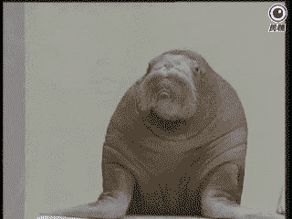](https://i.giphy.com/media/RhPvGbWK78A0/giphy.gif)

### 浏览器兼容性✔

如今，所有现代浏览器都支持 flexbox。

[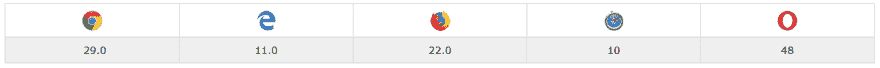](https://res.cloudinary.com/practicaldev/image/fetch/s--CS9_3yb1--/c_limit%2Cf_auto%2Cfl_progressive%2Cq_auto%2Cw_880/https://thepracticaldev.s3.amazonaws.com/i/auwgikbmrtxvlw5hbwt2.PNG)

* * *

### 概念💡

请将下图作为下一个概念的参考:

[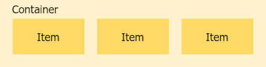](https://res.cloudinary.com/practicaldev/image/fetch/s--rxYw6TqE--/c_limit%2Cf_auto%2Cfl_progressive%2Cq_auto%2Cw_880/https://thepracticaldev.s3.amazonaws.com/i/4v61t0w8nmlf6n94kul6.png)

**display**
这个属性定义了一个 flex 容器，所以所有容器的子容器都有一个 flex 上下文。

```
.container {
  display: flex;
} 
```

<svg width="20px" height="20px" viewBox="0 0 24 24" class="highlight-action crayons-icon highlight-action--fullscreen-on"><title>Enter fullscreen mode</title></svg> <svg width="20px" height="20px" viewBox="0 0 24 24" class="highlight-action crayons-icon highlight-action--fullscreen-off"><title>Exit fullscreen mode</title></svg>

* * *

**伸缩方向**
使用这个属性我们设置主轴。Flexbox 是单向的，所以我们可以在水平行或垂直列中显示我们的项目。

[](https://res.cloudinary.com/practicaldev/image/fetch/s--iuEjgJU1--/c_limit%2Cf_auto%2Cfl_progressive%2Cq_auto%2Cw_880/https://thepracticaldev.s3.amazonaws.com/i/pp3bu9k73kbf36ycaxi8.png)T3】

```
.container {
  flex-direction: row | row-reverse | column | column-reverse;
} 
```

<svg width="20px" height="20px" viewBox="0 0 24 24" class="highlight-action crayons-icon highlight-action--fullscreen-on"><title>Enter fullscreen mode</title></svg> <svg width="20px" height="20px" viewBox="0 0 24 24" class="highlight-action crayons-icon highlight-action--fullscreen-off"><title>Exit fullscreen mode</title></svg>

* * *

**order**
使用 Flexbox，我们可以使用 order 属性来更改容器中每个项目的顺序。默认情况下，我们将在 HTML 上看到相同的订单。

[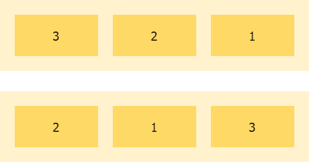](https://res.cloudinary.com/practicaldev/image/fetch/s--YD88mLmg--/c_limit%2Cf_auto%2Cfl_progressive%2Cq_auto%2Cw_880/https://thepracticaldev.s3.amazonaws.com/i/muituev7d33xwhrz15nd.png)T3】

```
.container {
  display: flex;
}
.item {
  order: <integer>;
} 
```

<svg width="20px" height="20px" viewBox="0 0 24 24" class="highlight-action crayons-icon highlight-action--fullscreen-on"><title>Enter fullscreen mode</title></svg> <svg width="20px" height="20px" viewBox="0 0 24 24" class="highlight-action crayons-icon highlight-action--fullscreen-off"><title>Exit fullscreen mode</title></svg>

* * *

这个属性定义了这个项目在我们的容器中应该占据多少可用空间。当我们想让一个项目在必要时增长时，这很有用。

[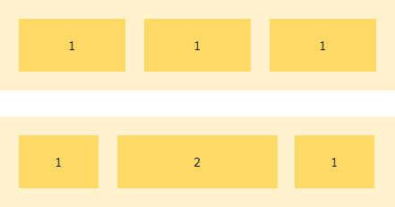](https://res.cloudinary.com/practicaldev/image/fetch/s--ES5qza0a--/c_limit%2Cf_auto%2Cfl_progressive%2Cq_auto%2Cw_880/https://thepracticaldev.s3.amazonaws.com/i/jpfp52729sogchtt2av1.png)T3】

```
.item {
  flex-grow: <number>; /* Default 0 */
} 
```

<svg width="20px" height="20px" viewBox="0 0 24 24" class="highlight-action crayons-icon highlight-action--fullscreen-on"><title>Enter fullscreen mode</title></svg> <svg width="20px" height="20px" viewBox="0 0 24 24" class="highlight-action crayons-icon highlight-action--fullscreen-off"><title>Exit fullscreen mode</title></svg>

* * *

**flex-wrap**
Flexbox 总是试图在一行中显示所有项目。为了防止这种情况，如有必要，我们可以使用 flex-wrap 属性。

[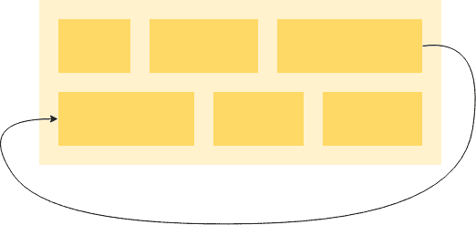](https://res.cloudinary.com/practicaldev/image/fetch/s--4aByDfyf--/c_limit%2Cf_auto%2Cfl_progressive%2Cq_auto%2Cw_880/https://thepracticaldev.s3.amazonaws.com/i/bnqcv1ob44geu6ck7x7j.png)

`nowrap` -默认值。一行中的项目。
`wrap`——上下多行。
`wrap-reverse`——自下而上多行。

```
.container {
   flex-wrap: nowrap | wrap | wrap-reverse;
} 
```

<svg width="20px" height="20px" viewBox="0 0 24 24" class="highlight-action crayons-icon highlight-action--fullscreen-on"><title>Enter fullscreen mode</title></svg> <svg width="20px" height="20px" viewBox="0 0 24 24" class="highlight-action crayons-icon highlight-action--fullscreen-off"><title>Exit fullscreen mode</title></svg>

* * *

**伸缩**
该属性定义了一个项目收缩的能力。

[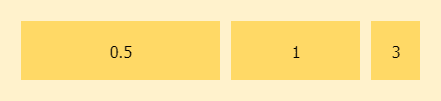](https://res.cloudinary.com/practicaldev/image/fetch/s--inukRBVo--/c_limit%2Cf_auto%2Cfl_progressive%2Cq_auto%2Cw_880/https://thepracticaldev.s3.amazonaws.com/i/v0il3npldiro9w9g7gnk.png)T3】

```
.item {
   flex-shrink: <number>; /* Default 1 */
} 
```

<svg width="20px" height="20px" viewBox="0 0 24 24" class="highlight-action crayons-icon highlight-action--fullscreen-on"><title>Enter fullscreen mode</title></svg> <svg width="20px" height="20px" viewBox="0 0 24 24" class="highlight-action crayons-icon highlight-action--fullscreen-off"><title>Exit fullscreen mode</title></svg>

* * *

利用这个属性我们可以避免使用`flex-grow`、`flex-shrink`和`flex-basis`。第二个参数是`flex-shrink`，第三个参数是`flex-basis`。默认`0 1 auto`。

```
.item{
  flex: none | [ <'flex-grow'> <'flex-shrink'>? || <'flex-basis'> ];
} 
```

<svg width="20px" height="20px" viewBox="0 0 24 24" class="highlight-action crayons-icon highlight-action--fullscreen-on"><title>Enter fullscreen mode</title></svg> <svg width="20px" height="20px" viewBox="0 0 24 24" class="highlight-action crayons-icon highlight-action--fullscreen-off"><title>Exit fullscreen mode</title></svg>

* * *

**justify-content**
用这个属性，我们定义了容器的子容器沿主轴的对齐方式。

[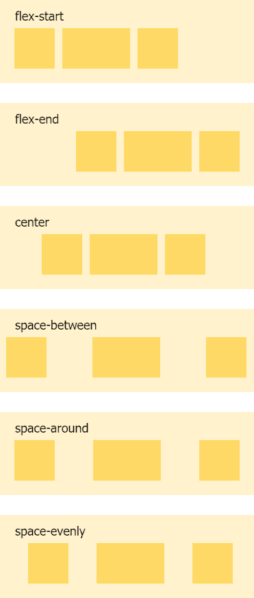](https://res.cloudinary.com/practicaldev/image/fetch/s--bA8acPLb--/c_limit%2Cf_auto%2Cfl_progressive%2Cq_auto%2Cw_880/https://thepracticaldev.s3.amazonaws.com/i/hzfzsyd8yd3viz338cee.png)

`flex-start` -默认值。项目靠左对齐。
`flex-end` -项目右对齐。
`center`——物品居中
`space-between`——物品均匀分布在直线上。左边第一件，右边最后一件。
`space-around`——物品周围等间距均匀分布。
`space-evenly` -两个项目之间的空间相等。

```
.container {
   justify-content: flex-start | flex-end | center | space-between | space-around | space-evenly;
} 
```

<svg width="20px" height="20px" viewBox="0 0 24 24" class="highlight-action crayons-icon highlight-action--fullscreen-on"><title>Enter fullscreen mode</title></svg> <svg width="20px" height="20px" viewBox="0 0 24 24" class="highlight-action crayons-icon highlight-action--fullscreen-off"><title>Exit fullscreen mode</title></svg>

* * *

**align-items**
定义我们的项目在与主轴相反的轴上将如何表现。(它总是垂直的)

[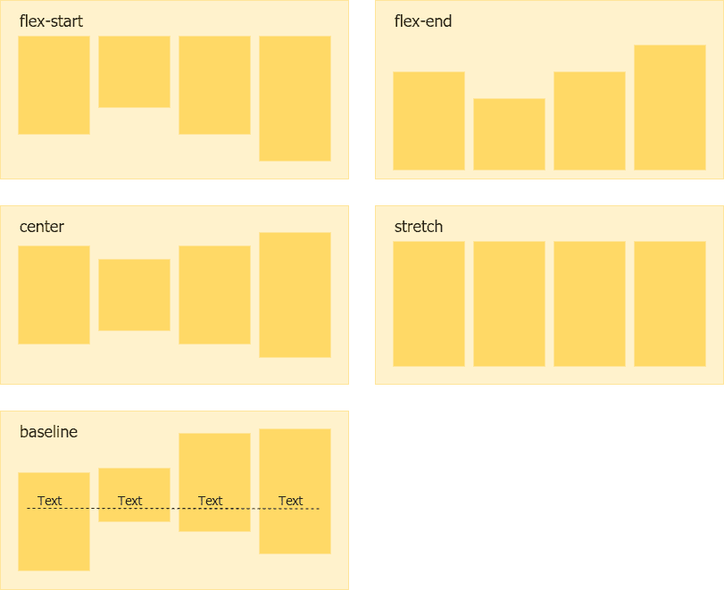](https://res.cloudinary.com/practicaldev/image/fetch/s---gngnE5x--/c_limit%2Cf_auto%2Cfl_progressive%2Cq_auto%2Cw_880/https://thepracticaldev.s3.amazonaws.com/i/4elluabvo9bzpifc7c48.png)

`flex-end` -项目的跨端边距边缘放置在跨端线
`flex-start` -项目的跨起始边距边缘放置在跨起始线
`stretch` -默认-填充容器时考虑最小宽度/最大宽度
`center` -项目居中
`baseline` -项目根据其基线对齐

```
.container {
   align-items: stretch | flex-start | flex-end | center | baseline;
} 
```

<svg width="20px" height="20px" viewBox="0 0 24 24" class="highlight-action crayons-icon highlight-action--fullscreen-on"><title>Enter fullscreen mode</title></svg> <svg width="20px" height="20px" viewBox="0 0 24 24" class="highlight-action crayons-icon highlight-action--fullscreen-off"><title>Exit fullscreen mode</title></svg>

* * *

**align-self**
使用该属性，我们可以覆盖特定项目的默认对齐。

[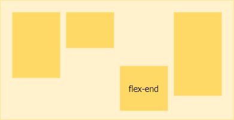](https://res.cloudinary.com/practicaldev/image/fetch/s--E9TEJcDJ--/c_limit%2Cf_auto%2Cfl_progressive%2Cq_auto%2Cw_880/https://thepracticaldev.s3.amazonaws.com/i/dd2jalha9rd9om8kg1bl.png)T3】

```
.item {
   align-self: auto | flex-start | flex-end | center | baseline | stretch;
} 
```

<svg width="20px" height="20px" viewBox="0 0 24 24" class="highlight-action crayons-icon highlight-action--fullscreen-on"><title>Enter fullscreen mode</title></svg> <svg width="20px" height="20px" viewBox="0 0 24 24" class="highlight-action crayons-icon highlight-action--fullscreen-off"><title>Exit fullscreen mode</title></svg>

* * *

当横轴上有多余的空间时，我们可以使用这个属性来对齐容器的行。

**Pro 提示:**仅当容器中有多行项目时才使用该属性。

[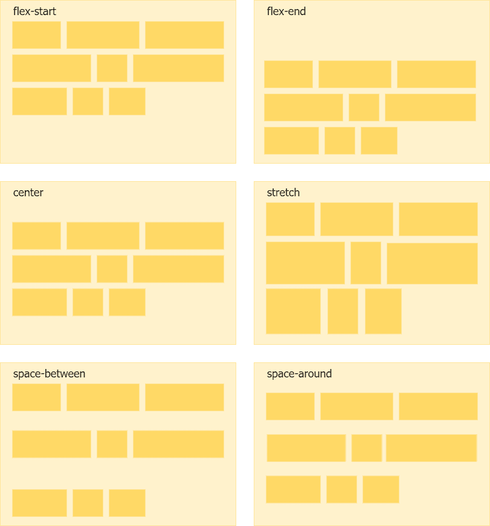](https://res.cloudinary.com/practicaldev/image/fetch/s--OwLN-fsz--/c_limit%2Cf_auto%2Cfl_progressive%2Cq_auto%2Cw_880/https://thepracticaldev.s3.amazonaws.com/i/u79ld71v9dswupj8grbn.png)

`stretch` -默认-内容将占用剩余空间
`flex-start` -行对齐到容器的开头
`flex-end` -行对齐到容器的结尾
`center` -行对齐到中心
`space-between` -行均匀分布，第一行在容器的开头，最后一行在容器的结尾
`space-around` -行均匀分布，周围有相等的空间

```
.container {
   align-content: flex-start | flex-end | center | space-between | space-around | stretch;
} 
```

<svg width="20px" height="20px" viewBox="0 0 24 24" class="highlight-action crayons-icon highlight-action--fullscreen-on"><title>Enter fullscreen mode</title></svg> <svg width="20px" height="20px" viewBox="0 0 24 24" class="highlight-action crayons-icon highlight-action--fullscreen-off"><title>Exit fullscreen mode</title></svg>

* * *

### 游乐场👨‍💻

你好奇吗？试一试，玩一玩。

[https://codepen.io/ecastellano/embed/BgNZPW?height=600&default-tab=result&embed-version=2](https://codepen.io/ecastellano/embed/BgNZPW?height=600&default-tab=result&embed-version=2)

### 感谢🙌

希望这篇文章对你有帮助。如果你有任何问题，请随时联系我。