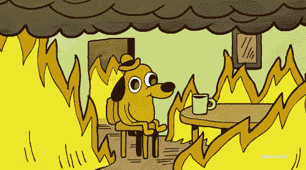
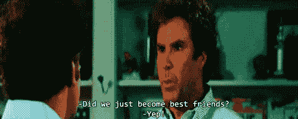
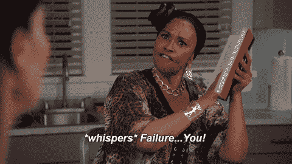
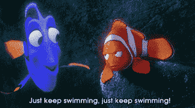

# 如何度过训练营的头几周

> 原文：<https://dev.to/austenhasty/tips-for-surviving-your-first-weeks-in-a-bootcamp-e3e>

当我报名参加一个编码训练营时，我只知道它将会很激烈。软件工程的世界对我来说是全新的，我将在很短的时间内接触到大量的信息。我唯一的经历是我上过的几门课程，但那短暂的接触足以让我放弃我的整个生活，去追求这种新发现的激情。我最终选择了一个身临其境的训练营，因为我知道我需要这样的结构，而且我在教室里比自己学得更好。如今有无数的训练营可供选择，成功的第一步是选择最适合你的。一旦我选择了我的，我就知道没有回头路了。

## 深呼吸

我们开始了学习 Ruby 的课程。我认为我已经很好地掌握了给我的准备工作材料(实验、自述文件等)...)，但那个假设很快就破灭了。突然间，信息以我无法理解的速度向我袭来。所有的准备工作都是按照我自己的进度完成的，但是我被期望学习的新速度是令人震惊的。对我来说，重要的是要记住，这正是我报名参加的目的；这应该是压倒性的。毕竟，我只是一个没有任何经验的初学者。我必须记得对自己和自己的适应能力有信心。显然有可能了解到这些信息。许多其他人都经历过训练营。我需要深呼吸，拥抱作为一个初学者。

## 你并不孤单

在这段旅程中要记住的下一件事是，你并不孤单。你有一个班的人都在完全相同的旅程。走出你的舒适区，去见见他们。他们是你的朋友和盟友。把它想象成你第一次涉足社交网络。此外，在这个过程中，没有什么比听别人谈论他们在同一材料上的斗争更让人放心的了。随着你在训练营的进展，与你的同学就你可能在一些代码中遇到的错误进行合作是很有帮助的。如果你和我一样，你会退缩或孤立自己，而不是追求新的友谊，尤其是在受到挑战和不知所措的时候。所有这些只会减缓你在课程中的成长和理解。友情让我有归属感，并激励我更加努力地工作。更不用说，能够在这个过程中互相帮助，这是非常值得的，也是一种自信的提升。

## 问，问，问

你会不知所措的。你会很困惑的。重要的是要记住，你拥有一切成功的资源。利用所有这些。遇到有挑战性的事情，提问！这是我最难做的事情之一。我喜欢自己解决问题，所以当我遇到让我困惑的概念时，我坐在那里沮丧地试图自己解决问题。这导致我在课程和理解关键新概念上落后了。当我最终放下自我，承认我需要一些帮助来理解一些材料时，事情变得简单多了。我想在内心深处，我害怕自己会因为没有立即理解新材料而受到批评...但问题是我的许多同龄人也不理解事情，他们中的许多人只是在需要帮助时毫不犹豫地寻求帮助！

## 失败是过程的一部分

一个我必须快速记住的重要概念是失败。我总是赋予它如此负面的含义，以至于我花了一段时间来适应我的代码经常会失败的想法。从所有的失败中吸取的重要的东西是每次失败给你的信息。我学会了一次一个失败地“推进”我的代码，一次一个地征服失败/错误消息，直到每个项目完成。仔细阅读每条失败/错误消息，并把消息“推进”到不同的失败，这实际上是我写所有代码的方式...我甚至自己测试我的代码，以确保我写的所有东西都能工作！

## 继续走！(你知道的比你做的多)

也许对我来说，整个训练营经历中最可怕的部分是“代码挑战”的想法，以衡量我的进步，并确保我知道足够多的知识来继续更高级的材料。这么多信息这么快就抛给我，我不能确定我实际上保留了多少。当我觉得自己终于开始理解一个概念的时候，我会去另一个实验室，然后完全被难倒。这是令人难以置信的沮丧，很容易觉得我没有学到任何东西。所以当我被要求完成一项“代码挑战”时，我真的不确定我是否能和其他同学一起进步。然而，事实证明我一直都在学习。通常很难全面衡量你所学的一切，因为你不断受到新信息的轰炸，但要相信这个过程！每天都有新的材料需要掌握，但是不要忘记偶尔欣赏一下你已经走了多远。

## 这一切都值得

过去的几周是我经历过的最艰难的几周。这么多的材料来得这么快。太吓人了。很难。压力很大。哇，这真令人沮丧。不过，在一天结束时，这是我做过的最有意义的事情。我遇到的每一个新挑战和每一段代码都像是另一个难题，没有什么比解决它更好的了。到目前为止，最有收获的一次经历是和我的一个同学一起拼凑了前几周的所有东西，构建了一个 CLI 应用程序。我知道我还有很长的路要走，但我迫不及待地想继续学习和提高我的技能。最后，毫无疑问，为了最终拥有一份做我喜欢的事情的职业，漫长的夜晚和清晨都是值得的！