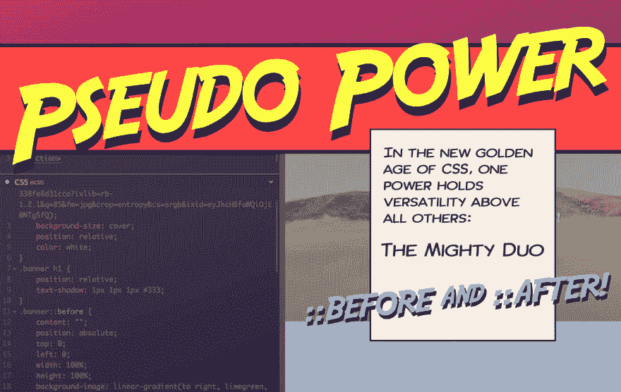

# 用 CSS 伪元素创建惊人的边框

> 原文：<https://dev.to/brob/create-amazing-borders-with-css-pseudo-elements-10lm>

在 Houdini Paint API 应用于所有浏览器之前，你可能会觉得元素的边框很无聊。使用简单的 CSS 和::before 和::after，可以给所有浏览器带来一些有趣的想法。

在本教程中，我将向你展示如何为任何标题或文本制作一个截断的、全渐变的、倾斜的边框。

你会用伪元素做什么样的边框或风格元素？

## 新课程:伪动力:使用强大的 CSS ::before 和::after 伪元素

在本课程中，我将解释什么是伪元素，并深入研究它们的许多用例。我仍在计划内容，但正如我所有的课程一样，将会有大量的示例和代码可以让您立即上手。以下是我们将要学习的一些用法示例:

*   遮掩
*   花哨的边框
*   整洁的文本链接悬停
*   多重装饰元素
*   仅 CSS 工具提示

[注册以了解最新信息，并在课程开始时获得优惠券代码](https://store.codecontemporary.com/pseudo-power-using-the-powerful-css-before-and-after-pseudo-elements)！