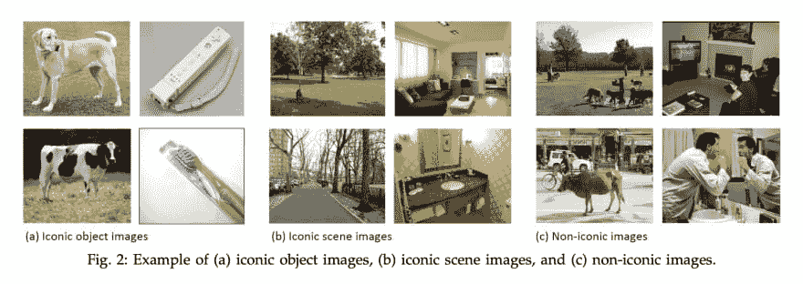
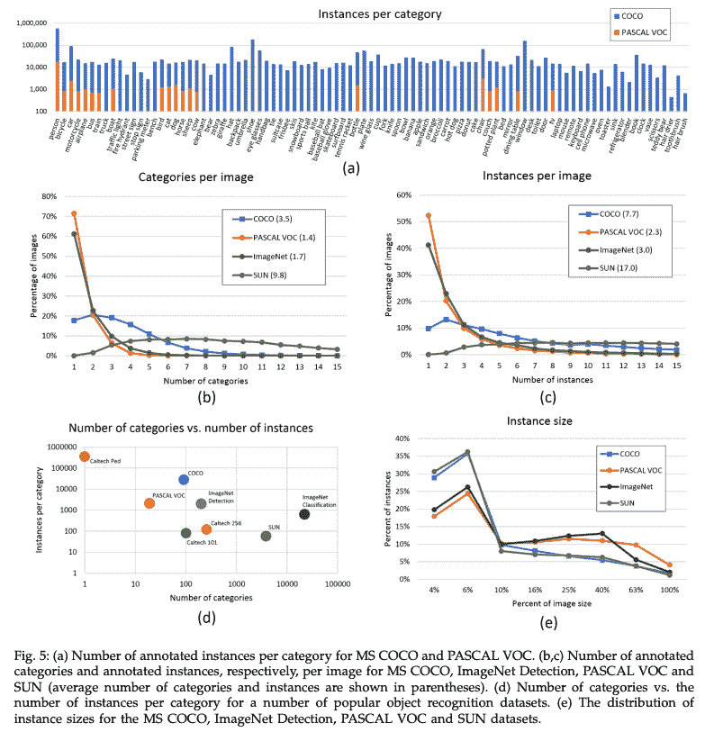
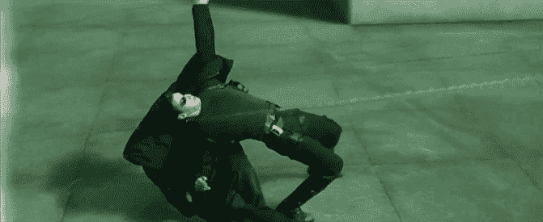

# 让我们一边看图像，一边谈论其他图像

> 原文：<https://dev.to/upwardtrajectory/let-s-look-at-images-while-talking-about-other-images-bbg>

### 微软*上下文中常见对象的快速总结*图像数据库

[据说](https://www.forbes.com/sites/gilpress/2016/03/23/data-preparation-most-time-consuming-least-enjoyable-data-science-task-survey-says/#615638c36f63)数据科学家花 60%的时间清理数据，19%的时间构建数据集，这使得数据科学家只有 21%的时间分配给其他任务，例如:

*   建筑模型
*   迭代地改进那些模型
*   参加本应是电子邮件的会议

关于机器学习(以及一般的数据科学)的许多最令人兴奋的部分都停留在许多相当无聊和平凡的任务后面。

2015 年，[发表了一篇论文](https://arxiv.org/pdf/1405.0312.pdf)，描述了“超过 70，000 个工人小时”花费在建立一个巨大的标签照片数据集上。这个数据集的目标是为机器学习模型提供训练数据，以帮助“场景理解”。当时，已经存在多个图像数据集(我将很快对其进行总结)，这些数据集既关注各种各样的对象，也关注每种对象类型的许多实例。然而，微软想要解决的一个主要问题是，图像中的许多对象和场景都是孤立的，在正常情况下几乎看不到。这是报纸上的一个例子。
T3T5】

左边的 4 组图像类似于当时用于对象检测的“行业标准”，而中间的组显示了标志性的场景:院子、客厅、取自 *SUN 数据库的街道:从修道院到动物园的大规模场景识别*。问题是，这些图像中有许多都太理想化了，好像是专业摄影师为目录或房地产清单拍摄的。然而，微软的研究人员更感兴趣的是显示在右侧群集内的非图标图像。为了使计算机视觉有效，我们需要与我们想要预测的未来任务类型紧密匹配的训练数据。由于那个数据集不存在，微软的一些聪明人决定建立它。

现在你知道了他们的动机，我将谈论他们的方法，但首先，让我们更深入地了解这篇论文发表时大型计算机视觉数据集的状态。

| 数据集名称和链接 | 图像数量 | 标签类别的数量 | 发布年份 | 赞成的意见 | 骗局 |
| --- | --- | --- | --- | --- | --- |
| [ImageNet](http://www.image-net.org/about-overview) | Fourteen million one hundred and ninety-seven thousand one hundred and twenty-two | One thousand | Two thousand and nine | 大量的类别和图片 | 受试者大多是孤立的，脱离正常的环境 |
| [孙数据库](https://vision.princeton.edu/projects/2010/SUN/) | One hundred and thirty-one thousand and sixty-seven | Three hundred and ninety-seven | Two thousand and ten | 高“图像复杂性”,每张照片有多个主题 | 任何一个类别的总体实例都更少 |
| [PASCAL VOC 数据集](http://host.robots.ox.ac.uk/pascal/VOC/) | Five hundred thousand | Twenty | Two thousand and twelve | 每个类别相当高的实例 | “图像复杂度”低，类别相对较少 |
| [可可女士](http://cocodataset.org/#home) | Two million five hundred thousand | Ninety-one | Two thousand and fifteen | 良好的“图像复杂性”，每个类别的实例数量高 | 类别的数量可能会更高，但总的来说，在发布时没有太多的负面影响。 |

附注:这篇博文中的大部分图片都是直接从上面链接的学术论文中复制的。如果你想知道他们方法论的细节，我鼓励你阅读这篇论文。它写得很好，相当短，只有大约 9 页的文本(包括附录)，还有许多有见地的图片和图表。这是他们对 4 个大型图像数据集的信息密度比较。我最喜欢的图是左下角的散点图。注意 X 轴和 Y 轴上的对数刻度。

我希望你和我一样喜欢研究这些图表。现在我们都在一个良好的顶部空间，让我们潜入巨大的规划和努力，进入创造可可小姐。为了简洁，我将在大纲中这样做。

### 这是怎么做到的

1)认识到当前数据集在哪些方面存在不足，并激励某人投入资源来解决这些不足

*   低图像复杂度
*   标签只是边界框，而不是像素化阴影

2)在“日常”环境中找到多个对象/场景的图片，而不是舞台场景

*   Flickr 包含业余摄影师上传的照片，带有可搜索的元数据和关键词
*   同时搜索多个对象，而不仅仅是单个单词/主题
    *   *猫酒杯*比仅仅是*猫酒杯*或者*酒杯*要好

3)手动注释图像:[亚马逊的机械土耳其人(AMT)](https://www.mturk.com/) 是一个众包工作的平台，但必须注意保持高标准

a)标签类别-此图片中是否有 *____________* ？

*   每个问题由不同的 AMT 员工重复 8 次，以提高回忆率。8 个工人都“弄错”的几率非常低。

b)实例定位-在此图片中已经有一个 *____________* ，在您看到的每个离散实例上放置一个标记。

*   对于不同的 AMT 员工，每个问题也要重复 8 次。

c)实例分割-在每个个体 *____________* 出现的地方对照片进行着色(平均来说，任何一张照片都有 7.7 个需要着色的实例)

*   设计一个界面，允许工作人员对图像中物体所在的特定像素进行着色。
*   对 2，500，000 个对象实例进行分段是一项极其耗时的任务，每 1，000 个分段需要超过 22 个工作小时。(每个实例大约 80 秒)
    *   由于这个原因，只有一个工人将分割每个实例，但需要高水平的培训和质量控制。

在我们看结果之前，我想提醒你一下 *Werlindo 的饱和现象*:

1) *展品 A* 超级新颖和酷，人们喜欢它

2)每个人都复制*展品 A* 的效果，以至于它被过度使用并被认为是俗气的

3)不在/不知道*展品 A* 的人第一次看到它时，认为“看起来很俗气”，没有意识到他们正在看的是一种令人惊叹的东西，这种东西彻底改变了一种体验。

我第一次听说这个是在《黑客帝国》的“子弹时间”里

对比“低预算”版本。

我提出这一点，因为即使我们在过去几年里已经看到了许多很酷的图像识别和着色演示，以至于认为它们是正常的，如果没有建立一个大规模、复杂标记的自然场景图像数据集这一相当无聊的任务，这一切都是不可能的。

### 感谢微软 COCO。

我本打算在这个博客上添加更多的图片来展示这个项目的成果，但是相反，你应该自己动手[摆弄](http://cocodataset.org/#explore)数据集。甚至有[预先训练好的模型](https://github.com/tensorflow/models/blob/master/research/object_detection/g3doc/detection_model_zoo.md)“开箱即用”来利用所有这些艰苦的工作，几乎不需要你额外的投入。