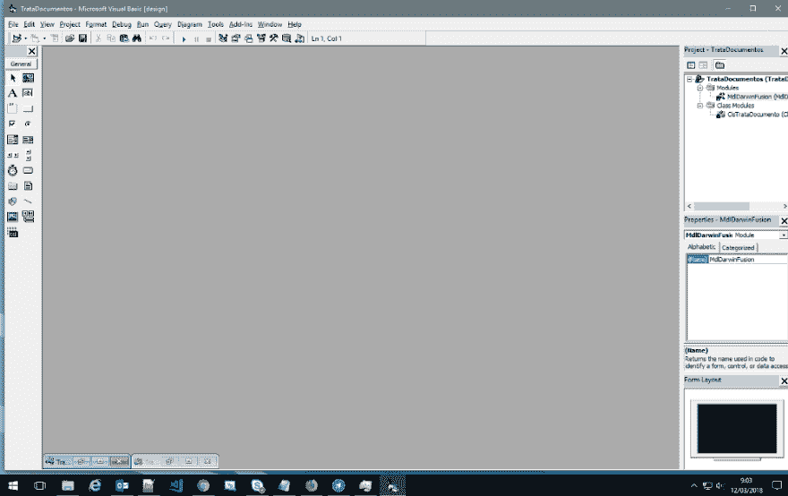

# 在 Windows 10 中安装 Visual Basic 6.0

> 原文：<https://dev.to/angelesbroullon/installing-visual-basic-6-0-in-windows-10-1kjn>

我最近被要求调试一个预。NET 应用程序 Visual Basic，所以我必须为 Windows 98 开发建立环境…但是现在所有这些软件都被废弃了，没有支持。这是我从安装和运行它的经验中学到的，但是如果你可以选择的话，我建议你重写代码。NET，由于这种 DLL 代码依赖于平台，20 年来事情发生了很大的变化。

## 1。-删除先前失败的 VB6 安装尝试中的所有文件

注意避免删除最新的 Visual Studio 版本，因为它们可能有相似的路径。

*   在 64 位系统中，Visual Studio 6.0 文件默认位于`C:\Program Files (x86)`下。

```
C:\Program Files (x86)\Microsoft Visual Studio\Common
C:\Program Files (x86)\Microsoft Visual Studio\MSDN
C:\Program Files (x86)\Microsoft Visual Studio\MSDN98
C:\Program Files (x86)\Microsoft Visual Studio\VB98
C:\Program Files (x86)\Microsoft Visual Studio\VC98
C:\Program Files (x86)\Microsoft Visual Studio\*.HTM
C:\Program Files (x86)\Microsoft Visual Studio\*.TXT
C:\Program Files (x86)\Common Files\Microsoft Shared\MSDesigners98
C:\Program Files (x86)\Common Files\Microsoft Shared\MSDN
C:\Program Files (x86)\Common Files\Microsoft Shared\VS98
C:\Program Files (x86)\Common Files\Microsoft Shared\Wizards98 
```

<svg width="20px" height="20px" viewBox="0 0 24 24" class="highlight-action crayons-icon highlight-action--fullscreen-on"><title>Enter fullscreen mode</title></svg> <svg width="20px" height="20px" viewBox="0 0 24 24" class="highlight-action crayons-icon highlight-action--fullscreen-off"><title>Exit fullscreen mode</title></svg>

*   清理 Windows 注册表条目:运行`regedit.exe`并删除以下注册表项(如果它们存在)。

```
HKEY_LOCAL_MACHINE\Software\Microsoft\DevStudio
HKEY_LOCAL_MACHINE\Software\Microsoft\HTML Help Collections
HKEY_LOCAL_MACHINE\Software\Microsoft\MSVSDG
HKEY_LOCAL_MACHINE\Software\Microsoft\Visual Basic\6.0
HKEY_LOCAL_MACHINE\Software\Microsoft\Visual Component Manager
HKEY_LOCAL_MACHINE\Software\Microsoft\Visual Modeler
HKEY_LOCAL_MACHINE\Software\Microsoft\VisualStudio\6.0
HKEY_LOCAL_MACHINE\Software\Wow6432Node\Microsoft\DevStudio
HKEY_LOCAL_MACHINE\Software\Wow6432Node\Microsoft\HTML Help Collections
HKEY_LOCAL_MACHINE\Software\Wow6432Node\Microsoft\MSVSDG
HKEY_LOCAL_MACHINE\Software\Wow6432Node\Microsoft\Visual Basic\6.0
HKEY_LOCAL_MACHINE\Software\Wow6432Node\Microsoft\Visual Component Manager
HKEY_LOCAL_MACHINE\Software\Wow6432Node\Microsoft\Visual Modeler
HKEY_LOCAL_MACHINE\Software\Wow6432Node\Microsoft\VisualStudio\6.0
HKEY_CURRENT_USER\Software\Microsoft\DevStudio
HKEY_CURRENT_USER\Software\Microsoft\MSVSDG
HKEY_CURRENT_USER\Software\Microsoft\Visual Basic\6.0
HKEY_CURRENT_USER\Software\Microsoft\Visual Modeler
HKEY_CURRENT_USER\Software\Microsoft\VisualFoxPro
HKEY_CURRENT_USER\Software\Microsoft\VisualStudio\6.0 
```

<svg width="20px" height="20px" viewBox="0 0 24 24" class="highlight-action crayons-icon highlight-action--fullscreen-on"><title>Enter fullscreen mode</title></svg> <svg width="20px" height="20px" viewBox="0 0 24 24" class="highlight-action crayons-icon highlight-action--fullscreen-off"><title>Exit fullscreen mode</title></svg>

## 2。-修改安装文件以适应当前的技术

首先，您需要在硬盘上安装一份 Visual Studio 安装程序。我把一张旧的大学授权光盘的内容复制到一个文件夹中，然后开始编辑。

*   用文本编辑器(例如 Notepad++)打开`SETUPWIZ.INI`，并用一个空的 va 替换试图安装一个非常旧的 Java 实现并使安装过程失败的`VmPath=ie4\msjavx86.exe`。

```
[setup wizard]
eula = eula.txt
NTSP = NTsp3\nt4sp3_i.exe
NTSpMinVer = 3
IE4 = ie4\ie4setup.exe
CommonFilesMin = 50
IEIni=ie4check.ini
WFCClean = setup\wfcclean.exe
readme = readmevs.htm
pid = setup.ini
MSDN = setup.exe
Acme = acmboot.exe
AcmeId = vs98ecd1.inf
STF = setup\vs98ent.stf
DCOM98 = dcom98\dcom98.exe
MSDNID = msdn3?1.inf
NtSpUrl = ftp://ftp.microsoft.com/bussys/winnt/winnt-public/fixes/
IeUrl = http://www.microsoft.com/ie/ie40/download/
UsrUrl = http://msdn.microsoft.com/vstudio/register/default.htm
RegUrl = http://www.microsoft.com/isapi/redir.dll?Prd=vstudio&Pver=98&Ar=register
VmPath= 
```

<svg width="20px" height="20px" viewBox="0 0 24 24" class="highlight-action crayons-icon highlight-action--fullscreen-on"><title>Enter fullscreen mode</title></svg> <svg width="20px" height="20px" viewBox="0 0 24 24" class="highlight-action crayons-icon highlight-action--fullscreen-off"><title>Exit fullscreen mode</title></svg>

*   您还必须编辑`SETUP.EXE`属性。转到文件的上下文菜单(默认为右键单击)，选择属性，然后转到“兼容性”选项卡。检查您是否选择了:

    *   兼容模式:作为“Windows XP (Service Pack 3)”执行。
    *   配置:“以管理员身份执行此程序”。

## 3。-执行向导安装程序

1.  打开`SETUP.EXE`的上下文菜单，选择“以管理员身份运行”。
2.  不要安装“源代码安全”，因为它会失败。
3.  当我们转到“选择安装模式”时，选择“自定义”。然后按照以下步骤操作:

*   **不要安装**(因为它们会失效):
    *   微软 Visual FoxPro 6.0
    *   Microsoft Visual InterDev 6.0
    *   Microsoft Visual SourceDafe 6.0
    *   ActiveX(过时版本，与当前版本产生冲突)
*   安装 unicode 库:从自定义主菜单中，选择文本“Microsoft Visual C++ 6.0”，右侧的按钮“更改选项”将被设置为活动状态。点击它，并按照类似的过程为' VC++ MFC 和模板库'和' MS 基础类库'。最后选择所有这些选项:
    *   静态库
    *   共享库
    *   Unicode 的静态库
    *   Unicode 的共享库
    *   浏览器数据库
    *   源代码
*   安装数据库:从主“自定义”菜单中，单击“数据访问”文本，右侧的按钮“更改选项”将被设置为活动状态。单击它，并确保没有选择“ADO，RDS 和 OLE DB 提供程序”。你会得到一个警告信息，说这个组件对于应用程序是必不可少的，但是你应该忽略它，因为它会在 Windows 10 上崩溃。请仅选择以下选项:
    *   Microsoft ODBC 驱动程序
    *   远程数据对象和控件
    *   数据环境
*   安装工具:从主“自定义”菜单中，单击“企业工具”文本，右侧的按钮“更改选项”将被设置为活动状态。检查是否未选择“Visual Studio Analyzer”。因此，请仅选择:
    *   应用性能浏览器
    *   贮藏室ˌ仓库
    *   可视组件管理器
    *   Visual Basic 企业组件
    *   VC++企业工具
    *   Microsoft 可视化建模工具
*   最后一步，在点击“完成”之前，不要让程序配置环境变量。
    *   如果你已经等了 5 分钟以上，而程序仍然在“配置系统”，你可以假设有什么地方出了问题，安装被冻结了。取消它，清理(见本文顶部的第一部分)并重新开始，仔细阅读步骤。
    *   如果有关于 Java 机器的错误消息，您可以忽略它。到那时，你应该能够在没有 MSDN 帮助包的情况下运行“Visual Basic ”,这样你就可以获得基本的功能体验。

## 4。-执行应用程序

总是在管理员模式下运行(右键单击 Visual Basic 6.0，然后选择“以管理员身份运行”)。然后，它在这里，准备运行和调试古老的 dll。

[](https://res.cloudinary.com/practicaldev/image/fetch/s--wErEu7Lg--/c_limit%2Cf_auto%2Cfl_progressive%2Cq_auto%2Cw_880/https://thepracticaldev.s3.amazonaws.com/i/vqb63sesqgzizfhevfma.png)

❗️如果你想让程序使用微软 Office 2010 实例运行，你需要加载一些依赖项。转到“项目/参考”并选择:

*   Visual Basic for Applications
*   Visual Basic 运行时对象和过程
*   Visual Basic 对象和过程
*   OLE 自动化
*   Microsoft Excel 15.0 对象库
*   Microsoft Word 15.0 对象库

## 5。-参考文献

*   [在 Windows 10 上安装 Visual Basic/Studio 6 | danbrust . net:博客](http://blog.danbrust.net/2015/09/14/installing-visual-basic-studio-6-on-windows-10/#.WUhzTGjyuUl)
*   [在 Windows 10 上安装 Visual Studio 6.0 代码项目](https://www.codeproject.com/Articles/1191047/Install-Visual-Studio-on-Windows)