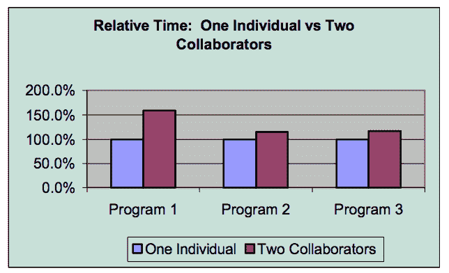
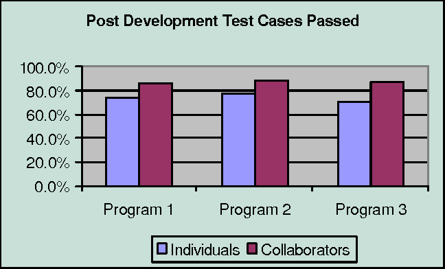
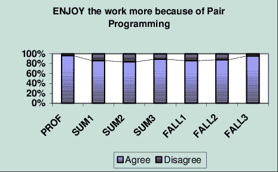
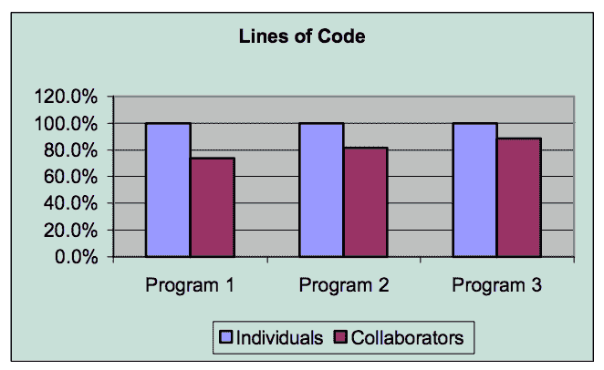

# 结对编程的好处

> 原文：<https://dev.to/milandhar/the-benefits-of-pair-programming-470h>

> “在人类(以及动物)漫长的历史中，那些学会最有效地合作和随机应变的人一直占据上风。”查尔斯·达尔文

我在熨斗学校的时候，我非常喜欢的一个方面是和我的同学一起编程。课程包括持续几个小时的小型“结对实验”和持续四至五天的大型结对项目。这两种风格都让我尝到了在团队开发环境中工作的滋味，并且对我的学习和许多概念的流畅性大有裨益。与不同性格类型和技术能力的人一起工作很有趣。结对编程也挑战了我过去的刻板印象，即工程师在凌晨 2 点钟独自一人把自己锁在黑暗的房间里，喝着一罐激浪。

虽然这些结对实验室和项目到目前为止都很棒，但我发现自己对结对工作时如何优化自己的效率和表现很感兴趣。我也想知道结对编程是否被证明比单独工作更有效。这些问题让我对结对编程这个话题进行了额外的研究，并由此产生了这篇博客！

# 什么是结对编程？

在基本层面上，结对编程是两个人并排坐在一台计算机上开发软件的敏捷技术。在大多数结对编程场景中，一个程序员(驱动程序)编写代码，而另一个程序员(导航程序)在输入时检查每一行。虽然从表面上看，这种做法似乎是浪费资源，因为它需要两个人来完成一个人可以完成的任务，但研究表明结对编程对工程和组织效率有重大影响。

## 结对编程的经济学

在犹他大学的一项研究中，没有接触过结对编程的学生被分配成对完成三项任务，1/3 的学生作为对照组独自完成。从下图中可以看出，在第一个项目所示的调整期之后，结对的学生只比单独的学生多花了大约 15%的时间。

抵消了花在结对编程上增加的工时，结对产生的代码比单独开发的代码缺陷少 15%(见下图)。由于解决一个 bug 平均需要 4 到 16 个小时，结对编程减少 bug 的好处将超过大多数项目中额外的工时成本。

## 满意

在开始在 Flatiron 工作之前，我从未听说过结对编程，当我发现我们将结对做这么多工作时，我起初持怀疑态度。我认为 50%的时间看别人做工作会妨碍我的学习，担心沟通会有困难。然而，这种不确定性随着我们在课程中的进步和更多的两人一组练习而逐渐消失。

犹他大学的研究反映了新结对程序员中类似的情绪。下图显示了学生结对程序员和专业结对程序员的调查结果。很明显，大多数程序员更喜欢协作工作。

## 设计质量

结对编程的另一个效果是提高了最终程序的设计质量。在犹他大学的研究中，成对的程序员比单独的程序员完成了更高质量的项目，并且用更少的代码实现了与单独的程序员相同的功能。

# 结对编程的风格

有几种风格的结对编程适合不同的场景和队友之间的经验水平。

## 驾驶员-导航仪

驾驶员导航器可能是结对编程中使用最广泛的风格。类比是相对清楚的:一对成员中的一个充当“司机”，做打字工作，确保代码的机制到位，并避免任何障碍；另一个成员扮演“导航员”的角色，检查错误，思考必须完成的目标和项目的整体架构。

驾驶员-导航员风格适用于两个专家或一对专家-新手。在这种情况下，专家最好是导航者，新手最好是驾驶员，以防止新手在专家扮演两种角色时仅仅观察。

## 后座导航仪

这种风格类似于驾驶员-导航员，但是导航员从驾驶员那里接管了更多的战术角色。在后座导航中，驱动程序仍然处理键盘和输入，但是导航器指示语法指令，例如用什么名称调用变量或者调用什么特定方法。

后座导航风格最适合新手当司机，专家当导航员，让新手边做边学。

## 乒乓配对

开发中经常使用另一种结对编程方式是乒乓结对。在这种模式中，第一个人编写一个当前失败的测试，第二个人让测试通过。然后第二个人写一个失败的测试，第一个人让它通过。

乒乓配对的好处是，它使角色能够频繁转换，并迫使工程师关注开发的编码和测试方面，在这个过程中熟悉 TDD。这种配对方式最适合两个专家，尤其是如果他们也是 TDD 方面的专家。但它也可以很好地与新手-专家结对，以及新手-新手结对，让初学者练习编写测试。

## 分布式配对

这更像是一种非正式的结对方式，但很可能是结对编程的未来。随着越来越多的开发工作空间转向远程和全球环境，屏幕共享技术变得无处不在，分布式配对继续流行。

分布式结对编程包括通过实时协作编辑器、共享桌面或远程 IDE 插件工作的两个人。分布式结对编程受益于位于不同位置的灵活性，但是引入了新的困难，这些困难伴随着面对面通信的丢失。这有时会使记住哪个程序员扮演驱动程序的角色变得模糊不清。

# 结论

最后，学习和体验结对编程在 Flatiron 和更大的开发者社区中是多么受重视，这是令人鼓舞的。我期待着继续完善我的结对编程技巧，并向我的同事们学习！

#### 我在这篇文章中引用的来源:

[https://en.wikipedia.org/wiki/Pair_programming](https://en.wikipedia.org/wiki/Pair_programming)
T3】https://collaboration . CSC . ncsu . edu/Laurie/Papers/XPSardinia。PDF
[https://stackify.com/pair-programming-styles/](https://stackify.com/pair-programming-styles/)
[https://medium . com/@ web lab _ tech/pair-programming-guide-a 76 ca 43 ff 389](https://medium.com/@weblab_tech/pair-programming-guide-a76ca43ff389)