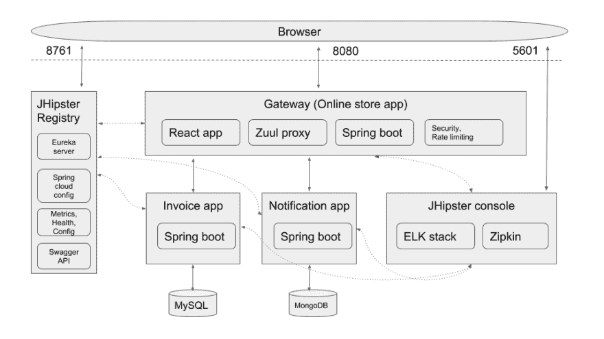
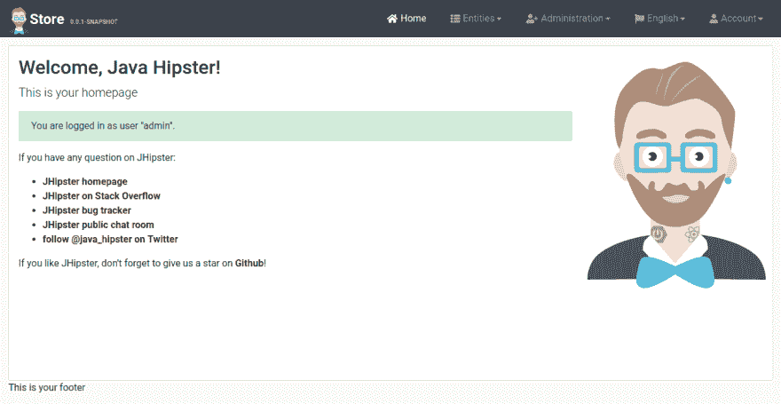
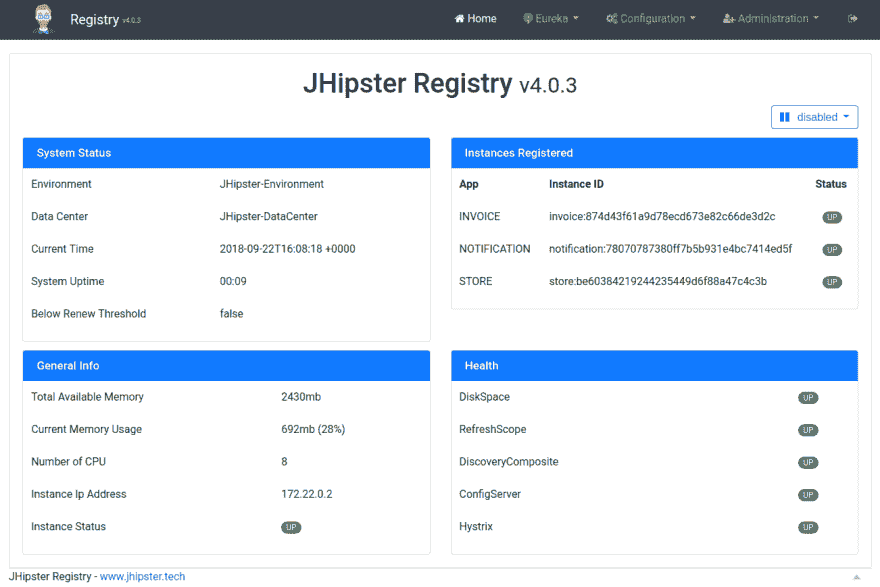
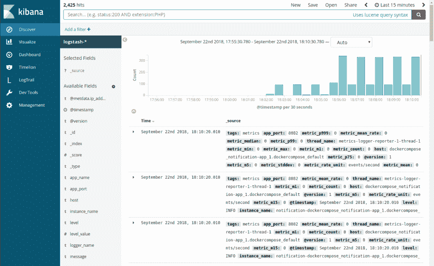

# 使用 JHipster 领域语言在 30 分钟内创建完整的微服务堆栈

> 原文：<https://dev.to/deepu105/create-full-microservice-stack-using-jhipster-domain-language-under-30-minutes-4ele>

*最初发布于[deepu . tech](https://deepu.tech/create-full-microservice-stack-using-j-hipster-domain-language-under-30-minutes/)T3。*

我写博客已经有一段时间了，几年前我写了一些，但从来没有真正继续写过。所以当我决定重新开始写作时，我不需要对一个主题想太多，因为这个主题很明显——T2。

JHipster 是 Java web 应用程序和微服务开发的开发平台。如果你是一个 JVM 开发者，你可能已经听说过 [JHipster](https://www.jhipster.tech/) 。如果没有，那么，你错过了很多，我强烈建议你去看看。你也可以在[亚马逊](https://www.amazon.com/Stack-Development-JHipster-Deepu-Sasidharan/dp/178847631X)和 [Packt](https://www.packtpub.com/application-development/full-stack-development-jhipster) 上查看我的书《**用 JHipster** 进行全栈开发》来了解 JHipster。

我从 2015 年 4 月开始开发 JHipster，到目前为止，我实现的最酷的功能无疑是使用 JDL 生成多个应用程序。这个特性在 JHipster 的最新版本中可用。如果你对 JDL 不熟悉，我推荐你去 https://www.jhipster.tech/jdl/查阅这些文件

## 电子商务应用

因此，让我们看看如何使用 JHipster 创建微服务堆栈。我们今天将建立一个电子商务商店。堆栈包括-

*   使用 JHipster Registry 的服务发现，这是一个 Spring boot 应用程序，它打包了 Eureka server 和 Spring cloud config server。

*   使用 Spring Boot、网飞 Zuul、ReactJS 和 Swagger 的 API 管理和网关。

*   使用 Spring Boot 的微服务。

*   使用由弹性堆栈(ELK)和 Zipkin 制成的 JHipster 控制台进行监控。

[ ](https://res.cloudinary.com/practicaldev/image/fetch/s--DXg7gK9m--/c_limit%2Cf_auto%2Cfl_progressive%2Cq_auto%2Cw_880/https://cdn-images-1.medium.com/max/2000/1%2Ab4krMVZ-mqjxAIh_EM1jhQ.png) *微服务应用架构*

网关将传入的请求路由到两个微服务，发票应用程序和通知应用程序。

### 要求

为了遵循这个教程，你需要在你的电脑上安装一个最新版本的 **Docker** 、 **Docker-compose** 、 **NodeJS** 和 **Java** 。以下是我安装过的版本(**更新**:有了 JHipster 6+就可以用 Java 11 & 12)。

```
$ docker -v                                                                                                                       
Docker version 18.06.1-ce, build e68fc7a

$ docker-compose -v                                
docker-compose version 1.20.1, build 5d8c71b

$ node -v                
v8.11.4

$ java -version          
openjdk version "1.8.0_212"
OpenJDK Runtime Environment (Zulu 8.38.0.13-CA-linux64) (build 1.8.0_212-b04)
OpenJDK 64-Bit Server VM (Zulu 8.38.0.13-CA-linux64) (build 25.212-b04, mixed mode) 
```

<svg width="20px" height="20px" viewBox="0 0 24 24" class="highlight-action crayons-icon highlight-action--fullscreen-on"><title>Enter fullscreen mode</title></svg> <svg width="20px" height="20px" viewBox="0 0 24 24" class="highlight-action crayons-icon highlight-action--fullscreen-off"><title>Exit fullscreen mode</title></svg>

首先，安装最新版本的 JHipster

```
$ npm install generator-jhipster -g 
```

<svg width="20px" height="20px" viewBox="0 0 24 24" class="highlight-action crayons-icon highlight-action--fullscreen-on"><title>Enter fullscreen mode</title></svg> <svg width="20px" height="20px" viewBox="0 0 24 24" class="highlight-action crayons-icon highlight-action--fullscreen-off"><title>Exit fullscreen mode</title></svg>

运行以下命令，验证您是否拥有版本 **5.3.4** 或更高版本

```
$ jhipster --version 
```

<svg width="20px" height="20px" viewBox="0 0 24 24" class="highlight-action crayons-icon highlight-action--fullscreen-on"><title>Enter fullscreen mode</title></svg> <svg width="20px" height="20px" viewBox="0 0 24 24" class="highlight-action crayons-icon highlight-action--fullscreen-off"><title>Exit fullscreen mode</title></svg>

### 创造 JDL

现在让我们创造我们的 JDL。前往 [JDL 工作室](https://start.jhipster.tech/jdl-studio/)或者你最喜欢的 IDE/编辑器(*如果你喜欢*，你可以使用 [JHipster IDE](https://www.jhipster.tech/jhipster-ide/) 插件)。

首先，让我们定义我们的应用程序。我们将从网关开始

```
application {
  config {
    baseName store,
    applicationType gateway,
    packageName com.jhipster.demo.store,
    serviceDiscoveryType eureka,
    authenticationType jwt,
    prodDatabaseType mysql,
    cacheProvider hazelcast,
    buildTool gradle,
    clientFramework react,
    testFrameworks [protractor]
  }
  entities *
} 
```

<svg width="20px" height="20px" viewBox="0 0 24 24" class="highlight-action crayons-icon highlight-action--fullscreen-on"><title>Enter fullscreen mode</title></svg> <svg width="20px" height="20px" viewBox="0 0 24 24" class="highlight-action crayons-icon highlight-action--fullscreen-off"><title>Exit fullscreen mode</title></svg>

大多数选项都是不言自明的，我们正在构建一个名为 **Store** 的应用程序，其类型为 **Gateway** ，具有 **JWT** 认证和**基于 Eureka** 的服务发现。应用程序使用一个 **MySQL** 数据库和 **Hazelcast** 进行缓存。它是使用 **Gradle** 构建的。对于客户端，它使用 **React** 和 **Sass** 。它还有用于端到端测试的**量角器**。

在定义的最后你可以看到`entities *`，我们稍后会谈到这一点。

现在让我们来定义我们的发票微服务

```
application {
  config {
    baseName invoice,
    applicationType microservice,
    packageName com.jhipster.demo.invoice,
    serviceDiscoveryType eureka,
    authenticationType jwt,
    prodDatabaseType mysql,
    buildTool gradle,
    serverPort 8081
  }
  entities Invoice, Shipment
} 
```

<svg width="20px" height="20px" viewBox="0 0 24 24" class="highlight-action crayons-icon highlight-action--fullscreen-on"><title>Enter fullscreen mode</title></svg> <svg width="20px" height="20px" viewBox="0 0 24 24" class="highlight-action crayons-icon highlight-action--fullscreen-off"><title>Exit fullscreen mode</title></svg>

它遵循类似的选项，如我们的网关，因为它是微服务，它没有定义任何客户端选项，也跳过了用户管理，因为它将由网关处理。此外，我们还提到了一个自定义端口 **8081** ，因为我们不希望这个应用程序与网关使用的默认端口 8080 冲突。

现在让我们定义第二个微服务，通知应用程序

```
application {
  config {
    baseName notification,
    applicationType microservice,
    packageName com.jhipster.demo.notification,
    serviceDiscoveryType eureka,
    authenticationType jwt,
    databaseType mongodb,
    cacheProvider no,
    enableHibernateCache false,
    buildTool gradle,
    serverPort 8082
  }
  entities Notification
} 
```

<svg width="20px" height="20px" viewBox="0 0 24 24" class="highlight-action crayons-icon highlight-action--fullscreen-on"><title>Enter fullscreen mode</title></svg> <svg width="20px" height="20px" viewBox="0 0 24 24" class="highlight-action crayons-icon highlight-action--fullscreen-off"><title>Exit fullscreen mode</title></svg>

这个应用程序遵循许多类似于网关和发票应用程序的选项，但是它不使用 MySQL，而是使用 **MongoDB** 作为它的数据库，并且还禁用了缓存。

既然我们的应用程序定义已经完成，我们将继续定义我们的实体模型。

对于我们的网关商店应用程序，让我们定义以下实体和枚举

```
/** Product sold by the Online store */
entity Product {
    name String required
    description String
    price BigDecimal required min(0)
    size Size required
    image ImageBlob
}

enum Size {
    S, M, L, XL, XXL
}

entity ProductCategory {
    name String required
    description String
}

entity Customer {
    firstName String required
    lastName String required
    gender Gender required
    email String required pattern(/^[^@\s]+@[^@\s]+\.[^@\s]+$/)
    phone String required
    addressLine1 String required
    addressLine2 String
    city String required
    country String required
}

enum Gender {
    MALE, FEMALE, OTHER
}

entity ProductOrder {
    placedDate Instant required
    status OrderStatus required
    code String required
    invoiceId Long
}

enum OrderStatus {
    COMPLETED, PENDING, CANCELLED
}

entity OrderItem {
    quantity Integer required min(0)
    totalPrice BigDecimal required min(0)
    status OrderItemStatus required
}

enum OrderItemStatus {
    AVAILABLE, OUT_OF_STOCK, BACK_ORDER
}

relationship OneToOne {
    Customer{user(login) required} to User
}

relationship ManyToOne {
    OrderItem{product(name) required} to Product
}

relationship OneToMany {
    Customer{order} to ProductOrder{customer(email) required},
    ProductOrder{orderItem} to OrderItem{order(code) required},
    ProductCategory{product} to Product{productCategory(name)}
}

service Product, ProductCategory, Customer, ProductOrder, OrderItem with serviceClass
paginate Product, Customer, ProductOrder, OrderItem with pagination 
```

<svg width="20px" height="20px" viewBox="0 0 24 24" class="highlight-action crayons-icon highlight-action--fullscreen-on"><title>Enter fullscreen mode</title></svg> <svg width="20px" height="20px" viewBox="0 0 24 24" class="highlight-action crayons-icon highlight-action--fullscreen-off"><title>Exit fullscreen mode</title></svg>

JDL 定义了实体、枚举、实体之间的关系以及选项，如分页和服务层。

实体字段定义遵循以下语法

```
entity <entity name> {
  <field name> <type> [<validation>*]
} 
```

<svg width="20px" height="20px" viewBox="0 0 24 24" class="highlight-action crayons-icon highlight-action--fullscreen-on"><title>Enter fullscreen mode</title></svg> <svg width="20px" height="20px" viewBox="0 0 24 24" class="highlight-action crayons-icon highlight-action--fullscreen-off"><title>Exit fullscreen mode</title></svg>

关系定义遵循以下语法

```
relationship (OneToMany | ManyToOne | OneToOne | ManyToMany) {
    <from entity>[{<relationship name>[(<display field>)]}] 
    to 
    <to entity>[{<relationship name>[(<display field>)]}]
} 
```

<svg width="20px" height="20px" viewBox="0 0 24 24" class="highlight-action crayons-icon highlight-action--fullscreen-on"><title>Enter fullscreen mode</title></svg> <svg width="20px" height="20px" viewBox="0 0 24 24" class="highlight-action crayons-icon highlight-action--fullscreen-off"><title>Exit fullscreen mode</title></svg>

参考 [JDL 文档](https://www.jhipster.tech/jdl/)获取完整的 DSL 参考。

发票微服务应用程序具有以下实体

```
entity Invoice {
    code String required
    date Instant required
    details String
    status InvoiceStatus required
    paymentMethod PaymentMethod required
    paymentDate Instant required
    paymentAmount BigDecimal required
}

enum InvoiceStatus {
    PAID, ISSUED, CANCELLED
}

entity Shipment {
    trackingCode String
    date Instant required
    details String
}

enum PaymentMethod {
    CREDIT_CARD, CASH_ON_DELIVERY, PAYPAL
}

relationship OneToMany {
    Invoice{shipment} to Shipment{invoice(code) required}
}

service Invoice, Shipment with serviceClass
paginate Invoice, Shipment with pagination
microservice Invoice, Shipment with invoice 
```

<svg width="20px" height="20px" viewBox="0 0 24 24" class="highlight-action crayons-icon highlight-action--fullscreen-on"><title>Enter fullscreen mode</title></svg> <svg width="20px" height="20px" viewBox="0 0 24 24" class="highlight-action crayons-icon highlight-action--fullscreen-off"><title>Exit fullscreen mode</title></svg>

注意这里声明的最后一个**微服务**选项，它指定这些实体属于名为**发票**的微服务，以便我们的网关知道将这些实体的请求路由到哪里。

现在让我们看看通知微服务应用程序的实体

```
entity Notification {
    date Instant required
    details String
    sentDate Instant required
    format NotificationType required
    userId Long required
    productId Long required
}

enum NotificationType {
    EMAIL, SMS, PARCEL
}

microservice Notification with notification 
```

<svg width="20px" height="20px" viewBox="0 0 24 24" class="highlight-action crayons-icon highlight-action--fullscreen-on"><title>Enter fullscreen mode</title></svg> <svg width="20px" height="20px" viewBox="0 0 24 24" class="highlight-action crayons-icon highlight-action--fullscreen-off"><title>Exit fullscreen mode</title></svg>

现在让我们回到应用程序定义中使用的 entities 关键字。

```
application {
  config {
    ...
  }
  entities *
}

application {
  config {
    ...
  }
  entities Invoice, Shipment
}

application {
  config {
    ...
  }
  entities Notification
}

/* Entities for Store Gateway */

entity Product {
    ...
}

entity ProductCategory {
    ...
}

entity Customer {
    ...
}

entity ProductOrder {
    ...
}

entity OrderItem {
    ...
}

microservice Invoice, Shipment with invoice

/* Entities for Invoice microservice */
entity Invoice {
    ...
}

entity Shipment {
    ...
}

/* Entities for notification microservice */

entity Notification {
    ...
}

microservice Notification with notification 
```

<svg width="20px" height="20px" viewBox="0 0 24 24" class="highlight-action crayons-icon highlight-action--fullscreen-on"><title>Enter fullscreen mode</title></svg> <svg width="20px" height="20px" viewBox="0 0 24 24" class="highlight-action crayons-icon highlight-action--fullscreen-off"><title>Exit fullscreen mode</title></svg>

在这里，我们指示商店网关应用程序，它应该包含 JDL 中定义的所有实体，并且网关将知道跳过属于另一个微服务的实体的服务器端代码，因此将只为这些实体生成客户端代码，这里即**发票**、**发货**和**通知**。我们还指示发票应用程序和通知应用程序包含其实体。

### 生成申请

创建一个我们想要创建微服务堆栈的文件夹。

```
$ mkdir ecommerce && cd ecommerce 
```

<svg width="20px" height="20px" viewBox="0 0 24 24" class="highlight-action crayons-icon highlight-action--fullscreen-on"><title>Enter fullscreen mode</title></svg> <svg width="20px" height="20px" viewBox="0 0 24 24" class="highlight-action crayons-icon highlight-action--fullscreen-off"><title>Exit fullscreen mode</title></svg>

现在，让我们把所有的东西放入一个 JDL 档案。让我们称它为`app.jdl`并保存到这个文件夹中。

```
application {
  config {
    baseName store,
    applicationType gateway,
    packageName com.jhipster.demo.store,
    serviceDiscoveryType eureka,
    authenticationType jwt,
    prodDatabaseType mysql,
    cacheProvider hazelcast,
    buildTool gradle,
    clientFramework react,
    testFrameworks [protractor]
  }
  entities *
}

application {
  config {
    baseName invoice,
    applicationType microservice,
    packageName com.jhipster.demo.invoice,
    serviceDiscoveryType eureka,
    authenticationType jwt,
    prodDatabaseType mysql,
    buildTool gradle,
    serverPort 8081
  }
  entities Invoice, Shipment
}

application {
  config {
    baseName notification,
    applicationType microservice,
    packageName com.jhipster.demo.notification,
    serviceDiscoveryType eureka,
    authenticationType jwt,
    databaseType mongodb,
    cacheProvider no,
    enableHibernateCache false,
    buildTool gradle,
    serverPort 8082
  }
  entities Notification
}

/* Entities for Store Gateway */

/** Product sold by the Online store */
entity Product {
    name String required
    description String
    price BigDecimal required min(0)
    size Size required
    image ImageBlob
}

enum Size {
    S, M, L, XL, XXL
}

entity ProductCategory {
    name String required
    description String
}

entity Customer {
    firstName String required
    lastName String required
    gender Gender required
    email String required pattern(/^[^@\s]+@[^@\s]+\.[^@\s]+$/)
    phone String required
    addressLine1 String required
    addressLine2 String
    city String required
    country String required
}

enum Gender {
    MALE, FEMALE, OTHER
}

entity ProductOrder {
    placedDate Instant required
    status OrderStatus required
    code String required
    invoiceId Long
}

enum OrderStatus {
    COMPLETED, PENDING, CANCELLED
}

entity OrderItem {
    quantity Integer required min(0)
    totalPrice BigDecimal required min(0)
    status OrderItemStatus required
}

enum OrderItemStatus {
    AVAILABLE, OUT_OF_STOCK, BACK_ORDER
}

relationship OneToOne {
    Customer{user(login) required} to User
}

relationship ManyToOne {
 OrderItem{product(name) required} to Product
}

relationship OneToMany {
   Customer{order} to ProductOrder{customer(email) required},
   ProductOrder{orderItem} to OrderItem{order(code) required} ,
   ProductCategory{product} to Product{productCategory(name)}
}

service Product, ProductCategory, Customer, ProductOrder, OrderItem with serviceClass
paginate Product, Customer, ProductOrder, OrderItem with pagination

/* Entities for Invoice microservice */
entity Invoice {
    code String required
    date Instant required
    details String
    status InvoiceStatus required
    paymentMethod PaymentMethod required
    paymentDate Instant required
    paymentAmount BigDecimal required
}

enum InvoiceStatus {
    PAID, ISSUED, CANCELLED
}

entity Shipment {
    trackingCode String
    date Instant required
    details String
}

enum PaymentMethod {
    CREDIT_CARD, CASH_ON_DELIVERY, PAYPAL
}

relationship OneToMany {
    Invoice{shipment} to Shipment{invoice(code) required}
}

service Invoice, Shipment with serviceClass
paginate Invoice, Shipment with pagination
microservice Invoice, Shipment with invoice

/* Entities for notification microservice */

entity Notification {
    date Instant required
    details String
    sentDate Instant required
    format NotificationType required
    userId Long required
    productId Long required
}

enum NotificationType {
    EMAIL, SMS, PARCEL
}

microservice Notification with notification 
```

<svg width="20px" height="20px" viewBox="0 0 24 24" class="highlight-action crayons-icon highlight-action--fullscreen-on"><title>Enter fullscreen mode</title></svg> <svg width="20px" height="20px" viewBox="0 0 24 24" class="highlight-action crayons-icon highlight-action--fullscreen-off"><title>Exit fullscreen mode</title></svg>

现在让我们调用 JHipster CLI 来导入这个文件

```
$ jhipster import-jdl app.jdl 
```

<svg width="20px" height="20px" viewBox="0 0 24 24" class="highlight-action crayons-icon highlight-action--fullscreen-on"><title>Enter fullscreen mode</title></svg> <svg width="20px" height="20px" viewBox="0 0 24 24" class="highlight-action crayons-icon highlight-action--fullscreen-off"><title>Exit fullscreen mode</title></svg>

这将创建**商店**、**发票**和**通知**文件夹，并将在每个文件夹中执行以下操作

*   生成适当的应用程序和实体配置。

*   基于配置生成应用程序和实体源代码。

*   为应用程序安装 NPM 依赖项。

该过程完成后，您应该会在控制台上看到以下内容

```
Entity Product generated successfully.
Entity ProductCategory generated successfully.
Entity Customer generated successfully.
Entity ProductOrder generated successfully.
Entity OrderItem generated successfully.
Entity Invoice generated successfully.
Entity Shipment generated successfully.
Entity Notification generated successfully.
Congratulations, JHipster execution is complete! 
```

<svg width="20px" height="20px" viewBox="0 0 24 24" class="highlight-action crayons-icon highlight-action--fullscreen-on"><title>Enter fullscreen mode</title></svg> <svg width="20px" height="20px" viewBox="0 0 24 24" class="highlight-action crayons-icon highlight-action--fullscreen-off"><title>Exit fullscreen mode</title></svg>

浏览一下生成的代码，熟悉一下。

### 用 Docker 运行应用程序

现在我们的应用程序已经创建好了，是时候使用 Docker 在本地测试它们了。为此，首先让我们使用 JHipster 生成一些 docker 组合配置。

在**电子商务**文件夹中创建一个新文件夹，并运行 JHipster docker-compose 命令

```
$ mkdir docker-compose && cd docker-compose
$ jhipster docker-compose 
```

<svg width="20px" height="20px" viewBox="0 0 24 24" class="highlight-action crayons-icon highlight-action--fullscreen-on"><title>Enter fullscreen mode</title></svg> <svg width="20px" height="20px" viewBox="0 0 24 24" class="highlight-action crayons-icon highlight-action--fullscreen-off"><title>Exit fullscreen mode</title></svg>

它会提示您几个问题，选择下面突出显示的答案

```
🐳  Welcome to the JHipster Docker Compose Sub-Generator 🐳
Files will be generated in folder: /home/deepu/workspace/temp/ecommerce/docker-compose
✔ Docker is installed

? Which *type* of application would you like to deploy? Microservice application

? Which *type* of gateway would you like to use? JHipster gateway based on Netflix Zuul

? Enter the root directory where your gateway(s) and microservices are located ../

3 applications found at /home/deepu/workspace/temp/ecommerce/
? Which applications do you want to include in your configuration? invoice, notification, store

? Which applications do you want to use with clustered databases (only available with MongoDB and Couchbase)? 

? Do you want to setup monitoring for your applications ? Yes, for logs and metrics with the JHipster Console (based on ELK and Zipkin)

? You have selected the JHipster Console which is based on the ELK stack and additional technologies, which one do you want to use ? Zipkin, for distributed tracing (only compatible with
 JHipster >= v4.2.0)

JHipster registry detected as the service discovery and configuration provider used by your apps
? Enter the admin password used to secure the JHipster Registry? admin 
```

<svg width="20px" height="20px" viewBox="0 0 24 24" class="highlight-action crayons-icon highlight-action--fullscreen-on"><title>Enter fullscreen mode</title></svg> <svg width="20px" height="20px" viewBox="0 0 24 24" class="highlight-action crayons-icon highlight-action--fullscreen-off"><title>Exit fullscreen mode</title></svg>

这将为堆栈生成所有需要的 docker-compose 配置，还将打印出构建 docker 映像的进一步指令。

**注意:**在最新的 JHipster 版本中，我们迁移到使用 [Jib](https://github.com/GoogleContainerTools/jib) 来创建 Docker 图像。这是对我们使用的 Docker Maven 插件的巨大改进，结果创建图像的命令变成了`./gradlew -Pprod bootWar jibDockerBuild`。

```
Docker Compose configuration generated with missing images!
To generate the missing Docker image(s), please run:
  ./gradlew -Pprod bootWar jibDockerBuild in /home/deepu/workspace/temp/ecommerce/invoice
  ./gradlew -Pprod bootWar jibDockerBuild in /home/deepu/workspace/temp/ecommerce/notification
  ./gradlew -Pprod bootWar jibDockerBuild in /home/deepu/workspace/temp/ecommerce/store 
```

<svg width="20px" height="20px" viewBox="0 0 24 24" class="highlight-action crayons-icon highlight-action--fullscreen-on"><title>Enter fullscreen mode</title></svg> <svg width="20px" height="20px" viewBox="0 0 24 24" class="highlight-action crayons-icon highlight-action--fullscreen-off"><title>Exit fullscreen mode</title></svg>

按照说明构建 docker 映像。一旦所有 3 个图像都构建好了，从 **docker-compose** 文件夹运行下面的命令来启动所有的东西。

```
$ docker-compose up -d 
```

<svg width="20px" height="20px" viewBox="0 0 24 24" class="highlight-action crayons-icon highlight-action--fullscreen-on"><title>Enter fullscreen mode</title></svg> <svg width="20px" height="20px" viewBox="0 0 24 24" class="highlight-action crayons-icon highlight-action--fullscreen-off"><title>Exit fullscreen mode</title></svg>

一旦容器启动，您可以使用下面的命令流日志

```
$ docker-compose logs -f 
```

<svg width="20px" height="20px" viewBox="0 0 24 24" class="highlight-action crayons-icon highlight-action--fullscreen-on"><title>Enter fullscreen mode</title></svg> <svg width="20px" height="20px" viewBox="0 0 24 24" class="highlight-action crayons-icon highlight-action--fullscreen-off"><title>Exit fullscreen mode</title></svg>

现在把你最喜欢的浏览器指向 [http://localhost:8080/](http://localhost:8080/) ，看看电商微服务应用在行动。

[ ](https://res.cloudinary.com/practicaldev/image/fetch/s--0ThU3_1j--/c_limit%2Cf_auto%2Cfl_progressive%2Cq_auto%2Cw_880/https://cdn-images-1.medium.com/max/2604/1%2ANR3QX_Q88_a4cWJ9X3fcnw.png) *【网关应用(商店)*

您可以在 [http://localhost:8761/](http://localhost:8761/#/) 看到 JHipster 注册中心的运行

[ ](https://res.cloudinary.com/practicaldev/image/fetch/s--k9YWBDEZ--/c_limit%2Cf_auto%2Cfl_progressive%2Cq_auto%2Cw_880/https://cdn-images-1.medium.com/max/2604/1%2AF-MV1Q_jsBvUHHeInJR8TA.png) *吉普斯特注册表*

最后是 JHipster 控制台，位于 [http://localhost:5601](http://localhost:5601) /

[ ](https://res.cloudinary.com/practicaldev/image/fetch/s--x3PPgxTz--/c_limit%2Cf_auto%2Cfl_progressive%2Cq_auto%2Cw_880/https://cdn-images-1.medium.com/max/2616/1%2Av2tJsdLIJcVwm7RDAI_YVg.png) *吉普斯特控制台——基巴纳仪表盘*

一旦你玩完了，你可以在 **docker-compose** 文件夹中运行下面的命令来关闭一切

```
docker-compose down 
```

<svg width="20px" height="20px" viewBox="0 0 24 24" class="highlight-action crayons-icon highlight-action--fullscreen-on"><title>Enter fullscreen mode</title></svg> <svg width="20px" height="20px" viewBox="0 0 24 24" class="highlight-action crayons-icon highlight-action--fullscreen-off"><title>Exit fullscreen mode</title></svg>

希望您喜欢使用 JHipster 创建微服务。要了解如何将 JHipster monolith 转换为微服务，请查看我在[亚马逊](https://www.amazon.com/Stack-Development-JHipster-Deepu-Sasidharan/dp/178847631X)和 [Packt](https://www.packtpub.com/application-development/full-stack-development-jhipster) 上的书“*用 JHipster* 进行全栈开发”。

在接下来的几周里，我会写一些关于将这个微服务栈部署到各种云提供商的帖子，比如 GCP、Azure、AWS、Heroku 等等。

如果你喜欢 JHipster，别忘了在 [Github](https://github.com/jhipster/generator-jhipster) 上给它一颗星。

如果你喜欢这篇文章，请留下赞或评论。

你可以在 [Twitter](https://twitter.com/deepu105) 和 [LinkedIn](https://www.linkedin.com/in/deepu05/) 上关注我。

我的其他相关帖子:

1.  [在 Azure Kubernetes 服务(AKS)上部署 JHipster 微服务](https://deepu.tech/deploying-jhipster-microservices-on-azure-kubernetes-service-aks)

2.  [在 Kubernetes 上使用 Istio 服务网格的 JHipster 微服务](https://deepu.tech/jhipster-microservices-with-istio-service-mesh-on-kubernetes)

原载于[媒体](https://medium.com/jhipster/create-full-microservice-stack-using-jhipster-domain-language-under-30-minutes-ecc6e7fc3f77)2018 . 9 . 22