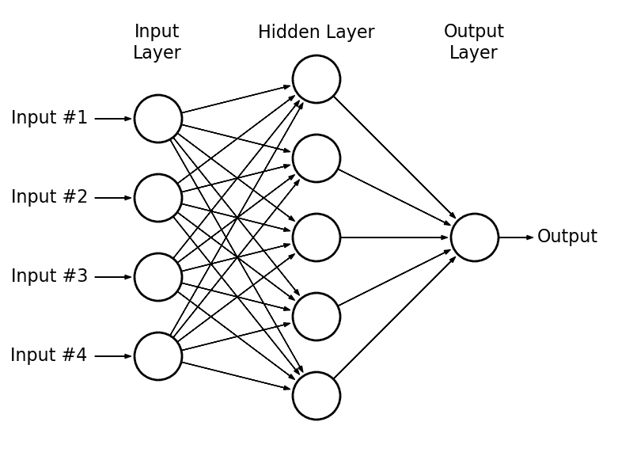
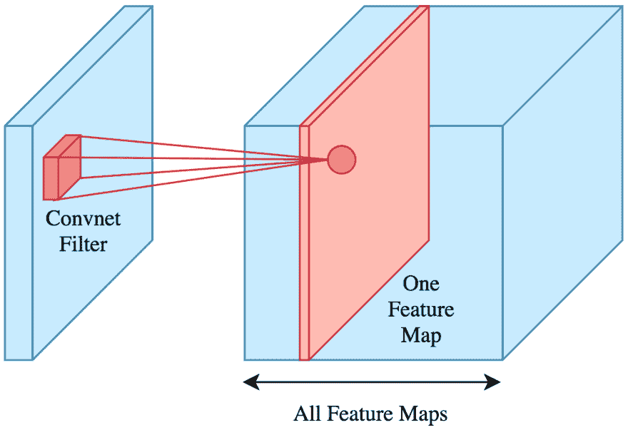
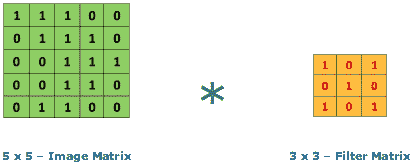
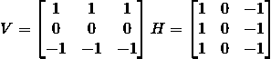
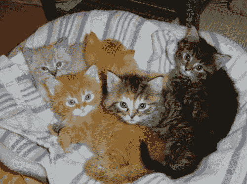
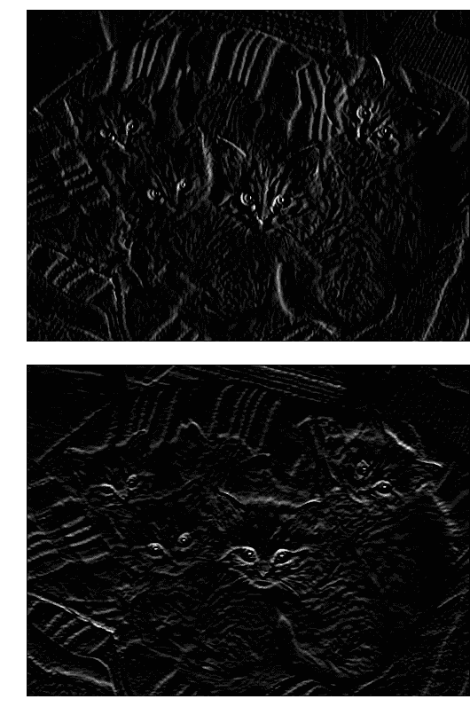

# 卷积神经网络:Python 教程(TensorFlow Eager API)

> 原文：<https://dev.to/strikingloo/convolutional-neural-networks-an-introduction-tensorflow-eager-4f4m>

卷积神经网络是过去十年深度学习经常成为头条新闻的一部分。今天我们将使用 TensorFlow 的 eager API 训练一个**图像分类器**来告诉我们一幅图像中包含的是一只狗还是一只猫。

由于人工神经网络在许多领域具有前所未有的能力，它最近已经颠覆了几个行业。然而，不同的深度学习架构在每个方面都很出色:

*   图像分类(卷积神经网络)。
*   图像、音频和文本生成(GANs、RNNs)。
*   时间序列预测(RNNs，LSTM)。
*   推荐系统。
*   巨大的等等(例如，回归)。

今天我们将关注列表中的第一项，尽管每一项都值得单独写一篇文章。

## 什么是卷积神经网络？

在多层感知器(MLP)中，*香草*神经网络，每层的神经元连接到下一层的**所有**神经元。我们称这种类型的层为完全连接的**。**

 **<figure> 

<figcaption>一个 MLP。来源: [AstroML](http://www.astroml.org/book_figures/appendix/fig_neural_network.html)</figcaption>

</figure>

卷积神经网络是不同的:它们有卷积层。

在完全连接的层上，每个神经元的输出将是前一层的线性变换，由非线性激活函数组成(例如， *ReLu* 或 *Sigmoid* )。

相反地，**卷积层**中每个神经元的输出只是前一层神经元的**子集**的函数(通常很小)。

<figure> 

<figcaption>来源:[辉煌](https://brilliant.org/wiki/convolutional-neural-network/)</figcaption>

</figure>

卷积层上的输出将是对前一层神经元的子集应用**卷积**的结果，然后是激活函数。

### 什么是卷积？

给定一个输入矩阵 *A* (通常是前一层的值)和一个被称为**内核**或**滤波器** *K* 的权重矩阵(通常小得多)，卷积运算将输出一个新的矩阵 *B* 。

<figure> 

<figcaption>【乘】 [RaghavPrabhu](https://medium.com/@RaghavPrabhu/understanding-of-convolutional-neural-network-cnn-deep-learning-99760835f148)</figcaption>

</figure>

如果 *K* 是一个 *CxC* 矩阵，那么 *B* 中的第一个元素将是以下结果:

*   取 *A* 的第一个 *CxC* 子矩阵。
*   将其每个元素乘以其在 *K* 中的相应权重。
*   添加所有产品。

最后这两个步骤相当于展平 A 的子矩阵和 K，并计算结果向量的点积。

然后，我们向右滑动 K 以获得下一个元素，依此类推，对 *A* 的每一行重复这个过程。

<figure> 

<figcaption>【卷积可视化通过@ [RaghavPrabhu](https://medium.com/@RaghavPrabhu/understanding-of-convolutional-neural-network-cnn-deep-learning-99760835f148)</figcaption>

</figure>

根据我们的需要，我们只能从以第 *Cth* 行和列为中心的内核开始，以避免“越界”，或者假设“A 之外”的所有元素都有某个默认值(通常为 0)——这将定义 *B* 的大小是小于 *A* 还是相同。

如你所见，如果 *A* 是一个 *NxM* 矩阵，那么现在 *B* 中每个神经元的值将不取决于 *N*M* 权重，而只取决于其中的 *C*C* (少得多)。这使得卷积层比全连接层轻得多，有助于卷积模型学习得更快。

当然，我们最终会在每一层上使用许多内核(得到一堆矩阵作为每一层的输出)。然而，这仍然需要比我们的老 MLP 少得多的重量。

### 这是为什么？

为什么我们可以**忽略**每个神经元如何影响大多数其他神经元？嗯，这整个系统成立的前提是，每个神经元都受到其“邻居”的强烈影响**。然而，远处的神经元对它只有很小的影响。**

这个假设在 images 中**直观上是正确的——如果我们想到输入层，每个神经元将是一个像素或一个像素的 RGB 值。这也是为什么这种方法对图像分类如此有效的部分原因。**

例如，如果我拍摄一张照片中有蓝天的区域，很可能附近的区域也会使用相似的色调来显示天空。

像素的相邻像素通常具有相似的 RGB 值。如果他们没有，那么这可能意味着我们在一个图形或物体的边缘。

如果你用笔和纸(或计算器)做一些卷积，你会意识到如果在某种边缘上，某些内核会增加输入的强度。在其他边缘，他们可以减少它。

作为一个例子，让我们考虑下面的内核 *V* 和 *H* :

<figure> 

<figcaption>垂直和水平边缘滤镜</figcaption>

</figure>

*V* 过滤垂直边缘(上面的颜色与下面的颜色非常不同)，而 *H* 过滤水平边缘。注意一个是另一个的转置版本。

### 卷积举例

这是一窝小猫未经过滤的照片:

如果我们分别应用水平和垂直边缘滤镜，会发生以下情况:

我们可以看到一些特征变得更加明显，而另一些逐渐消失。有趣的是，每个过滤器展示了不同的功能。

这就是卷积神经网络如何学习识别图像中的特征。让它适合自己的内核权重比任何手动方法都要容易得多。想象一下，试图找出你应该如何表达像素之间的关系…用手！

为了真正掌握每个卷积对一张图片的影响，我强烈建议你在这个网站上玩一玩。它对我的帮助比任何书籍或教程都大。去吧，把它收藏起来。很好玩。

好了，你已经学了一些理论。现在让我们进入实际部分。

## 如何在 TensorFlow 中训练一个卷积神经网络？

TensorFlow 是 Python 最流行的深度学习框架。我也听说过 PyTorch 的优点，虽然我从来没有机会尝试。

我已经写了一篇关于如何用 TensorFlow 的 Eager API 训练神经网络的教程，重点是自动编码器。

今天会有所不同:我们将尝试三种不同的架构，看看哪一种做得更好。像往常一样，所有的代码都可以在 [GitHub](https://github.com/StrikingLoo/Cats-and-dogs-classifier-tensorflow-CNN) 上获得，所以你可以自己尝试所有的东西或者跟着做。当然，我还会展示 Python 代码片段。

### 数据集

我们将训练一个神经网络来预测一幅图像是包含一只狗还是一只猫。为此，我们将使用 Kaggle 的[猫狗数据集](https://www.kaggle.com/c/dogs-vs-cats)。它包含 12500 张猫和 12500 张狗的图片，分辨率各不相同。

### 用 NumPy 加载并预处理我们的图像数据

神经网络接收特征向量或矩阵作为输入，通常具有**固定维度**。我们如何从我们的照片中产生这种感觉？

幸运的是，Python 的图像库为我们提供了一种将图像作为 NumPy 数组加载的简单方法。RGB 值的高 x 宽矩阵。

我们已经在[这篇文章](https://dev.to/strikingloo/k-means-clustering-with-dask-image-filters-for-pictures-of-kittens-ip7)中这样做了，所以我将重用这段代码。

然而，我们仍然必须解决固定维度部分:我们为输入层选择哪些维度？这很重要，因为我们必须将每张图片调整到所选的分辨率。我们不想扭曲太多的长宽比，以免给网络带来太多的噪音。

下面是我们如何看到数据集中最常见的形状。**