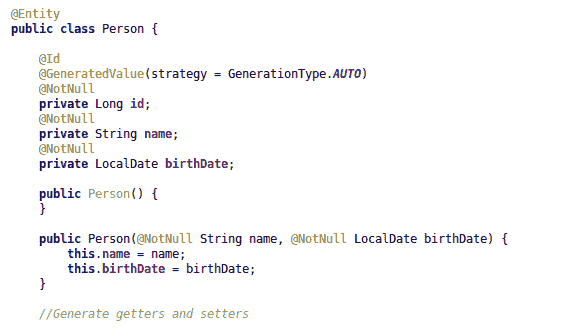
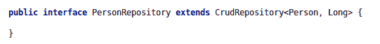
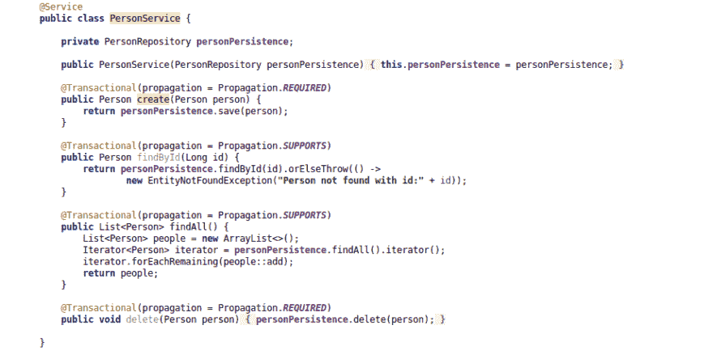
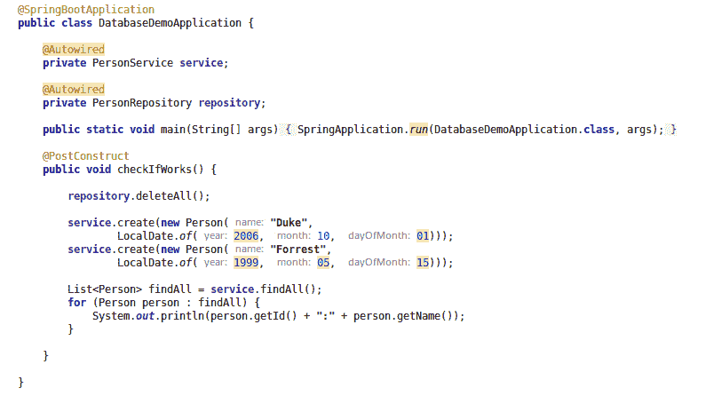
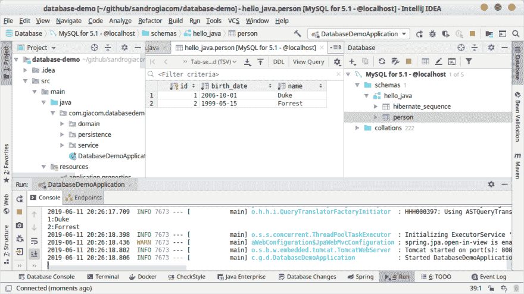
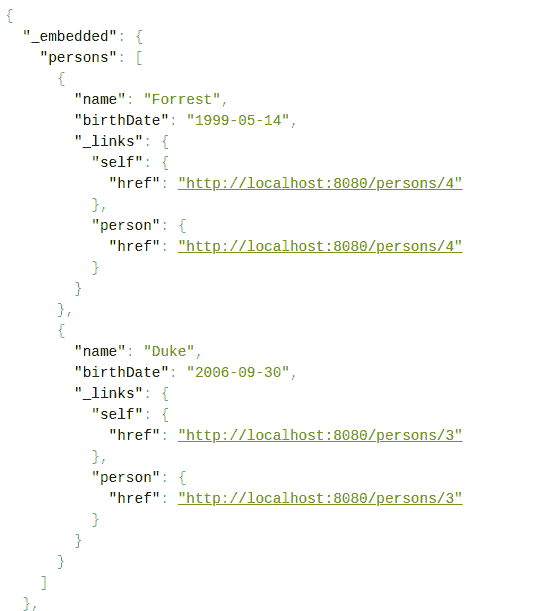

# 在 Docker 上运行 MySQL 并在你的 Java 应用中使用

> 原文：<https://dev.to/sandrogiacom/run-mysql-on-docker-and-use-in-your-java-app-jpn>

在 Docker 中运行 MySQL 在开发中非常有用。在本教程中，我们将看到在 Docker 中启动 MySQL 并通过 Spring Boot 在我们的 Java 应用程序中使用它是多么容易。

## 准备

首先，您的机器上需要一个 docker 运行时。如果你没有，请安装以下 docker 文档:[https://docs.docker.com/install/](https://docs.docker.com/install/)

## 启动 Mysql 容器

要启动容器，请在您的终端中键入以下命令:

```
docker run --name mysql57 -p 3306:3306 -e MYSQL_ROOT_PASSWORD=1234 -d mysql/mysql-server:5.7 
```

上面的命令，如果在本地存储库中找不到，则提取图像，并在分离模式下运行 mysql 容器。将本地端口配置为容器端口，并将 root 密码设置为`1234`。

检查您的容器运行:

```
docker ps
CONTAINER ID        IMAGE                 COMMAND                  CREATED             STATUS                   PORTS                               NAMES
380eca8a553c        mysql/mysql-server:5.7    "/entrypoint.sh mysq…"   8 minutes ago       Up 8 minutes (healthy)   0.0.0.0:3306->3306/tcp, 33060/tcp   mysql 
```

正如我们所见，mysql5.7 运行在 localhost:3306
上。此时，您已经有了一个本地 mysql 服务器，但没有安装它。

> **注意:【root 用户将无法从外部访问容器。**

## 创建数据库

类型:

```
docker exec -it mysql57 bash 
```

该命令访问 mysql 容器并允许在数据库上执行命令。在容器内，键入:

```
mysql -h localhost -u root -p 
```

记住，密码是`1234`。首先，我们需要为容器外访问创建一个用户，因为不允许 root 访问:

```
CREATE USER 'demo_java' IDENTIFIED BY 'java';
grant all on *.* to 'demo_java'@'%' identified by '1234';
FLUSH PRIVILEGES; 
```

要创建一个数据库，将 DDL 粘贴到下面:

```
CREATE DATABASE hello_java CHARACTER SET utf8 COLLATE utf8_general_ci; 
```

接下来，键入:

```
show databases;
+--------------------+
| Database           |
+--------------------+
| hello_java         |
| information_schema |
| mysql              |
| performance_schema |
| sys                |
+--------------------+
5 rows in set (0.00 sec) 
```

## 自动创建数据库

另一种启动数据库的方法是自动创建一个`hello_java`数据库和`demo_java`用户:

```
docker run --name mysql57 -p 3306:3306 \
-e MYSQL_ROOT_PASSWORD=1234 \
-e MYSQL_USER=demo_java \
-e MYSQL_PASSWORD=1234 \
-e MYSQL_DATABASE=hello_java \
-d mysql/mysql-server:5.7 
```

使用上面的命令，您不必进入数据库并创建数据库和用户。很酷，不是吗？

## 创建演示应用

转到[https://start.spring.io/](https://start.spring.io/)，使用 *Web* 和 *Jpa* 依赖项创建一个演示应用。

在 IDE 中导入应用程序，并遵循以下步骤:

1 -编辑`application.properties`文件:

```
spring.datasource.url=jdbc:mysql://localhost:3306/hello_java
spring.datasource.username=demo_java
spring.datasource.password=1234
spring.jpa.hibernate.ddl-auto=update 
```

**spring . JPA . hibernate . DDL-auto = update**创建不存在的`person`表。

> **注意:**不建议在生产中使用。

2 -编辑`pom.xml`文件并添加 mysql 连接器 java

```
<dependency>
    <groupId>mysql</groupId>
    <artifactId>mysql-connector-java</artifactId>
</dependency> 
```

3 -添加域、服务和持久性类:
**域**
[](https://res.cloudinary.com/practicaldev/image/fetch/s--5sBK8I73--/c_limit%2Cf_auto%2Cfl_progressive%2Cq_auto%2Cw_880/https://thepracticaldev.s3.amazonaws.com/i/uh40cxp2k43lo2a2q9co.png)

**储存库**
[](https://res.cloudinary.com/practicaldev/image/fetch/s--V530uS9c--/c_limit%2Cf_auto%2Cfl_progressive%2Cq_auto%2Cw_880/https://thepracticaldev.s3.amazonaws.com/i/fsfx14mig774ae7szw96.png)

**服务**
[](https://res.cloudinary.com/practicaldev/image/fetch/s--rHigz9En--/c_limit%2Cf_auto%2Cfl_progressive%2Cq_auto%2Cw_880/https://thepracticaldev.s3.amazonaws.com/i/bl2ja92mcu7z9ao38ovy.png)

4 -更改主类以创建两个新人:

[](https://res.cloudinary.com/practicaldev/image/fetch/s--lkJ5Cy08--/c_limit%2Cf_auto%2Cfl_progressive%2Cq_auto%2Cw_880/https://thepracticaldev.s3.amazonaws.com/i/3tokyynlkp8qbiiq398i.png)

## 运行演示应用程序

启动演示应用程序，只运行一个主类:

**应用程序正在运行，数据永久保存在数据库中**

[](https://res.cloudinary.com/practicaldev/image/fetch/s--4hsdKN5I--/c_limit%2Cf_auto%2Cfl_progressive%2Cq_auto%2Cw_880/https://thepracticaldev.s3.amazonaws.com/i/1o6o3i9u1ikog6rnq8la.png)

## 奖金

要将您的数据公开为 Rest 端点，只需添加这个依赖项:

```
<dependency>
    <groupId>org.springframework.boot</groupId>
    <artifactId>spring-boot-starter-data-rest</artifactId>
</dependency> 
```

访问[http://localhost:8080/persons](http://localhost:8080/persons)

哇哦！您的数据公开为 json。

[](https://res.cloudinary.com/practicaldev/image/fetch/s---sizisfp--/c_limit%2Cf_auto%2Cfl_progressive%2Cq_auto%2Cw_880/https://thepracticaldev.s3.amazonaws.com/i/7948avwkyfw19dt4f4wi.png)

## 源代码

##  [ sandrogiacom ](https://github.com/sandrogiacom) / [数据库-演示](https://github.com/sandrogiacom/database-demo)

<article class="markdown-body entry-content container-lg" itemprop="text">

# 数据库演示

这篇文章的源代码:在 Docker 上运行 MySQL 并在你的 Java 应用中使用

[https://dev . to/sandrogiacom/run-MySQL-on-docker-and-use-in-your-Java-app-JPN](https://dev.to/sandrogiacom/run-mysql-on-docker-and-use-in-your-java-app-jpn)

</article>

[View on GitHub](https://github.com/sandrogiacom/database-demo)