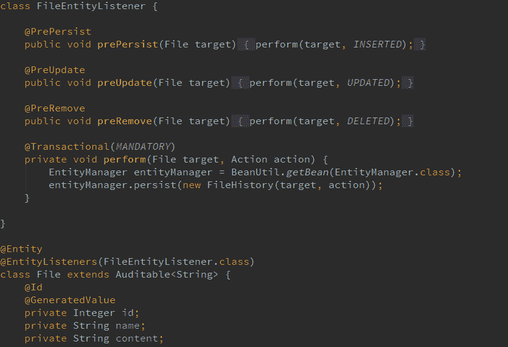

# JPA 审计:使用 EntityListeners 自动保存审计日志

> 原文：<https://dev.to/njnareshjoshi/jpa-auditing-persisting-audit-logs-automatically-using-entitylisteners-238p>

在我的一篇文章[Spring Data JPA Auditing:Saving created by，CreatedDate，LastModifiedBy，LastModifiedDate automatically](https://programmingmitra.blogspot.in/2017/02/automatic-spring-data-jpa-auditing-saving-CreatedBy-createddate-lastmodifiedby-lastmodifieddate-automatically.html)中，我已经讨论了为什么审计对于任何业务应用程序都是重要的，以及我们如何使用 Spring Data JPA 来自动化它。

我还讨论了 Spring Data 如何使用 JPA 的 **EntityListeners** 和**回调方法**来自动更新 CreatedBy、CreatedDate、LastModifiedBy、LastModifiedDate 属性。

在本文中，我将深入探讨一下，并讨论我们如何使用 JPA EntityListeners 来创建审计日志，并保存对数据的每次插入、更新和删除操作的信息。

我将以上一篇文章中的文件实体为例，向您介绍一些必要的步骤和代码部分，您需要将这些步骤和代码部分包含在我们的项目中，以实现审计过程的自动化。

我们将使用 Spring Boot、Spring Data JPA(因为它为我们提供了完整的 JPA 功能以及 Spring 的一些很好的定制)、MySql 来演示这一点。

我们需要在 pom 文件中添加以下父文件和依赖文件

```
<parent>
    <groupId>org.springframework.boot</groupId>
    <artifactId>spring-boot-starter-parent</artifactId>
    <version>1.5.1.RELEASE</version>
    <relativePath/>
</parent>

<dependencies>
    <dependency>
        <groupId>org.springframework.boot</groupId>
        <artifactId>spring-boot-starter-data-jpa</artifactId>
    </dependency>

    <dependency>
        <groupId>mysql</groupId>
        <artifactId>mysql-connector-java</artifactId>
        <scope>runtime</scope>
    </dependency>
</dependencies> 
```

<svg width="20px" height="20px" viewBox="0 0 24 24" class="highlight-action crayons-icon highlight-action--fullscreen-on"><title>Enter fullscreen mode</title></svg> <svg width="20px" height="20px" viewBox="0 0 24 24" class="highlight-action crayons-icon highlight-action--fullscreen-off"><title>Exit fullscreen mode</title></svg>

### 使用注释@PrePersist、@PreUpdate、@PreRemove 实现 JPA 回调方法

JPA 为我们提供了使用注释为任何实体定义回调方法的功能**、@PrePersist** 、**、@PreUpdate** 、**、@PreRemove** ，这些方法将在它们各自的生命周期事件之前被调用。

与前注释类似，JPA 也提供类似于**@ postpist**、 **@PostUpdate** 、 **@PostRemove、* *和** @PostLoad** 的后注释。我们可以用它们来定义事件发生后触发的回调方法。

[](////3.bp.blogspot.com/-Jrwc5quKJAY/WKA_RGPIW8I/AAAAAAAAKg0/FSGY7lGEWfYzPpDIxVgK9NFzwnMhFbO0wCK4B/s1600/JPA-Automatic-Auditing-Saving-Audit-Logs.png)

注释的名称可以告诉你它们各自的事件，例如@PrePersist -在实体持续之前和@PostUpdate -在实体更新之后，这对于其他注释也是一样的。

### 在实体内部定义回调方法

我们可以在实体类中定义回调方法，但是我们需要遵循一些规则，比如内部回调方法应该总是返回 void 并且不带参数。它们可以有任何名称和任何访问级别，也可以是静态的。

```
@Entity
public class File {

    @PrePersist
    public void prePersist() { // Persistence logic }

    @PreUpdate
    public void preUpdate() { //Updation logic }

    @PreRemove
    public void preRemove() { //Removal logic }

} 
```

<svg width="20px" height="20px" viewBox="0 0 24 24" class="highlight-action crayons-icon highlight-action--fullscreen-on"><title>Enter fullscreen mode</title></svg> <svg width="20px" height="20px" viewBox="0 0 24 24" class="highlight-action crayons-icon highlight-action--fullscreen-off"><title>Exit fullscreen mode</title></svg>

### 在外部类中定义回调方法并使用@EntityListeners

我们还可以在外部侦听器类中定义回调方法，使它们总是返回 void 并接受目标对象作为参数。但是，它们可以有任何名称和任何访问级别，也可以是静态的。

```
public class FileEntityListener {
    @PrePersist
    public void prePersist(File target) { // Persistence logic }

    @PreUpdate
    public void preUpdate(File target) { //Updation logic }

    @PreRemove
    public void preRemove(File target) { //Removal logic }
} 
```

<svg width="20px" height="20px" viewBox="0 0 24 24" class="highlight-action crayons-icon highlight-action--fullscreen-on"><title>Enter fullscreen mode</title></svg> <svg width="20px" height="20px" viewBox="0 0 24 24" class="highlight-action crayons-icon highlight-action--fullscreen-off"><title>Exit fullscreen mode</title></svg>

我们将需要通过使用 **@EntityListeners** 注释在文件实体或其超类上注册这个 FileEntityListener 类

```
@Entity
@EntityListeners(FileEntityListener.class)
class File extends Auditable<String> {

    @Id
    @GeneratedValue
    private Integer id;
    private String name;
    private String content;

    // Fields, Getters and Setters
} 
```

<svg width="20px" height="20px" viewBox="0 0 24 24" class="highlight-action crayons-icon highlight-action--fullscreen-on"><title>Enter fullscreen mode</title></svg> <svg width="20px" height="20px" viewBox="0 0 24 24" class="highlight-action crayons-icon highlight-action--fullscreen-off"><title>Exit fullscreen mode</title></svg>

### 使用@EntityListeners 的优势

*   首先，我们不应该在实体类中编写任何类型的业务逻辑，并遵循单一责任原则。每个实体类都应该是 [POJO (Plain Old Java Object)](https://programmingmitra.blogspot.in/2016/05/plain-old-java-object-pojo-explained.html) 。
*   在一个类中，对于一个特定的事件，我们只能有一个回调方法，例如，一个类中只允许有一个带有@PrePresist 的回调方法。虽然我们可以在@EntityListeners 中定义多个侦听器类，并且每个侦听器类都可以有一个@PrePersist。

例如，我在 File 上使用了@EntityListeners，并为它提供了 FileEntityListener 类，我还在 File 类中扩展了一个 Auditable 类。

Auditable 类本身有一个@EntityListeners，上面有 AuditingEntityListener 类，因为我是用这个类来持久化 createdBy 和上面提到的其他属性，可以查看我以前的文章[Spring Data JPA Auditing:Saving createdBy，CreatedDate，LastModifiedBy，last modified date automatically](https://programmingmitra.blogspot.in/2017/02/automatic-spring-data-jpa-auditing-saving-CreatedBy-createddate-lastmodifiedby-lastmodifieddate-automatically.html)了解更多细节。

```
@MappedSuperclass
@EntityListeners(AuditingEntityListener.class)
public abstract class Auditable<U> {

    @CreatedBy
    protected U createdBy;

    @CreatedDate
    @Temporal(TIMESTAMP)
    protected Date createdDate;

    @LastModifiedBy
    protected U lastModifiedBy;

    @LastModifiedDate
    @Temporal(TIMESTAMP)
    protected Date lastModifiedDate;

    // Getters and Setters
} 
```

<svg width="20px" height="20px" viewBox="0 0 24 24" class="highlight-action crayons-icon highlight-action--fullscreen-on"><title>Enter fullscreen mode</title></svg> <svg width="20px" height="20px" viewBox="0 0 24 24" class="highlight-action crayons-icon highlight-action--fullscreen-off"><title>Exit fullscreen mode</title></svg>

我们还需要为所有实体提供 getters、setters、constructors、toString 和 equals 方法。然而，如果你想自动生成这些东西，你可能想看看 Lombok 项目:样板代码提取器。

现在我们都设置好了，我们需要实现我们的日志策略，我们可以在一个单独的历史表 FileHistory 中存储文件的历史日志。

```
@Entity
@EntityListeners(AuditingEntityListener.class)
public class FileHistory {

    @Id
    @GeneratedValue
    private Integer id;

    @ManyToOne
    @JoinColumn(name = "file_id", foreignKey = @ForeignKey(name = "FK_file_history_file"))
    private File file;

    private String fileContent;

    @CreatedBy
    private String modifiedBy;

    @CreatedDate
    @Temporal(TIMESTAMP)
    private Date modifiedDate;

    @Enumerated(STRING)
    private Action action;

    public FileHistory() {
    }

    public FileHistory(File file, Action action) {
        this.file = file;
        this.fileContent = file.toString();
        this.action = action;
    }

    // Getters, Setters
} 
```

<svg width="20px" height="20px" viewBox="0 0 24 24" class="highlight-action crayons-icon highlight-action--fullscreen-on"><title>Enter fullscreen mode</title></svg> <svg width="20px" height="20px" viewBox="0 0 24 24" class="highlight-action crayons-icon highlight-action--fullscreen-off"><title>Exit fullscreen mode</title></svg>

这里 Action 是一个枚举

```
public enum Action {

    INSERTED("INSERTED"),
    UPDATED("UPDATED"),
    DELETED("DELETED");

    private final String name;

    private Action(String value) {
        this.name = value;
    }

    public String value() {
        return this.name;
    }

    @Override
    public String toString() {
        return name;
    }
} 
```

<svg width="20px" height="20px" viewBox="0 0 24 24" class="highlight-action crayons-icon highlight-action--fullscreen-on"><title>Enter fullscreen mode</title></svg> <svg width="20px" height="20px" viewBox="0 0 24 24" class="highlight-action crayons-icon highlight-action--fullscreen-off"><title>Exit fullscreen mode</title></svg>

对于每个插入、更新、删除操作，我们都需要在 FileHistory 中插入一个条目，并且我们需要在 FileEntityListener 类中编写该逻辑。为此，我们需要在 FileEntityListener 类中注入 repository 类或 EntityManager。

### 在 EntityListeners 中注入类似 EntityManager 的 Spring 托管 Beans

但是这里我们有一个问题，EntityListeners 是由 JPA 而不是 Spring 实例化的，所以 Spring 不能在任何 EntityListeners 中注入任何 Spring 管理的 bean，例如 EntityManager。

因此，如果您试图在 FileEntityListener 类中自动连接 EntityManager，它将不起作用

```
@Autowired EntityManager entityManager; //Will not work and entityManager will be null always 
```

<svg width="20px" height="20px" viewBox="0 0 24 24" class="highlight-action crayons-icon highlight-action--fullscreen-on"><title>Enter fullscreen mode</title></svg> <svg width="20px" height="20px" viewBox="0 0 24 24" class="highlight-action crayons-icon highlight-action--fullscreen-off"><title>Exit fullscreen mode</title></svg>

我还写了一篇单独的文章，介绍如何[将 Spring Beans 自动绑定到不是由 Spring 管理的类中，比如 JPA 实体监听器](https://programmingmitra.blogspot.in/2017/03/AutoWiring-Spring-Beans-Into-Classes-Not-Managed-By-Spring-Like-JPA-Entity-Listeners.html)，如果你想了解更多，你可以阅读这篇文章。

我在这里使用相同的想法来使它工作，我们将创建一个实用程序类来为我们获取 Spring 管理的 beans

```
@Service
public class BeanUtil implements ApplicationContextAware {

    private static ApplicationContext context;

    @Override
    public void setApplicationContext(ApplicationContext applicationContext) throws BeansException {
        context = applicationContext;
    }

    public static <T> T getBean(Class<T> beanClass) {
        return context.getBean(beanClass);
    }

} 
```

<svg width="20px" height="20px" viewBox="0 0 24 24" class="highlight-action crayons-icon highlight-action--fullscreen-on"><title>Enter fullscreen mode</title></svg> <svg width="20px" height="20px" viewBox="0 0 24 24" class="highlight-action crayons-icon highlight-action--fullscreen-off"><title>Exit fullscreen mode</title></svg>

现在，我们将在 FileEntityListener 中编写历史记录创建逻辑

```
public class FileEntityListener {

    @PrePersist
    public void prePersist(File target) {
        perform(target, INSERTED);
    }

    @PreUpdate
    public void preUpdate(File target) {
        perform(target, UPDATED);
    }

    @PreRemove
    public void preRemove(File target) {
        perform(target, DELETED);
    }

    @Transactional(MANDATORY)
    private void perform(File target, Action action) {
        EntityManager entityManager = BeanUtil.getBean(EntityManager.class);
        entityManager.persist(new FileHistory(target, action));
    }

} 
```

<svg width="20px" height="20px" viewBox="0 0 24 24" class="highlight-action crayons-icon highlight-action--fullscreen-on"><title>Enter fullscreen mode</title></svg> <svg width="20px" height="20px" viewBox="0 0 24 24" class="highlight-action crayons-icon highlight-action--fullscreen-off"><title>Exit fullscreen mode</title></svg>

现在，如果我们尝试保存或更新文件对象，这些审核属性将自动保存。

你可以在这个 [Github 库](https://github.com/njnareshjoshi/articles/tree/master/spring-data-jpa-auditing)上找到完整的代码，请随时提供你的宝贵反馈。