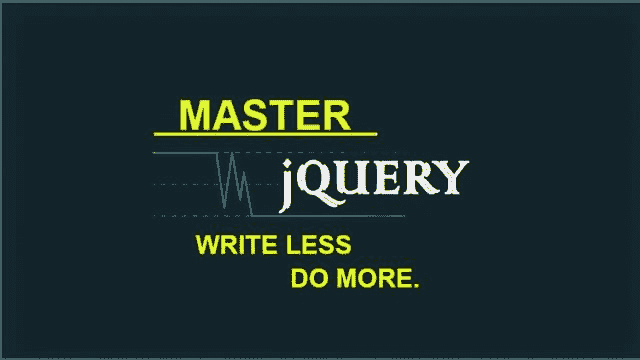
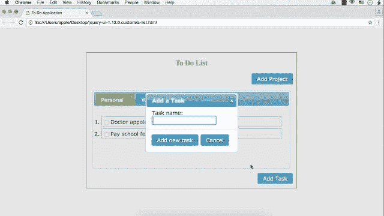
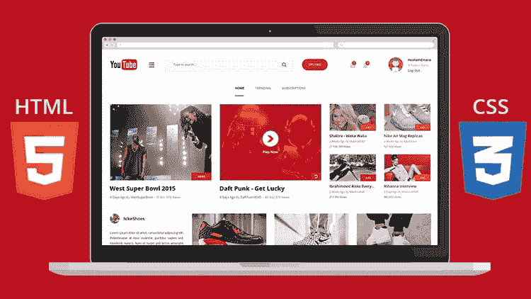
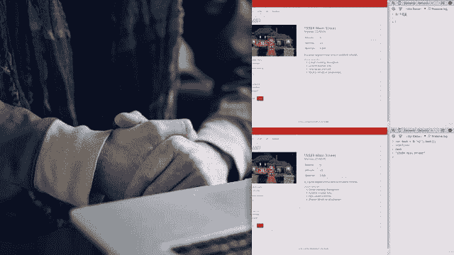

# 2022 年学习 jQuery 的 5 门免费课程

> 原文：<https://dev.to/javinpaul/5-free-online-courses-to-learn-jquery-in-2019-437o>

*披露:这篇文章包括附属链接；如果您从本文提供的不同链接购买产品或服务，我可能会收到报酬。*

你好，伙计们，如果你想学习 jQuery 并寻找一些很棒的免费资源，如[书籍](http://javarevisited.blogspot.sg/2013/07/top-5-jquery-books-for-web-developers-learn.html#axzz5D4gR4y2f)，教程和在线课程，那么你来对地方了。

早些时候，我已经分享了[最佳 JavaScript](https://medium.com/javarevisited/10-best-online-courses-to-learn-javascript-in-2020-af5ed0801645) 、 [Angular](https://medium.com/javarevisited/10-courses-to-learn-angular-for-web-development-6da1bd2856dc) 和[免费 React 在线课程](https://medium.com/javarevisited/top-10-free-courses-to-learn-react-js-c14edbd3b35f)，在本文中，我将分享一些来自 [Udemy](https://javarevisited.blogspot.com/2019/10/udemy-vs-pluralsight-review-which-is-better-to-learn-code.html) 和 [Pluralsight](https://javarevisited.blogspot.com/2019/10/pluralsight-vs-codecademy-which-is-best-online-learning-platform.html) 的**最佳免费 jQuery 课程**，你可以通过它们来学习这个出色的 JavaScript 库。

过去我也在 jQuery 上分享过一些免费的[书籍](http://javarevisited.blogspot.sg/2017/04/free-ebooks-to-learn-jquery-online-or-download-pdf.html)和[教程](http://javarevisited.blogspot.sg/2017/05/jquery-tutorial-how-to-modify-multiple-elements-in-one-line.html#axzz5D4gR4y2f)，是对这些课程的补充。在学习 jQuery 的不同部分时，您也可以看看它们。

在分享这些免费课程之前，我先简单介绍一下 jQuery 是什么，为什么要学习它？嗯， [jQuery](https://jquery.com/) 是一个 [JavaScript 库](http://www.java67.com/2019/01/top-10-javascript-frameworks-and-libraries-for-web-developers.html)，但是与任何其他库不同，它非常强大，并且使得客户端脚本编写非常容易。

它提供了 CSS 类型的[选择器](http://javarevisited.blogspot.sg/2013/07/jquery-selectors-examples-ID-Class-Descendent-Child-Multiple-Pseudo-Selector-find-element-DOM.html)，允许你一次选择多个组件，并在一行代码中修改它们，就像你可以抓取所有按钮并启用或禁用它们，就像我们在[这个](http://javarevisited.blogspot.sg/2017/08/how-to-enable-disable-element-using-jQuery-JavaScript-example.html#axzz5D4gR4y2f)例子中所做的那样。

您可以抓取所有“p”标签，并更好地设计它们。你甚至可以做一些很酷的动画，比如淡入淡出，切换按钮和其他元素，就像我们在基于标签的 GUI 例子中做的一样。jQuery 真正改变了你使用 [JavaScript](https://hackernoon.com/10-websites-to-learn-javascript-for-beginners-31e13bbdbb5c) 进行验证并使你的网站具有交互性的方式。

jQuery 的流行可以通过一个简单的事实来理解，即许多人在没有学习 JavaScript 的情况下使用 jQuery，这并不伟大，但仍然说明了这个小库是多么有用。**“少写多做”**这个词清楚地告诉我们 jQuery 的潜力。

## 2022 年 5 门免费在线课程学习 jQuery

现在，回到*免费的 jQuery 课程*在线学习。我个人觉得最适合学习新框架或库的在线课程，其次是一本好书。

这些来自 [Udemy](https://click.linksynergy.com/fs-bin/click?id=JVFxdTr9V80&offerid=323058.9409&type=3&subid=0) 和[pluar sight](http://pluralsight.pxf.io/c/1193463/424552/7490?u=https%3A%2F%2Fwww.pluralsight.com%2Flearn)的免费 jQuery 课程其实还是挺不错的，和其他很多付费课程差不多。它们大多是免费的，用于宣传或教育目的。

也有这样的情况，在 Udemy 上的免费课程一旦导师达到了他们的推广目标，就变成了付费课程，所以你最好在注册之前检查一下。

此外，我建议你尽早注册，即使你现在没有时间学习 jQuery，但希望在不久的将来学习，因为一旦你注册了这门课程，你就可以终身免费学习，并且可以随时学习。

### 1。[完成面向初学者的 JQuery 和 JQuery UI 课程](https://click.linksynergy.com/deeplink?id=JVFxdTr9V80&mid=39197&murl=https%3A%2F%2Fwww.udemy.com%2Fcomplete-jquery-and-jquery-ui-course-for-beginner%2F)

这是学习 jQuery 和 jQuery UI 的最新课程之一，如果你今年正在学习 jQuery，这是一个很好的起点。它已经有 9000 多名学生，而且仍然是免费的，但可能不会永远免费。

[课程](https://click.linksynergy.com/deeplink?id=JVFxdTr9V80&mid=39197&murl=https%3A%2F%2Fwww.udemy.com%2Fcomplete-jquery-and-jquery-ui-course-for-beginner%2F)分为两个部分，jQuery 简介和 jQuery UI 简介。

在第一部分中，您将学习什么是 jQuery 以及如何使用它，然后下载 jQuery 库。

在 jQuery 简介部分，您将了解基本的 jQuery 概念，如[选择器](http://www.java67.com/2016/09/10-example-of-jquery-selectors-for-web.html)、过滤器、替换内容、处理事件，以及一些基本的动画效果，如淡入淡出、滑动、切换、隐藏和显示等。

jQuery UI 部分重点介绍基本的 jQuery UI 小部件，如日期选择器小部件、工具提示小部件、折叠小部件和选项卡小部件。

总的来说，对于今年想学习 jQuery 的人来说，这是一门很好的入门课程。虽然以前的 HTML 和 CSS 经验是可取的，你可以通过加入我之前分享的[免费前端 web 开发课程](http://www.java67.com/2018/02/5-free-html-and-css-courses-to-learn-web-development.html)来获得。

### [2。学习使用 jQuery UI 小部件](https://click.linksynergy.com/fs-bin/click?id=JVFxdTr9V80&subid=0&offerid=323058.1&type=10&tmpid=14538&RD_PARM1=https%3A%2F%2Fwww.udemy.com%2Flearn-to-use-jquery-ui-widgets%2F)

如果你不知道 jQuery 分为两个库，jQuery 和 jQuery UI。JQuery 是关于验证、选择器和 DOM 操作的，而 jQuery UI 提供了几个很酷的 UI 小部件，可以在 web 应用程序中使用。

在这个[课程](https://click.linksynergy.com/fs-bin/click?id=JVFxdTr9V80&subid=0&offerid=323058.1&type=10&tmpid=14538&RD_PARM1=https%3A%2F%2Fwww.udemy.com%2Flearn-to-use-jquery-ui-widgets%2F)中，你将学习如何使用标签、手风琴、[日期选择器](http://javarevisited.blogspot.sg/2013/10/how-to-use-multiple-jquery-ui-date.html#axzz5D4gR4y2f)以及更多小工具。课程从介绍和安装 jQuery UI 开始。

之后，它介绍了不同的 jQuery UI 小部件，如 jQuery Accordion、选项卡、菜单、工具提示、 [DatePicker](http://javarevisited.blogspot.sg/2013/10/how-to-use-multiple-jquery-ui-date.html#axzz5D4gR4y2f) 和按钮小部件。在每一节之后，它还包含一些问题来测试您对特定 jQuery UI 小部件的了解。

这是一个很短的课程，但是非常有用，在 Udemy 上非常受欢迎。超过 32，550 名学生已经注册了这门课程，它已经获得了 700 多个评分，平均 4.3 分，令人印象深刻。

### 3。 [Bootstrap，HTML5 & CSS3:创建一个现代的 Youtube 主页](https://click.linksynergy.com/deeplink?id=JVFxdTr9V80&mid=39197&murl=https%3A%2F%2Fwww.udemy.com%2Fpsd-to-html5css3-build-a-youtube-homepage-from-scratch%2F)

这是另一个通过使用 HTML、CSS 和 Bootstrap 创建响应网站来学习 jQuery 的免费课程。

[课程](https://click.linksynergy.com/deeplink?id=JVFxdTr9V80&mid=39197&murl=https%3A%2F%2Fwww.udemy.com%2Fpsd-to-html5css3-build-a-youtube-homepage-from-scratch%2F)从 HTML 5 基础开始，解释创建网站所需的基本东西，如图像、字体、链接、样式、表单、单选按钮和[复选框](http://javarevisited.blogspot.sg/2017/07/how-to-checkuncheck-checkbox-using-jQuery-example.html#axzz5D4gR4y2f)。

之后，它使用 [BootStrap](http://www.java67.com/2019/01/5-free-bootstrap-course-to-learn-online.html) ，一个 CSS 样式库来设计网页的样式。bootstrap 有助于创建响应的图像形式、菜单、链接，以及使用字体牛逼的图标和 BootStrap 等。

在最后一节中，您将学习 jQuery 使用类和 id 选择器来提供动画和目标页面元素。

您将学习使用 jQuery 从一组元素中添加和删除 [CSS 类](https://javarevisited.blogspot.com/2014/02/how-to-create-tab-ui-using-html-css-jQuery-JavaScript-JSP.html)，更改 HTML 文本，关闭和定位父元素和子元素等。

简而言之，[一门很好的实践课程](https://click.linksynergy.com/deeplink?id=JVFxdTr9V80&mid=39197&murl=https%3A%2F%2Fwww.udemy.com%2Fpsd-to-html5css3-build-a-youtube-homepage-from-scratch%2F)通过使用 HTML、CSS 和 jQuery 做一个完整的项目来学习 jQuery 的实用方面。它也很受欢迎，超过 13，300 名学生注册了这门课程，有 435 个评分，平均为 4.1 分

### 4。面向初学者的 jQuery 和 AJAX 权威指南

这是在线学习 jQuery 和 AJAX 的又一个优秀的[免费课程。您将学习如何使用 jQuery JavaScript 库制作动态网站。本课程包含 2.5 小时的内容，并提供终身免费学习本课程的机会。](https://click.linksynergy.com/deeplink?id=JVFxdTr9V80&mid=39197&murl=https%3A%2F%2Fwww.udemy.com%2Fjquery-and-ajax-for-beginners-the-definitive-guide%2F)

在本[课程](https://click.linksynergy.com/deeplink?id=JVFxdTr9V80&mid=39197&murl=https%3A%2F%2Fwww.udemy.com%2Fjquery-and-ajax-for-beginners-the-definitive-guide%2F)中，您将通过构建应用程序来学习 jQuery，例如，首先创建一个 HTML 页面，然后构建一个动态游戏板，添加样式和移动鼹鼠。

当你看到事情发生时，你会喜欢这种代码的调整和更新。

说到社会证明，这门课得到了超过 235 次的评分，平均 4.3 分，令人印象深刻。此外，超过 6000 名学生注册了这个免费的课程来学习 jQuery。

### [5。jQuery 基础知识](https://pluralsight.pxf.io/c/1193463/424552/7490?u=https%3A%2F%2Fwww.pluralsight.com%2Fcourses%2Fjquery-fundamentals)

这是一门非常好的从零开始学习 jQuery 的课程。这是一门初级课程，但是你将学到使用 jQuery 开发一个引人注目的用户界面所需的大部分东西。

这门[课程]((https://pluralsight.pxf.io/c/1193463/424552/7490?u=https%3A%2F%2Fwww.pluralsight.com%2Fcourses%2Fjquery-fundamentals))将教你如何使用不同的 jQuery 选择器，例如 id、类和标签选择器来选择和操作 DOM 元素，处理事件，以及应用动画来创建一个有响应的用户界面。

它还提供了 jQuery 选择器和与 DOM 交互的全面覆盖，例如遍历节点、修改单个属性、添加和删除节点、修改样式，如添加/删除 CSS 选择器等。

除了 API 和函数，您还将了解 jQuery 如何工作，以及一些基本概念，如为什么使用 CDN 更适合下载 jQuery 库和使用 ajax 功能，如从服务器加载 HTML 内容和理解 load()、get()、post()和 AJAX()函数。

顺便说一句，如果你喜欢免费资源，那么让我告诉你，我已经在这个博客上分享了很多免费资源，比如关于 [Spring](http://www.java67.com/2017/11/top-5-free-core-spring-mvc-courses-learn-online.html) 、 [Python](http://www.java67.com/2018/02/5-free-python-online-courses-for-beginners.html) 、 [REST](http://javarevisited.blogspot.sg/2018/02/top-5-restful-web-services-with-spring-courses-for-experienced-java-programmers.html) 、 [Jenkins](http://www.java67.com/2018/02/6-free-maven-and-jenkins-online-courses-for-java-developers.html) 、 [JUnit](http://www.java67.com/2018/02/5-free-eclipse-and-junit-online-courses-java-developers.html) 、 [Docker](http://www.java67.com/2018/02/5-free-docker-courses-for-java-and-DevOps-engineers.html) 、 [PHP](http://www.java67.com/2018/02/5-free-php-and-mysql-courses-for-web-developers.html) 、 [React](http://www.java67.com/2018/02/5-free-react-courses-for-web-developers.html) 、 [Web Development](http://www.java67.com/2018/03/top-5-free-courses-to-learn-web-development.html) 等等的免费课程和书籍。如果你对学习这些技能感兴趣，请随时查看。

以上就是关于你自己学习 jQuery online 的一些**最好的免费课程。您可以在舒适的办公室或家中学习这些免费的 jQuery 课程，并按照自己的进度学习。你不需要去任何地方或遵循任何时间表。**

尽管你应该注意到，一旦讲师达到他们的推广目标，Udemy 上的一些免费课程就会变成付费课程，这意味着现在注册比以后注册好。

一旦你参加了一个课程，它将对你是免费的，当你有时间或者你的优先事项改变时，你可以参加这个课程。

其他**免费在线课程**你可能喜欢探索
[2022 Web 开发(前端+后端)路线图](https://dev.to/javinpaul/the-2019-web-development-frontend-backend-roadmap-4le2)
[5 门课程学习微服务用 Spring Boot 和春云](http://javarevisited.blogspot.sg/2018/02/top-5-spring-microservices-courses-with-spring-boot-and-spring-cloud.html)
[5 门免费课程学习 Servlet、JSP、 和 JDBC](http://www.java67.com/2018/02/5-free-servlet-jsp-and-jdbc-online-courses-for-java-developers.html)
[10 门免费 Docker 课程面向 Java 和 DevOps 工程师](http://javarevisited.blogspot.sg/2018/02/10-free-docker-container-courses-for-Java-Developers.html)
[5 门课程面向 Java 开发者学习 Maven 和 Jenkins](http://www.java67.com/2018/02/6-free-maven-and-jenkins-online-courses-for-java-developers.html)
[3 本书和课程面向 Java 学习 RESTful Web Services](http://www.java67.com/2018/02/3-books-and-courses-to-learn-restful-web-services-with-spring.html)
[5 门课程面向 Oracle 和微软 SQL Server 数据库](http://www.java67.com/2018/02/5-free-oracle-and-microsoft-sql-server-online-courses.html)
[5 门课程面向 Java 和 C 学习区块链技术](http://www.java67.com/2018/02/5-free-blockchain-technology-courses.html)
[7 门免费 Selenium Webdriver 课程](http://www.java67.com/2018/02/7-free-selenium-web-deriver-courses-for-java-C-developer.html)

感谢您阅读本文。如果你喜欢这些免费的 jQuery 课程，请与你的朋友和同事分享。如果您有任何问题或反馈，请留言。

如果你不介意花几块钱买一个好的资源，那么你也可以查看一下 [**完整的 jQuery 课程:从初级到高级！**](https://click.linksynergy.com/deeplink?id=JVFxdTr9V80&mid=39197&murl=https%3A%2F%2Fwww.udemy.com%2Fjquery-tutorial%2F) ，学习 jQuery 的最佳课程之一。