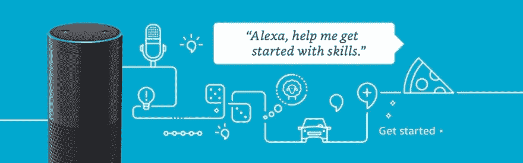

# Alexa，打开 Alexa 的技能发展课程...

> [https://dev . to/Lucio spp/Alexa-open-El-Alexa-31dc 技能开发课程](https://dev.to/luciomsp/alexa-abre-el-curso-de-desarrollo-de-skills-de-alexa-31dc)

今天，技术正在以惊人的速度发展，使我们能够通过声音开展各种活动的装置已经成为现实，而且在社会中的分散程度越来越大。

上周，亚马逊的 Alexa 技术福音派“T0”德文 Viscuso ，开设了免费的**课程**(西班牙语)，学习 Alexa 的技能发展。本课程在平台[【守密】](https://plataforma.keepcoding.io/p/curso-desarrollo-alexa-skills)上提供，涵盖广泛的关键主题。

soho 从一段 20 分钟的视频开始，标题是“技巧自”，接着是一个相当具体的主题，其中一些主题将帮助我们了解 Alexa 是如何工作的，以及我们如何为她培养技能。内容涵盖从创建基本类型技能到与外部 API 通信以及支持 Alexa APL 的新演示语言:

–i18n 技能(26:20)
–天标识(29:00)

–记忆和持久性(26:54)

–访问 ask API(23:58)

–提示 API(46:34)

> ∞这门免费课程你将学会逐步做 Alexa 的技能。我们将从 Hello World 开始，逐步添加更多元素和功能，使您成为发展的真正大师

为了进行课程，技术要求非常基本，在“亚马逊开发者”门户网站上开设账户是必不可少的。

瞄准了吗？-什么**在这里报名**

* * *