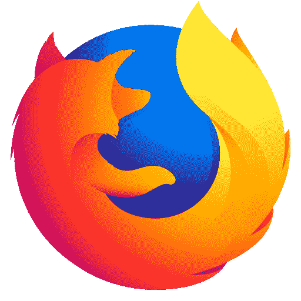

# Firefox 更新使您的网站加载速度加快了 40–80%

> 原文：<https://dev.to/syncfusion/firefox-update-loads-your-site-40-80-faster-4g68>

对于希望在主流浏览器上获得最佳性能的开发者来说，Mozilla 最新发布的 Firefox 浏览器是个好消息。基于 2017 年发布的速度更快的 Firefox Quantum 浏览器，67 版继续加快页面下载和搜索速度。

事实上，据 Mozilla 称，亚马逊和脸书等主要网站的下载速度要快 40-80%。Firefox 通过消除启动时的膨胀来做到这一点。不必要的工作被忽略，更常用的脚本优先于不常用的脚本。如果浏览器检测到您的电脑内存不足，您没有查看的标签将被暂停。如果你点击他们，他们会重新加载。所有这些意味着更快的性能。

那么，互联网第二大最受欢迎的浏览器能与其第一名媲美吗？嗯，这取决于你问谁。有些人说不，Chrome 是王者，有些人说火狐的性能和 Chrome 差不多。不管怎样，它正在赶上。

Firefox 的其他更新包括一个新的解码器 dav1d，用于即将推出的 AV1 视频格式，以及 WebRender 的首次推出。这是 Mozilla 的下一代基于 GPU 的 2D [渲染引擎](https://mozillagfx.wordpress.com/2019/05/23/webrender-newsletter-45/)，通过将图形渲染推给 GPU，允许网页加载速度更快。它正在缓慢推出，但今年所有的火狐浏览器都应该会有。

新版本还修复了几个主要的安全漏洞，增加了安全性和隐私性。Firefox 现在阻止了会消耗处理能力从而降低性能的加密挖掘和使用浏览器配置来识别身份的指纹识别。它还允许你在私人浏览模式下打开扩展。

事实上，就隐私而言，Firefox 明显胜过 Chrome。很快，广告追踪器将被 Firefox 默认屏蔽。随着 67.0.1 版本的发布，新用户将立即获得这一好处，当前用户也将很快得到更新。这与谷歌最近宣布改变 Chrome 的扩展系统形成了鲜明对比。广告拦截器将很快无法使用 Chrome 的 webRequest API 运行，本质上是禁用所有现代广告拦截器。

当然，广告是谷歌的主要收入来源，而 Mozilla 是非营利组织，没有这样的动机。但谷歌不让你干涉它的底线，并不意味着它反对你干涉其他公司的收入流。它在 5 月的 I/O 会议上宣布了新的控制措施，以帮助用户限制第三方跟踪，但没有详细说明。

总的来说，Mozilla Firefox 的最新版本对用户和网络开发者来说都是积极的。我们期待着这种改善速度继续下去。让我们知道你最喜欢的互联网浏览器是什么，为什么在下面的评论区。

如果你喜欢这篇文章，我们认为你可能也会喜欢:

【电子书】 *[简洁地应用见解](https://www.syncfusion.com/ebooks/application_insights_succinctly)*

【电子书】 *[棱角分明简洁地](https://www.syncfusion.com/ebooks/angular-succinctly)*

[博客帖子] [微软在 PWA Builder 2.0 上加倍投资 PWA](https://www.syncfusion.com/blogs/post/microsoft-doubles-down-on-pwas-with-pwa-builder-2-0.aspx)

帖子 [Firefox 更新加载你的网站快了 40-80%](https://blog.syncfusion.com/post/firefox-update-loads-your-site-40-80-faster.aspx)首先出现在 [Syncfusion 博客](https://blog.syncfusion.com)上。