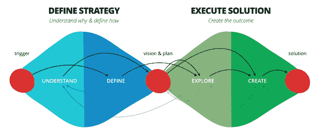
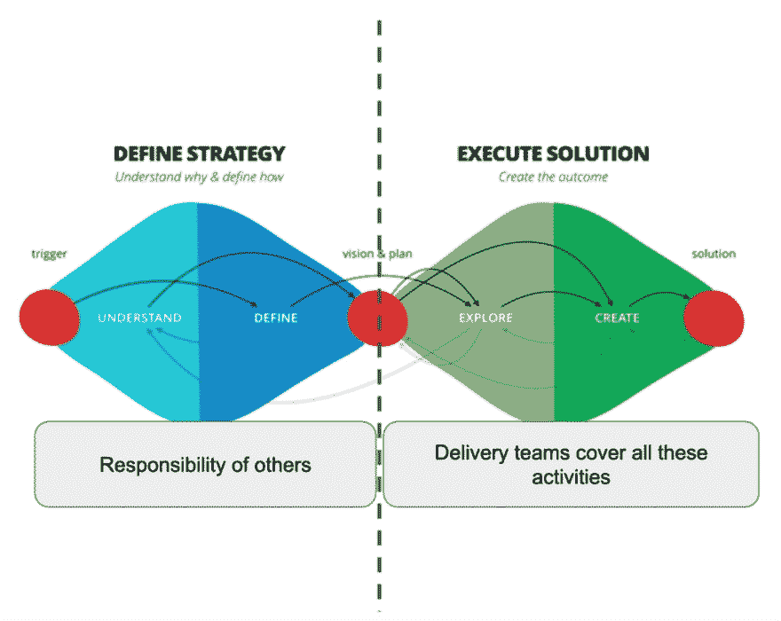
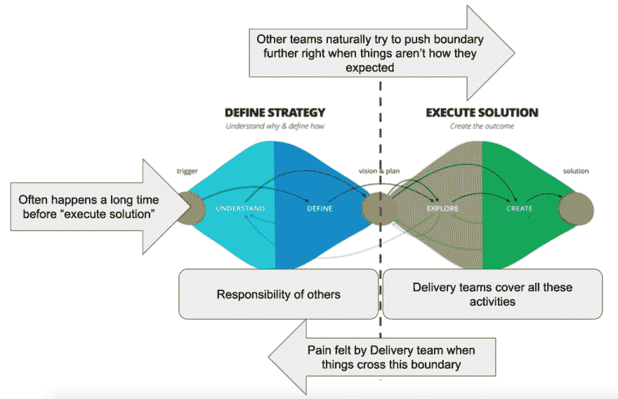
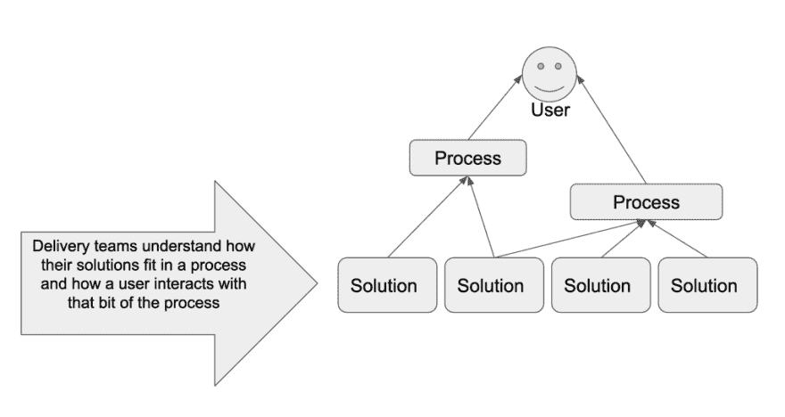
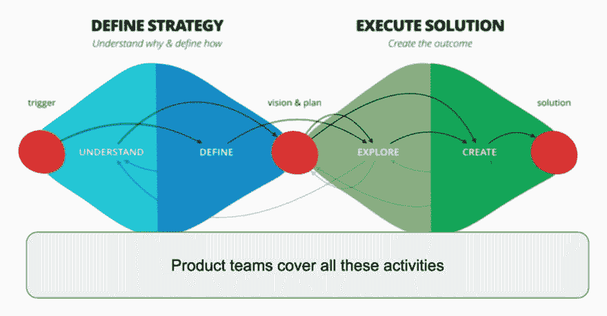
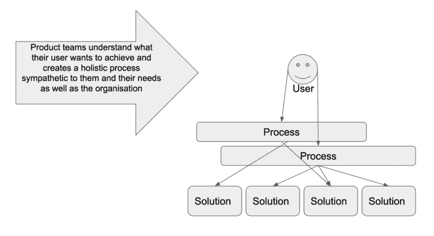
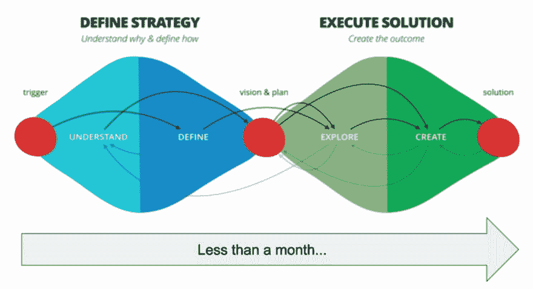

# “不断发现的令人不安的世界”或“交付和产品团队之间的差异”

> 原文：<https://dev.to/defmyfunc/the-uncomfortable-world-of-constant-discovery-or-the-difference-between-delivery-and-product-teams-5489>

随着“敏捷”和“产品”开发渗透到越来越多的 mainstrain 软件开发中，我想写一下出现的两种团队原型的流行(当事情运行良好时…功能障碍是一个完全不同的话题！).从表面上看，他们看起来是由相似的角色组成的，但实际上他们对交付软件有着非常不同的看法，并且在不同的情况下是有用的。这使得比较变得困难，解释两者之间的区别也变得困难和不易理解。

根据我在“转型”(数字/敏捷/产品等)过程中的经验，组织、团队和个人在他们的旅程中会经历许多阶段。在这个旅程中，对于我所描述的“产品”团队，许多团队和组织都陷入了“交付”团队。

首先，让我们为定义和交付软件所涉及的活动建立一个模型。在 ThoughtWorks，我们经常使用[“双菱形”](https://www.thoughtworks.com/insights/blog/double-diamond)

 

<figcaption>一种“双钻”的形象手法。</figcaption>

#### 发货团队

您的旅程的第一步可能是将一定数量的用户从基于角色的团队转移到某种形式的跨职能团队。我称之为交付团队。这一旅程中的第一个角色通常是交付、开发和测试，然后是 BAs、产品和 UX。这意味着你有一个能有效执行解决方案的团队。

 

<figcaption>交付团队可以在‘执行解决方案’阶段有效地工作</figcaption>

如果一个团队停留在这个阶段或者这被认为是转换的“结束”,事情会变得非常困难。交付团队并不真正理解他们为什么要构建他们正在构建的东西，即使他们变得非常擅长构建它。模糊边界向右的压力增加了，这样团队就不会再次“构建错误的东西”,因此过程被设置，这两方面之间的剧场增加了。“定义策略”阶段可能发生在“执行解决方案”阶段之前几个月甚至几年，这意味着在实际探索解决方案时会有越来越多的边界跨越和越来越多的痛苦。

 

<figcaption>当两颗钻石被分开时，疼痛如何影响运送团队</figcaption>

好的交付团队也理解他们构建的系统，以及他们如何适应过程。他们明白系统试图为他们的用户实现什么。他们可以运行、维护和扩展这些系统。

 

<figcaption>交付团队了解用户如何受到他们解决方案的影响</figcaption>

#### 产品团队

产品团队可以对整个“双钻石”负责

 

<figcaption>产品团队覆盖“双钻”</figcaption>

的所有活动

对于一个开始转型之旅的组织来说，这可能是相当不舒服的一步。这是因为突然之间，我们面临着未知的混乱，迫使该组织不得不面对这样一个事实，即它以前所做的很多事情都是在演戏，给人以确定性的错觉。然而，这一步对组织来说是最重要和最有价值的。

我们通常称之为“以用户为中心”。

好的产品团队了解他们的用户想要实现什么，并创建一个整体的过程，同情他们和他们的需求以及组织的需求。

 

<figcaption>产品团队关注他们的用户想要达到的目标</figcaption>

当我和客户一起工作时，我经常不得不把这两颗钻石分成“发现”和“开始”两个阶段。这是为了允许必要的技能和领域专长的交叉授粉发生。然而，在一个真正的产品团队中，这些钻石应该是不断出现的。票证中的微观级别、路线图中的宏观级别以及功能交付的中间阶段。

如果我们使用类似精益价值树的东西来理解我们的工作，那么产品团队能够在大约一个月内完成“打赌”是很重要的。

 

<figcaption>从定义到执行不到一个月</figcaption>

这意味着大多数组织理解和分解需要多年才能解决的问题的方式存在重大差异，如果没有建立应对这种变化的机制，在组织层面上处理这些问题可能会非常困难。

### 总结

转变是一个持续的旅程，所以了解你在哪里和你想去哪里是很有用的。如果你发现自己“被困”在一个交付团队中，无法改变事情，重要的是要明白这是有意还是无意。然后你可以开始朝着你希望的方向努力。

在现实中，交付团队应该是高度过渡的(但通常不是),并且应该努力成为一个产品团队(因为情况是这样的，这是有价值的),或者如果已经真正深刻地理解了工作，应该努力理解如何将工作转移给商品提供商。

### 附录

#### 表示你在一个送货团队中

这个团队通常由敏捷之旅的前几个步骤创建，在交付、开发和测试之间有着密切的合作。开发人员将理解质量的重要性，并将对自动化测试负责。Test 将负责探索性测试，并能够生成基于风险的方法来测试任何解决方案或服务。

团队负责一个系统/服务或一组系统和服务。通常，一个完整的用户之旅分散在多个团队中。运营角色已经由团队承担，他们将理想地 24/7 照看他们的服务。这个团队可以帮助人们理解技术债务的问题。他们可能有 10%或 20%的时间来探索新的想法，并展示给组织中的高层人员。他们可能与 UX 的角色有着良好的关系，尤其是更注重设计的角色。ba 通常负责帮助团队理解需求，当开发人员或测试人员第一次看到一个标签时，已经有很多工作要做了。

用户研究通常会提前几个月进行。开发和测试角色很少参与涉及他们用户的事件。路线图通常是在未来一年后定义的。团队对他们正在做的大部分工作没有什么发言权，但是随着工作的分解，他们可能对如何实现工作有越来越多的发言权。

用于可视化工作的板通常被分成多个泳道，以便高优先级的项目可以更快地流动。这些列通常基于代码必须经过的角色或环境。它侧重于“开发”和“测试”,因此不包含整个价值链，经常错过工作的“构思”阶段，而“观察”发布意味着一些工作正在“脱离董事会”进行，团队可能很难理解。一张票往往是“搞定”而不是“搞定”。票证通常代表单个角色可以完成的一组任务的一部分，而不是向用户交付的一部分价值。回顾通常关注其他团队对这个团队工作的影响，这意味着有时回顾会失败，因为改变的能力有限。

nfr/CFR 经常被考虑，但是随后被团队分开处理。有时这是由环境(即性能测试)描述的，而其他时候是由处理另一个团队(即安全或文档标签)来描述的。通常，团队必须在事后为一些把关者角色制作文档，包括(但不限于)架构和安全性。他们可能不得不与其他团队协调发布，或者成为计划的一部分(就像发布列车)。

人们通常根据在团队中的角色获得不同的报酬，他们的个人绩效评估并没有与团队的目标挂钩。个人贡献者经常产生大量的输出，产生知识仓库和对特定任务的特定团队成员的依赖。

#### 表明你在一个产品团队中

他们可以完全控制自己的积压工作。积压的工作不超过一个月的工作量，并且被毫不留情地修剪和优先处理。正因为如此，回顾会关注这个团队可以改变什么，行动优先于所有其他工作。未来 3 个月的路线图只是相对确定的。路线图由一系列“赌注”而不是需求组成，每个“赌注”都可以被团队取消。

团队负责端到端流程或用户旅程的服务设计、交付和运营，在该流程中不移交给其他团队。整个团队都鼓励深入理解产品，产品中经常发生的事件有助于形成待办事项。

团队可以自由使用由他们、组织内的其他团队或外部提供商构建的解决方案。

在特别困难的时候，特别是当团队对某些事情不是很了解的时候，通常是“暴民”，这可以是任何类型的任务，而不仅仅是“类型-类型”。愿景的一致性在长期和短期内都受到重视，团队积极努力在前期设计和交付之间进行折衷。前期设计大部分是“及时”完成的，紧接着是尝试交付该设计。这种一致性被团队视为实现自主的一种方式。任何技术债务都可以像特性一样被赋值，因此可以相应地进行优先级排序。

工作被可视化在一块板上，列代表增值活动。如果没有，团队可以根据需要改变他们的过程。只有一条泳道。团队中的每个人从头到尾都知道如何得到一张票，并定期为此承担责任。该板包括“构思”和“发布”阶段。对释放进行积极的监控和观察，以了解它们所产生的影响。发布独立于任何其他团队。

票证通常代表用户的一部分价值。在团队经历的关键发现和解决方案阶段，任何关键把关团队(如架构和安全)都积极参与。这意味着 nfr/CFR 是个人票的组成部分。一张罚单不可能由一个人解决。负责通过董事会获得入场券的人将不得不在不同的点引入各种角色，以成功实现这一目标。

用户研究持续定期进行，团队积极参与其中。正在进行的研究要么与刚刚发布的东西相关，要么与团队下一步想做的事情相关。

无论在团队中担任何种角色，人们的薪酬通常都差不多，他们的个人绩效评估也有意与团队目标挂钩。虽然个人为团队带来了其他人无法带来的关键技能，但团队其他成员的技能积累可以弥补个人的缺失。在出现知识孤岛的地方，团队会积极地打破它们。

### 链接用在文章中并作为灵感

[双菱形:战略+正确解决方案的执行](https://www.thoughtworks.com/insights/blog/double-diamond)

[https://medium . com/media/3c a50 a 105 CAC 63 b 20 D5 b 0952d 7d 84886/href](https://medium.com/media/3ca50a105cac63b20d5b0952d7d84886/href)

[组织反模式:双重价值流](https://www.continuousdeliveryconsulting.com/blog/organisation-antipattern-dual-value-streams/)