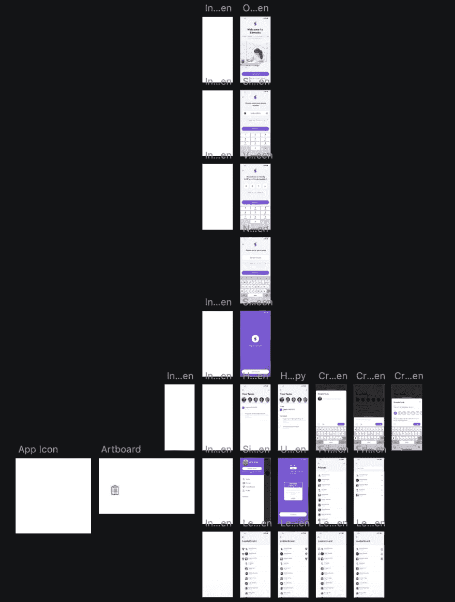
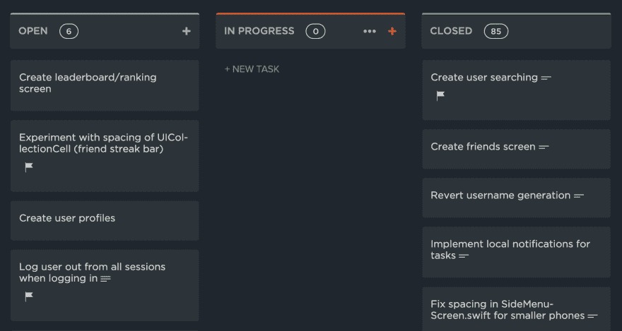

# 纪律在发展中的重要性

> 原文：<https://dev.to/oohsinan/the-importance-of-discipline-in-development-1id2>

在过去的几个月里，我一直在做兼职项目(主要是在 iOS 上使用 XCode 和 Swift ),只是为了好玩。我注意到我有开始项目的倾向，但在某个时候我会放弃并彻底放弃这个项目。迫使我放弃这个项目的原因有很多，但最常见的是:

*   编写 UI 代码时感到烦恼
*   在决定应用程序的结构时遇到问题
*   直截了当地讨厌我编写和构建代码的方式

## 🗣让我们来谈谈纪律

那么对于编程来说，遵守纪律意味着什么呢？我认为这是建立标准，并在整个项目开发过程中遵循适当的工作流程。

我意识到几乎我所有失败的项目都有相同的趋势。它们是我马上开始的项目。我没有花任何时间:

*   集思广益
*   决定功能
*   设计用户界面
*   决定项目的结构

最终，我会面临一个似乎不可能解决的障碍，尽管我确信它是不可能的。但是，因为我花了更多的时间调试和面对意想不到的问题，我最终失去了动力，彻底放弃了这个项目。

## ✍️的变化我决定做出

#### 👨‍🎨使用草图设计我的用户界面

大约 3 个月前，我想出了一个 iOS 应用程序的主意，它可以帮助我和我的朋友更有效地学习(部分灵感来自我糟糕的成绩😬).5 月 26 日，我终于从所有的课业中解脱出来，我决定开始计划这个应用程序。

规划应用程序是朝着更规范的开发方法迈出的第一步。我花了大约一周的时间来草图设计我能想到的存在于应用程序中的每一个可能的屏幕。

 

<figure>

<figcaption>一周后我的草图页面是什么样子的(不得不隐藏一些画板🙈)</figcaption>

</figure>

我知道，我知道...我可能应该使用单独的页面来组织设计，但这是我第一次使用草图和...是的，事情变得有点乱😅

我鼓励在开始开发之前设计 UI 的原因是因为当我编程时，我宁愿只关注功能而不是设计。我所要做的就是将设计翻译成代码，这并不像以前项目中从头开始设计 UI 那样耗时。在没有参考资料可供我使用的项目中，我不得不花一些时间在脑海中勾勒出一个设计，这浪费了更多的时间。

#### 📝使用项目管理工具

在过去的几年里，我参与了几十个其他项目，其中一件事让我记忆犹新，那就是管理我的任务的艰难。我从来不记得我做过什么，我想做什么。

对于这个项目，我决定使用 ClickUp，这是一个项目管理工具，就像 Trello 和其他著名的服务一样。我开始在“开放”栏中填写我想完成的简单初始设置任务。慢慢地，随着时间的推移，我的空间看起来是这样的:

 

<figure>

<figcaption>我的 ClickUp 空间目前看起来怎么样</figcaption>

</figure>

我喜欢为这个项目做这样的改变，是因为有许多我可以利用的功能，这些功能在使用文本编辑器来跟踪任务或使用传统的笔和纸方法时是不可用的。我能够根据优先级对任务进行排序，添加描述，设置截止日期，添加子任务等等。

我真正喜欢的另一件事是整合。尤其是 GitHub 集成。启用时，每个提交都被分配给 ClickUp 中的一个任务(通过使用任务 ID)，因此，搜索和筛选任务并找到相应的提交变得更加容易。

#### 🎉克服我对使用 Git 的恐惧

信不信由你，在我之前的所有项目中，我从未使用过版本控制系统。我过去常常在我的本地计算机上编码，创建十几个目录(以防出错🤦‍♂️).有了这个项目，我决定是时候克服我对使用 Git 的恐惧，并最终学会如何使用它了(主要是由于 ClickUp 上的 GitHub 集成)。

我怎么强调 Git 对我的生活改变都不为过。我可以很容易地检查我所有的提交，并看到每个文件中的变化。一切都感觉井井有条，恰到好处。

因为这是一个 iOS 应用程序，所以我使用 XCode，这使得使用提供的 GUI 界面提交到我的存储库变得容易得多，这也让我相信采用 Git 是一个好主意。

## 💬最后的想法和反思

在开始这个项目大约 2-3 周后，我注意到我的工作流程和工作效率发生了很多变化。我仍然在做我的项目，我喜欢它！一切都井井有条，很容易找到。到目前为止，我已经在 ClickUp 上完成了 91 个任务，在 Sketch 上完成了所有的设计，并在 GitHub 上提交了所有与代码相关的任务。我已经注意到，与我之前参与的任何其他项目相比，我更喜欢在这个应用上工作。我相信在我的整个开发过程中遵守纪律和使用工具使我更有效率，这个设置对我真的很有好处，我迫不及待地想在未来的项目中继续使用它😃

不要羞于分享你的想法和你用来提高生产力的工具！🙌