# 2019 年针对网页开发者和设计者的 19 个 Chrome 扩展

> 原文：<https://dev.to/lambdatest/19-chrome-extensions-for-web-developers-designers-in-2019-1ei2>

毫无疑问，谷歌浏览器是世界上最受欢迎的浏览器。在用户份额方面，谷歌 Chrome 遥遥领先于其他主要浏览器，如 Mozilla Firefox、Safari、Opera、微软 Edge 等。你可以在我们关于跨浏览器测试最重要的浏览器的博客中查看其他浏览器与 Chrome 相比的表现。在短短 10 年多的时间里，谷歌 Chrome 已经占领了超过 65%的市场份额。其迅速崛起背后的一个关键因素是其庞大的扩展库，这使其真正与众不同，尤其是对 web 设计人员和开发人员而言。然而，尽管它提供了一个如此庞大的扩展库，但对于用户来说，根据他们的日常需要来选择扩展还是有点麻烦。

作为一名 web 开发人员，我意识到在选择一个可以提高我日常工作效率的扩展时会有很多麻烦。这种情况经常发生，我的同事向我推荐一些新的 Chrome 扩展，它们极大地帮助我更快地提供更好的网站。回想起来，我意识到，我已经错过了这些对 web 开发人员来说必不可少的 Chrome 扩展几个月了，直到一位同事通知了我。我也多次帮助过我的同事&我相信他们一定和我有同样的感受。这是人类的一部分，当你开始了解一些可以帮助你更快做事情的事情时，你最终会说“要是我早点知道就好了”。

在这篇文章中，我将为 web 开发人员和设计人员重点介绍精心制作的 19 个最佳 Chrome 扩展，以提高他们的工作效率，让他们的生活更加轻松。

## 1。[ColorZilla](https://chrome.google.com/webstore/detail/colorzilla/bhlhnicpbhignbdhedgjhgdocnmhomnp?ref=designrevision.com)–颜色选择器和生成器

ColorZilla 是 8 年前推出的最古老的颜色选择器扩展之一，即使在今天，它仍然成功地保持了作为开发人员或设计师的最佳颜色选择器和滴管 Chrome 扩展的地位。ColorZilla 将使您能够从浏览器上的任何像素动态读取颜色，并以 RGB 十六进制格式粘贴到任何其他程序中。就像 Site Palette 一样，ColorZilla 也使您能够生成渐变颜色，并从任何网站提取调色板。该扩展还维护了最近颜色选择的颜色历史索引。

[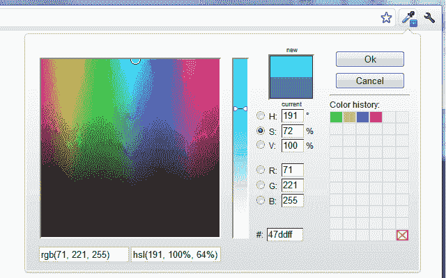](https://res.cloudinary.com/practicaldev/image/fetch/s--lUqOpcv6--/c_limit%2Cf_auto%2Cfl_progressive%2Cq_auto%2Cw_880/https://www.lambdatest.com/blog/wp-content/uploads/2019/07/image4-2.png)

## 2。[现场调色板](https://chrome.google.com/webstore/detail/site-palette/pekhihjiehdafocefoimckjpbkegknoh?ref=designrevision.com)–调色板生成器

下次当你遇到一个有着漂亮和令人愉悦的颜色组合的网站时，这个巧妙的插件可以帮助你快速提取和生成调色板。它还允许你下载预览调色板图像，pdf 和生成可共享的链接。网站调色板武装与 coolers.co 和谷歌艺术调色板无缝集成。对于全球的开发者和设计者来说，它是一个重要的 Chrome 扩展。

[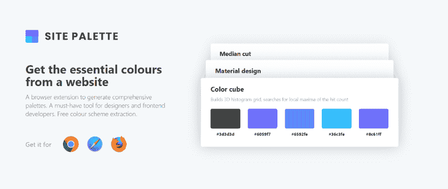](https://res.cloudinary.com/practicaldev/image/fetch/s--pM7hMEnc--/c_limit%2Cf_auto%2Cfl_progressive%2Cq_auto%2Cw_880/https://www.lambdatest.com/blog/wp-content/uploads/2019/07/image6-2.png)

## 3。[忍者面庞](https://chrome.google.com/webstore/detail/fontface-ninja/eljapbgkmlngdpckoiiibecpemleclhh?ref=designrevision.com)——字体标识符

开发人员不用检查 Chrome 开发工具中的元素来找出正在使用的字体名称，而是可以依赖这个名为 **Font Face Ninja** 的优雅扩展来轻松识别网页上正在使用的所有字体。字体忍者拥有超过 280，000 的下载量，是另一个叫做 **WhatFont** 的流行字体扩展的直接竞争对手。为了给开发者&的设计者使用这个手工制作的 Chrome 扩展，你只需要将鼠标悬停在网页上任何你需要识别的文本元素上。一个弹出的浮动窗口将显示字体的名称，以及一个小的预览窗口供你玩。您可以将喜爱的字体加入书签，并保存起来以备后用。

[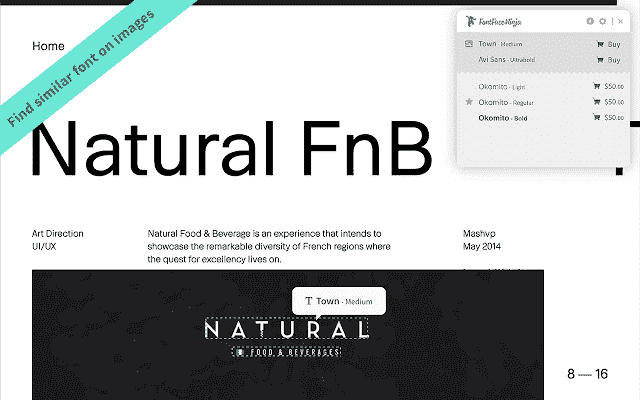](https://res.cloudinary.com/practicaldev/image/fetch/s--FLrFwvLk--/c_limit%2Cf_auto%2Cfl_progressive%2Cq_auto%2Cw_880/https://www.lambdatest.com/blog/wp-content/uploads/2019/07/pasted-image-0-3.png)

## 4。[狨猴](https://chrome.google.com/webstore/detail/marmoset/npkfpddkpefnmkflhhligbkofhnafieb?hl=en)–代码快照生成器

出于美观或表现的目的，Web 设计人员和开发人员可能需要为他们项目中的代码创建快照。Marmoset 是一个出色的 Chrome 扩展，只需点击一下，你就可以在几秒钟内创建漂亮的代码快照。这对于社交媒体帖子或作品集网站设计来说可能会很方便。它是网页开发者和设计者必备的 Chrome 扩展之一。

[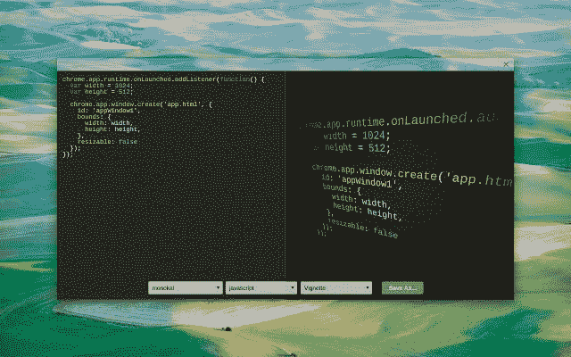](https://res.cloudinary.com/practicaldev/image/fetch/s--NHixpV2T--/c_limit%2Cf_auto%2Cfl_progressive%2Cq_auto%2Cw_880/https://www.lambdatest.com/blog/wp-content/uploads/2019/07/image3.jpg)

## 5。 [LambdaTest 截图](https://chrome.google.com/webstore/detail/lambdatest-screenshots/fjcjehbiabkhkdbpkenkhaahhopildlh?hl=en)——跨浏览器测试扩展

作为一名开发人员，我经常注意到其他开发人员错过了测试他们所构建的东西的机会。有时，这种粗心的态度会给产品带来耻辱，停机会给你的办公环境带来不适。一旦你找到了问题的根源，并意识到 web 应用程序并不适用于一个浏览器时，你会觉得自己很傻。这可能是由于不推荐使用的 CSS 功能，或者浏览器不太支持的任何其他 web 元素。

我不会责怪开发者错过跨浏览器测试，因为当你看到它时，它是不可行的。通过 VMware 或任何其他设置安装多个浏览器、设备对所有人来说都是一件麻烦事。这就是 LambdaTest 派上用场的地方。LambdaTest 提供了一个基于云的平台，可以在 2000 多种真实浏览器和不同设备的浏览器版本上执行[跨浏览器测试](https://www.lambdatest.com/?utm_source=dev&utm_medium=Blog&utm_campaign=Nikhil-22072019&utm_term=Nikhil)，因此你最终可以拥有一个吸引眼球、健壮且[跨浏览器兼容的网站](https://www.lambdatest.com/blog/how-to-make-a-cross-browser-compatible-website/?utm_source=dev&utm_medium=Blog&utm_campaign=Nikhil-22072019&utm_term=Nikhil)。对于桌面设备，你可以在 Windows 和 macOS 上进行测试。对于移动设备，你可以在两个安卓& iOS 上进行测试。

LambdaTest 开发了一个 Chrome 扩展来帮助用户批量执行自动截图测试。最精彩的部分？你可以一次在 25 个设备上进行[截图测试](https://www.lambdatest.com/automated-screenshot?utm_source=dev&utm_medium=Blog&utm_campaign=Nikhil-22072019&utm_term=Nikhil)。如果您发现任何 UI 异常，那么您可以在您首选的项目管理工具上与您的同事分享。授权你[执行跨浏览器测试](https://www.lambdatest.com/blog/performing-cross-browser-testing-with-lambdatest/?utm_source=dev&utm_medium=Blog&utm_campaign=Nikhil-22072019&utm_term=Nikhil)在一瞬间，LambdaTest 截图对于全世界的开发者、设计者，显然还有测试者来说，无疑是最好的 Chrome 扩展之一。

## 6。[页面尺](https://chrome.google.com/webstore/detail/page-ruler/emliamioobfffbgcfdchabfibonehkme?ref=designrevision.com)–尺寸和大小检查器

Page Ruler 是对开发者和设计者最重要和最有帮助的 Chrome 扩展之一，它可以帮助 web 开发者快速测量页面上任何元素的完美尺寸和位置。这个扩展在屏幕上画出一个标尺图像，允许你检查单个元素并查看它们的尺寸读数——宽度、高度和位置。

[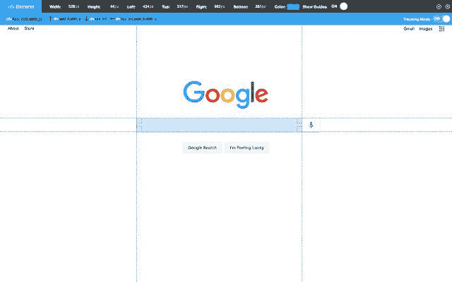](https://res.cloudinary.com/practicaldev/image/fetch/s--ns3N0b0---/c_limit%2Cf_auto%2Cfl_progressive%2Cq_auto%2Cw_880/https://www.lambdatest.com/blog/wp-content/uploads/2019/07/image1.jpg)

## 7。[尺寸](https://chrome.google.com/webstore/detail/dimensions/baocaagndhipibgklemoalmkljaimfdj?ref=designrevision.com)–尺寸和大小检查器

这一类别下的另一个关键扩展称为维度，它有助于测量网页上各种元素之间的距离。**其功能与页面标尺**略有不同。尺寸测量从鼠标指针向上/向下和向左/向右直到到达边框的距离。这使得它成为测量图像、输入框、按钮、视频、gif、文本、图标之间距离的完美工具。另一个让 Dimensions 与众不同的功能是它的**功能，也可以与实体模型**一起工作。如果你的设计师给了你 Jpeg 或 PNG 格式的页面设计模型，把它们放在 Chrome 里面，dimensions 就会顺利工作。关于尺寸，需要注意的一点是，它可能并不总是能很好地处理图像

[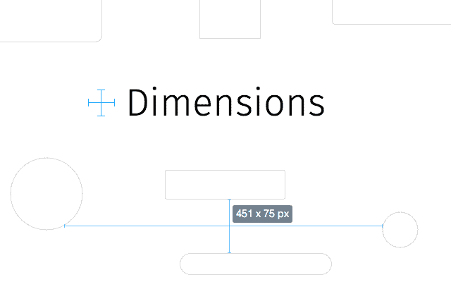](https://res.cloudinary.com/practicaldev/image/fetch/s--11nkNJei--/c_limit%2Cf_auto%2Cfl_progressive%2Cq_auto%2Cw_880/https://www.lambdatest.com/blog/wp-content/uploads/2019/07/image5-2.png)

## 8。[检查我的链接](https://chrome.google.com/webstore/detail/check-my-links/ojkcdipcgfaekbeaelaapakgnjflfglf?hl=en)——断链检查器

Check My Links 可以说是 Chrome library 中为开发者和设计者提供的最强大、最健壮的断链检查器 Chrome 扩展。“检查我的链接”会搜索整个网页，验证每个链接并报告其是否有效。**检查我的链接**让你只需点击一下鼠标，就可以将每个断开的链接复制到你的剪贴板上。识别和纠正断开的链接对于任何网站有效的页面搜索引擎优化和避免谷歌网站爬虫的惩罚都是至关重要的。

[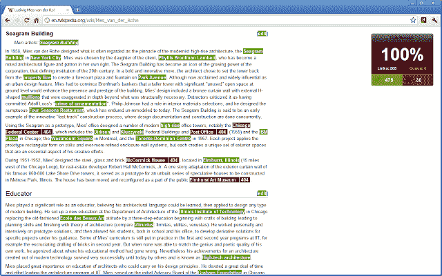](https://res.cloudinary.com/practicaldev/image/fetch/s--8Flrp5q4--/c_limit%2Cf_auto%2Cfl_progressive%2Cq_auto%2Cw_880/https://www.lambdatest.com/blog/wp-content/uploads/2019/07/pasted-image-0-4.png)

## 9。[清除缓存](https://chrome.google.com/webstore/detail/clear-cache/cppjkneekbjaeellbfkmgnhonkkjfpdn?ref=designrevision.com)

清除缓存扩展有助于擦拭干净你的缓存随着浏览数据与一个单一的点击，没有浪费时间与任何弹出窗口，对话窗口或铬设置窗口。此外，您甚至可以定制要在扩展选项设置上清除多少数据——应用程序缓存、缓存、Cookies、下载、文件系统、表单数据、历史、索引数据库、本地存储、插件数据、密码和 WebSQL。您可以删除全局 cookiess，也可以删除特定域的 cookie。对于开发者、设计师和其他人来说，这是最方便的 Chrome 扩展之一。

[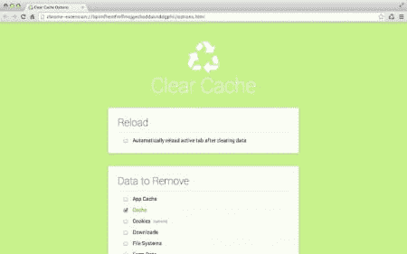](https://res.cloudinary.com/practicaldev/image/fetch/s--VS8pPIp8--/c_limit%2Cf_auto%2Cfl_progressive%2Cq_auto%2Cw_880/https://www.lambdatest.com/blog/wp-content/uploads/2019/07/pasted-image-0-5.png)

## 10。[Wappalyzer](https://chrome.google.com/webstore/detail/wappalyzer/gppongmhjkpfnbhagpmjfkannfbllamg?ref=designrevision.com)–现场分析仪(技术标识符)

开发人员在遇到令人印象深刻的网站时面临的最大障碍之一是一个有趣的问题——这个网站使用了哪些技术？这就是 Wappalyzer 来拯救我们的地方。这个惊人的扩展是 Elbert Alias 在 2009 年创建的跨平台工具，它揭示了用于创建特定网站的技术名称。它自动检测超过 1000 种技术，如站点生成器、框架、库、插件、CMS、数据库、服务器软件、小部件、分析工具等。您可以使用 Wappalyzer 网站或使用扩展快速使用。这个为开发者和设计者提供的 Chrome 扩展是制作有吸引力的网站的真正生命线。

[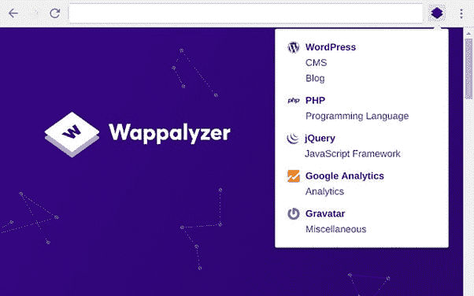](https://res.cloudinary.com/practicaldev/image/fetch/s--LWSnFKdD--/c_limit%2Cf_auto%2Cfl_progressive%2Cq_auto%2Cw_880/https://www.lambdatest.com/blog/wp-content/uploads/2019/07/pasted-image-0-6.png)

## 11。[幽灵特工](https://chrome.google.com/webstore/detail/ghostery-%E2%80%93-privacy-ad-blo/mlomiejdfkolichcflejclcbmpeaniij?ref=designrevision.com)——隐私工具

Ghostery 是一个隐私扩展，内置广告拦截器，以消除网站上令人讨厌的广告，跟踪保护，以保护您的数据和阻止第三方网站跟踪，以及页面速度加速器和优化器，使您的浏览体验整洁愉快。它还附带了一个定制的 insights 仪表板，您可以对其进行定制以查看相关信息。

[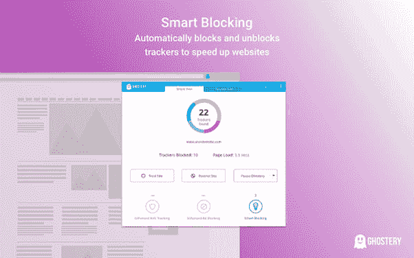](https://res.cloudinary.com/practicaldev/image/fetch/s--prh5hvjI--/c_limit%2Cf_auto%2Cfl_progressive%2Cq_auto%2Cw_880/https://www.lambdatest.com/blog/wp-content/uploads/2019/07/pasted-image-0-7.png)

## 12。 [JSON 浏览器](https://chrome.google.com/webstore/detail/json-viewer/gbmdgpbipfallnflgajpaliibnhdgobh?ref=designrevision.com)——JSON 美化者和浏览器

如果你正在广泛地使用 API，尤其是 RestFul APIs 或任何涉及大量 JSON 数据的东西，这个视觉上令人惊叹的 JSON highlighter 对于开发者来说是一个很好的 Chrome 扩展。JSON viewer 有助于将 JSON 数据排列成视觉上吸引人的树格式，可以直接在浏览器窗口中查看，而不是在浏览器中以笨拙的不可读格式查看巨大的 JSON 文件数据。

[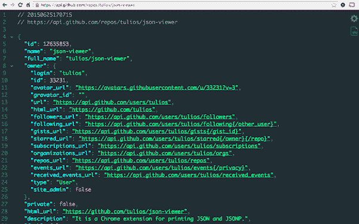](https://res.cloudinary.com/practicaldev/image/fetch/s--2Sp9eiU_--/c_limit%2Cf_auto%2Cfl_progressive%2Cq_auto%2Cw_880/https://www.lambdatest.com/blog/wp-content/uploads/2019/07/pasted-image-0-8.png)

## 13。[窗口尺寸调节器](https://chrome.google.com/webstore/detail/window-resizer/kkelicaakdanhinjdeammmilcgefonfh/?ref=designrevision.com)–屏幕尺寸模型

这个扩展是响应式设计编码的救星。虽然大多数开发人员对默认的 Chrome dev tools resizer 功能感到满意，但这个面向开发人员和设计人员的 Chrome 扩展可以模拟所有流行设备(如 iPhones、iPad mac 等)的任何屏幕大小和分辨率。这非常有助于开发人员在不同屏幕尺寸的设备上测试他们的布局，并验证他们的响应媒体查询编码是否按预期工作。

不过请记住，窗口大小调整程序只会调整视窗大小，为您提供一个关于您的网站在不同屏幕大小上如何呈现的大致想法。为了更准确和彻底的响应测试，你需要真正的移动浏览器来验证你的网站渲染。

除了跨浏览器测试，LambdaTest 还提供响应测试，让你在真正的移动浏览器上可视化你的网站或网络应用。你可以在一次测试中测试 46 个移动设备，包括 iOS & android。

[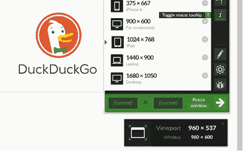](https://res.cloudinary.com/practicaldev/image/fetch/s--nBdGll1w--/c_limit%2Cf_auto%2Cfl_progressive%2Cq_auto%2Cw_880/https://www.lambdatest.com/blog/wp-content/uploads/2019/07/pasted-image-0-9.png)

## 14。[企业 Ipsum](https://chrome.google.com/webstore/detail/corporate-ipsum/lfmadckmfehehmdnmhaebniooenedcbb?ref=designrevision.com)–Lorem Ipsum 生成器

另一个对开发者和设计者最有用的 Chrome 扩展。与其使用普通的标准 lorem ipsum 生成器在你的 web 布局中创建占位符文本，为什么不尝试使用这个智能工具来生成智能文本而不是乱码内容。Corporate Ipsum extension 是一种特殊的 lorem ipsum 生成器，它创建模拟的业务内容文本。这将使你的布局在视觉上更吸引人，更能让客户满意。

[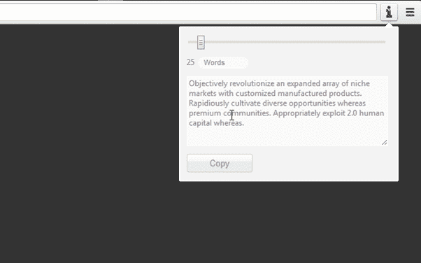](https://res.cloudinary.com/practicaldev/image/fetch/s--A4-tGl07--/c_limit%2Cf_auto%2Cfl_progressive%2Cq_auto%2Cw_880/https://www.lambdatest.com/blog/wp-content/uploads/2019/07/pasted-image-0-10.png)

## 15。[会话伙伴](https://chrome.google.com/webstore/detail/session-buddy/edacconmaakjimmfgnblocblbcdcpbko?ref=designrevision.com)–选项卡/会话管理器

谷歌 Chrome 因其对内存使用的巨大胃口而在世界各地臭名昭著，使用较慢系统的开发人员在使用多个标签时经常会面临屏幕冻结和崩溃。这就是为什么有效的标签管理是必不可少的，尤其是当你忘记了你打开的标签是为了寻找设计灵感还是在 StackOverflow 上寻找解决方案。解决这个巨大问题的完美工具是会话伙伴！Sessions Buddy 是最强大的 Chrome 扩展，可以帮助开发者和设计者管理浏览器标签。它还提供了一个书签管理器，界面简单美观。它可以帮助您保存会话，并在以后动态打开会话时恢复它们。因此，避免混乱并保持内存空闲。它允许您在一个页面中管理所有选项卡，按主题组织它们，还提供快速搜索来查找特定的选项卡。此外，如果您意外关闭浏览器窗口或系统崩溃，您也不必担心会丢失会话。Sessions Buddy 将恢复您离开时的所有标签。

[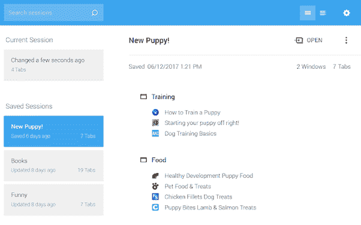](https://res.cloudinary.com/practicaldev/image/fetch/s--vQSBYSC2--/c_limit%2Cf_auto%2Cfl_progressive%2Cq_auto%2Cw_880/https://www.lambdatest.com/blog/wp-content/uploads/2019/07/pasted-image-0-11.png)

## 16。 [CSS 查看器](https://chrome.google.com/webstore/detail/cssviewer/ggfgijbpiheegefliciemofobhmofgce?hl=en)–CSS 属性查看器

与其浪费时间在检查器窗口或源代码中寻找元素的 CSS 属性， **CSS Viewer** extension 提取所有有价值的 CSS 属性，并以有组织的方式在浮动窗口中显示它们。只需将鼠标悬停在您想要检查的网页上的任何元素上，CSS viewer 浮动窗口就会列出类别-1 下的所有关键 CSS 属性。字体和文本(字体系列、字体大小、字体粗细、行高、文本修饰、文本对齐)，2。颜色和背景(颜色，背景颜色，背景位置)，3。盒模型属性(高度、宽度、填充、边距)，4。定位，5。效果(变换和过渡)和最后 6。杂项属性。

[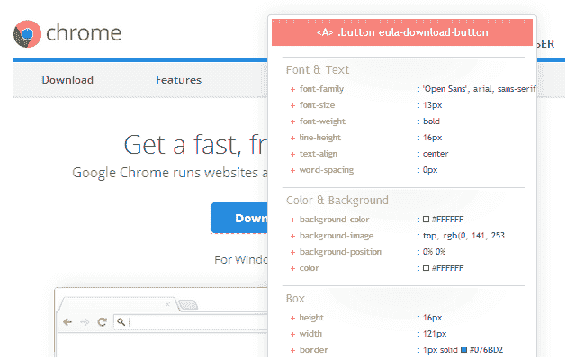](https://res.cloudinary.com/practicaldev/image/fetch/s--RoLWOvjb--/c_limit%2Cf_auto%2Cfl_progressive%2Cq_auto%2Cw_880/https://www.lambdatest.com/blog/wp-content/uploads/2019/07/pasted-image-0-12.png)

## 17。[编辑这个 Cookie](https://chrome.google.com/webstore/detail/editthiscookie/fngmhnnpilhplaeedifhccceomclgfbg?ref=designrevision.com)–Cookie 管理器

EditThisCookie 是 Chrome 库中最受欢迎的 Cookie 管理器扩展，拥有超过 270 万用户，这使得它成为 cookie 领域无可争议的王者。此工具允许您添加、删除、搜索、编辑、阻止和保护(只读)cookies。此外，您还可以导入 JSON 或 cookiess.txt 格式的 cookie。这个 Chrome 扩展是对开发者&设计者最有用的 Chrome 扩展之一。

## 18。[检查机器人](https://chrome.google.com/webstore/detail/checkbot-seo-web-speed-se/dagohlmlhagincbfilmkadjgmdnkjinl)–网站审计员(搜索引擎优化/页面速度/安全)

Checkbot 是一个屡获殊荣的站点审计扩展，允许您同时检查每个站点的 250 多个 URL，以检查 SEO/Web 速度/安全问题，如断开的链接、重定向、无效的 HTML/CSS/JS、不安全的密码形式、缩小文件、重复内容等。Checkbot 运行基于 50 多个最佳 SEO 和安全实践的测试，这些安全实践基于 Google、Mozilla 和 W3C 的建议。使用 Checkbot 扩展将帮助你打造完美优化和安全的网站，这将扼杀谷歌 SERP 排名。SERP 排名对互联网上的每个企业都至关重要，作为一名开发者，你的目标是提供一个漂亮的网站，但如果它没有得到应有的关注，那又有什么好处呢？

我喜欢经常使用 Checkbot 在我的网站上运行审计&发现它对于全球的开发者和设计者来说是一个非常方便的 Chrome 扩展。

[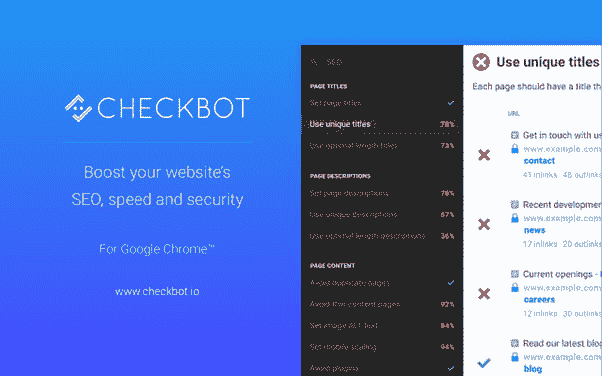](https://res.cloudinary.com/practicaldev/image/fetch/s--YZ3O2_89--/c_limit%2Cf_auto%2Cfl_progressive%2Cq_auto%2Cw_880/https://www.lambdatest.com/blog/wp-content/uploads/2019/07/pasted-image-0-14.png)

## 19。[网络开发人员](https://chrome.google.com/webstore/detail/web-developer/bfbameneiokkgbdmiekhjnmfkcnldhhm)–网络开发工具包

对于开发者和设计者来说，这是一个不可或缺的 Chrome 扩展，这个扩展在你的浏览器中增加了一个工具栏和一套完整的 web 开发套件。该扩展提供的工具分为 10 个独立的选项卡——禁用、Cookies、CSS、表单、图像、信息、杂项、大纲、调整大小和工具。

这些工具包括禁用 JavaScript/插件/弹出窗口/通知、cookie 管理器、CSS 属性查看器和编辑器、表单和图像操作、窗口大小调整、缓存管理、页面标尺、属性检查器等。

[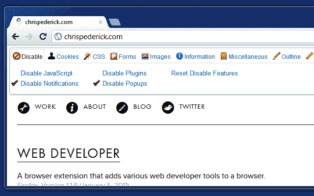](https://res.cloudinary.com/practicaldev/image/fetch/s--FXBY7KXk--/c_limit%2Cf_auto%2Cfl_progressive%2Cq_auto%2Cw_880/https://www.lambdatest.com/blog/wp-content/uploads/2019/07/pasted-image-0-15.png)

## 结论

Chrome 开发者每周都会发布几十个新的令人兴奋的扩展，这些扩展是专为网络开发者打造的。这些针对开发者和设计者的 Chrome 扩展从基本的实用工具和设计工具到针对各种语言和框架的开发工具，可以节省您大量的时间，并将您的生产力提升到一个全新的水平。继续探索新的 Chrome 扩展，如果我错过了什么，请在下面的评论中分享你的观点。我期待听到你最喜欢的 Chrome 扩展。干杯！

