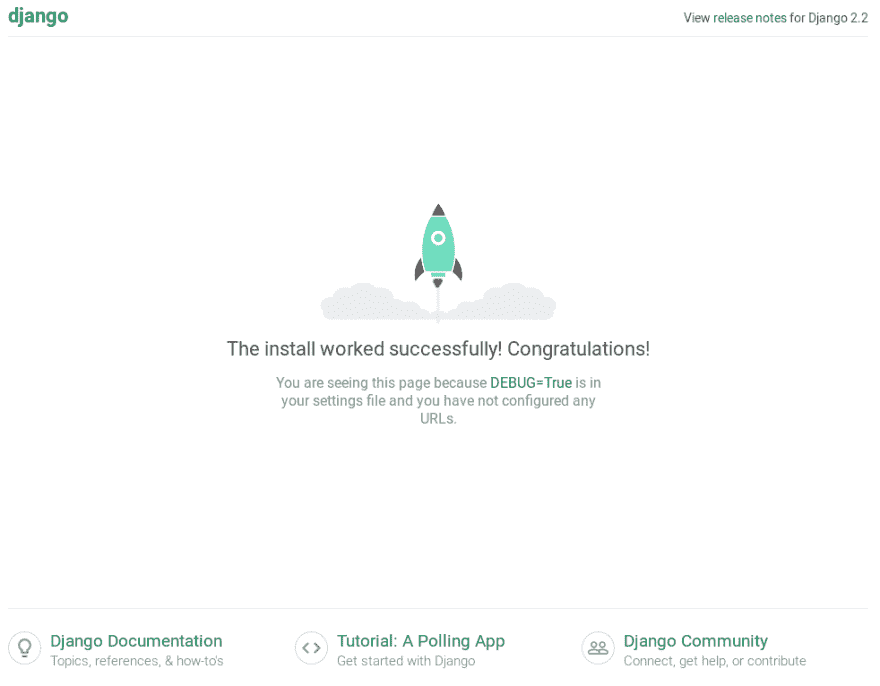

# 优化 Django 中的 Postgres 全文搜索

> 原文：<https://dev.to/danihodovic/optimizing-postgres-full-text-search-with-django-42hg>

Postgres 提供了强大的开箱即用的搜索功能。对于大多数 Django 应用程序来说，没有必要运行和维护 ElasticSearch 集群，除非你需要 ElasticSearch 提供的高级功能。Django 通过内置的 [Postgres 模块](https://docs.djangoproject.com/en/2.2/ref/contrib/postgres/)很好地集成了 Postgres 搜索。

对于小数据集，默认配置表现良好，但是当您的数据增长时，默认搜索配置变得非常慢，我们需要启用某些优化来保持我们的查询速度。

这一页将带你设置 Django 和 Postgres，索引样本数据，执行和优化全文搜索。

这些例子是通过 Django + Postgres 设置完成的，但是这个建议通常适用于任何使用 Postgres 的编程语言或框架。

如果你已经是 Django 的老手，你可以跳过第一步，直接进入优化阶段。

# 目录

*   [项目设置](#project-setup)
*   [创建模型和索引样本数据](#creating-models)
*   [优化搜索](#optimizing-search)
    *   [专业搜索栏和 gin 索引](#specialized-column)
    *   [Postgres 触发器](https://dev.topostgres-triggers)
*   [衡量绩效改进](#measuring)
*   [弊端](#drawbacks)
*   [结论](#conclusion)

## 项目设置

创建目录并设置 Django 项目。

```
mkdir django_postgres
cd django_postgres
python -m venv venv
source venv/bin/activate
pip install django
django-admin startproject full_text_search
cd full_text_search
./manage.py startapp web 
```

现在我们需要安装 3 个依赖项:

*   psycopg 2:Python 的 Postgres 客户端库
*   维基百科:检索维基百科文章的客户端库
*   django-extensions:简化 SQL 查询的调试

```
pip install psycopg2 wikipedia django-extensions 
```

我们还需要在本地运行 Postgres。我将在这里使用一个 dockerized 版本的 Postgres，因为它更容易设置，但是如果您愿意，可以随意安装一个 Postgres 二进制文件。

打开`full_text_search/docker-compose.yml`

```
---
version: '2.4'
services:
  postgres:
    image: postgres:11-alpine
    ports:
      - '5432:5432'
    environment:
      # Set the Postgres environment variables for bootstrapping the default
      # database and user.
      POSTGRES_DB: "my_db"
      POSTGRES_USER: "me"
      POSTGRES_PASSWORD: "password" 
```

项目结构现在应该看起来像下面的输出。我们将忽略 venv 目录，因为它装满了文件，与现在无关。

```
$ tree -I venv
.
└── full_text_search
    ├── docker-compose.yml
    ├── full_text_search
    │   ├── __init__.py
    │   ├── __pycache__
    │   │   ├── __init__.cpython-37.pyc
    │   │   └── settings.cpython-37.pyc
    │   ├── settings.py
    │   ├── urls.py
    │   └── wsgi.py
    ├── manage.py
    └── web
        ├── admin.py
        ├── apps.py
        ├── __init__.py
        ├── migrations
        │   └── __init__.py
        ├── models.py
        ├── tests.py
        └── views.py

5 directories, 15 files 
```

我们将修改默认的数据库设置，使用 Postgres 代替 SQLite。在 settings.py 中更改`DATABASES`属性:

```
DATABASES = {
    "default": {
        "ENGINE": "django.db.backends.postgresql",
        "NAME": "my_db",
        "USER": "me",
        "PASSWORD": "password",
        "HOST": "localhost",
        "PORT": "5432",
        "OPTIONS": {"connect_timeout": 2},
    }
} 
```

我们还将修改我们的`INSTALLED_APPS`以包含一些应用程序:

*   用于 Django 的 Postgres 模块，这是全文搜索所必需的
*   `django_extensions`在 Python 中执行查询时打印 SQL 日志
*   我们的`web`应用

打开`full_text_search/settings.py`并修改:

```
INSTALLED_APPS = [
    'django.contrib.admin',
    'django.contrib.auth',
    'django.contrib.contenttypes',
    'django.contrib.sessions',
    'django.contrib.messages',
    'django.contrib.staticfiles',
    # Added apps below
    'django.contrib.postgres',
    'django_extensions',
    'web',
] 
```

开始 Postgres 和 Django。

```
cd full_text_search
docker-compose up -d
./manage.py runserver 
```

如果我们打开浏览器，输入 [http://localhost:8000](http://localhost:8000) ，我们应该会看到安装成功。

[](https://res.cloudinary.com/practicaldev/image/fetch/s--RlSG0nCl--/c_limit%2Cf_auto%2Cfl_progressive%2Cq_auto%2Cw_880/https://thepracticaldev.s3.amazonaws.com/i/umum52ua4h3hb4vk0rqy.png)

## 创建模型和索引样本数据

假设我们有一个代表维基百科页面的模型。为了简单起见，我们将使用两个字段:标题和内容。

打开`full_text_search/web/models.py`

```
from django.db import models

class Page(models.Model):
    title = models.CharField(max_length=100, unique=True)
    content = models.TextField() 
```

现在运行迁移来创建模型。

```
cd full_text_search
./manage.py makemigrations && ./manage.py migrate
No changes detected
Operations to perform:
  Apply all migrations: admin, auth, contenttypes, sessions
Running migrations:
  Applying contenttypes.0001_initial... OK
  # truncated the other output for brievity 
```

我们将使用一个脚本来索引随机的维基百科文章，并将内容保存到 Postgres。

编辑`web/index_wikipedia.py`

```
import logging
import wikipedia
from .models import Page

logger = logging.getLogger("django")

def index_wikipedia(num_pages):
    for _ in range(0, num_pages):
        p = wikipedia.random()
        try:
            wiki_page = wikipedia.page(p)
            Page.objects.update_or_create(title=wiki_page.title, defaults={
                "content": wiki_page.content
            })
        except Exception:
            logger.exception("Failed to index %s", p) 
```

现在让我们运行脚本来索引维基百科。运行脚本时会有错误，但是只要我们设法存储几百篇文章，就不用担心这些错误。脚本需要一段时间运行，所以去喝杯咖啡，几分钟后回来。

```
./manage.py shell_plus

>>> from web.index_wikipedia import index_wikipedia
>>> index_wikipedia(200)

#
## A bunch of errors will be show here, ignore them.
# 
>>> Page.objects.count()
183 
```

## 优化搜索

现在假设我们希望允许用户对内容执行全文搜索。我们将交互查询数据集来测试全文搜索。打开 Django shell 会话:

```
$ ./manage.py shell_plus --print-sql

>>> Page.objects.filter(content__search='football')
SELECT t.oid,
       typarray
  FROM pg_type t
  JOIN pg_namespace ns
    ON typnamespace = ns.oid
 WHERE typname = 'hstore'

Execution time: 0.001440s [Database: default]

SELECT typarray
  FROM pg_type
 WHERE typname = 'citext'

Execution time: 0.000260s [Database: default]

SELECT "web_page"."id",
       "web_page"."title",
       "web_page"."content"
  FROM "web_page"
 WHERE to_tsvector(COALESCE("web_page"."content", '')) @@ (plainto_tsquery('football')) = true
 LIMIT 21

Execution time: 0.222619s [Database: default]

<QuerySet [<Page: Page object (2)>, <Page: Page object (7)>...]> 
```

Django 执行两个预备查询，最后执行我们的搜索查询。查看最后一个查询，我们可以一眼看出，仅查询执行和序列化的执行时间就达到了 315 毫秒。当我们想让页面加载速度保持在两位数(以毫秒计)时，这太慢了。

让我们仔细看看为什么这个查询执行得如此之慢。打开第二个终端，我们将在那里使用优秀的 [Postgres 查询分析器](https://thoughtbot.com/blog/reading-an-explain-analyze-query-plan)。从上面复制查询并运行`EXPLAIN ANALYZE` :

```
$ ./manage.py dbshell
psql (10.8 (Ubuntu 10.8-0ubuntu0.18.10.1), server 11.2)

Type "help" for help.

my_db=# explain analyze SELECT "web_page"."id",
my_db-#        "web_page"."title",
my_db-#        "web_page"."content"
my_db-#   FROM "web_page"
my_db-#  WHERE to_tsvector(COALESCE("web_page"."content", '')) @@ (plainto_tsquery('football')) = true
my_db-#  LIMIT 21
my_db-# ;
                                                  QUERY PLAN
---------------------------------------------------------------------------------------------------------------
 Limit  (cost=0.00..106.71 rows=1 width=643) (actual time=5.001..220.212 rows=18 loops=1)
   ->  Seq Scan on web_page  (cost=0.00..106.71 rows=1 width=643) (actual time=4.999..220.206 rows=18 loops=1)
         Filter: (to_tsvector(COALESCE(content, ''::text)) @@ plainto_tsquery('football'::text))
         Rows Removed by Filter: 165
 Planning Time: 3.336 ms
 Execution Time: 220.292 ms
(6 rows) 
```

我们可以看到，虽然计划时间相当快(~3ms)，但执行时间非常慢，大约 220ms。

```
->  Seq Scan on web_page  (cost=0.00..106.71 rows=1 width=643) (actual time=4.999..220.206 rows=18 loops=1) 
```

我们可以注意到，该查询对整个表执行顺序扫描，以便找到匹配的记录。我们可以通过使用索引来优化查询。

```
Filter: (to_tsvector(COALESCE(content, ''::text)) @@ plainto_tsquery('football'::text)) 
```

此外，该查询使用`to_tsvector`将`content`列从文本规范化为 tsvector，以便执行全文搜索。

```
WHERE to_tsvector(COALESCE("web_page"."content", '')) @@ (plainto_tsquery('football')) = true 
```

`tsvector`类型是我们文本的标记化版本，它规范了搜索列(更多关于标记化的内容[在这里](https://www.compose.com/articles/indexing-for-full-text-search-in-postgresql/#tokenization))。Postgres 需要对每一行执行这种规范化，每一行都包含一个完整的维基百科页面。这既是 CPU 密集型操作，也是缓慢的操作。

### 专门搜索栏目和杜松子酒索引

为了避免将文本动态转换为 tsvectors，我们将创建一个专门的列，仅用于搜索。应该在插入或更新时填充该列。当执行查询时，我们将避免转换类型的性能损失。

因为我们现在可以有一个 tsvector 类型，所以我们还可以添加一个 gin 索引来加速查询。gin 索引确保搜索将通过索引扫描来执行，而不是对所有记录进行顺序扫描。

打开我们的`web/models.py`文件，对页面模型进行修改。

```
from django.db import models
from django.contrib.postgres.search import SearchVectorField
from django.contrib.postgres.indexes import GinIndex

class Page(models.Model):
    title = models.CharField(max_length=100, unique=True)
    content = models.TextField()

    # New modifications. A field and an index
    content_search = SearchVectorField(null=True)

    class Meta:
        indexes = [GinIndex(fields=["content_search"])] 
```

运行迁移

```
Migrations for 'web':
  web/migrations/0002_auto_20190525_0647.py
    - Add field content_search to page
    - Create index web_page_content_505071_gin on field(s) content_search of model page
Operations to perform:
  Apply all migrations: admin, auth, contenttypes, sessions, web
Running migrations:
  Applying web.0002_auto_20190525_0647... OK 
```

### Postgres 触发器

理论上我们的问题已经解决了。我们有一个 Gin 索引的列，当我们搜索它时，它应该表现得很好，但是这样做我们引入了另一个问题:优化的`content_search`列需要手动保持同步，并且每当`content`列更新时就更新。

幸运的是，Postgres 提供了一个额外的特性来解决这个问题，即[触发](https://www.postgresql.org/docs/9.1/sql-createtrigger.html)。触发器是 Postgres 函数，当对一行执行特定操作时触发。我们将创建一个触发器，每当创建或更新一个`content`行时，该触发器就会填充`content_search`。这样，Postgres 将保持两列同步，而我们不必编写任何 Python 代码。

为了添加一个触发器，我们需要手工进行 Django 迁移。这将添加触发器函数并更新我们所有的页面行，以确保触发器被触发，并且在迁移时为我们现有的记录填充了`content_search`。如果您有一个非常大的数据集，您可能不希望在生产中这样做。

在`web/migrations/0003_create_text_search_trigger.py`中添加新的迁移。确保在`dependencies`中修改之前的迁移，因为之前自动生成的迁移可能与您的不同。

```
from django.db import migrations

class Migration(migrations.Migration):

    dependencies = [
        # NOTE: The previous migration probably looks different for you, so
        # modify this.
        ('web', '0002_auto_20190524_0957'),
    ]

    migration = '''
        CREATE TRIGGER content_search_update BEFORE INSERT OR UPDATE
        ON web_page FOR EACH ROW EXECUTE FUNCTION
        tsvector_update_trigger(content_search, 'pg_catalog.english', content);

        -- Force triggers to run and populate the text_search column.
        UPDATE web_page set ID = ID;
    '''

    reverse_migration = '''
        DROP TRIGGER content_search ON web_page;
    '''

    operations = [
        migrations.RunSQL(migration, reverse_migration)
    ] 
```

运行迁移

```
$ ./manage.py makemigrations && ./manage.py migrate
No changes detected
Operations to perform:
  Apply all migrations: admin, auth, contenttypes, sessions, web
Running migrations:
  Applying web.0003_create_text_search_trigger... OK 
```

### 

最后是有趣的部分，让我们验证 are query 比以前执行得更快。再次打开 Django shell，但是在过滤行时使用索引的`content_search`列，而不是普通的`content`列。

```
./manage.py shell_plus --print-sql

>>> from django.contrib.postgres.search import SearchQuery
>>> Page.objects.filter(content_search=SearchQuery('football', config='english'))
SELECT t.oid,
       typarray
  FROM pg_type t
  JOIN pg_namespace ns
    ON typnamespace = ns.oid
 WHERE typname = 'hstore'

Execution time: 0.000829s [Database: default]

SELECT typarray
  FROM pg_type
 WHERE typname = 'citext'

Execution time: 0.000310s [Database: default]

SELECT "web_page"."id",
       "web_page"."title",
       "web_page"."content",
       "web_page"."content_search"
  FROM "web_page"
 WHERE "web_page"."content_search" @@ (plainto_tsquery('english'::regconfig, 'football')) = true
 LIMIT 21

Execution time: 0.001359s [Database: default]

<QuerySet []> 
```

[](https://res.cloudinary.com/practicaldev/image/fetch/s--xFXAxwGK--/c_limit%2Cf_auto%2Cfl_progressive%2Cq_auto%2Cw_880/https://thepracticaldev.s3.amazonaws.com/i/9z4xtdlne5q5n0mxf1vk.jpeg)

**查询执行时间从 0.220 秒下降到 0.001 秒！**

让我们再次分析这个查询，看看 Postgres 是如何执行它的。从上面复制查询并通过`EXPLAIN ANALYZE`运行它。

```
./manage.py dbshell

my_db=# explain analyze SELECT "web_page"."id",
my_db-#        "web_page"."title",
my_db-#        "web_page"."content",
my_db-#        "web_page"."content_search"
my_db-#   FROM "web_page"
my_db-#  WHERE "web_page"."content_search" @@ (plainto_tsquery('english'::regconfig, 'football')) = true
my_db-#  LIMIT 21
my_db-# ;
                                                                QUERY PLAN
------------------------------------------------------------------------------------------------------------------------------------------
 Limit  (cost=8.01..12.02 rows=1 width=675) (actual time=0.022..0.022 rows=0 loops=1)
   ->  Bitmap Heap Scan on web_page  (cost=8.01..12.02 rows=1 width=675) (actual time=0.020..0.020 rows=0 loops=1)
         Recheck Cond: (content_search @@ '''football'''::tsquery)
         ->  Bitmap Index Scan on web_page_content_505071_gin  (cost=0.00..8.01 rows=1 width=0) (actual time=0.017..0.017 rows=0 loops=1)
               Index Cond: (content_search @@ '''football'''::tsquery)
 Planning Time: 3.061 ms
 Execution Time: 0.165 ms
(7 rows) 
```

以下是有趣的片段:

```
->  Bitmap Index Scan on web_page_content_505071_gin  (cost=0.00..8.01 rows=1 width=0) (actual time=0.017..0.017 rows=0 loops=1) 
```

Postgres 在`content_search`列上使用索引，而不是顺序扫描。

```
Index Cond: (content_search @@ '''football'''::tsquery) 
```

我们也不再为每一行执行昂贵的`to_tsquery`操作，而是按原样使用`content_search`列。

## 无往不利

不幸的是，当使用这种优化技术时，有一些折衷。

*   因为我们维护另一列文本的唯一目的是为了提高搜索速度，所以我们的表格大小会占用更多的空间。此外，`content_search`列上的 gin 索引会自己占用空间。

*   因为搜索列在每次更新或插入时都会更新，所以它也会降低对数据库的写入速度。

如果您受到内存和磁盘的限制，或者需要快速写入，这种技术可能不适合您的用例。然而，我怀疑大多数 CRUD 应用程序为了闪电般的快速搜索而牺牲磁盘和写入速度是可以接受的。

## 结论

Postgres 提供了优秀的全文搜索功能，但是开箱即用有点慢。为了加快文本搜索，我们添加了一个 tsvector 类型的第二列，这是我们的文本的搜索优化版本。

我们在搜索列上添加了一个 Gin 索引，以确保 Postgres 执行索引扫描，而不是顺序扫描。这将查询执行时间减少了一个数量级。

为了保持文本列和搜索列同步，我们使用了 Postgres 触发器，它会在对文本列进行任何修改时填充搜索列。

完整的代码示例可以在 [Github](https://github.com/danihodovic/django-postgres-fulltext-search) 找到。