# 寻找含硒元素的实用指南

> 原文：<https://dev.to/endtest/a-practical-guide-for-finding-elements-with-selenium-4djf>

这篇文章是写给那些刚刚开始使用 **[硒](https://www.seleniumhq.org/)** 并想知道寻找元素的最佳方法的人。

这里的关键是为每个元素找到最稳定、最可靠的定位器。

请记住，让硒元素定位元素就像告诉一个从外地来的人如何找到你所在城市的某个咖啡店。

我们将以 Github 的注册页面为例。

我还将对 Selenium 和:
[https://www.youtube.com/embed/4DIVKcs--TA](https://www.youtube.com/embed/4DIVKcs--TA)进行一些比较

我们将使用不同的定位器类型来查找用户名输入:

1.  按 ID 查找元素
2.  按名称查找元素
3.  按类名查找元素
4.  通过 XPath 查找元素
5.  通过 CSS 选择器查找元素
6.  通过链接文本查找元素
7.  通过部分链接文本查找元素
8.  通过标记名查找元素

[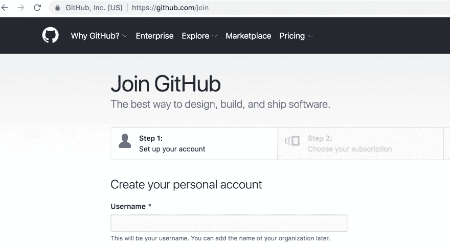](https://res.cloudinary.com/practicaldev/image/fetch/s--c8CMGiyw--/c_limit%2Cf_auto%2Cfl_progressive%2Cq_auto%2Cw_880/https://thepracticaldev.s3.amazonaws.com/i/w5ixo8ijsgzgy44s9e4t.png)

### **1)通过 ID 查找元素**

永远是第一选择。

为了得到你的元素的 ID，你只需要右击你的元素，然后点击 **Inspect** 选项。

[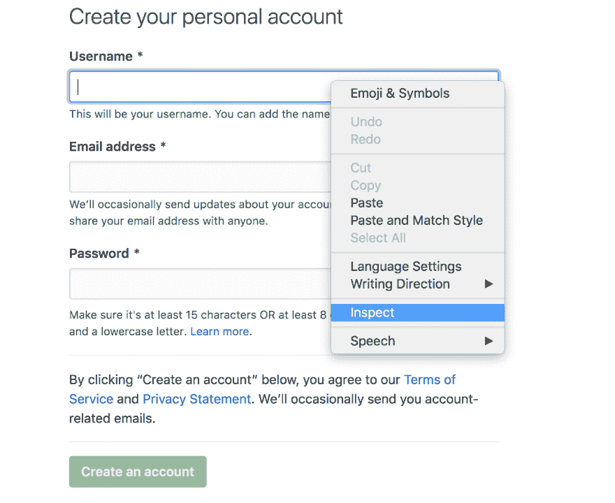](https://res.cloudinary.com/practicaldev/image/fetch/s--vavogjEG--/c_limit%2Cf_auto%2Cfl_progressive%2Cq_auto%2Cw_880/https://thepracticaldev.s3.amazonaws.com/i/1cv6im6lpjnyw9lymwoc.png)

您的元素的结构将在控制台中突出显示:

[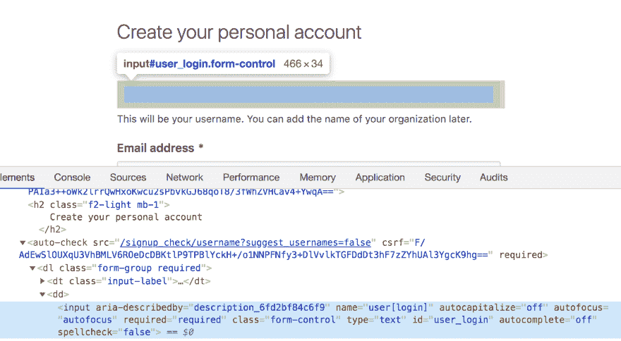](https://res.cloudinary.com/practicaldev/image/fetch/s--mnYe5Usg--/c_limit%2Cf_auto%2Cfl_progressive%2Cq_auto%2Cw_880/https://thepracticaldev.s3.amazonaws.com/i/bvh7yrblddekpn3a18pr.png)

似乎我们的元素具有以下 ID:

**用户 _ 登录**

这意味着您的代码行将如下所示:

*username = driver . find _ element _ by _ id(" user _ log in ")*

由于 ID 在页面上应该是唯一的，所以它是您可以使用的最可靠的定位器类型。

这就像你所在的城市只有一家星巴克，并告诉你的朋友在那里与你见面，他们不会错过。

### **2)按名称查找元素**

和 ID 一样好，但是你不会像你期望的那样经常遇到它。

表单中的元素通常有 **Name** 属性。

[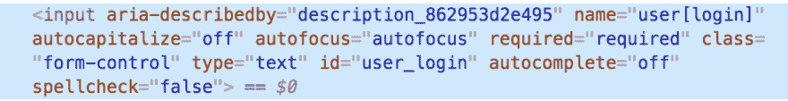](https://res.cloudinary.com/practicaldev/image/fetch/s--i_yttXBT--/c_limit%2Cf_auto%2Cfl_progressive%2Cq_auto%2Cw_880/https://thepracticaldev.s3.amazonaws.com/i/zxpdxveli0wvu9lxz4fy.png)

我们可以很容易地看到，我们的元素有以下名称:

**用户【登录】**

*username = driver . find _ element _ by _ name(" user[log in]")*

### **3)按类名查找元素**

不太可靠，因为类名通常由多个元素共享。

我们很容易看到我们的元素有如下的类名:

**表单控制**

如果我们仔细观察该表单的其余输入，我们会发现它们都有**表单控件**类名。

*username = driver . find _ element _ by _ class _ name("表单控制")*

这意味着您将无法用类名定位器类型定位用户名输入，因为 Selenium 将抛出一个错误。

**[Endtest](https://endtest.io)** 这里有一个比 Selenium 更优雅的方法。
如果你提供了那个类名，它只会给你一个警告，告诉你找到了多少个具有那个类名的元素，第一个元素将被使用。

[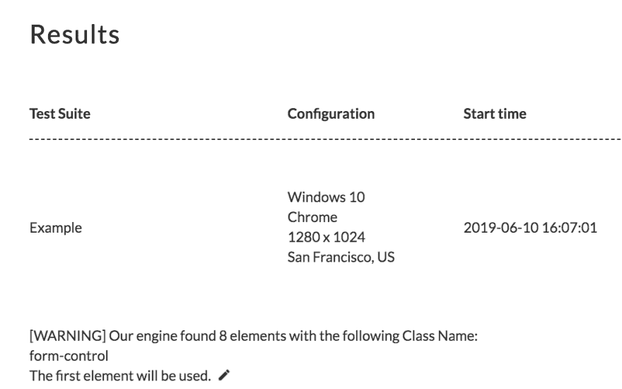](https://res.cloudinary.com/practicaldev/image/fetch/s--vddx8T3z--/c_limit%2Cf_auto%2Cfl_progressive%2Cq_auto%2Cw_880/https://thepracticaldev.s3.amazonaws.com/i/kcnut64l7g5cgrpa8zfz.png)

如果星巴克有一个分类名称，它可能是咖啡店。如果你告诉你的朋友**在咖啡店**见我，他们可能不知道你说的是哪一家。

初学者最常犯的错误是提取所有的类名，而不是只提取一个。

让我们来看看这个元素:

[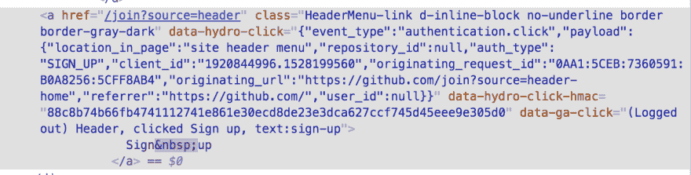](https://res.cloudinary.com/practicaldev/image/fetch/s--aLo9NEFc--/c_limit%2Cf_auto%2Cfl_progressive%2Cq_auto%2Cw_880/https://thepracticaldev.s3.amazonaws.com/i/v5ozm4j73z1vcgduxftz.png)

新手用户可能会说该元素具有以下类名:

**header menu-link d-inline-block 无下划线边框边框-灰色-深色**

但它实际上有 5 个不同的类名:

*header menu-link*
*d-inline-block*
*无下划线*
*边框*
*边框-灰色-深色*

没错，类名是用空格隔开的。

Selenium 对此没有验证，但是 **[Endtest](https://endtest.io)** 有:

[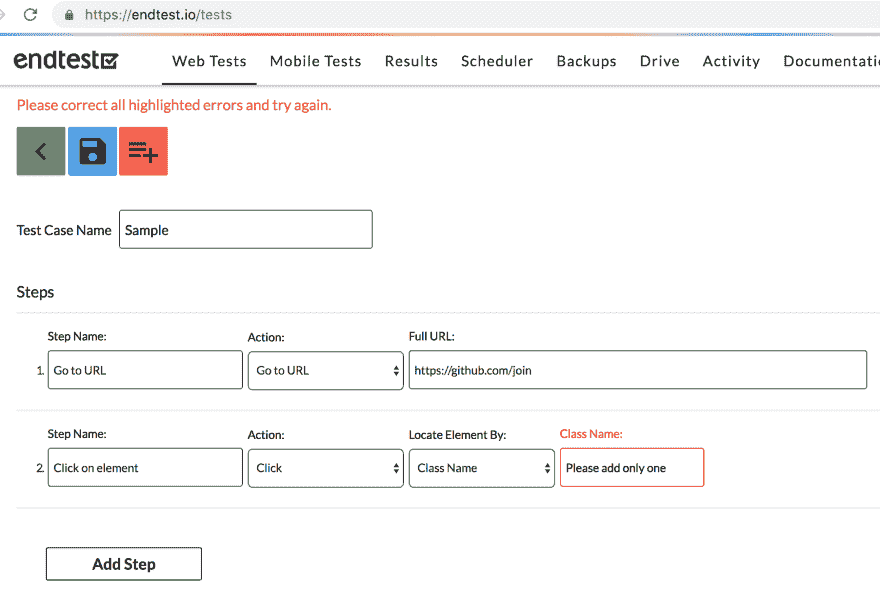](https://res.cloudinary.com/practicaldev/image/fetch/s--MlQYSv1H--/c_limit%2Cf_auto%2Cfl_progressive%2Cq_auto%2Cw_880/https://thepracticaldev.s3.amazonaws.com/i/0z7q6pumqwlu7b8ncvin.png)

### **4)通过 XPath 找到元素**

至少对于某些元素，您无法避免使用 XPath。没他们说的那么糟。

XPath 就像一条路线。你的朋友可以走很多路线去那家星巴克。

通常，一个 XPath 看起来是这样的:
**/html/body/div[4]/main/div/div/div[1]/p**

获取 XPath 的最快方式是从 Chrome 控制台:

在本例中，我们得到了以下 XPath:

**//*[[@ id](https://dev.to/id)= " user _ log in "]**

如果您有一个稳定的 ID，就不应该使用 XPath。

如果你没有一个稳定的 ID，我们得到的 XPath 是不可靠的。

有许多 web 应用程序对某些元素使用动态 id。

具有动态 ID 的元素就像一家每天都在更换名称的咖啡店。

你知道这家咖啡店昨天叫咖啡，但你不知道它今天会叫什么名字。

告诉你的朋友在报价处见你会让人困惑。

这时我们需要编写自己的 XPath。

找出那个元素的稳定属性和特征是什么。

回到有不同名字的咖啡店的例子。

有什么事情是**不会改变**的？

也许是地点和这是一家**咖啡店的事实**。

这意味着你可以告诉你的外地朋友在西购物中心的咖啡厅见你。

让我们看一下我们的 lemon 并获取其父级的 xpath:

[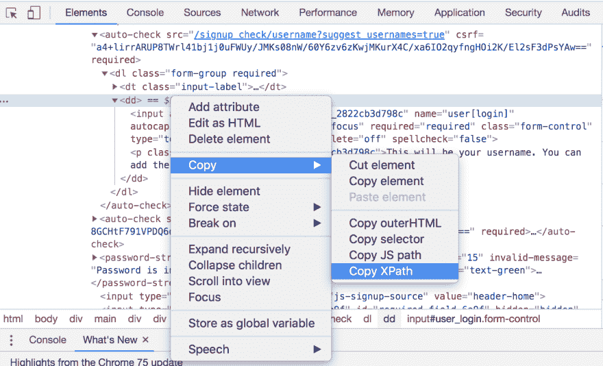](https://res.cloudinary.com/practicaldev/image/fetch/s--W-ppdJEt--/c_limit%2Cf_auto%2Cfl_progressive%2Cq_auto%2Cw_880/https://thepracticaldev.s3.amazonaws.com/i/iju3ocug101s2hq6q24q.png)

这是我们为它的父级得到的 XPath:

**//*[ [@id](https://dev.to/id) = "注册表单"]/自动检查[1]/dl/dd**

在我们的例子中，这实际上是 West 购物中心的地址。

现在我们要做的就是在最后添加一些细节。

我们的**用户名**元素是一个**输入**，它有一个**表单控件**类名。

这意味着我们需要将以下内容附加到父节点:

**/input[@ class = " form-control "]**

该部分翻译成:
*在父类中查找具有表单控件类名的输入。*

Username 元素的最终 XPath 如下所示:

**//*[ [@id](https://dev.to/id) = "注册表单"]/auto-check[1]/dl/DD/input[@ class = " form-control "]**

总是在 Chrome 控制台中通过按 Ctrl + F 并搜索来验证您的 XPath，您应该看到您的元素像这样突出显示:

[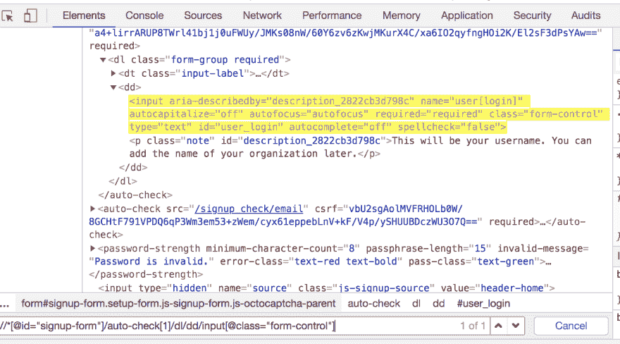](https://res.cloudinary.com/practicaldev/image/fetch/s--tQrHuvNV--/c_limit%2Cf_auto%2Cfl_progressive%2Cq_auto%2Cw_880/https://thepracticaldev.s3.amazonaws.com/i/fue5bn0884vlsg1as9me.png)

编写自己的 XPaths 并不可怕。您将会遇到这样的情况，您的元素可能没有 ID，但是它将具有某个可靠的属性，这使得它是唯一的。

在这种情况下，您的 XPath 将如下所示:

**//*[@ attribute = " attribute _ value "]**

您还可以编写一个 XPath，通过仅使用属性的部分值来定位元素:

**//*[包含(@attribute，" part_of_attribute_value")]**

例如，我们的**用户名**元素具有以下属性:

*aria-described by = " description _ 2822 CB 3d 798 c "*
*name = " user[log in]"*
*auto capitalize = " off "*
*auto focus = " auto focus "*
*required = " required "*
*class = " form-control "*
*type = " text "*
*id = " user*

如果我们想要使用 **aria-describedby** 属性，这将是 XPath:

**//*[@ aria-descripted by = " description _ 2822 CB 3d 798 c "]**

如果您使用 **[Endtest](https://endtest.io)** 而不是 Selenium，他们的记录器将知道如何自动提取这些自定义 XPaths。

### **5)通过 CSS 选择器找到元素**

**CSS 选择器**定位器类型类似于 XPath。

有些人声称这样更快。

通常，一个 CSS 选择器看起来是这样的:
body>div . application-main>main>div>div

我们用类似的方法提取它:

[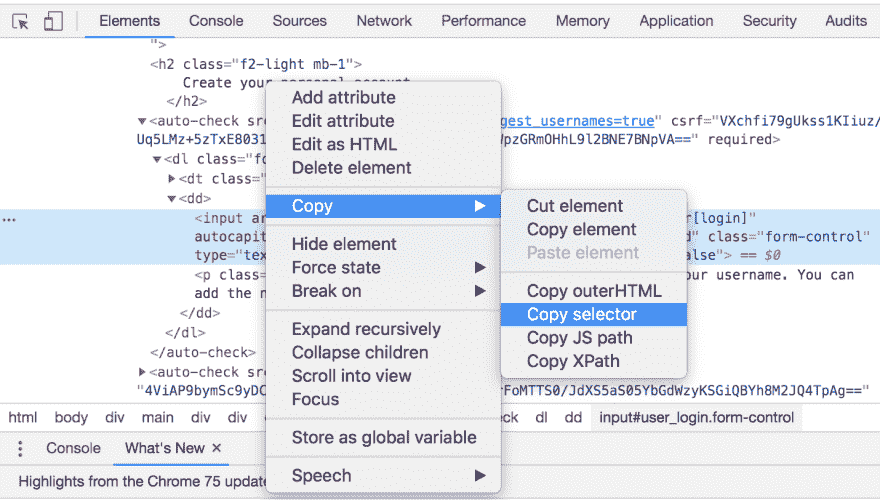](https://res.cloudinary.com/practicaldev/image/fetch/s--eH0pawyU--/c_limit%2Cf_auto%2Cfl_progressive%2Cq_auto%2Cw_880/https://thepracticaldev.s3.amazonaws.com/i/42jy484cgu8cik7w1x2o.png)

在这种情况下，我们得到了下面的 CSS 选择器:

**#用户 _ 登录**

如果你熟悉 CSS，你会知道 **#** 代表 **ID** 。

与 XPath 的相似之处不止于此。

如果你有一个稳定的 ID，你就不应该使用 CSS 选择器。

如果你没有一个稳定的 ID，我们得到的 CSS 选择器是不可靠的。

解决办法？

编写我们自己的自定义 CSS 选择器。

让我们从提取**用户名**元素的父元素的 CSS 选择器开始:

[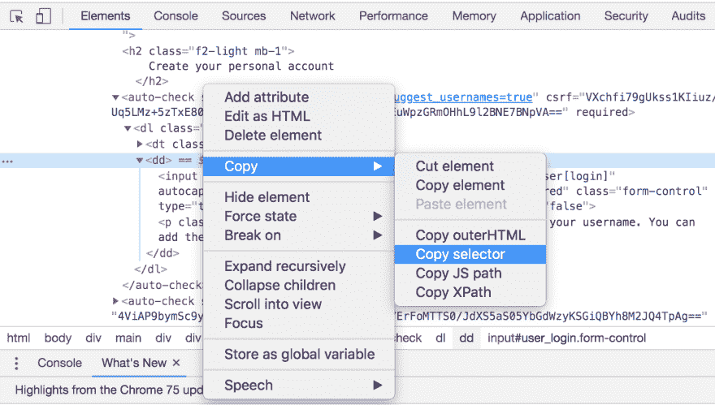](https://res.cloudinary.com/practicaldev/image/fetch/s--yxOlnKsh--/c_limit%2Cf_auto%2Cfl_progressive%2Cq_auto%2Cw_880/https://thepracticaldev.s3.amazonaws.com/i/9h54tfue92u2x8lucpoe.png)

这是我们得到的结果:

**#报名表>自动检查:第 n 个孩子(4) > dl > dd**

现在，就像我们对 XPath 所做的一样，我们需要在最后添加一些细节。

如果您忘记了，我们的**用户名**元素是一个**输入**，它有一个**表单控件**类名。

这意味着我们需要将以下内容附加到父节点:

**>输入表单控件**

该部分翻译成:
*在父类中查找具有表单控件类名的输入。*

如果你熟悉 CSS，圆点代表类名。

用户名元素的最终 CSS 选择器如下所示:

**#注册表单>自动检查:第 n 个子项(4) > dl > dd >输入表单控制**

添加元素类型和类名并不是强制性的。

你可以只使用其中一个:

**#注册表单>自动检查:第 n 个孩子(4) > dl > dd >输入**

**#报名表>自动检查:第 n 个孩子(4) > dl > dd >。表单控制**

同样，如果你使用 **[Endtest](https://endtest.io)** 而不是 Selenium，他们的记录器将知道如何自动提取这些定制的 CSS 选择器。

### **6)通过链接文本查找元素**

**链接文本**定位器类型仅适用于链接。

如果元素具有以下格式，则它是一个链接:

[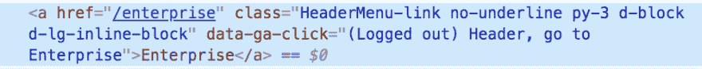](https://res.cloudinary.com/practicaldev/image/fetch/s--fTfeHQMM--/c_limit%2Cf_auto%2Cfl_progressive%2Cq_auto%2Cw_880/https://thepracticaldev.s3.amazonaws.com/i/5olbkanfe0vgs79w37ch.png)

**a** 代表锚。

因为我们的 **Username** 元素是一个输入而不是一个链接，所以我们不能通过使用链接文本来定位它。

值得记住的是，链接文本只是标签之间的文本。

从截图的链接来看，链接文字是**企业**。

[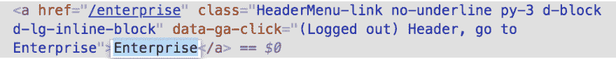](https://res.cloudinary.com/practicaldev/image/fetch/s--E3HYOHjW--/c_limit%2Cf_auto%2Cfl_progressive%2Cq_auto%2Cw_880/https://thepracticaldev.s3.amazonaws.com/i/vghvvkwtvmpzoqvuejja.png)

我们的 Selenium 代码如下所示:

*Enterprise _ link = driver . find _ element _ by _ link _ text(" Enterprise ")*

### **7)通过部分链接文本查找元素**

顾名思义，它和**链接文本**一模一样，但区别在于你只需要添加部分链接文本。

这就是我们的硒码:

*enterprise _ link = driver . find _ element _ by _ partial _ link _ text(" Enterp ")*

### **8)通过标签名查找元素**

正如我们从前面的例子中看到的，一个元素总是有一个标签。

如果这是您可以抓住的元素的唯一独特特征，您可以使用**标记名**定位器类型。

现实地说，我不认为你会用这个。

**[Endtest](https://endtest.io)** 有一个额外的定位符类型，内的**文本，类似于部分链接文本，但是它适用于所有类型的元素。**

即使您的定位器是可靠的，您也会遇到这样的情况:您的 web 应用程序正在进行修改，并且您将花费时间来保持您的测试与您的 web 应用程序同步。

避免这种情况的一个选择是使用机器学习:
[https://www.youtube.com/embed/t7Wa5mTP45Q](https://www.youtube.com/embed/t7Wa5mTP45Q)