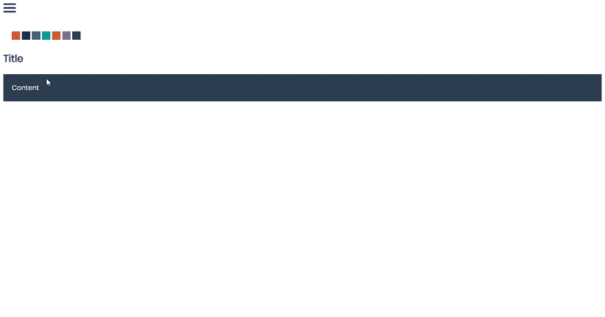
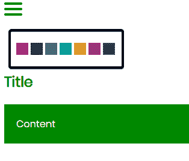
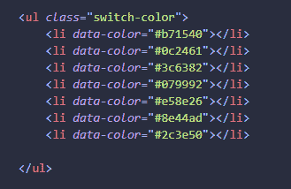
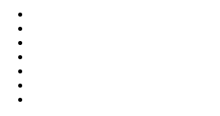
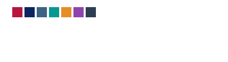
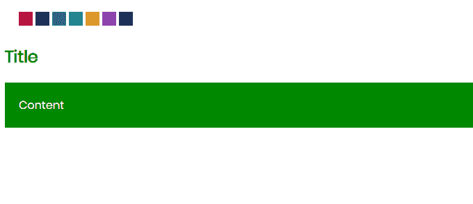

# 主题选择器

> 原文：<https://dev.to/ahmadherzallah/theme-selector-594p>

今天我将向你展示如何制作“主题选择器”

结果: 

# 添加 jQuery

`jQuery`

``

# 添加主题 BTN

那么我们如何添加它，以及添加多少呢？

你想要多少就有多少，如果你想加 3 个 BTN 你可以。

转到`index.html`并添加带有类别`switch-color`的`ul`

。然后:在`ul`标签里面。
添加你想要的`li`标签，带属性`data-color`

`<li data-color="COLOR"></li>`

我们将如何使用它？
嗯，比如: 

我们会得到这个: 

所以，现在我们必须添加 CSS

# CSS

首先，我们将添加`:root`,当我们点击主题 btns 时，它会改变

`:root {
--maincolor: #080; // Original Theme
}`

快速 CSS 代码

`.switch-color li {
display: inline-block;
width: 20px;
height: 20px;
cursor: pointer;
transition: 0.5s;
}`

然后样式为`li`

`.switch-color li:first-child {
background-color: #b71540;
color: white;
}
.switch-color li:nth-child(2) {
background-color: #0c2461;
}
.switch-color li:nth-child(3) {
background-color: #3c6382;
}
.switch-color li:nth-child(4) {
background-color: #079992;
}
.switch-color li:nth-child(5) {
background-color: #e58e26;
}
.switch-color li:nth-child(6) {
background-color: #8e44ad;
}
.switch-color li:nth-child(7) {
background-color: #2c3e50;
color: black;
}`

结果: 

现在我们需要一些内容来测试 btns。

# 内容

Soo 快速编码内容的 HTML 和 CSS

`HTML`

`

<h2>Title</h2>

Content

`

# CSS

`main h2 {
color: var(--maincolor); // From => :root
}
.main-content {
background-color: var(--maincolor); // From => :root
color: #fff;
padding: 20px;
}`

结果: 

# JavaScript

`$(function() {
$(".switch-color li").on("click", function() {
$(":root").css("--maincolor", $(this).data("color"));
});
});`

解释:在中单击一个 ul 项目。它会将- maincolor in :root 更改为来自单击的 li 的数据。

就是这样:)