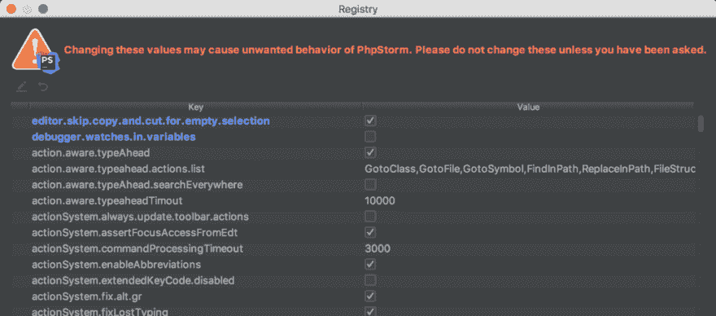

# 我最喜欢的 PhpStorm 特性和键盘快捷键

> 原文：<https://dev.to/daniel_werner/my-favorite-phpstorm-features-and-keyboard-shortcuts-14po>

在过去 10 多年的软件开发工作中，我使用过一些 ide 和文本编辑器(例如 Eclipse、Netbeans、Sublime text、Notepad++等)，但是在我看来最好的是 PhpStorm。它与其他 ide 有相似的特性，但与其他 ide 不同的是，它只是工作。你不需要安装花哨的插件，它带有合理的默认设置，所以不需要在开始时做大量的配置(当然它有大量的配置和定制选项)。让我们看看有哪些我喜欢并在日常工作中使用的功能。下面描述的功能应该可以在任何操作系统上运行，但是键盘快捷键是针对 macOS 的。

## 导航

**⌘** **+点击**–跳转到定义，可以用在函数、方法、类名、变量和常量上。在源代码中导航非常有用的工具，它也适用于供应商目录

**【⌘】****+[**–导航回上一个位置。 可以与前面的功能结合使用:通过跳转到其定义来检查一个函数，然后导航回前一个位置

**⌘****+】**–向前导航:与前面的

**⌘****+o**–搜索类，这是一个方便的功能，可以快速打开所需的类

**⌘+⇧+o**–搜索文件， 与前一个类似，但是它搜索文件名而不是类

**⌘+l**–跳转到当前文件中的给定行

## 代码

**【⌘+/**–注释/取消注释选中的行

**【⌘+退格键**–删除当前行

**【⌘+⌥+l**–重新格式化代码，对当前打开的文件应用配置的编码标准规则

**【⌘+n**–生成:可用于生成类构造函数、获取函数和设置函数。只需向类中添加必要的属性，按组合键选择要在构造函数中初始化的属性，PhpStorm 将生成带有所有必要参数的构造函数，并相应地设置属性。

## 文件创建

从 **New…** 上下文菜单中，您可以创建类、接口和特征，它会根据您在对话框中设置的名称和配置为您创建样板代码。

另一个有用的特性是创建 PHPUnit 测试。在对话框中，您可以选择类以及测试方法，IDE 将为所选方法生成所有测试用例。

## 调试

**F8**–单步执行下一个函数/方法调用

**F7**–单步执行函数/方法调用

**⌘+⇧+ r**–在断点处停止后运行调试器

## 重构

**⌘+⌥+m**——提取法，最近听说了，效果很好。只需选择一部分代码作为方法提取，它将创建带有所有必需参数的方法。

## 复制/粘贴

关于复制粘贴，PhpStorm 有一个很酷也很烦人的特性。最酷的功能是粘贴历史:**⌘+⇧+v**–打开一个对话框选择最近复制的项目。

PHP storm 中最烦人的特性是，默认情况下它允许你复制**什么也不复制**，例如，如果没有选择任何内容，你按下 **⌘ + C** ，它将简单地删除剪贴板的内容。发生了很多事情，我复制了一些东西，当我试图粘贴它时，我按下了 **⌘ + C** 而不是 **⌘ + V** ，我不得不再次复制它。如果您已经剪切了某些内容，这尤其成问题，您需要撤销剪切以便能够再次复制它(或使用粘贴历史)。

幸运的是，您可以禁用此行为:

调用帮助|查找操作…(Ctrl(Mac 上的 Cmd)+Shift+A)，键入*注册表*并选择出现的注册表…项。在那里启用 editor . skip . copy . and . cut . for . empty . selection 选项。

这个解决方案归功于以下 stackoverflow 答案的作者:

[https://stack overflow . com/questions/32895522/disable-copy-when-nothing-is-selected-in-intellij](https://stackoverflow.com/questions/32895522/disable-copying-entire-line-when-nothing-is-selected-in-intellij)

你知道 PhpStorm 的其他一些我在这里没有提到的伟大特性吗？请在下面的评论中分享。

帖子[我最喜欢的 PhpStorm 特性和键盘快捷键](https://42coders.com/my-favorite-phpstorm-features-and-keyboard-shortcuts/)最先出现在 [42 Coders](https://42coders.com) 上。