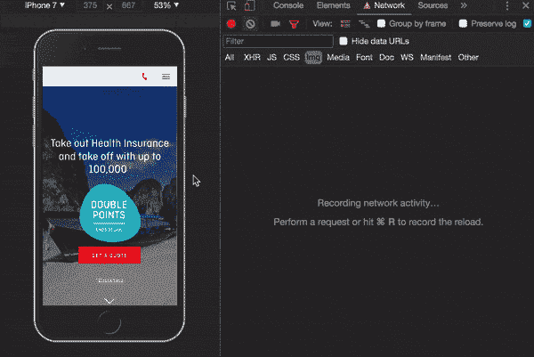

# 使用交叉点观察器优化页面性能(图像)

> 原文：<https://dev.to/bluebill1049/optimising-page-performance-image-with-intersection-observer-1jm5>

单页应用程序(SPA)已经越来越成为主流。感谢那些出色的 Javascript 框架让 web 应用程序变得更强大、更先进👏🏼。

然而现在，网页性能的优化是至关重要的。这是因为一个页面的响应性会极大地影响客户是否会停留在某个特定的网站上。

在过去的几周里，我们的团队一直在努力提高我们网站的性能。我们页面上那些漂亮但很大的图片真的会降低页面加载速度，延迟有意义的绘制时间。所以我们想到用一个占位符轻松地延迟加载它们来解决这个问题。

web 确实为延迟加载图像提供了许多解决方案。但是它们不支持响应式图像、带有现成动画的占位符，并且不支持在触发加载之前满足图像距离阈值的规范。因此，我们决定解决这个问题，并为 React 社区做出贡献。✍️:我要感谢尤辛托·恩加迪曼和威尔·博，感谢他们为我们做出的巨大贡献🎩。

[](https://res.cloudinary.com/practicaldev/image/fetch/s--eOpxKNyP--/c_limit%2Cf_auto%2Cfl_progressive%2Cq_auto%2Cw_880/https://thepracticaldev.s3.amazonaws.com/i/8tg6brkk9dtsgmlex5st.png)

介绍[React Simple Img](https://github.com/bluebill1049/react-simple-img):React 组件库使图像按需加载，并且用占位符和动画设置起来非常简单。这里有一个关于它如何工作的快速示例代码😘。

```
import { SimpleImg } from 'react-lazyLoad-images';

export const App = () => <SimpleImg src="your image path" />; 
```

Enter fullscreen mode Exit fullscreen mode

你只需要使用 SimpleImg 组件，图像就会被延迟加载动画。💥

这就是 react-simple-img 的占位符部分所实现的功能:

[](https://res.cloudinary.com/practicaldev/image/fetch/s--m5ncJYnx--/c_limit%2Cf_auto%2Cfl_progressive%2Cq_auto%2Cw_880/https://thepracticaldev.s3.amazonaws.com/i/jh1d4l1yvdnz4umyqgn8.png)

超级简单对！！我还建立了一个演示页面，随时查看这里的。

我们现在获得了更快的有意义的绘制时间，这发生在图像完全加载之前，即使网络连接很慢。所有的图像都懒的加载占位符和动画。页面看起来更漂亮了👏👏👏

[](https://res.cloudinary.com/practicaldev/image/fetch/s--pRSmnG25--/c_limit%2Cf_auto%2Cfl_progressive%2Cq_66%2Cw_880/https://thepracticaldev.s3.amazonaws.com/i/nddsf17d8j7i8q5z2vok.gif)

所以，如果你正在寻找一种方法来优化你的网页，为什么不试一试呢？如果你觉得有用，请在 GitHub 上给我留一颗星。这绝对会让我开心。❤️❤️❤️，也请在下面的评论区留下你的问题。

最后，我真的很感谢阅读博客。希望你会觉得有用。让我们共同努力，让我们的 web 应用程序成为一个更好的地方，为我们的客户提供更令人满意的体验！