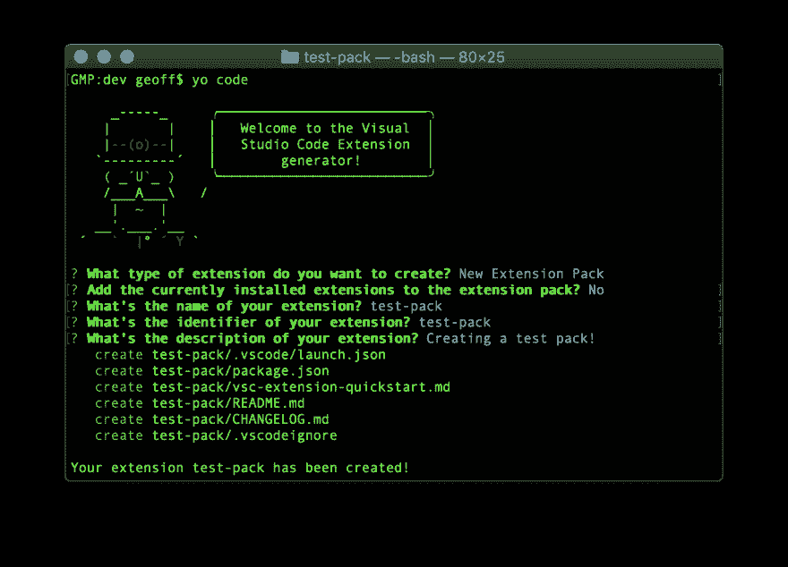
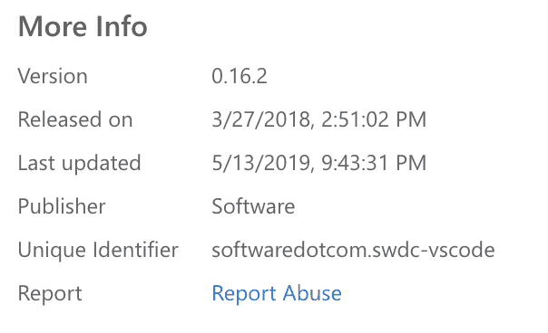

# 如何创建自己的 VS 代码扩展包

> 原文：<https://dev.to/thegeoffstevens/how-to-create-your-own-vs-code-extension-pack-nab>

我以前写过关于[创建你自己的 VS 代码主题扩展](https://dev.to/thegeoffstevens/launch-a-product-in-the-vs-code-marketplace-in-30-minutes-or-less-16oa)(在 30 分钟或更短的时间内)，但是你知道构建你自己的扩展包也是非常容易的吗？

扩展包是一种扩展，它简单地捆绑了通常一起安装的其他扩展。例如，您可以简单地下载 [Live Share 扩展包](https://marketplace.visualstudio.com/items?itemName=MS-vsliveshare.vsliveshare-pack)来一键安装所有内容，而不是一个接一个地寻找并安装 [Live Share](https://marketplace.visualstudio.com/items?itemName=MS-vsliveshare.vsliveshare) 、 [Live Share Audio](https://marketplace.visualstudio.com/items?itemName=MS-vsliveshare.vsliveshare-audio) 和 [Team Chat](https://marketplace.visualstudio.com/items?itemName=karigari.chat) 。如果您想卸载软件包，卸载软件包也会自动删除每个扩展。

我自己做了一些，你可能会觉得有价值:

*   [最佳黑暗主题](https://marketplace.visualstudio.com/items?itemName=thegeoffstevens.best-dark-themes-pack)
*   [最佳灯光主题](https://marketplace.visualstudio.com/items?itemName=thegeoffstevens.best-light-themes-pack)
*   [最佳色彩主题](https://marketplace.visualstudio.com/items?itemName=thegeoffstevens.best-colorful-themes-pack)
*   [生产力包](https://marketplace.visualstudio.com/items?itemName=thegeoffstevens.productivity-pack)
*   [时间跟踪包](https://marketplace.visualstudio.com/items?itemName=thegeoffstevens.time-tracking-pack)

## 为什么要创建扩展包

如果您厌倦了管理 VS 代码扩展的整个工具箱，那么扩展包是改进您的工作流，以及您的团队和更广泛的开发社区的工作流的一个很好的方法。

**轻松共享**:扩展包很容易与其他开发人员共享，无论他们是您的团队成员还是社区成员。包是回馈 VS 代码社区和帮助其他人发现新工具的一种简单方式。

更好的组织:包还可以帮助跟踪你自己的开发环境，比如一个更公开的[设置同步](https://marketplace.visualstudio.com/items?itemName=Shan.code-settings-sync)版本，任何人可以在任何机器上复制它。您还可以在需要时禁用和启用包来控制扩展。

现在让我们试着建造一个！

## 构建您的扩展包

如果您以前从未构建过扩展，您将需要设置您的开发环境。您需要安装:

*   [Node.js](https://nodejs.org/en/) ，一个支持 VS 代码扩展的 JavaScript 运行时
*   Yeoman ，一个搭建工具，它将为你的扩展包构建框架
*   Visual Studio 代码扩展生成器，将帮助您构建扩展的 Yeoman 生成器

在不同的平台上安装 Node 有很多不同的方法，但是安装 Node 最直接的方法是使用 Node 网站上的[官方安装程序](https://nodejs.org/en/download/)。

要安装 Yeoman 和 Visual Studio 代码扩展生成器，请运行:

```
npm install -g yo generator-code 
```

Enter fullscreen mode Exit fullscreen mode

如果您想了解更多关于这些工具的信息，您可以参考下面我上一篇文章的设置您的环境部分。这可能需要你 5 分钟左右的时间。

[](/thegeoffstevens) [## 在 30 分钟或更短时间内在 VS 代码市场推出“产品”

### 杰夫史蒂文斯 3 月 7 日 1911 分钟阅读

#vscode #coding #learning](/thegeoffstevens/launch-a-product-in-the-vs-code-marketplace-in-30-minutes-or-less-16oa)

一旦安装了这三个工具，打开您的终端，导航到您的项目目录，并运行:

```
yo code 
```

Enter fullscreen mode Exit fullscreen mode

您将被提示以下问题，这些问题将有助于为您的扩展包生成框架。

您想创建哪种类型的扩展？新扩展包
T3】将当前安装的扩展添加到扩展包中？你的分机叫什么名字？你的分机的标识符是什么？扩展名
**你的扩展名是什么？**创建测试包！

完成该过程后，您的终端应该如下所示:

[](https://res.cloudinary.com/practicaldev/image/fetch/s--LLsTbRkX--/c_limit%2Cf_auto%2Cfl_progressive%2Cq_auto%2Cw_880/https://thepracticaldev.s3.amazonaws.com/i/24l4m1esua63l7um53ur.png)

回答完这些问题后，将创建一个具有以下文件结构的项目:

```
├── .vscode
│   └── launch.json
├── .vscodeignore
├── CHANGELOG.md
├── package.json
├── README.md
└── vsc-extension-quickstart.md 
```

Enter fullscreen mode Exit fullscreen mode

如果你感兴趣，通读`vsc-extension-quickstart.md`以快速了解扩展是如何创建的。

要开始定制您的包，请导航到`package.json`，在这里您将添加将成为您的扩展包的一部分的扩展的唯一标识符。您将看到一个占位符键/值对:

```
"extensionPack":  [  "publisher.extensionName"  ] 
```

Enter fullscreen mode Exit fullscreen mode

接下来，在市场上找到一些你认为有用的扩展包。每个扩展都有一个唯一的标识符，格式为`publisher.extensionName`，可以在 VS 代码市场的扩展下载页面上找到。在页面右侧寻找包含唯一标识符的部分*更多信息*。

这里有一个[代码时间](https://marketplace.visualstudio.com/items?itemName=softwaredotcom.swdc-vscode)的例子，唯一标识符*software dot com . swdc-vs Code*。

[](https://res.cloudinary.com/practicaldev/image/fetch/s--PGgKPx45--/c_limit%2Cf_auto%2Cfl_progressive%2Cq_auto%2Cw_880/https://thepracticaldev.s3.amazonaws.com/i/3hi7uz2vma6fnofap23h.png)

根据需要向`package.json`中的`extensionPack`数组添加任意数量的扩展。

举个例子，我的生产力包是这样的:

```
"extensionPack":  [  "softwaredotcom.swdc-vscode",  "cosminalco.pomodoro",  "burkeholland.simple-timer",  "Gruntfuggly.todo-tree",  "alefragnani.Bookmarks",  "sleistner.vscode-fileutils",  "streetsidesoftware.code-spell-checker",  "Shan.code-settings-sync",  "alefragnani.project-manager"  ] 
```

Enter fullscreen mode Exit fullscreen mode

一旦添加了唯一标识符，**您就差不多完成了！**让我们做一些最后的润色，让你的扩展包对你的粉丝来说更加漂亮。

### 链接到一个 GitHub 仓库

我建议在您的扩展包中添加一个 GitHub 库。这样做将有助于您加强 GitHub 档案，并允许下载您的包的其他开发人员轻松提交 pull 请求和文件 bug。

首先在您的扩展文件夹中初始化一个带有`git init`的 Git 存储库，并将项目推送到 GitHub。在`package.json`中添加:

```
"repository":  {  "type":  "git",  "url":  "https://github.com/username/extension-repo" 
```

Enter fullscreen mode Exit fullscreen mode

### 设计一个醒目的图标

我还建议在你的扩展包中添加一个图标，帮助其他人在他们的编辑器和市场中识别你的扩展。

图标必须至少为 128x128 像素。我用 Figma 制作我所有的图标，这是一个非常棒的免费设计工具。您应该将您的图像添加到项目文件夹中，并将以下内容添加到`package.json` :

```
"icon":  "icon.png" 
```

Enter fullscreen mode Exit fullscreen mode

### 写一个描述性的 README 和 changelog

您的自述文件将显示在扩展市场中，因此这是描述您的扩展包解决了什么问题、您创建它的灵感以及包含的扩展的好方法。

我还喜欢在运行中的扩展截图旁边包含每个单独扩展的链接。如果你正在寻找一个例子，你可以在这里看到我的生产力包[的 READMEs，在这里](https://github.com/geoffstevens8/productivity-pack/blob/master/README.md)看到我最好的黑暗主题包[。](https://github.com/geoffstevens8/best-dark-themes-pack/blob/master/README.md)

类似地，更新 changelog 对你和下载你的包的开发者也有帮助。您可以显示您在当前版本中添加了哪些扩展。changelog 可以帮助您跟踪软件包的变化，如果您决定在将来添加更多的软件包并进行更新的话。

### 整理好你的项目

最后，我建议在发布前删除`vsc-extension-quickstart.md`和任何其他无关文件！

## 发布您的扩展包

要发布您的扩展，您需要安装 [Visual Studio 代码扩展](https://github.com/Microsoft/vscode-vsce)，这是一个用于打包、发布和管理扩展的命令行工具。再次打开你的终端，运行:

```
npm install -g vsce 
```

Enter fullscreen mode Exit fullscreen mode

访问 VS 代码市场的最快方法是在 VS 代码市场的[管理页面](https://marketplace.visualstudio.com/manage)上创建一个[微软账户](https://account.microsoft.com/account?lang=en-us)和一个发布者档案。在这里，您可以创建一个发布者档案，将您的扩展添加到市场。

一旦您创建了一个发布者，确保返回到您的扩展包并编辑`package.json`文件，使用您新创建的发布者名称添加`"publisher”: “publisher-name”`作为一个新的键/值对。

```
"publisher”: “your-publisher-name” 
```

Enter fullscreen mode Exit fullscreen mode

现在您可以选择上传您的扩展，它将在 VS 代码市场中可用。导航到包含您的扩展包的目录并简单地运行`vsce package`，这将创建一个`VSIX`文件。`VSIX`文件包含了安装和运行扩展包所需的所有信息。在您之前创建的 publisher 管理页面上上传生成的`VSIX`文件。

你完成了！

如果您希望使用更高级的工作流发布，您可以直接从命令行发布，但您需要创建一个 Azure DevOps 组织。你可以在我之前提到的文章中读到更多关于如何做的内容(大约在*发布你的主题扩展到 VS 代码市场*部分的中途)。

一旦你的延期申请被批准(这个过程应该只需要几分钟)，一定要和你的朋友分享这个消息！

查看[SRC](https://www.software.com/src?ref=devto)——一份专为开发者准备的时事通讯。